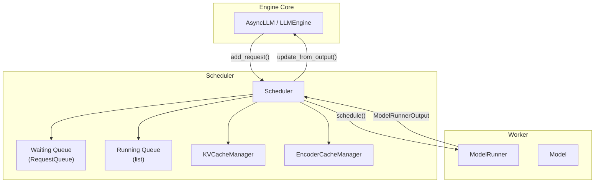
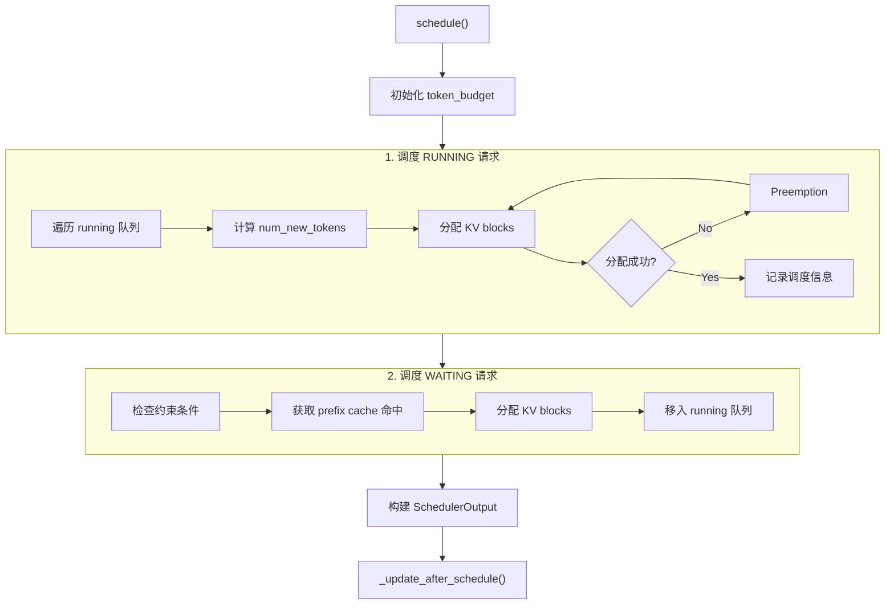
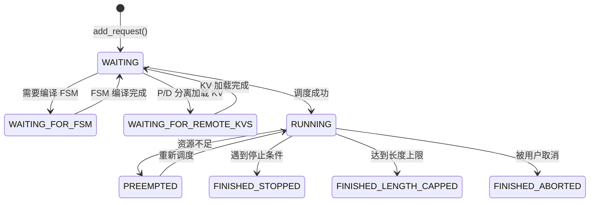
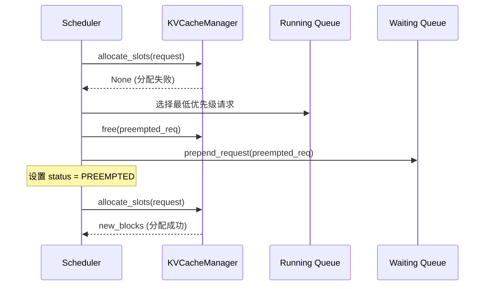

# vLLM v1 调度器 (Scheduler) 深度解析

本文档深入分析 vLLM v1 调度器的设计与实现，涵盖调度策略、KV Cache 管理、Continuous Batching 等核心机制。

---

## 1. 架构概述

vLLM v1 调度器位于 `vllm/v1/core/sched/` 目录，是 vLLM 引擎的核心组件，负责决定每一步（step）处理哪些请求以及处理多少 tokens。



### 核心类

| 类 | 文件 | 职责 |
|---|---|---|
| `Scheduler` | [scheduler.py](file:///Users/wesley/code/vllm/vllm/v1/core/sched/scheduler.py) | 主调度逻辑 |
| `SchedulerInterface` | [interface.py](file:///Users/wesley/code/vllm/vllm/v1/core/sched/interface.py) | 调度器抽象接口 |
| `SchedulerOutput` | [output.py](file:///Users/wesley/code/vllm/vllm/v1/core/sched/output.py) | 调度输出结构 |
| `KVCacheManager` | [kv_cache_manager.py](file:///Users/wesley/code/vllm/vllm/v1/core/kv_cache_manager.py) | KV Cache 分配与管理 |
| `RequestQueue` | [request_queue.py](file:///Users/wesley/code/vllm/vllm/v1/core/sched/request_queue.py) | 请求队列（FCFS/Priority） |

---

## 2. 调度核心流程

### 2.1 调度循环

`schedule()` 方法是调度器的核心，在每个 step 被调用。其设计理念是**统一处理 prefill 和 decode**：

> "There's no 'decoding phase' nor 'prefill phase' in the scheduler. Each request just has `num_computed_tokens` and `num_tokens_with_spec`."



### 2.2 Token Budget 管理

调度器使用 `token_budget` 控制每 step 处理的总 token 数：

```python
token_budget = self.max_num_scheduled_tokens  # 来自 scheduler_config.max_num_batched_tokens

# 对于每个请求
num_new_tokens = request.num_tokens_with_spec - request.num_computed_tokens
num_new_tokens = min(num_new_tokens, token_budget)
token_budget -= num_new_tokens
```

**关键配置**：
- `max_num_batched_tokens`: 单 step 最大 token 数
- `max_num_seqs`: 最大并发请求数
- `long_prefill_token_threshold`: 长 prefill 分块阈值（Chunked Prefill 相关）

---

## 3. 请求状态机



**RequestStatus 定义** ([request.py](file:///Users/wesley/code/vllm/vllm/v1/request.py#L244-L269)):
- `WAITING`: 等待调度
- `WAITING_FOR_FSM`: 等待结构化输出 FSM 编译
- `WAITING_FOR_REMOTE_KVS`: 等待远程 KV 传输（P/D 分离）
- `RUNNING`: 正在执行
- `PREEMPTED`: 被抢占
- `FINISHED_*`: 各种完成状态

---

## 4. KV Cache 管理

### 4.1 关键概念

**Block-based 管理**: KV Cache 被划分为固定大小的 blocks，每个 block 存储 `block_size` 个 tokens 的 KV。

```python
# KVCacheManager 初始化
self.kv_cache_manager = KVCacheManager(
    kv_cache_config=kv_cache_config,
    max_model_len=self.max_model_len,
    enable_caching=self.cache_config.enable_prefix_caching,
    # ...
)
```

### 4.2 核心操作

| 方法 | 功能 |
|------|------|
| `get_computed_blocks()` | 获取已缓存的 blocks（prefix caching） |
| `allocate_slots()` | 为请求分配新的 blocks |
| `free()` | 释放请求占用的 blocks |
| `reset_prefix_cache()` | 重置前缀缓存 |

### 4.3 Prefix Caching

当 `enable_prefix_caching=True` 时，调度器会：

1. **查询缓存命中**：
```python
new_computed_blocks, num_new_local_computed_tokens = (
    self.kv_cache_manager.get_computed_blocks(request)
)
```

2. **复用已计算的 blocks**，跳过重复 prefill。

---

## 5. Preemption（抢占）机制

当 KV Cache 不足时，调度器会抢占低优先级请求：



**抢占策略**：
- FCFS 策略：抢占队列尾部请求
- Priority 策略：抢占优先级最低（priority 值最大）的请求

```python
if self.policy == SchedulingPolicy.PRIORITY:
    preempted_req = max(
        self.running,
        key=lambda r: (r.priority, r.arrival_time),
    )
else:
    preempted_req = self.running.pop()  # FCFS: 最后加入的
```

---

## 6. Scheduling Policy

vLLM v1 支持两种调度策略：

### 6.1 FCFS (First-Come-First-Served)
- 使用 `deque` 实现
- 按到达顺序处理请求
- 默认策略

### 6.2 Priority
- 使用 `heapq` 实现最小堆
- 按 `(priority, arrival_time)` 排序
- 支持用户指定优先级

```python
# Request.__lt__ 定义排序
def __lt__(self, other: "Request") -> bool:
    return (self.priority, self.arrival_time, self.request_id) < (
        other.priority, other.arrival_time, other.request_id
    )
```

---

## 7. 与其他组件的集成

### 7.1 Speculative Decoding

调度器处理投机采样的 draft tokens：

```python
# 调度时包含 spec tokens
num_new_tokens = request.num_tokens_with_spec - request.num_computed_tokens

# 更新输出时处理 rejection
if scheduled_spec_token_ids:
    num_rejected = num_draft_tokens - num_accepted
    request.num_computed_tokens -= num_rejected
```

### 7.2 KV Connector (P/D 分离)

调度器与 `KVConnector` 协作实现 Prefill-Decode 分离：

```python
# 创建 Connector
if self.vllm_config.kv_transfer_config is not None:
    self.connector = KVConnectorFactory.create_connector(
        config=self.vllm_config,
        role=KVConnectorRole.SCHEDULER,
    )

# 调度时检查外部缓存
ext_tokens, load_kv_async = self.connector.get_num_new_matched_tokens(
    request, num_new_local_computed_tokens
)
```

### 7.3 Encoder Cache (多模态)

调度器管理多模态 encoder 输入的缓存：

```python
self.encoder_cache_manager = EncoderCacheManager(cache_size=encoder_cache_size)

# 调度 encoder 输入
encoder_inputs_to_schedule, num_new_tokens, ... = self._try_schedule_encoder_inputs(
    request, num_computed_tokens, num_new_tokens, encoder_compute_budget
)
```

---

## 8. SchedulerOutput 结构

调度输出包含模型执行所需的所有信息：

```python
@dataclass
class SchedulerOutput:
    scheduled_new_reqs: list[NewRequestData]    # 新调度的请求
    scheduled_cached_reqs: CachedRequestData    # 已缓存的请求更新
    num_scheduled_tokens: dict[str, int]        # 每个请求调度的 token 数
    total_num_scheduled_tokens: int             # 总调度 token 数
    scheduled_spec_decode_tokens: dict[str, list[int]]  # spec decode tokens
    scheduled_encoder_inputs: dict[str, list[int]]      # encoder 输入
    num_common_prefix_blocks: list[int]         # 公共前缀 blocks
    finished_req_ids: set[str]                  # 已完成的请求
    kv_connector_metadata: KVConnectorMetadata  # KV 传输元数据
```

---

## 9. 关键配置参数

| 参数 | 配置位置 | 说明 |
|------|----------|------|
| `max_num_seqs` | `SchedulerConfig` | 最大并发序列数 |
| `max_num_batched_tokens` | `SchedulerConfig` | 单 step 最大 token 数 |
| `enable_chunked_prefill` | `SchedulerConfig` | 启用分块预填充 |
| `policy` | `SchedulerConfig` | 调度策略 (fcfs/priority) |
| `enable_prefix_caching` | `CacheConfig` | 启用前缀缓存 |
| `long_prefill_token_threshold` | `SchedulerConfig` | 长 prefill 分块阈值 |

---

## 10. 调试技巧

### 10.1 日志开启

```python
# 启用调度器统计
scheduler = Scheduler(..., log_stats=True)
```

### 10.2 关键断点位置

1. `schedule()` L216 - 调度循环入口
2. `_preempt_request()` L759 - 抢占逻辑
3. `update_from_output()` L1055 - 输出处理
4. `allocate_slots()` in KVCacheManager - 内存分配

### 10.3 常见问题排查

- **请求卡在 WAITING**: 检查 `token_budget` 或 `max_num_seqs` 是否已满
- **频繁抢占**: KV Cache 不足，考虑增加 `gpu_memory_utilization`
- **Prefix cache 未命中**: 检查 `enable_prefix_caching` 配置

---

## 参考文件

- [scheduler.py](file:///Users/wesley/code/vllm/vllm/v1/core/sched/scheduler.py) - 主调度器实现
- [interface.py](file:///Users/wesley/code/vllm/vllm/v1/core/sched/interface.py) - 调度器接口
- [request_queue.py](file:///Users/wesley/code/vllm/vllm/v1/core/sched/request_queue.py) - 请求队列实现
- [kv_cache_manager.py](file:///Users/wesley/code/vllm/vllm/v1/core/kv_cache_manager.py) - KV 缓存管理
- [request.py](file:///Users/wesley/code/vllm/vllm/v1/request.py) - 请求数据结构
