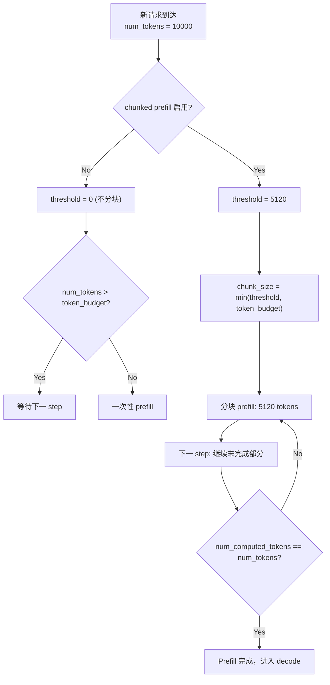
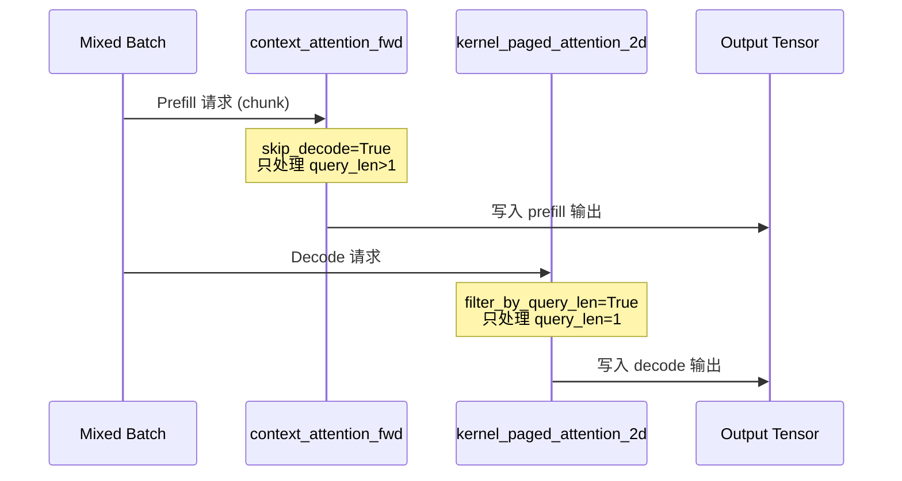

# vLLM Chunked Prefill 深度解析

本文档深入分析 vLLM 的 Chunked Prefill 机制，涵盖设计动机、调度策略、注意力计算优化等核心内容。

---

## 1. 什么是 Chunked Prefill？

Chunked Prefill 是一种将长 prompt 的 prefill 阶段分块处理的技术，允许 prefill 和 decode 请求在同一 batch 中混合执行。

### 1.1 设计动机

传统 LLM 推理中，prefill（处理 prompt）和 decode（生成 token）是分开的阶段：

| 阶段 | 特点 | 问题 |
|------|------|------|
| Prefill | 计算密集、高内存带宽利用 | 长 prompt 独占 GPU 时间 |
| Decode | 内存带宽受限、低 GPU 利用率 | decode 请求等待 prefill 完成 |

**Chunked Prefill 解决的问题**：
1. 长 prompt prefill 阻塞其他请求
2. 降低首 token 延迟 (Time-to-First-Token, TTFT)
3. 提高吞吐量，通过 prefill/decode 混合批处理

```mermaid
gantt
    title 传统 vs Chunked Prefill
    dateFormat X
    axisFormat %s
    
    section 传统方式
    Prefill (长prompt)    :a1, 0, 100
    Decode 请求等待     :a2, 100, 120
    
    section Chunked Prefill
    Chunk 1 + Decode    :b1, 0, 35
    Chunk 2 + Decode    :b2, 35, 70
    Chunk 3 + Decode    :b3, 70, 105
```



---

## 2. 调度器集成

### 2.1 核心参数

Chunked Prefill 在调度器中通过以下参数控制：

```python
# SchedulerConfig 关键配置
enable_chunked_prefill: bool = False       # 是否启用 chunked prefill
long_prefill_token_threshold: int = 0      # 单次 prefill 的最大 token 数
max_num_batched_tokens: int                # 单 step 最大 token 预算
```

### 2.2 自动配置

当启用 chunked prefill 时，`long_prefill_token_threshold` 会自动计算：

```python
# vllm/config/scheduler.py
if self.long_prefill_token_threshold == 0:
    self.long_prefill_token_threshold = int(max_model_len * 0.04)
```

默认取 `max_model_len` 的 4%，例如 128K 模型约 5120 tokens。

### 2.3 调度逻辑

在 [scheduler.py](file:///Users/wesley/code/vllm/vllm/v1/core/sched/scheduler.py) 中的调度流程：

```python
# 对于 WAITING 请求
num_new_tokens = request.num_tokens - num_computed_tokens
threshold = self.scheduler_config.long_prefill_token_threshold

# 限制单次 prefill 的 token 数
if 0 < threshold < num_new_tokens:
    num_new_tokens = threshold

# 如果禁用 chunked prefill 且超出预算，停止调度
if not self.scheduler_config.enable_chunked_prefill and num_new_tokens > token_budget:
    break

num_new_tokens = min(num_new_tokens, token_budget)
```



---

## 3. 注意力计算

### 3.1 混合 Prefill-Decode Kernel

vLLM 实现了专门的 kernel 来处理同一 batch 中的 prefill 和 decode：

[chunked_prefill_paged_decode.py](file:///Users/wesley/code/vllm/vllm/attention/ops/chunked_prefill_paged_decode.py)

```python
def chunked_prefill_paged_decode(
    query, key, value, output,
    key_cache, value_cache,
    block_table,
    query_start_loc,  # 每个请求的起始位置
    seq_lens,         # 每个请求的序列长度
    max_query_len,    # batch 中最大 query 长度
    ...
):
    # Prefill: 处理 query_len > 1 的请求
    if max_query_len > 1:
        context_attention_fwd(
            q=query, k=key, v=value, o=output,
            skip_decode=True,  # 跳过 decode 请求
            ...
        )
    
    # Decode: 处理 query_len = 1 的请求
    kernel_paged_attention_2d(
        filter_by_query_len=True,  # 只处理单 token 请求
        ...
    )
```

### 3.2 两阶段处理

该 kernel 将注意力计算分为两步：

| 阶段 | 函数 | 处理对象 |
|------|------|----------|
| Prefill | `context_attention_fwd()` | `query_len > 1` 的请求 |
| Decode | `kernel_paged_attention_2d()` | `query_len = 1` 的请求 |



---

## 4. Prefix Caching 协作

Chunked Prefill 与 Prefix Caching 配合工作：

1. **首个 chunk**: 查询 prefix cache 命中
2. **后续 chunk**: 复用已计算的 KV cache

```python
# 调度时记录已计算的 tokens
request.num_computed_tokens = num_computed_tokens

# 下一 step 继续从 num_computed_tokens 开始
num_new_tokens = request.num_tokens - num_computed_tokens
```

---

## 5. 内存效率分析

### 5.1 Token Budget 控制

`max_num_batched_tokens` 决定了每 step 的 token 上限，防止 OOM：

```python
token_budget = self.max_num_scheduled_tokens  # = max_num_batched_tokens

# 每个请求消耗预算
token_budget -= num_new_tokens
```

### 5.2 Chunk Size 权衡

| Chunk Size | 优点 | 缺点 |
|------------|------|------|
| 小 | 更好的 decode 延迟 | 更多 kernel 启动开销 |
| 大 | 更高的 prefill 吞吐 | 可能阻塞 decode |

---

## 6. 配置建议

### 6.1 启用 Chunked Prefill

```python
from vllm import LLM

llm = LLM(
    model="...",
    enable_chunked_prefill=True,
    max_num_batched_tokens=8192,  # 根据 GPU 内存调整
)
```

### 6.2 调整分块阈值

```python
# 命令行参数
vllm serve model --enable-chunked-prefill --long-prefill-token-threshold 4096
```

### 6.3 适用场景

**推荐启用**：
- 长 context 模型 (128K+)
- 混合 prefill/decode 负载
- 对 TTFT 有严格要求的场景

**可能不适用**：
- 短 prompt 场景
- 极高吞吐为主的离线批处理

---

## 7. 调试技巧

### 7.1 监控 Chunk 调度

查看日志中的调度信息：
- `num_scheduled_tokens`: 每个请求实际调度的 token 数
- `num_computed_tokens`: 累计已计算的 token 数

### 7.2 关键代码位置

1. **调度控制**: [scheduler.py L527-542](file:///Users/wesley/code/vllm/vllm/v1/core/sched/scheduler.py#L527-L542)
2. **配置定义**: [scheduler.py (config)](file:///Users/wesley/code/vllm/vllm/config/scheduler.py#L70-L74)
3. **注意力 kernel**: [chunked_prefill_paged_decode.py](file:///Users/wesley/code/vllm/vllm/attention/ops/chunked_prefill_paged_decode.py#L223-L401)

---

## 参考文件

- [scheduler.py](file:///Users/wesley/code/vllm/vllm/v1/core/sched/scheduler.py) - 调度器 chunked prefill 控制
- [scheduler.py (config)](file:///Users/wesley/code/vllm/vllm/config/scheduler.py) - 配置参数定义  
- [chunked_prefill_paged_decode.py](file:///Users/wesley/code/vllm/vllm/attention/ops/chunked_prefill_paged_decode.py) - 混合 prefill/decode kernel
- [prefix_prefill.py](file:///Users/wesley/code/vllm/vllm/attention/ops/prefix_prefill.py) - context_attention_fwd 实现
