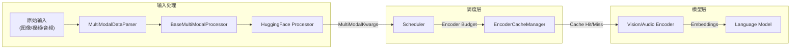
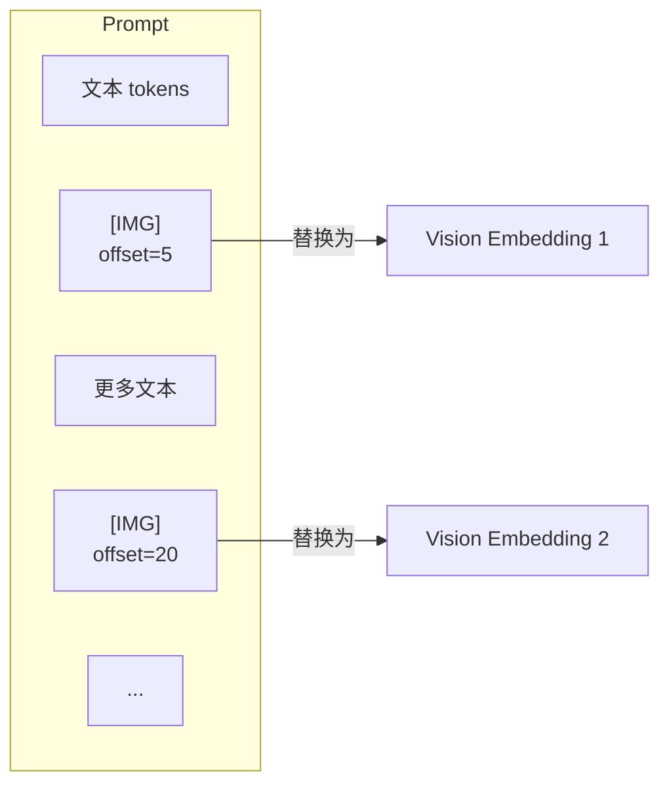
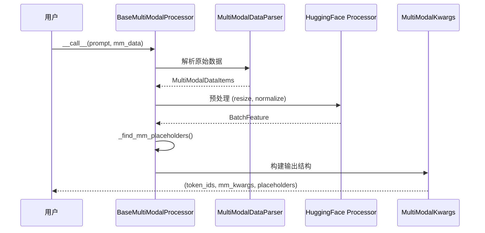
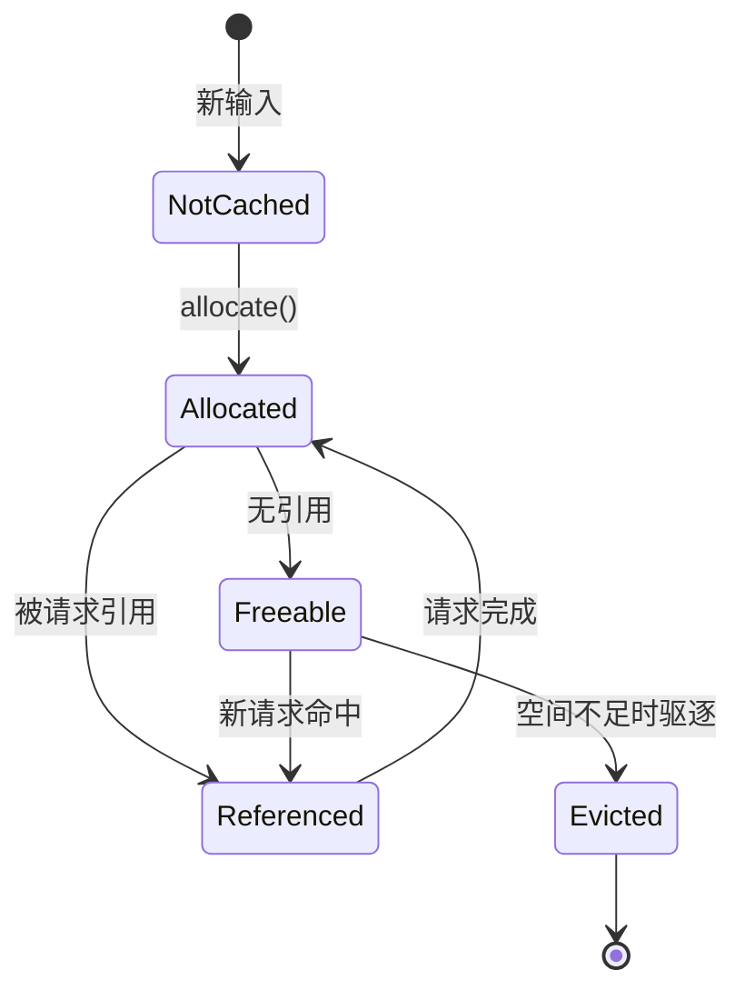
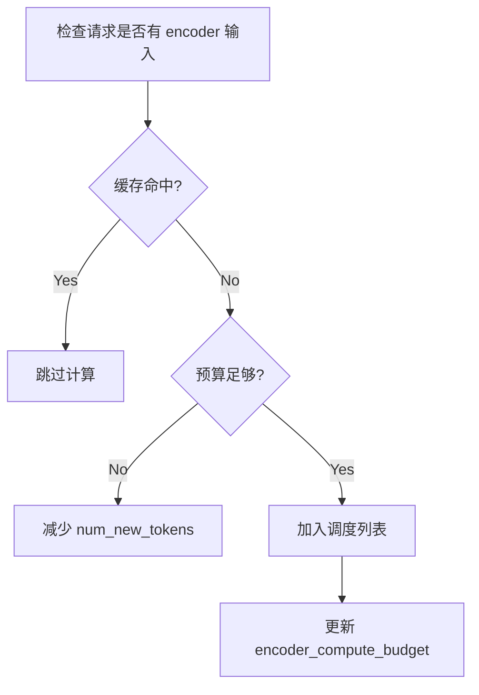
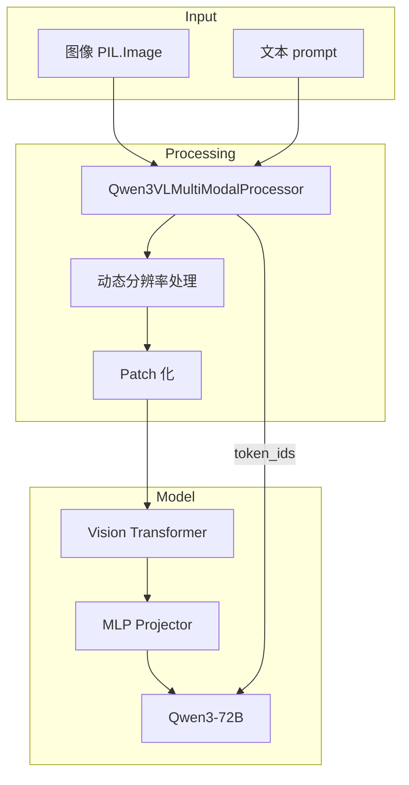
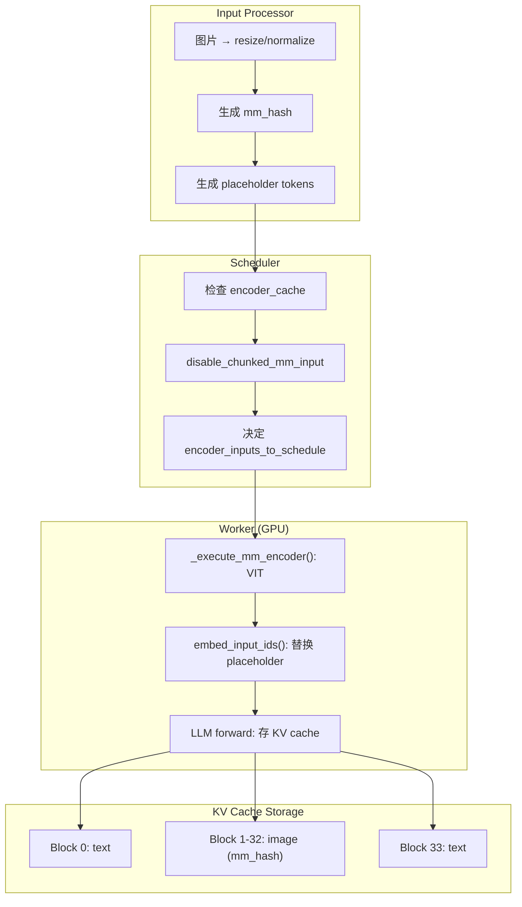

# vLLM 多模态 (Multimodal) 深度解析

本文档深入分析 vLLM 的多模态处理架构，涵盖输入处理、Encoder 缓存、调度集成等核心机制。

---

## 1. 架构概述

vLLM 多模态系统负责处理图像、视频、音频等非文本输入，将其转换为模型可理解的嵌入表示。



### 核心组件

| 组件 | 文件 | 职责 |
|------|------|------|
| `BaseMultiModalProcessor` | [processing.py](file:///Users/wesley/code/vllm/vllm/multimodal/processing.py) | 多模态输入处理管道 |
| `MultiModalDataParser` | [parse.py](file:///Users/wesley/code/vllm/vllm/multimodal/parse.py) | 原始数据解析 |
| `EncoderCacheManager` | [encoder_cache_manager.py](file:///Users/wesley/code/vllm/vllm/v1/core/encoder_cache_manager.py) | Encoder 输出缓存 |
| `MultiModalRegistry` | [registry.py](file:///Users/wesley/code/vllm/vllm/multimodal/registry.py) | 模态注册与配置 |

---

## 2. 输入数据结构

### 2.1 核心类型定义

```python
# 支持的模态数据类型
ImageItem = PIL.Image | torch.Tensor | np.ndarray
VideoItem = list[ImageItem] | torch.Tensor
AudioItem = tuple[np.ndarray, int] | np.ndarray  # (data, sample_rate)

# 多模态输入字典
MultiModalDataDict = Mapping[str, ModalityData[Any]]
# 例如: {"image": [img1, img2], "video": video1}
```

### 2.2 PlaceholderRange

`PlaceholderRange` 标记多模态内容在 token 序列中的位置：

```python
@dataclass
class PlaceholderRange:
    offset: int      # 在 token 序列中的起始位置
    length: int      # 占用的 token 数量
    is_embed: list[bool] | None  # 哪些位置需要嵌入替换
```



### 2.3 MultiModalFeatureSpec

用于 V1 引擎跟踪多模态数据：

```python
@dataclass
class MultiModalFeatureSpec:
    data: MultiModalKwargsItem | None  # 处理后的数据
    modality: str                       # 模态类型 (image/video/audio)
    identifier: str                     # 唯一标识符 (mm_hash)
    mm_position: PlaceholderRange       # 在 prompt 中的位置
```

---

## 3. 处理流程

### 3.1 BaseMultiModalProcessor

处理器将原始多模态数据转换为模型输入：



### 3.2 关键方法

| 方法 | 功能 |
|------|------|
| `_to_mm_items()` | 标准化多模态输入 |
| `_get_hf_mm_data()` | 调用 HF processor |
| `_find_mm_placeholders()` | 定位 placeholder tokens |
| `_get_prompt_updates()` | 生成 token 更新规则 |

---

## 4. Encoder 缓存机制

### 4.1 设计动机

Vision Encoder 等计算开销大，缓存其输出可以：
- 避免重复计算相同图像
- 支持 chunked prefill 时的分阶段处理
- 跨请求共享相同输入的编码

### 4.2 EncoderCacheManager

```python
class EncoderCacheManager:
    def __init__(self, cache_size: int):
        self.cache_size = cache_size
        self.num_free_slots = cache_size
        
        # mm_hash -> 引用该缓存的请求 ID 集合
        self.cached: dict[str, set[str]] = {}
        
        # 可释放的缓存项 (无引用)
        self.freeable: OrderedDict[str, int] = OrderedDict()
```

### 4.3 缓存生命周期



### 4.4 核心操作

```python
# 检查缓存命中
is_cached = cache_manager.check_and_update_cache(request, input_id)

# 检查是否可以分配
can_alloc = cache_manager.can_allocate(
    request, input_id, 
    encoder_compute_budget, 
    num_embeds_to_schedule
)

# 分配缓存空间
cache_manager.allocate(request, input_id)

# 释放缓存引用
cache_manager.free_encoder_input(request, input_id)
```

---

## 5. 调度器集成

### 5.1 Encoder Budget 管理

调度器维护两个预算：
- `encoder_compute_budget`: 单步可计算的 encoder token 数
- `encoder_cache_size`: encoder 输出缓存总大小

```python
# 计算 encoder 预算
encoder_compute_budget, encoder_cache_size = compute_encoder_budget(
    model_config, scheduler_config, mm_registry
)
```

### 5.2 调度 Encoder 输入

```python
# scheduler.py 中的调度逻辑
if request.has_encoder_inputs:
    encoder_inputs_to_schedule, num_new_tokens, ... = \
        self._try_schedule_encoder_inputs(
            request,
            num_computed_tokens,
            num_new_tokens,
            encoder_compute_budget
        )
```

### 5.3 _try_schedule_encoder_inputs 流程



---

## 6. 模型集成示例

以 Qwen3-VL 为例的多模态处理：



---

## 7. 配置参数

| 参数 | 说明 |
|------|------|
| `--limit-mm-per-prompt` | 限制每个 prompt 的多模态项数量 |
| `--max-num-encoder-input-tokens` | encoder 输入 token 上限 |
| `--encoder-cache-size` | encoder 缓存大小 |
| `--disable-chunked-mm-input` | 禁用多模态分块处理 |

---

## 8. 调试技巧

### 8.1 检查 Placeholder 位置

```python
# 查看多模态 placeholder 信息
for feature in request.mm_features:
    print(f"Modality: {feature.modality}")
    print(f"Position: offset={feature.mm_position.offset}, "
          f"length={feature.mm_position.length}")
```

### 8.2 监控 Encoder 缓存

```python
# 检查缓存状态
print(f"Free slots: {encoder_cache.num_free_slots}")
print(f"Freeable slots: {encoder_cache.num_freeable_slots}")
print(f"Cached items: {len(encoder_cache.cached)}")
```

---

## 参考文件

- [processing.py](file:///Users/wesley/code/vllm/vllm/multimodal/processing.py) - 多模态处理器
- [inputs.py](file:///Users/wesley/code/vllm/vllm/multimodal/inputs.py) - 输入数据结构
- [encoder_cache_manager.py](file:///Users/wesley/code/vllm/vllm/v1/core/encoder_cache_manager.py) - Encoder 缓存
- [registry.py](file:///Users/wesley/code/vllm/vllm/multimodal/registry.py) - 模态注册表
- [scheduler.py](file:///Users/wesley/code/vllm/vllm/v1/core/sched/scheduler.py) - 调度器集成

---

## 9. 多模态 + Chunked Prefill 深度 Q&A

### 9.1 调度时图片是 Embedding 还是 Placeholder？

**是 placeholder token IDs（fake IDs）**，不是 embedding。

```python
# 图片在 prompt 中表示为 placeholder tokens
# 例如：[文本 tokens] + [ * 512] + [文本 tokens]
mm_position = PlaceholderRange(offset=100, length=512)  # 512 个 placeholder
```

图片预处理发生在**请求进入 engine 之前**（`InputProcessor`），此时：
- 图片被处理成 `MultiModalFeatureSpec`，包含处理后的图像数据
- Prompt 中图片位置被替换为 **placeholder token IDs**
- 真正的 VIT embedding 在 **Worker 端**运行时才计算

---

### 9.2 VIT 何时执行？

**VIT 在 Worker 端模型执行时运行，不是调度时**。

调度器只决定：
- 哪些 encoder inputs 需要计算（`encoder_inputs_to_schedule`）
- 是否有足够的 encoder cache 空间

```python
# scheduler.py L921-948: 调度器检查 encoder input 是否已缓存
if self.encoder_cache_manager.check_and_update_cache(request, i):
    continue  # 已缓存，跳过

# gpu_model_runner.py L2113-2170: Worker 端真正运行 VIT
def _execute_mm_encoder(self, scheduler_output):
    encoder_outputs = model.encoder(mm_kwargs_group)
```

---

### 9.3 VIT 需要完整图片吗？Chunk 如何保证精度？

**VIT 必须处理完整图片，不能分块！**

vLLM 通过 **`disable_chunked_mm_input`** 确保 encoder 输入的原子性：

```python
# scheduler.py L966-973
if (
    self.scheduler_config.disable_chunked_mm_input
    and num_computed_tokens < start_pos
    and (num_computed_tokens + num_new_tokens) < (start_pos + num_encoder_tokens)
):
    # 如果会部分覆盖图片，回退到图片开始前
    num_new_tokens = start_pos - num_computed_tokens
    break
```

**关键机制**：
- 调度器确保 **encoder input 要么完整调度，要么不调度**
- 即使 decoder tokens 可以 chunk，encoder 部分是原子的
- 源码注释：`"encoder input tokens should be processed altogether, as the encoder usually uses bidirectional attention"`

---

### 9.4 图片在 KV Cache 中如何存储？

**图片对应的 KV 按 token 粒度存储在 blocks 里**。

假设一张图片 512 tokens，block_size=16：
- 需要 512/16 = 32 个 KV blocks
- 每个 block 存储 16 个 token 的 KV

```
KV Blocks: [blk0: text] [blk1: img] [blk2: img] ... [blk32: img] [blk33: text]
                         ↑----- 图片 512 tokens = 32 blocks -----↑
```

**但是**，这 32 个 blocks 的 **block hash** 都包含相同的 **mm_hash**：

```python
# kv_cache_utils.py L426-435
def _gen_mm_extra_hash_keys(request, start_token_idx, end_token_idx, ...):
    if end_token_idx > offset:
        extra_keys.append(mm_feature.identifier)  # mm_hash
```

---

### 9.5 同一图片的 Block Hash 是否相同？

**不完全相同，但都包含相同的 mm_hash**。

```
Block Hash = hash(parent_hash, token_ids, extra_keys)
                                           ↑ 包含 mm_hash
```

- 同图片不同 block：`parent_hash` 和 `token_ids` 不同 → 最终 hash 不同
- 但都包含同一个 `mm_hash` → 可关联到同一图片

---

### 9.6 Prefix Caching：能否命中其他请求的部分图片 Tokens？

**可以！这是 Prefix Caching 的核心场景**。

```
请求 A: [System Prompt] + [图片1] + [问题A]
请求 B: [System Prompt] + [图片1] + [问题B]
```

请求 B 可复用请求 A 计算的：
- System Prompt 的 KV blocks
- 图片1 的 KV blocks（`mm_hash` 相同）

```python
# kv_cache_manager.py - get_computed_blocks()
# 查找匹配的 block hash，包含 mm_hash 时可命中相同图片
```

---

### 9.7 KV Cache 驱逐时会部分驱逐图片吗？

**会驱逐部分 blocks，但有机制保证正确性**。

KV cache 是 **block 粒度** 驱逐：
```
假设图片占用 block [5, 6, 7, 8]
驱逐时可能只驱逐 block [7, 8]
```

**保护机制**：

1. **Prefix Caching 的链式 Hash**：
   ```python
   block_hash = hash(parent_hash, tokens, mm_hash)
   ```
   父 block 被驱逐 → 子 block hash 无法匹配 → 触发重新计算

2. **调度层完整性保证**：
   ```python
   # scheduler.py L978-992
   if not self.encoder_cache_manager.can_allocate(request, i, ...):
       if num_computed_tokens < start_pos:
           num_new_tokens = start_pos - num_computed_tokens  # 调度到图片前
       else:
           num_new_tokens = 0  # 无法调度
   ```

3. **Encoder Cache 独立管理**：
   ```python
   # encoder_cache_manager.py
   # 整个 encoder output 作为一个单元，以 mm_hash 为 key
   self.cached[mm_hash] = set()  # 引用计数，驱逐时整体驱逐
   ```

---

### 9.8 处理流程总结


