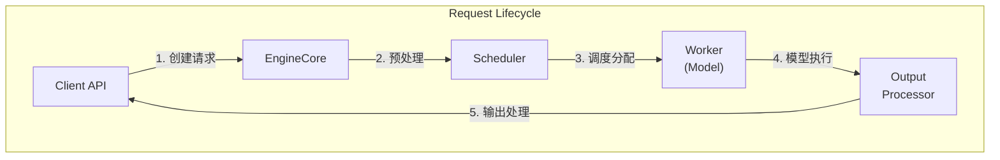
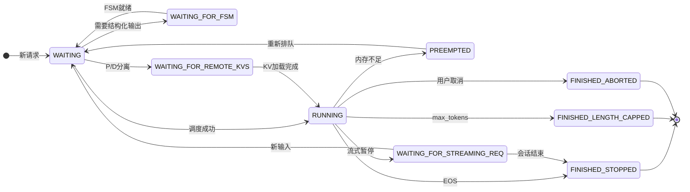
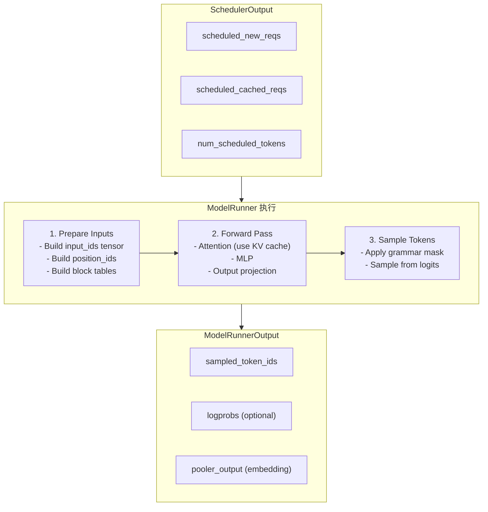
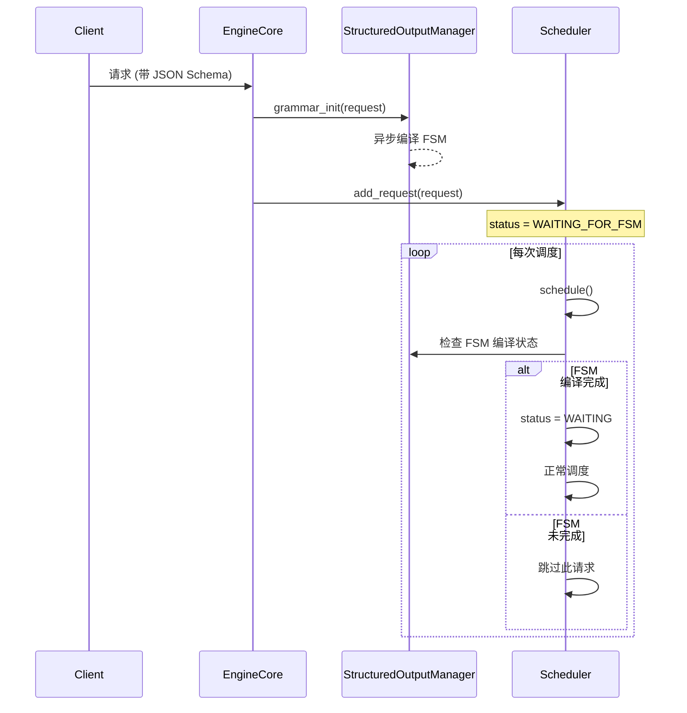
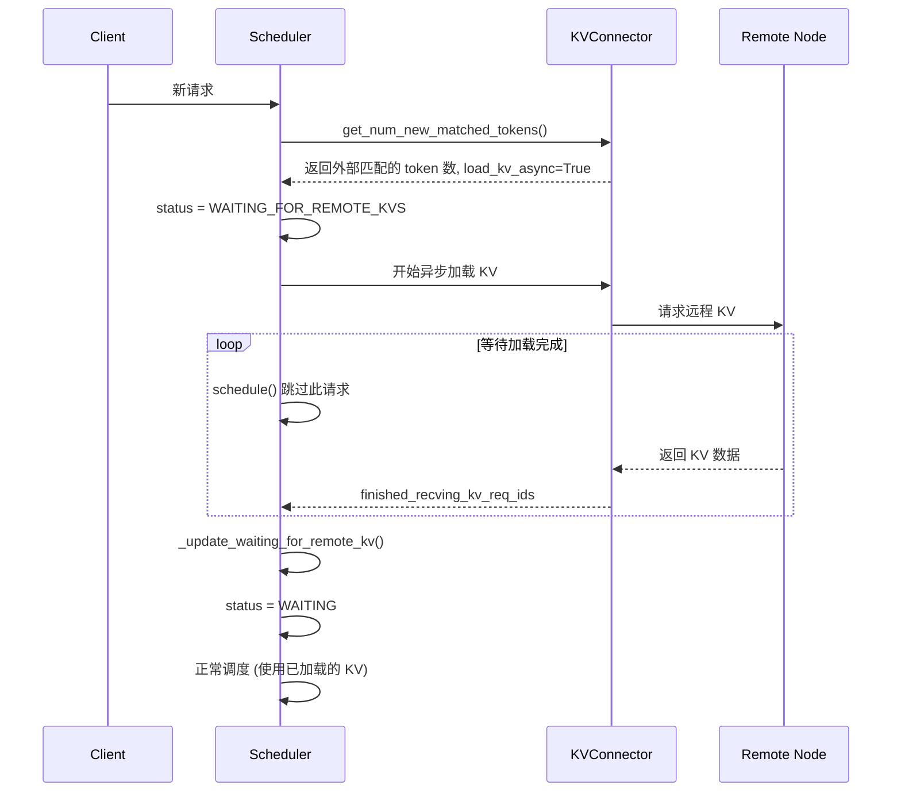
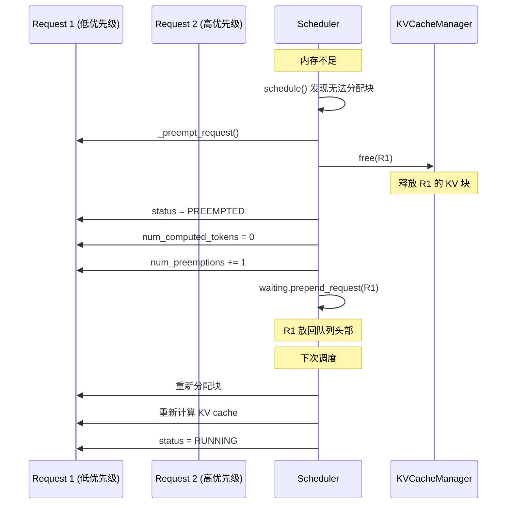
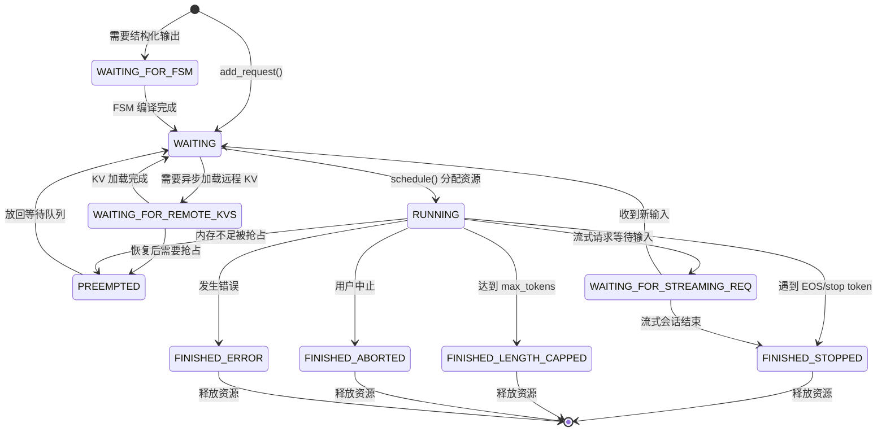

# 04 - 请求生命周期

> **学习目标**: 深入理解 vLLM 中请求从创建到完成的完整生命周期
>
> **关键文件**:
> - `vllm/v1/request.py` - Request, RequestStatus
> - `vllm/v1/engine/core.py` - EngineCore 主循环
> - `vllm/v1/core/sched/scheduler.py` - 调度器处理

---

## 请求生命周期总览





---

## 1. 阶段一: 请求创建与预处理

### 1.1 客户端请求入口

```python
# 用户通过 API 发送请求
# vllm/entrypoints/openai/serving_chat.py 或其他入口

# 请求转换为 EngineCoreRequest
engine_core_request = EngineCoreRequest(
    request_id="req-001",
    prompt_token_ids=[151644, 8948, ...],  # tokenized prompt
    mm_features=[...],                      # 多模态特征 (可选)
    sampling_params=SamplingParams(
        max_tokens=512,
        temperature=0.7,
    ),
    arrival_time=time.time(),
)
```

### 1.2 EngineCore 预处理

```python
# vllm/v1/engine/core.py:611-633

def preprocess_add_request(
    self, request: EngineCoreRequest
) -> tuple[Request, int]:
    """预处理请求 - 可在输入处理线程中并行执行"""
    
    # 处理多模态缓存
    if self.mm_receiver_cache is not None and request.mm_features:
        request.mm_features = self.mm_receiver_cache.get_and_update_features(
            request.mm_features
        )

    # 创建内部 Request 对象
    req = Request.from_engine_core_request(
        request, 
        self.request_block_hasher  # 用于 prefix caching
    )
    
    # 初始化结构化输出 (如 JSON Schema)
    if req.use_structured_output:
        self.structured_output_manager.grammar_init(req)
    
    return req, request.current_wave
```

### 1.3 Request 对象创建

```python
# vllm/v1/request.py:173-195

@classmethod
def from_engine_core_request(
    cls,
    request: EngineCoreRequest,
    block_hasher: Callable[[...]] | None,
) -> "Request":
    return cls(
        request_id=request.request_id,
        client_index=request.client_index,
        prompt_token_ids=request.prompt_token_ids,
        prompt_embeds=request.prompt_embeds,
        mm_features=request.mm_features,
        sampling_params=request.sampling_params,
        pooling_params=request.pooling_params,
        eos_token_id=request.eos_token_id,
        arrival_time=request.arrival_time,
        lora_request=request.lora_request,
        cache_salt=request.cache_salt,
        priority=request.priority,
        trace_headers=request.trace_headers,
        block_hasher=block_hasher,  # 计算 block hash 的函数
        resumable=request.resumable,
    )
```

### 1.4 初始状态设置

```python
# vllm/v1/request.py:91-106 (在 __init__ 中)

# 默认状态为 WAITING
self.status = RequestStatus.WAITING

# 如果需要结构化输出，状态改为 WAITING_FOR_FSM
if self.structured_output_request is not None:
    self.status = RequestStatus.WAITING_FOR_FSM

# 初始化各种计数器
self.num_computed_tokens = 0      # 已计算的 token 数
self.num_cached_tokens = -1       # prefix cache 命中数 (-1 表示未检查)
self.num_preemptions = 0          # 被抢占次数
```

---

## 2. 阶段二: 加入调度队列

### 2.1 添加到调度器

```python
# vllm/v1/engine/core.py:282-313

def add_request(self, request: Request, request_wave: int = 0):
    """将请求添加到调度器"""
    
    # 验证 request_id 类型
    if not isinstance(request.request_id, str):
        raise TypeError(...)

    # 验证 pooling 任务
    if pooling_params := request.pooling_params:
        if pooling_params.task not in supported_pooling_tasks:
            raise ValueError(...)

    # 检查 KV 传输参数
    if request.kv_transfer_params is not None:
        if not self.scheduler.get_kv_connector():
            logger.warning("Got kv_transfer_params, but no KVConnector found.")

    # 添加到调度器
    self.scheduler.add_request(request)
```

### 2.2 调度器处理新请求

```python
# vllm/v1/core/sched/scheduler.py:1617-1637

def add_request(self, request: Request) -> None:
    existing = self.requests.get(request.request_id)
    
    if existing is not None:
        # 处理流式请求的后续输入
        update = StreamingUpdate.from_request(request)
        if existing.status != RequestStatus.WAITING_FOR_STREAMING_REQ:
            existing.streaming_queue.append(update)
        elif update is not None:
            self._update_request_as_session(existing, update)
        else:
            self.finish_requests(request.request_id, RequestStatus.FINISHED_ABORTED)
    else:
        # 新请求: 创建流式队列 (如果需要)
        if request.resumable:
            request.streaming_queue = deque()
        
        # 添加到等待队列
        self.waiting.add_request(request)
        
        # 注册到请求字典
        self.requests[request.request_id] = request
        
        # 记录事件
        if self.log_stats:
            request.record_event(EngineCoreEventType.QUEUED)
```

---

## 3. 阶段三: 调度执行

### 3.1 主循环调度

```python
# vllm/v1/engine/core.py:369-398

def step(self) -> tuple[dict[int, EngineCoreOutputs], bool]:
    """单步调度-执行-输出"""
    
    # 检查是否有请求需要处理
    if not self.scheduler.has_requests():
        return {}, False
    
    # ① 调度: 决定本次处理哪些请求/token
    scheduler_output = self.scheduler.schedule()
    
    # ② 异步执行模型
    future = self.model_executor.execute_model(scheduler_output, non_block=True)
    
    # ③ 获取语法掩码 (结构化输出)
    grammar_output = self.scheduler.get_grammar_bitmask(scheduler_output)
    
    # ④ 等待执行完成
    with self.log_error_detail(scheduler_output):
        model_output = future.result()
        if model_output is None:
            model_output = self.model_executor.sample_tokens(grammar_output)
    
    # ⑤ 处理中途的 abort 请求
    self._process_aborts_queue()
    
    # ⑥ 更新调度器状态
    engine_core_outputs = self.scheduler.update_from_output(
        scheduler_output, model_output
    )
    
    return engine_core_outputs, scheduler_output.total_num_scheduled_tokens > 0
```

### 3.2 WAITING -> RUNNING 转换

```python
# vllm/v1/core/sched/scheduler.py:753-772 (schedule() 方法中)

# 从 waiting 队列弹出请求
request = self.waiting.pop_request()

# 添加到 running 队列
self.running.append(request)

# 记录调度事件
if self.log_stats:
    request.record_event(EngineCoreEventType.SCHEDULED, scheduled_timestamp)

# 更新状态
if request.status == RequestStatus.WAITING:
    scheduled_new_reqs.append(request)
elif request.status == RequestStatus.PREEMPTED:
    scheduled_resumed_reqs.append(request)

# 设置为 RUNNING
request.status = RequestStatus.RUNNING

# 更新 num_computed_tokens (prefix cache 命中)
request.num_computed_tokens = num_computed_tokens

# 记录 cache 命中
if request.num_cached_tokens < 0:
    request.num_cached_tokens = num_computed_tokens
```

---

## 4. 阶段四: 模型执行与输出处理

### 4.1 模型执行



### 4.2 输出处理 (update_from_output)

```python
# vllm/v1/core/sched/scheduler.py:1225-1400

def update_from_output(
    self,
    scheduler_output: SchedulerOutput,
    model_runner_output: ModelRunnerOutput,
) -> dict[int, EngineCoreOutputs]:
    """根据模型输出更新调度器状态"""
    
    sampled_token_ids = model_runner_output.sampled_token_ids
    
    for req_id, num_tokens_scheduled in num_scheduled_tokens.items():
        request = self.requests.get(req_id)
        if request is None:
            continue  # 请求可能已被中止
        
        # 获取生成的 token
        req_index = model_runner_output.req_id_to_index[req_id]
        generated_token_ids = sampled_token_ids[req_index]
        
        # 追加 token 并检查停止条件
        new_token_ids, stopped = self._update_request_with_output(
            request, generated_token_ids
        )
        
        if stopped:
            # 处理停止的请求
            finished = self._handle_stopped_request(request)
            if finished:
                self._free_request(request)
            stopped_running_reqs.add(request)
        
        # 构建输出
        if new_token_ids or stopped:
            outputs[request.client_index].append(
                EngineCoreOutput(
                    request_id=req_id,
                    new_token_ids=new_token_ids,
                    finish_reason=request.get_finished_reason(),
                    ...
                )
            )
```

### 4.3 Token 追加与停止检查

```python
# vllm/v1/core/sched/scheduler.py:1517-1533

def _update_request_with_output(
    self, request: Request, new_token_ids: list[int]
) -> tuple[list[int], bool]:
    """追加生成的 token 并检查停止条件"""
    
    stopped = False
    for num_new, output_token_id in enumerate(new_token_ids, 1):
        # 追加 token
        request.append_output_token_ids(output_token_id)
        
        # 检查停止条件
        stopped = check_stop(request, self.max_model_len)
        if stopped:
            # 裁剪多余的 token
            del new_token_ids[num_new:]
            break
    
    return new_token_ids, stopped
```

---

## 5. 停止条件检查

### 5.1 check_stop 函数

```python
# vllm/v1/core/sched/utils.py

def check_stop(request: Request, max_model_len: int) -> bool:
    """检查请求是否应该停止"""
    
    sampling_params = request.sampling_params
    
    # 1. 检查 EOS token
    last_token_id = request.output_token_ids[-1]
    if request.eos_token_id is not None:
        if last_token_id == request.eos_token_id:
            request.status = RequestStatus.FINISHED_STOPPED
            return True
    
    # 2. 检查 stop token ids
    if sampling_params.stop_token_ids:
        if last_token_id in sampling_params.stop_token_ids:
            request.status = RequestStatus.FINISHED_STOPPED
            request.stop_reason = last_token_id
            return True
    
    # 3. 检查 max_tokens
    if request.num_output_tokens >= sampling_params.max_tokens:
        request.status = RequestStatus.FINISHED_LENGTH_CAPPED
        return True
    
    # 4. 检查 max_model_len
    if request.num_tokens >= max_model_len:
        request.status = RequestStatus.FINISHED_LENGTH_CAPPED
        return True
    
    return False
```

### 5.2 停止原因枚举

```python
# vllm/v1/engine/__init__.py

class FinishReason(enum.Enum):
    STOP = "stop"           # 遇到 stop token
    LENGTH = "length"       # 达到 max_tokens 或 max_model_len
    ABORT = "abort"         # 用户中止
    ERROR = "error"         # 发生错误
```

---

## 6. 特殊状态流转

### 6.1 WAITING_FOR_FSM (结构化输出)



### 6.2 WAITING_FOR_REMOTE_KVS (P/D 分离)



### 6.3 PREEMPTED (抢占)



---

## 7. 请求完成与清理

### 7.1 处理停止的请求

```python
# vllm/v1/core/sched/scheduler.py:1475-1491

def _handle_stopped_request(self, request: Request) -> bool:
    """处理停止的请求，返回 True 表示完全完成"""
    
    if not request.resumable:
        return True  # 非流式请求，直接完成
    
    # 流式请求处理
    if request.streaming_queue:
        update = request.streaming_queue.popleft()
        if update is None:
            return True  # 流式会话结束
        # 更新请求以继续下一个输入块
        self._update_request_as_session(request, update)
    else:
        # 等待新的输入
        request.status = RequestStatus.WAITING_FOR_STREAMING_REQ
        self.num_waiting_for_streaming_input += 1
    
    # 放回等待队列
    self.waiting.add_request(request)
    return False  # 请求未完全完成
```

### 7.2 释放请求资源

```python
# vllm/v1/core/sched/scheduler.py:1683-1701

def _free_request(self, request: Request) -> dict[str, Any] | None:
    """释放已完成请求的资源"""
    assert request.is_finished()

    # 通知 KV Connector (P/D 分离)
    delay_free_blocks, kv_xfer_params = self._connector_finished(request)
    
    # 释放 encoder cache
    self.encoder_cache_manager.free(request)
    
    # 记录已完成
    self.finished_req_ids.add(request.request_id)
    
    # 释放 KV cache 块 (除非需要延迟释放)
    if not delay_free_blocks:
        self._free_blocks(request)

    return kv_xfer_params

def _free_blocks(self, request: Request):
    """释放 KV cache 块并移除请求"""
    self.kv_cache_manager.free(request)
    del self.requests[request.request_id]
```

---

## 8. 完整状态流转图



---

## 9. Qwen3-VL 请求生命周期示例

### 9.1 多模态请求创建

```python
# Qwen3-VL 请求示例

engine_core_request = EngineCoreRequest(
    request_id="qwen3vl-img-001",
    prompt_token_ids=[
        151644,  # <|im_start|>
        8948,    # user
        ...
        # 图像占位符 token
        ...
        151645,  # <|im_end|>
    ],
    mm_features=[
        MultiModalFeatureSpec(
            identifier="image_hash_abc123",
            mm_position=MultiModalPosition(
                offset=50,      # 图像 token 起始位置
                length=1024,    # 图像 token 数量
            ),
        ),
    ],
    sampling_params=SamplingParams(
        max_tokens=512,
        temperature=0.7,
    ),
)
```

### 9.2 调度时的 Encoder 处理

```
调度步骤:

Step 1: Prefill 前 50 个 token (图像前的文本)
- encoder_inputs_to_schedule = []
- num_new_tokens = 50

Step 2: Prefill 包含图像的 token
- encoder_inputs_to_schedule = [0]  # 调度第 0 张图片
- ViT 处理图像，生成 vision embeddings
- 融合到 LLM 输入
- num_new_tokens = 1024

Step 3: Prefill 剩余 prompt token
- encoder_inputs_to_schedule = []
- num_new_tokens = remaining_tokens

Step 4+: Decode
- 逐 token 生成
- num_new_tokens = 1
```

---

## 10. 总结

### 生命周期关键节点

| 阶段 | 关键操作 | 状态变化 |
|------|---------|---------|
| 创建 | Request.from_engine_core_request() | -> WAITING/WAITING_FOR_FSM |
| 入队 | scheduler.add_request() | 加入 waiting 队列 |
| 调度 | scheduler.schedule() | WAITING -> RUNNING |
| 执行 | model_executor.execute_model() | 模型前向传播 |
| 更新 | scheduler.update_from_output() | 追加 token, 检查停止 |
| 完成 | _free_request() | RUNNING -> FINISHED_* |
| 抢占 | _preempt_request() | RUNNING -> PREEMPTED |

### 特殊状态

| 状态 | 场景 | 处理方式 |
|------|------|---------|
| WAITING_FOR_FSM | 结构化输出 | 等待 FSM 编译完成 |
| WAITING_FOR_REMOTE_KVS | P/D 分离 | 等待远程 KV 加载 |
| WAITING_FOR_STREAMING_REQ | 流式会话 | 等待下一个输入块 |
| PREEMPTED | 内存不足 | 释放资源，放回队列头部 |

---

> **下一步**: [05-kv-cache.md](./05-kv-cache.md) - KV Cache 管理机制
