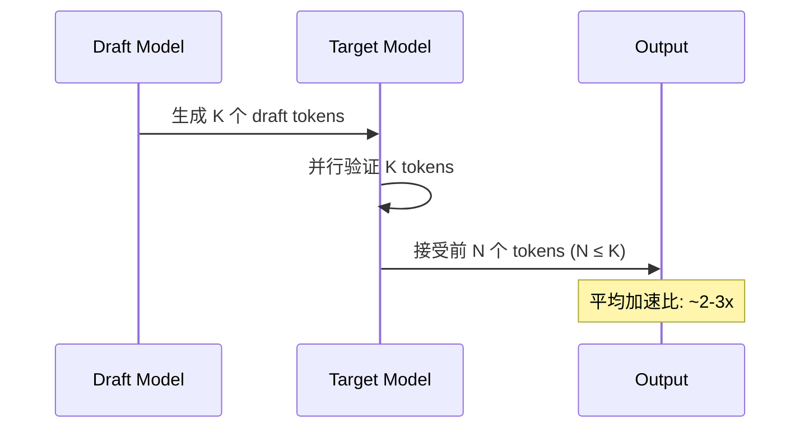
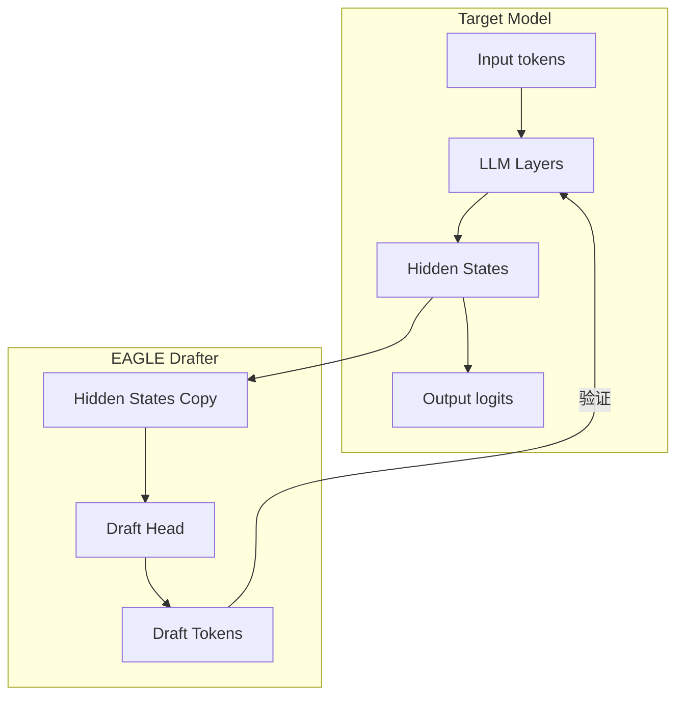
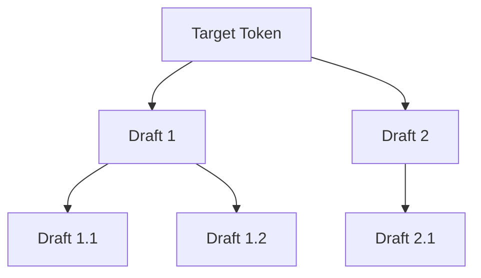

# vLLM 投机采样 (Speculative Decoding) 深度解析

本文档深入分析 vLLM v1 的投机采样实现，涵盖 EAGLE、Medusa、N-gram 等方法。

---

## 1. 投机采样原理

投机采样是一种加速 LLM 推理的技术，通过小模型（或启发式方法）快速生成 draft tokens，然后由大模型并行验证。



### 1.1 数学基础

给定 draft 模型分布 $q(x)$ 和 target 模型分布 $p(x)$：
- **接受概率**: $\min(1, p(x)/q(x))$
- **保证无偏**: 拒绝时从 $p(x) - q(x)$ 采样

---

## 2. vLLM v1 支持的方法

| 方法 | 原理 | 适用场景 |
|------|------|----------|
| **EAGLE** | 使用 hidden states 预测 | 高准确率，需要额外模型 |
| **Medusa** | 多头预测 | 无需额外模型 |
| **N-gram** | Prompt lookup | 无需模型，适合重复模式 |

---

## 3. EAGLE 实现

### 3.1 架构概述

EAGLE (Extrapolation Algorithm for Gradient-like Estimation) 使用 target 模型的 hidden states 来预测 draft tokens。



### 3.2 核心类 EagleProposer

[eagle.py](file:///Users/wesley/code/vllm/vllm/v1/spec_decode/eagle.py)

```python
class EagleProposer:
    def __init__(self, vllm_config, device, runner=None):
        self.num_speculative_tokens = speculative_config.num_speculative_tokens
        self.hidden_size = draft_model_config.get_hidden_size()
        
        # 持久缓冲区
        self.input_ids = torch.zeros(max_num_tokens, dtype=torch.int32, device=device)
        self.hidden_states = torch.zeros(
            (max_num_tokens, hidden_size), dtype=dtype, device=device
        )
        
        # Tree 结构解析
        self.tree_choices = ast.literal_eval(speculative_token_tree)
```

### 3.3 Propose 流程

```python
def propose(
    self,
    target_token_ids: torch.Tensor,     # [num_tokens]
    target_positions: torch.Tensor,      # [num_tokens]
    target_hidden_states: torch.Tensor,  # [num_tokens, hidden_size]
    next_token_ids: torch.Tensor,        # [batch_size]
    ...
) -> torch.Tensor:
    # 1. 移位输入: [a1, b1, b2, c1] -> [b1, b2, c1, c1]
    self.input_ids[:num_tokens-1] = target_token_ids[1:]
    self.input_ids[last_token_indices] = next_token_ids
    
    # 2. 运行 draft 模型
    last_hidden_states, hidden_states = self.model(
        input_ids=input_ids,
        positions=positions,
        hidden_states=hidden_states,
    )
    
    # 3. 采样 draft tokens
    logits = self.model.compute_logits(sample_hidden_states)
    draft_token_ids = logits.argmax(dim=-1)
    
    return draft_token_ids  # [batch_size, num_speculative_tokens]
```

### 3.4 Tree-based Drafting

EAGLE 支持树状 draft 结构，提高接受率：



```python
# 树结构配置示例
speculative_token_tree = "[[1], [1,1], [1,2], [2], [2,1]]"

# propose_tree() 方法实现树状 drafting
def propose_tree(self, batch_size, logits, positions, hidden_states, ...):
    # 采样多个子节点
    draft_token_ids = torch.topk(logits, num_children, dim=-1).indices
```

---

## 4. N-gram Proposer

### 4.1 原理

N-gram proposer 通过在 prompt 中查找匹配的 n-gram 来预测下一个 tokens：

```
Prompt: "The quick brown fox jumps over the lazy dog. The quick brown"
                                                      ↑ 当前位置
匹配: "The quick brown" → 预测 "fox"
```

### 4.2 实现

[ngram_proposer.py](file:///Users/wesley/code/vllm/vllm/v1/spec_decode/ngram_proposer.py)

```python
class NgramProposer:
    def __init__(self, vllm_config):
        self.min_n = speculative_config.prompt_lookup_min  # 最小 n-gram
        self.max_n = speculative_config.prompt_lookup_max  # 最大 n-gram
        self.k = speculative_config.num_speculative_tokens
    
    def propose(self, sampled_token_ids, req_ids, ...):
        # 使用 numba 加速的批量查找
        draft_tokens = batch_propose_numba(
            valid_ngram_requests,
            num_tokens_no_spec,
            token_ids_cpu,
            min_n, max_n, max_model_len, k, ...
        )
```

### 4.3 Numba 加速

```python
@njit(parallel=True)
def batch_propose_numba(...):
    for i in prange(len(valid_ngram_requests)):
        draft, num = _find_longest_matched_ngram_and_propose_tokens(
            origin_tokens, min_ngram, max_ngram, max_model_len, k
        )
```

---

## 5. 调度器集成

### 5.1 Spec Token 管理

调度器维护每个请求的 spec tokens：

```python
# scheduler.py
if request.spec_token_ids:
    num_scheduled_spec_tokens = (
        num_new_tokens + request.num_computed_tokens
        - request.num_tokens - request.num_output_placeholders
    )
    scheduled_spec_decode_tokens[request.request_id] = request.spec_token_ids
```

### 5.2 Token 验证与回滚

```python
# update_from_output() 中处理 rejection
if scheduled_spec_token_ids:
    num_rejected = num_draft_tokens - num_accepted
    request.num_computed_tokens -= num_rejected
```

---

## 6. 配置参数

### 6.1 命令行参数

```bash
vllm serve model \
    --speculative-model eagle-model \           # Draft 模型路径
    --num-speculative-tokens 5 \                # 投机 token 数量
    --speculative-token-tree "[[1],[1,1],[2]]"  # Tree 结构 (EAGLE)
```

### 6.2 N-gram 配置

```bash
vllm serve model \
    --speculative-method ngram \
    --prompt-lookup-min 3 \
    --prompt-lookup-max 5 \
    --num-speculative-tokens 4
```

---

## 7. 性能考量

| 因素 | 影响 |
|------|------|
| Draft 模型大小 | 更小 = 更快，但准确率下降 |
| num_speculative_tokens | 更多 = 更高理论加速，但接受率下降 |
| Tree 结构 | 更宽 = 更高接受率，但计算开销增加 |
| Batch Size | 大 batch 时收益降低 |

---

## 8. 调试技巧

### 8.1 监控接受率

```python
# SpecDecodingStats 包含
- num_draft_tokens: 提议的 draft token 数
- num_accepted_tokens: 被接受的 token 数
- acceptance_rate = num_accepted / num_draft
```

### 8.2 关键代码位置

1. **EAGLE Proposer**: [eagle.py L225-531](file:///Users/wesley/code/vllm/vllm/v1/spec_decode/eagle.py#L225-L531)
2. **N-gram Proposer**: [ngram_proposer.py](file:///Users/wesley/code/vllm/vllm/v1/spec_decode/ngram_proposer.py)
3. **Scheduler 集成**: [scheduler.py L378-394](file:///Users/wesley/code/vllm/vllm/v1/core/sched/scheduler.py#L378-L394)

---

## 参考文件

- [eagle.py](file:///Users/wesley/code/vllm/vllm/v1/spec_decode/eagle.py) - EAGLE proposer
- [ngram_proposer.py](file:///Users/wesley/code/vllm/vllm/v1/spec_decode/ngram_proposer.py) - N-gram proposer
- [medusa.py](file:///Users/wesley/code/vllm/vllm/v1/spec_decode/medusa.py) - Medusa proposer
- [utils.py](file:///Users/wesley/code/vllm/vllm/v1/spec_decode/utils.py) - 工具函数
