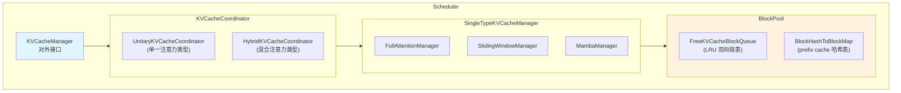
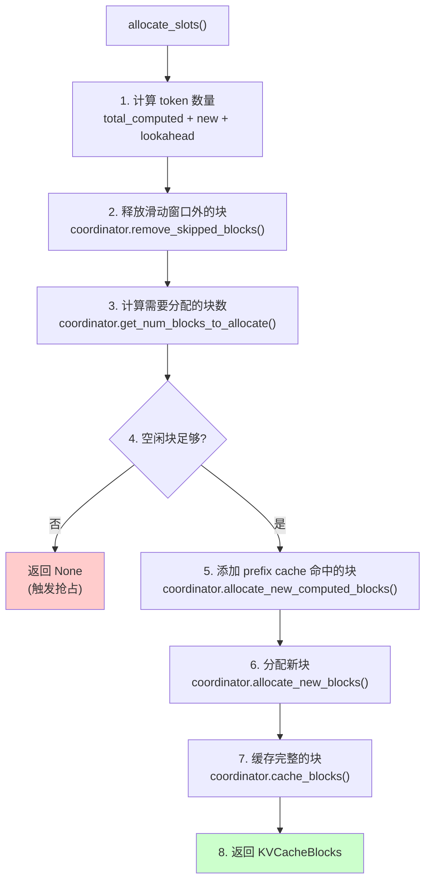
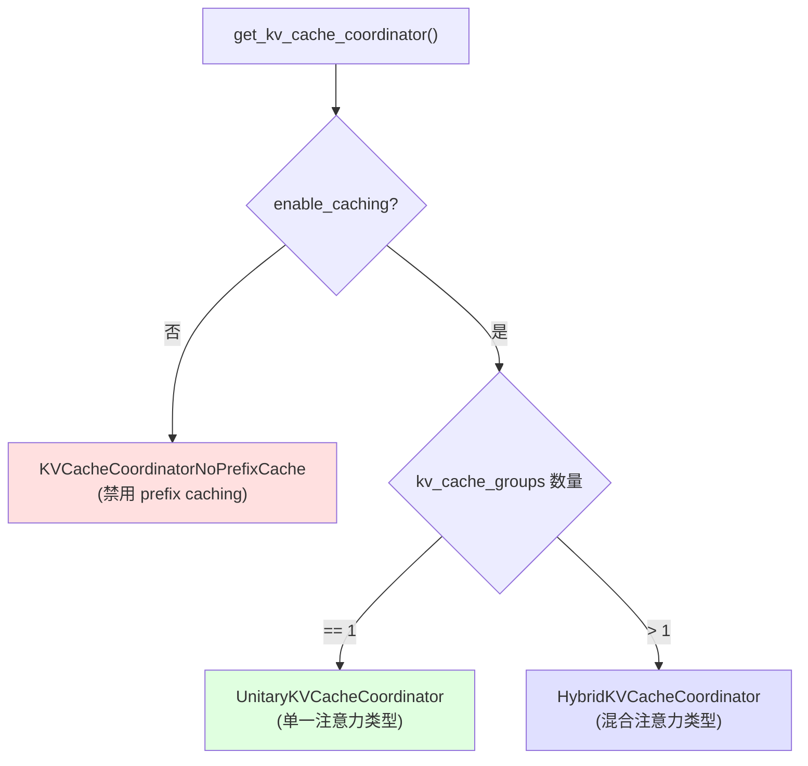
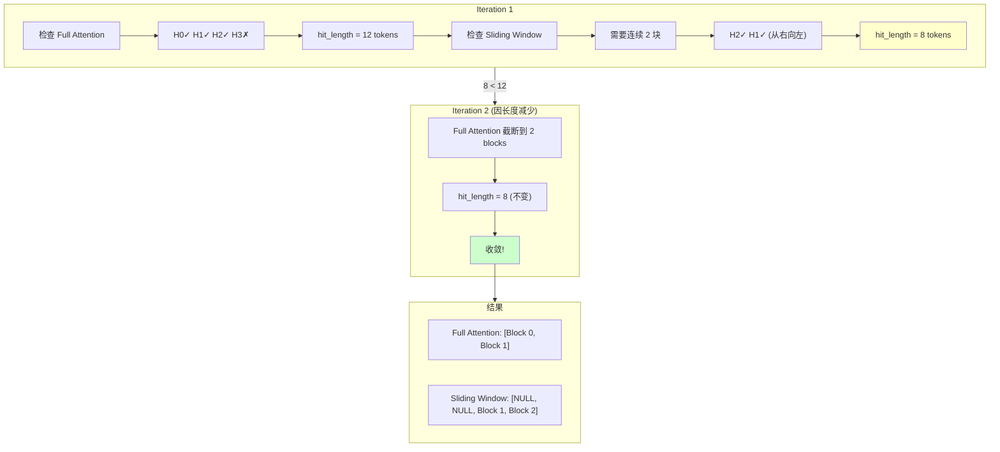
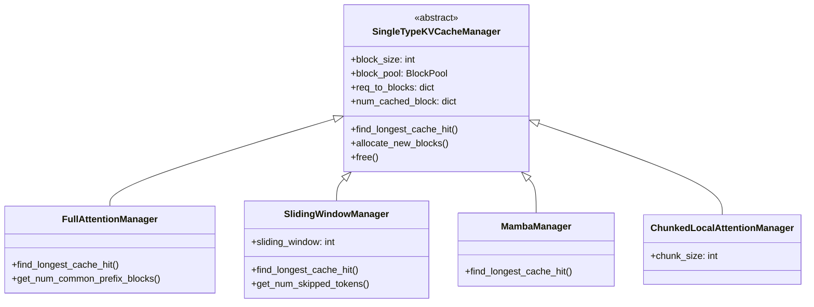
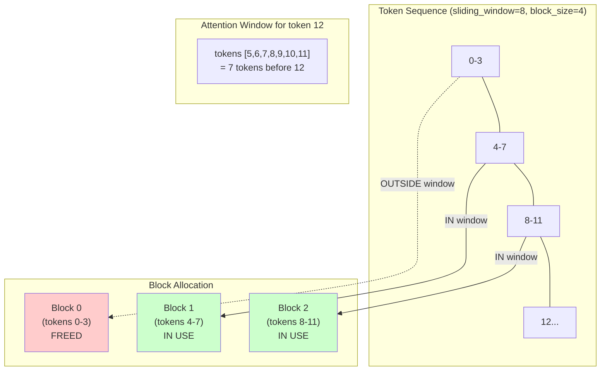
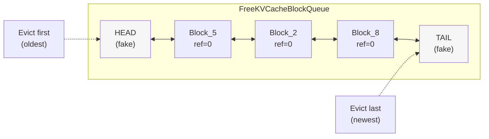

# 05 - KV Cache 管理机制

> vLLM V1 的 KV Cache 管理是高性能推理的核心。本笔记深入分析 KVCacheManager、Coordinator 和 BlockPool 的设计与实现。

## 1. 整体架构



**层次说明**:

| 组件 | 职责 |
|------|------|
| **KVCacheManager** | 顶层接口，提供 `allocate_slots`, `get_computed_blocks`, `free` |
| **KVCacheCoordinator** | 协调多个 SingleTypeManager，处理混合模型 |
| **SingleTypeKVCacheManager** | 单一注意力类型的块管理逻辑 |
| **BlockPool** | 底层块池，LRU 驱逐 + Prefix Cache |

## 2. 核心数据结构

### 2.1 KVCacheBlock - 块元数据

```python
# vllm/v1/core/kv_cache_utils.py:107-153

@dataclass
class KVCacheBlock:
    """KV-cache block metadata."""

    # Block ID, ranging from 0 to num_gpu_blocks - 1.
    block_id: int
    # Reference count - 被多少请求引用
    ref_cnt: int = 0
    # The hash key (block hash + group id) of the block, only available
    # when the block is full and cached.
    _block_hash: BlockHashWithGroupId | None = None

    # Used to construct a doubly linked list for free blocks.
    # These two attributes should only be manipulated by FreeKVCacheBlockQueue.
    prev_free_block: "KVCacheBlock | None" = None
    next_free_block: "KVCacheBlock | None" = None

    # Whether the block is a null block that should never be cached.
    is_null: bool = False
```

**关键设计点:**
- `ref_cnt`: 引用计数，用于追踪块被多少请求使用
- `_block_hash`: 只有当块满且被缓存时才有值
- 双向链表指针: 用于 O(1) 的 LRU 驱逐

### 2.2 KVCacheBlocks - 分配结果

```python
# vllm/v1/core/kv_cache_manager.py:21-91

@dataclass
class KVCacheBlocks:
    """
    The allocation result of KVCacheManager, work as the interface between
    Scheduler and KVCacheManager, to hide KVCacheManager's internal data
    structure from the Scheduler.
    """

    blocks: tuple[Sequence[KVCacheBlock], ...]
    """
    `blocks[i][j]` refers to the i-th kv_cache_group
    and the j-th block of tokens.
    
    内存布局示意:
    ┌─────────────────────────────────────────────────┐
    │ blocks[0] = [Block_0, Block_1, Block_2, ...]    │ <- KV Cache Group 0 (e.g., Full Attention)
    │ blocks[1] = [Block_0, Block_1, Block_2, ...]    │ <- KV Cache Group 1 (e.g., Sliding Window)  
    └─────────────────────────────────────────────────┘
    """

    def get_block_ids(self, allow_none: bool = False) -> tuple[list[int], ...] | None:
        """Converts the KVCacheBlocks instance to block_ids."""
        if allow_none and all(len(group) == 0 for group in self.blocks):
            return None
        return tuple([blk.block_id for blk in group] for group in self.blocks)
```

### 2.3 KVCacheSpec - 缓存规格

```python
# vllm/v1/kv_cache_interface.py:19-62

@dataclass(frozen=True)
class KVCacheSpec:
    """A base class for specifying the KV cache format of one layer."""

    # number of tokens in a block
    block_size: int

    @property
    def page_size_bytes(self) -> int:
        """The size of a page with `block_size` tokens in bytes."""
        raise NotImplementedError

# Full Attention 的具体规格
@dataclass(frozen=True, kw_only=True)
class FullAttentionSpec(AttentionSpec):
    head_size_v: int | None = None
    sliding_window: int | None = None  # 兼容滑动窗口
    attention_chunk_size: int | None = None

    @property
    def real_page_size_bytes(self) -> int:
        # K + V 的总大小
        return (
            self.block_size
            * self.num_kv_heads
            * (self.head_size + self.head_size_v)  # K head + V head
            * get_dtype_size(self.dtype)
        )

# Sliding Window 的具体规格  
@dataclass(frozen=True, kw_only=True)
class SlidingWindowSpec(AttentionSpec):
    sliding_window: int

    def max_memory_usage_bytes(self, vllm_config: VllmConfig) -> int:
        # 只需要 sliding_window 大小的 KV cache
        num_tokens = min(
            self.sliding_window - 1 + max_num_batched_tokens, max_model_len
        )
        return (cdiv(num_tokens, self.block_size) + 1) * self.page_size_bytes
```

## 3. KVCacheManager - 顶层管理器

### 3.1 初始化

```python
# vllm/v1/core/kv_cache_manager.py:94-141

class KVCacheManager:
    def __init__(
        self,
        kv_cache_config: KVCacheConfig,
        max_model_len: int,
        hash_block_size: int,
        enable_caching: bool = True,      # 是否启用 prefix caching
        use_eagle: bool = False,          # 是否使用 EAGLE speculative decoding
        log_stats: bool = False,
        enable_kv_cache_events: bool = False,  # P/D 分离时的事件追踪
        dcp_world_size: int = 1,          # Decode Context Parallelism
        pcp_world_size: int = 1,          # Prefill Context Parallelism
        metrics_collector: KVCacheMetricsCollector | None = None,
    ) -> None:
        self.max_model_len = max_model_len
        self.enable_caching = enable_caching

        # 创建 Coordinator - 根据模型类型选择不同实现
        self.coordinator = get_kv_cache_coordinator(
            kv_cache_config=kv_cache_config,
            max_model_len=self.max_model_len,
            use_eagle=self.use_eagle,
            enable_caching=self.enable_caching,
            ...
        )
        
        self.num_kv_cache_groups = len(kv_cache_config.kv_cache_groups)
        self.block_pool = self.coordinator.block_pool
        
        # 预构造的空 KVCacheBlocks，避免 GC 开销
        self.empty_kv_cache_blocks = KVCacheBlocks(
            tuple(() for _ in range(self.num_kv_cache_groups))
        )
```

### 3.2 allocate_slots - 核心分配方法

```python
# vllm/v1/core/kv_cache_manager.py:206-376

def allocate_slots(
    self,
    request: Request,
    num_new_tokens: int,
    num_new_computed_tokens: int = 0,
    new_computed_blocks: KVCacheBlocks | None = None,
    num_lookahead_tokens: int = 0,           # EAGLE draft tokens
    num_external_computed_tokens: int = 0,   # P/D 分离时远程计算的 tokens
    delay_cache_blocks: bool = False,        # P/D 分离时延迟缓存
    num_encoder_tokens: int = 0,             # Encoder-Decoder 模型
) -> KVCacheBlocks | None:
    """Add slots for a request with new tokens to append.

    Blocks layout:
    ```
    ----------------------------------------------------------------------
    | <comp>   | <new_comp> | <ext_comp>  | <new>   | <lookahead> |
    ----------------------------------------------------------------------
                                          |   <to be computed>    |
    ----------------------------------------------------------------------
                            |            <to be allocated>        |
    ----------------------------------------------------------------------
    
    comp      = request.num_computed_tokens (已计算的 tokens)
    new_comp  = num_new_computed_tokens (prefix cache 命中的新 tokens)
    ext_comp  = num_external_computed_tokens (远程计算的 tokens)
    new       = num_new_tokens (需要计算的新 tokens)
    lookahead = num_lookahead_tokens (EAGLE 投机解码的 tokens)
    ```
    """
```

**分配流程图:**



### 3.3 get_computed_blocks - Prefix Cache 查找

```python
# vllm/v1/core/kv_cache_manager.py:164-204

def get_computed_blocks(self, request: Request) -> tuple[KVCacheBlocks, int]:
    """Get the computed (cached) blocks for the request.
    Note that the computed blocks must be full.
    
    Returns:
        A tuple containing:
            - A list of blocks that are computed for the request.
            - The number of computed tokens.
    """
    # 跳过 prefix cache 的情况:
    # 1. 禁用了 caching
    # 2. 请求需要 prompt logprobs (需要重新计算每个 token 的 logprobs)
    if not self.enable_caching or request.skip_reading_prefix_cache:
        return self.empty_kv_cache_blocks, 0

    # NOTE: 当所有 tokens 都命中缓存时，必须重新计算最后一个 token
    # 以获取 logits。因此设置 max_cache_hit_length = prompt_length - 1
    max_cache_hit_length = request.num_tokens - 1
    
    computed_blocks, num_new_computed_tokens = (
        self.coordinator.find_longest_cache_hit(
            request.block_hashes, max_cache_hit_length
        )
    )

    # 记录 prefix cache 统计
    if self.log_stats:
        self.prefix_cache_stats.record(
            num_tokens=request.num_tokens,
            num_hits=num_new_computed_tokens,
            preempted=request.num_preemptions > 0,
        )

    return self.create_kv_cache_blocks(computed_blocks), num_new_computed_tokens
```

## 4. KVCacheCoordinator - 协调器

### 4.1 协调器工厂



**使用场景**:

| Coordinator | 适用模型 |
|-------------|---------|
| `NoPrefixCache` | 禁用 prefix caching 时 |
| `Unitary` | Llama, Qwen, GPT (单一 Full Attention) |
| `Hybrid` | Gemma3 (Full + Sliding Window), Jamba (Attention + Mamba) |

```python
# vllm/v1/core/kv_cache_coordinator.py:526-570

def get_kv_cache_coordinator(
    kv_cache_config: KVCacheConfig,
    max_model_len: int,
    use_eagle: bool,
    enable_caching: bool,
    ...
) -> KVCacheCoordinator:
    """根据配置选择合适的 Coordinator"""
    
    if not enable_caching:
        # 禁用 prefix caching
        return KVCacheCoordinatorNoPrefixCache(...)
    
    if len(kv_cache_config.kv_cache_groups) == 1:
        # 单一注意力类型 (大多数模型)
        return UnitaryKVCacheCoordinator(...)
    
    # 混合注意力类型 (如 Gemma3 = Full + Sliding Window)
    return HybridKVCacheCoordinator(...)
```

### 4.2 UnitaryKVCacheCoordinator - 单一类型

```python
# vllm/v1/core/kv_cache_coordinator.py:297-360

class UnitaryKVCacheCoordinator(KVCacheCoordinator):
    """
    KV cache coordinator for models with only one KV cache group. This is the
    case for models with only one KV cache type, e.g., all attention layers use
    full attention or all attention layers use sliding window attention.
    """

    def __init__(self, ...):
        super().__init__(...)
        self.kv_cache_spec = self.kv_cache_config.kv_cache_groups[0].kv_cache_spec
        self.block_size = self.kv_cache_spec.block_size
        
        # 支持 Context Parallelism
        if dcp_world_size > 1:
            self.block_size *= dcp_world_size
        if pcp_world_size > 1:
            self.block_size *= pcp_world_size

    def find_longest_cache_hit(
        self,
        block_hashes: list[BlockHash],
        max_cache_hit_length: int,
    ) -> tuple[tuple[list[KVCacheBlock], ...], int]:
        """单一类型的 cache hit 查找 - 直接委托给 SingleTypeKVCacheManager"""
        hit_blocks = self.single_type_managers[0].find_longest_cache_hit(
            block_hashes=block_hashes,
            max_length=max_cache_hit_length,
            kv_cache_group_ids=[0],
            block_pool=self.block_pool,
            kv_cache_spec=self.kv_cache_spec,
            use_eagle=self.use_eagle,
            alignment_tokens=self.block_size,
            dcp_world_size=self.dcp_world_size,
            pcp_world_size=self.pcp_world_size,
        )
        return hit_blocks, len(hit_blocks[0]) * self.block_size
```

### 4.3 HybridKVCacheCoordinator - 混合类型

混合模型 (如 Gemma3 = Full Attention + Sliding Window) 需要特殊处理:

```python
# vllm/v1/core/kv_cache_coordinator.py:363-523

class HybridKVCacheCoordinator(KVCacheCoordinator):
    """
    KV cache coordinator for hybrid models with multiple KV cache types.
    
    例如 Gemma3:
    - 5 层 Sliding Window Attention  
    - 1 层 Full Attention
    - 重复 N 次
    """

    def __init__(self, ...):
        super().__init__(...)
        self.hash_block_size = hash_block_size
        
        # 验证并分组 KV cache groups
        self.verify_and_split_kv_cache_groups()

    def verify_and_split_kv_cache_groups(self) -> None:
        """
        Groups KV cache groups by their spec type for efficient batch processing
        during cache hit lookup.
        """
        attention_groups: list[
            tuple[KVCacheSpec, list[int], type[SingleTypeKVCacheManager]]
        ] = []

        for i, g in enumerate(self.kv_cache_config.kv_cache_groups):
            manager_cls = self.single_type_managers[i].__class__
            spec = g.kv_cache_spec
            # 尝试合并相同 spec 的 groups
            for existing_spec, group_ids, existing_cls in attention_groups:
                if existing_spec == spec:
                    group_ids.append(i)
                    break
            else:
                attention_groups.append((spec, [i], manager_cls))

        # 把 Full Attention 放在最前面
        # Full Attention 的从左到右扫描提供了更紧的初始边界
        self.attention_groups = sorted(
            attention_groups,
            key=lambda x: not isinstance(x[0], FullAttentionSpec),
        )

        # 计算所有 block sizes 的 LCM
        block_sizes = [spec.block_size for spec, _, _ in attention_groups]
        self.lcm_block_size = lcm(*block_sizes)

    def find_longest_cache_hit(
        self,
        block_hashes: list[BlockHash],
        max_cache_hit_length: int,
    ) -> tuple[tuple[list[KVCacheBlock], ...], int]:
        """
        Find the longest cache hit using an iterative fixed-point algorithm.

        算法说明:
        1. 每种注意力类型要么接受当前候选长度，要么减少它
        2. 如果任何类型减少了长度，重新检查所有类型
        3. 收敛条件: 长度单调递减且下界为 0
        
        例如对于 Gemma3 (Full + Sliding Window):
        - 先检查 Full Attention 的 cache hit -> 得到 hit_length_1
        - 再检查 Sliding Window 的 cache hit -> 得到 hit_length_2
        - 如果 hit_length_2 < hit_length_1，需要重新检查 Full Attention
        - 直到两者都接受当前长度
        """
        num_groups = len(self.kv_cache_config.kv_cache_groups)
        hit_length = max_cache_hit_length
        hit_blocks_by_group: list[list[KVCacheBlock] | None] = [None] * num_groups

        while True:
            curr_hit_length = hit_length

            for spec, group_ids, manager_cls in self.attention_groups:
                is_full_attn = isinstance(spec, FullAttentionSpec)

                # Full attention: 利用 downward-closed 性质复用缓存的块
                cached_blocks = hit_blocks_by_group[group_ids[0]]
                if is_full_attn and cached_blocks is not None:
                    # Full attention 只需要计算一次 cache hit length
                    # 后续迭代如果长度减少，直接截断已缓存的块
                    num_blocks = curr_hit_length // spec.block_size
                    curr_hit_length = num_blocks * spec.block_size
                    for group_id in group_ids:
                        blocks = hit_blocks_by_group[group_id]
                        del blocks[num_blocks:]
                else:
                    # 计算 cache hit
                    hit_blocks = manager_cls.find_longest_cache_hit(
                        block_hashes=_get_block_hashes(spec),
                        max_length=curr_hit_length,
                        kv_cache_group_ids=group_ids,
                        block_pool=self.block_pool,
                        kv_cache_spec=spec,
                        use_eagle=self.use_eagle,
                        alignment_tokens=self.lcm_block_size,
                    )
                    curr_hit_length = len(hit_blocks[0]) * spec.block_size
                    for group_id, blocks in zip(group_ids, hit_blocks):
                        hit_blocks_by_group[group_id] = blocks

            if curr_hit_length < hit_length:
                # 长度减少，需要继续迭代
                hit_length = curr_hit_length
            else:
                # 收敛
                break

        return tuple(
            blocks if blocks is not None else [] for blocks in hit_blocks_by_group
        ), hit_length
```

**混合模型 Cache Hit 查找流程:**



**算法说明**:
1. 每种注意力类型要么接受当前候选长度，要么减少它
2. 如果任何类型减少了长度，重新检查所有类型
3. 收敛条件: 长度单调递减且下界为 0

## 5. SingleTypeKVCacheManager - 单类型管理器

### 5.1 基类设计



```python
# vllm/v1/core/single_type_kv_cache_manager.py:24-67

class SingleTypeKVCacheManager(ABC):
    """
    An abstract base class for a manager that handle the kv cache management
    logic of one specific type of attention layer.
    """

    def __init__(
        self,
        kv_cache_spec: KVCacheSpec,
        block_pool: BlockPool,
        enable_caching: bool,
        kv_cache_group_id: int,
        dcp_world_size: int = 1,
        pcp_world_size: int = 1,
    ) -> None:
        self.block_size = kv_cache_spec.block_size
        if dcp_world_size * pcp_world_size > 1:
            self.block_size *= dcp_world_size * pcp_world_size
        
        self.block_pool = block_pool
        self.enable_caching = enable_caching

        # request_id -> blocks 的映射
        self.req_to_blocks: defaultdict[str, list[KVCacheBlock]] = defaultdict(list)

        # request_id -> 已缓存的块数
        # 只追踪 RUNNING 请求，不追踪被抢占的请求
        self.num_cached_block: dict[str, int] = {}

        self._null_block = block_pool.null_block
```

### 5.2 FullAttentionManager - 全注意力管理

```python
# vllm/v1/core/single_type_kv_cache_manager.py:400-458

class FullAttentionManager(SingleTypeKVCacheManager):
    @classmethod
    def find_longest_cache_hit(
        cls,
        block_hashes: BlockHashList,
        max_length: int,
        kv_cache_group_ids: list[int],
        block_pool: BlockPool,
        kv_cache_spec: KVCacheSpec,
        use_eagle: bool,
        alignment_tokens: int,
        ...
    ) -> tuple[list[KVCacheBlock], ...]:
        """
        Full Attention 的 cache hit 查找:
        - 从左到右顺序扫描
        - 一旦 miss 就停止 (block hashes 是链式的)
        """
        computed_blocks: tuple[list[KVCacheBlock], ...] = tuple(
            [] for _ in range(len(kv_cache_group_ids))
        )
        block_size = kv_cache_spec.block_size
        max_num_blocks = max_length // block_size
        
        for block_hash in itertools.islice(block_hashes, max_num_blocks):
            # 查找缓存的块
            if cached_block := block_pool.get_cached_block(
                block_hash, kv_cache_group_ids
            ):
                for computed, cached in zip(computed_blocks, cached_block):
                    computed.append(cached)
            else:
                # block hashes 是链式的，一旦 miss 后续肯定都 miss
                break
        
        # EAGLE 需要 drop 最后一个匹配的块以获取 hidden states
        if use_eagle and computed_blocks[0]:
            for computed in computed_blocks:
                computed.pop()
        
        # 对齐到 alignment_tokens
        while (
            block_size != alignment_tokens
            and len(computed_blocks[0]) * block_size % alignment_tokens != 0
        ):
            for computed in computed_blocks:
                computed.pop()
        
        return computed_blocks

    def get_num_common_prefix_blocks(self, running_request_id: str) -> int:
        """计算所有请求共享的前缀块数"""
        blocks = self.req_to_blocks[running_request_id]
        num_common_blocks = 0
        for block in blocks:
            # ref_cnt == 请求总数 表示所有请求都共享这个块
            if block.ref_cnt == len(self.req_to_blocks):
                num_common_blocks += 1
            else:
                break
        return num_common_blocks
```

### 5.3 SlidingWindowManager - 滑动窗口管理

```python
# vllm/v1/core/single_type_kv_cache_manager.py:461-591

class SlidingWindowManager(SingleTypeKVCacheManager):
    def __init__(self, kv_cache_spec: SlidingWindowSpec, **kwargs) -> None:
        super().__init__(kv_cache_spec, **kwargs)
        self.sliding_window = kv_cache_spec.sliding_window

    @classmethod
    def find_longest_cache_hit(
        cls,
        block_hashes: BlockHashList,
        max_length: int,
        kv_cache_group_ids: list[int],
        block_pool: BlockPool,
        kv_cache_spec: KVCacheSpec,
        use_eagle: bool,
        alignment_tokens: int,
        ...
    ) -> tuple[list[KVCacheBlock], ...]:
        """
        Sliding Window 的 cache hit 查找:
        - 从右向左搜索 (需要最近的连续块)
        - 需要连续 sliding_window_contiguous_blocks 个块
        """
        # 计算需要多少连续块
        # -1 因为输入 token 本身也在窗口内
        sliding_window_contiguous_blocks = cdiv(
            kv_cache_spec.sliding_window - 1, kv_cache_spec.block_size
        )
        
        if use_eagle:
            sliding_window_contiguous_blocks += 1

        max_num_blocks = max_length // kv_cache_spec.block_size
        computed_blocks = tuple(
            [block_pool.null_block] * max_num_blocks  # 用 NULL 填充
            for _ in range(len(kv_cache_group_ids))
        )
        
        num_contiguous_blocks = 0
        match_found = False
        
        # 从右向左搜索
        for i in range(max_num_blocks - 1, -1, -1):
            if cached_block := block_pool.get_cached_block(
                block_hashes[i], kv_cache_group_ids
            ):
                for computed, cached in zip(computed_blocks, cached_block):
                    computed[i] = cached
                num_contiguous_blocks += 1
                
                if num_contiguous_blocks >= sliding_window_contiguous_blocks:
                    # 找到足够的连续块，截断尾部
                    for computed in computed_blocks:
                        del computed[i + num_contiguous_blocks:]
                    match_found = True
                    break
            else:
                # 连续性中断，重新计数
                num_contiguous_blocks = 0
        
        if not match_found:
            # 即使没找到足够的连续块，前缀部分仍然是 cache hit
            for computed in computed_blocks:
                del computed[num_contiguous_blocks:]
        
        return computed_blocks

    def get_num_skipped_tokens(self, num_computed_tokens: int) -> int:
        """
        计算滑动窗口外需要跳过的 tokens 数
        
        Example:
        sliding_window=4, num_computed_tokens=7
        
        Tokens:   [ 0  1  2  3  4  5  6  7 ]
                  | ---- computed --------|
                                           ^ next token to be computed
                                 |-----------| sliding window for next token
                  |--skipped---|
        
        返回: max(0, 7 - 4 + 1) = 4
        """
        return max(0, num_computed_tokens - self.sliding_window + 1)
```

**Sliding Window 内存优化示意:**



**内存布局**: `req_to_blocks = [NULL_BLK, Block 1, Block 2]`

### 5.4 Manager 工厂

```python
# vllm/v1/core/single_type_kv_cache_manager.py:1049-1065

spec_manager_map: dict[type[KVCacheSpec], type[SingleTypeKVCacheManager]] = {
    FullAttentionSpec: FullAttentionManager,
    MLAAttentionSpec: FullAttentionManager,       # DeepSeek MLA
    SlidingWindowSpec: SlidingWindowManager,
    ChunkedLocalAttentionSpec: ChunkedLocalAttentionManager,  # LLaMA4
    MambaSpec: MambaManager,                      # Jamba, Mamba
    CrossAttentionSpec: CrossAttentionManager,    # Encoder-Decoder (Whisper)
    SinkFullAttentionSpec: SinkFullAttentionManager,
}

def get_manager_for_kv_cache_spec(
    kv_cache_spec: KVCacheSpec, **kwargs
) -> SingleTypeKVCacheManager:
    manager_class = spec_manager_map[type(kv_cache_spec)]
    manager = manager_class(kv_cache_spec, **kwargs)
    return manager
```

## 6. BlockPool - 块池管理

### 6.1 初始化

```python
# vllm/v1/core/block_pool.py:128-180

class BlockPool:
    """BlockPool that manages KVCacheBlocks.
    
    It provides methods to allocate, free and cache the kv cache blocks.
    """

    def __init__(
        self,
        num_gpu_blocks: int,
        enable_caching: bool,
        hash_block_size: int,
        enable_kv_cache_events: bool = False,
        metrics_collector: KVCacheMetricsCollector | None = None,
    ):
        self.num_gpu_blocks = num_gpu_blocks
        self.enable_caching = enable_caching
        
        # 预分配所有 KVCacheBlock 元数据
        self.blocks: list[KVCacheBlock] = [
            KVCacheBlock(idx) for idx in range(num_gpu_blocks)
        ]
        
        # Free block queue - 双向链表实现 LRU
        self.free_block_queue = FreeKVCacheBlockQueue(self.blocks)

        # Prefix cache 哈希表
        self.cached_block_hash_to_block: BlockHashToBlockMap = BlockHashToBlockMap()

        # Null block - block_id=0，用于占位
        self.null_block = self.free_block_queue.popleft()
        self.null_block.is_null = True
```

### 6.2 块分配

```python
# vllm/v1/core/block_pool.py:300-330

def get_new_blocks(self, num_blocks: int) -> list[KVCacheBlock]:
    """Get new blocks from the free block pool.
    
    Note that we do not check block cache in this function.
    """
    if num_blocks > self.get_num_free_blocks():
        raise ValueError(f"Cannot get {num_blocks} free blocks from the pool")

    # 从 LRU 队列头部取块
    ret: list[KVCacheBlock] = self.free_block_queue.popleft_n(num_blocks)

    if self.enable_caching:
        for block in ret:
            # 如果块有 hash，需要从 cache 中驱逐
            self._maybe_evict_cached_block(block)
            assert block.ref_cnt == 0
            block.ref_cnt += 1
            if self.metrics_collector:
                self.metrics_collector.on_block_allocated(block)
    else:
        for block in ret:
            assert block.ref_cnt == 0
            block.ref_cnt += 1
    
    return ret
```

### 6.3 块释放与 LRU 驱逐

```python
# vllm/v1/core/block_pool.py:389-403

def free_blocks(self, ordered_blocks: Iterable[KVCacheBlock]) -> None:
    """Free a list of blocks. The blocks should be ordered by their
    eviction priority, where the first block will be evicted first.
    """
    blocks_list = list(ordered_blocks)
    
    for block in blocks_list:
        block.ref_cnt -= 1
    
    # 只有 ref_cnt == 0 且不是 null_block 的块才放回 free queue
    self.free_block_queue.append_n(
        [block for block in blocks_list if block.ref_cnt == 0 and not block.is_null]
    )
```

### 6.4 Prefix Cache 缓存块

```python
# vllm/v1/core/block_pool.py:209-298

def cache_full_blocks(
    self,
    request: Request,
    blocks: list[KVCacheBlock],
    num_cached_blocks: int,
    num_full_blocks: int,
    block_size: int,
    kv_cache_group_id: int,
) -> None:
    """Cache a list of full blocks for prefix caching.
    
    This function takes a list of blocks that will have their block hash
    metadata to be updated and cached.
    """
    if num_cached_blocks >= num_full_blocks:
        return
    
    new_full_blocks = blocks[num_cached_blocks:num_full_blocks]
    
    # 获取对应的 block hashes
    block_hashes = request.block_hashes
    new_block_hashes = block_hashes[num_cached_blocks:]
    
    for i, blk in enumerate(new_full_blocks):
        # 跳过 null blocks (sliding window 或 Mamba)
        if blk.is_null:
            continue
        
        assert blk.block_hash is None
        block_hash = new_block_hashes[i]

        # 设置块的 hash 并加入缓存
        block_hash_with_group_id = make_block_hash_with_group_id(
            block_hash, kv_cache_group_id
        )
        blk.block_hash = block_hash_with_group_id
        self.cached_block_hash_to_block.insert(block_hash_with_group_id, blk)
```

### 6.5 Touch - 增加引用计数

```python
# vllm/v1/core/block_pool.py:372-387

def touch(self, blocks: Sequence[KVCacheBlock]) -> None:
    """Touch a block increases its reference count by 1, and may remove
    the block from the free queue. This is used when a block is hit by
    another request with the same prefix.
    """
    for block in blocks:
        # ref_cnt=0 意味着这个块在 free list 中 (驱逐候选)
        # 需要从 free list 中移除
        if block.ref_cnt == 0 and not block.is_null:
            self.free_block_queue.remove(block)
        block.ref_cnt += 1
        if self.metrics_collector:
            self.metrics_collector.on_block_accessed(block)
```

## 7. FreeKVCacheBlockQueue - LRU 双向链表

```python
# vllm/v1/core/kv_cache_utils.py:156-364

class FreeKVCacheBlockQueue:
    """This class organizes a list of KVCacheBlock objects to a doubly linked
    list of free blocks.
    
    实现自定义双向链表而不是用 Python deque 的原因:
    1. 支持 O(1) 时间从链表中间删除节点
    2. 避免 Python 对象分配，直接操作 KVCacheBlock 的指针属性
    
    驱逐顺序:
    1. LRU - 最久未使用的块在前面
    2. 同时分配的块按 hash tokens 数量排序 (块链的尾部在前)
    """

    def __init__(self, blocks: list[KVCacheBlock]) -> None:
        self.num_free_blocks = len(blocks)

        # 初始化连续块的双向链接
        for i in range(self.num_free_blocks):
            if i > 0:
                blocks[i].prev_free_block = blocks[i - 1]
            if i < self.num_free_blocks - 1:
                blocks[i].next_free_block = blocks[i + 1]

        # 创建假的头尾节点以简化边界处理
        self.fake_free_list_head = KVCacheBlock(block_id=-1)
        self.fake_free_list_tail = KVCacheBlock(block_id=-1)
        
        if self.num_free_blocks > 0:
            self.fake_free_list_head.next_free_block = blocks[0]
            blocks[0].prev_free_block = self.fake_free_list_head
            self.fake_free_list_tail.prev_free_block = blocks[-1]
            blocks[-1].next_free_block = self.fake_free_list_tail
        else:
            self.fake_free_list_head.next_free_block = self.fake_free_list_tail
            self.fake_free_list_tail.prev_free_block = self.fake_free_list_head

    def popleft(self) -> KVCacheBlock:
        """Pop the first free block - O(1)"""
        first_block = self.fake_free_list_head.next_free_block
        # 重新链接
        self.fake_free_list_head.next_free_block = first_block.next_free_block
        first_block.next_free_block.prev_free_block = self.fake_free_list_head
        # 清理指针
        first_block.prev_free_block = first_block.next_free_block = None
        self.num_free_blocks -= 1
        return first_block

    def remove(self, block: KVCacheBlock) -> None:
        """Remove a block in the middle - O(1)"""
        block.prev_free_block.next_free_block = block.next_free_block
        block.next_free_block.prev_free_block = block.prev_free_block
        block.prev_free_block = block.next_free_block = None
        self.num_free_blocks -= 1

    def append(self, block: KVCacheBlock) -> None:
        """Put a block back at the end - O(1)"""
        last_block = self.fake_free_list_tail.prev_free_block
        last_block.next_free_block = block
        block.prev_free_block = last_block
        block.next_free_block = self.fake_free_list_tail
        self.fake_free_list_tail.prev_free_block = block
        self.num_free_blocks += 1
```

**LRU 链表结构:**



**操作说明**:
- `popleft()`: 从 HEAD 后取块 (驱逐最老的) - O(1)
- `append()`: 添加到 TAIL 前 (最新释放的) - O(1)
- `remove(block)`: 从中间移除 (cache hit 时) - O(1)

## 8. Block Hash 计算与 Prefix Caching

### 8.1 Block Hash 结构

```python
# vllm/v1/core/kv_cache_utils.py:31-72

# BlockHash 是一个 bytes 类型的新类型
BlockHash = NewType("BlockHash", bytes)

# BlockHashWithGroupId 组合了 BlockHash 和 KV cache group ID
BlockHashWithGroupId = NewType("BlockHashWithGroupId", bytes)

def make_block_hash_with_group_id(
    block_hash: BlockHash, group_id: int
) -> BlockHashWithGroupId:
    """Pack a `BlockHash` and group id into a `BlockHashWithGroupId`.
    
    group id 使用 4 字节大端序编码并追加到 block hash 后面。
    """
    return BlockHashWithGroupId(block_hash + group_id.to_bytes(4, "big", signed=False))

def get_block_hash(key: BlockHashWithGroupId) -> BlockHash:
    """Extract the `BlockHash` from a `BlockHashWithGroupId`."""
    return BlockHash(key[:-4])

def get_group_id(key: BlockHashWithGroupId) -> int:
    """Extract the group id from a `BlockHashWithGroupId`."""
    return int.from_bytes(key[-4:], "big", signed=False)
```

### 8.2 Block Hash 计算

```python
# vllm/v1/core/kv_cache_utils.py:525-552

def hash_block_tokens(
    hash_function: Callable[[Any], bytes],
    parent_block_hash: BlockHash | None,
    curr_block_token_ids: Sequence[int],
    extra_keys: tuple[Any, ...] | None = None,
) -> BlockHash:
    """Computes a hash value corresponding to the contents of a block and
    the contents of the preceding block(s).
    
    Block hash 是链式的:
    - 第一个块: hash(NONE_HASH, tokens, extra_keys)
    - 后续块: hash(parent_block_hash, tokens, extra_keys)
    
    这样可以确保:
    1. 相同前缀的请求会有相同的 block hashes
    2. 不同前缀的请求即使后续 tokens 相同也有不同的 block hashes
    """
    if not parent_block_hash:
        parent_block_hash = NONE_HASH  # 随机初始化的种子

    curr_block_token_ids_tuple = tuple(curr_block_token_ids)
    return BlockHash(
        hash_function((parent_block_hash, curr_block_token_ids_tuple, extra_keys))
    )
```

### 8.3 请求的 Block Hash 计算

```python
# vllm/v1/core/kv_cache_utils.py:555-606

def get_request_block_hasher(
    block_size: int,
    caching_hash_fn: Callable[[Any], bytes],
) -> Callable[[Request], list[BlockHash]]:
    """Returns a function which computes the list of un-computed block hashes."""

    def request_block_hasher(request: Request) -> list[BlockHash]:
        start_token_idx = len(request.block_hashes) * block_size
        num_tokens = request.num_tokens

        if start_token_idx + block_size > num_tokens:
            # 没有新的完整块
            return []

        prev_block_hash_value = (
            request.block_hashes[-1] if request.block_hashes else None
        )
        new_block_hashes: list[BlockHash] = []
        
        while True:
            end_token_idx = start_token_idx + block_size
            if end_token_idx > num_tokens:
                break  # 只 hash 完整的块

            # 生成额外的 hash keys (多模态、LoRA、cache salt 等)
            extra_keys, curr_mm_idx = generate_block_hash_extra_keys(
                request, start_token_idx, end_token_idx, curr_mm_idx
            )

            # 计算当前块的 hash
            block_tokens = request.all_token_ids[start_token_idx:end_token_idx]
            block_hash = hash_block_tokens(
                caching_hash_fn, prev_block_hash_value, block_tokens, extra_keys
            )

            new_block_hashes.append(block_hash)
            start_token_idx += block_size
            prev_block_hash_value = block_hash

        return new_block_hashes

    return request_block_hasher
```

**Block Hash 链式计算示意:**

```
┌──────────────────────────────────────────────────────────────────────┐
│                 Block Hash Chain Computation                          │
├──────────────────────────────────────────────────────────────────────┤
│                                                                      │
│  Request tokens: [T0, T1, T2, T3, T4, T5, T6, T7, T8, T9, T10, ...]  │
│                  |----Block 0----|----Block 1----|----Block 2----|   │
│                                                                      │
│  Hash computation chain:                                             │
│                                                                      │
│  ┌──────────────┐                                                    │
│  │  NONE_HASH   │ (random seed)                                      │
│  └──────┬───────┘                                                    │
│         │                                                            │
│         ▼                                                            │
│  ┌──────────────────────────────────────────────────┐               │
│  │ Block 0 Hash = hash(NONE_HASH, [T0,T1,T2,T3], extra_keys)        │
│  └──────┬───────────────────────────────────────────┘               │
│         │                                                            │
│         ▼                                                            │
│  ┌──────────────────────────────────────────────────┐               │
│  │ Block 1 Hash = hash(Block_0_Hash, [T4,T5,T6,T7], extra_keys)     │
│  └──────┬───────────────────────────────────────────┘               │
│         │                                                            │
│         ▼                                                            │
│  ┌──────────────────────────────────────────────────┐               │
│  │ Block 2 Hash = hash(Block_1_Hash, [T8,T9,T10,T11], extra_keys)   │
│  └──────────────────────────────────────────────────┘               │
│                                                                      │
│  If Request B has same [T0-T7] but different [T8-T11]:               │
│  - Block 0 Hash: SAME (same parent hash + same tokens)               │
│  - Block 1 Hash: SAME (same parent hash + same tokens)               │
│  - Block 2 Hash: DIFFERENT (same parent hash but different tokens)   │
│                                                                      │
└──────────────────────────────────────────────────────────────────────┘
```

## 9. 实际案例: Qwen3-VL 的 KV Cache 管理

### 9.1 配置分析

```python
# Qwen3-VL 235B 使用 Full Attention (无 Sliding Window)
# 假设配置:
# - block_size = 16
# - num_kv_heads = 8 (GQA)
# - head_size = 128
# - dtype = bfloat16

# 每层每块的内存使用:
page_size = 2 * 16 * 8 * 128 * 2  # K + V
# = 2 * 16 * 8 * 128 * 2 = 65536 bytes = 64 KB

# 假设有 80 层 attention:
# 每请求每块总内存 = 64 KB * 80 = 5.12 MB

# 假设 GPU 有 80GB 内存，分配 70% 给 KV cache:
available_memory = 80 * 0.7 * 1024 * 1024 * 1024  # 56 GB
num_blocks = available_memory // (page_size * 80)
# = 56 GB / 5.12 MB ≈ 10937 blocks

# 每请求最大 tokens (假设 max_model_len = 131072):
max_blocks_per_request = 131072 // 16 = 8192 blocks

# 最大并发请求数 ≈ 10937 / 8192 ≈ 1.3
# 这意味着需要使用 chunked prefill 来提高并发
```

### 9.2 Prefix Caching 示例

```python
# 场景: 多轮对话，system prompt 相同

# Request 1: "You are a helpful assistant. User: Hello"
# block_hashes = [H0, H1, H2]  # 假设 system prompt 占 2 块

# 处理 Request 1:
# 1. get_computed_blocks() -> [], 0 (没有缓存)
# 2. allocate_slots() -> 分配 3 个新块
# 3. cache_blocks() -> 将 [H0, H1, H2] 加入 cached_block_hash_to_block

# Request 2: "You are a helpful assistant. User: How are you?"
# block_hashes = [H0, H1, H3]  # H3 是新的块 hash

# 处理 Request 2:
# 1. get_computed_blocks():
#    - 检查 H0 -> HIT (Block_X)
#    - 检查 H1 -> HIT (Block_Y)
#    - 检查 H3 -> MISS (链式 hash 不同)
#    - 返回 [Block_X, Block_Y], 8 tokens (2 blocks * 4 tokens/block)
# 2. allocate_slots():
#    - touch([Block_X, Block_Y]) -> ref_cnt++
#    - 分配 1 个新块 for H3
# 3. num_computed_tokens = 8, 只需计算从 token 8 开始
```

## 10. 性能优化要点

### 10.1 内存优化

1. **预分配 KVCacheBlock 元数据**: 避免运行时分配
2. **空 KVCacheBlocks 复用**: `empty_kv_cache_blocks` 避免 GC
3. **BlockHashToBlockMap 优化**: 单块直接存储，多块用 dict

### 10.2 计算优化

1. **O(1) LRU 操作**: 双向链表实现
2. **链式 Hash 早停**: Full Attention 一旦 miss 就停止
3. **Hybrid 模型迭代收敛**: 利用 Full Attention 的 downward-closed 性质

### 10.3 并发优化

1. **Context Parallelism 支持**: block_size *= world_size
2. **P/D 分离事件追踪**: enable_kv_cache_events

## 11. 总结

vLLM V1 的 KV Cache 管理系统是一个精心设计的分层架构:

| 层级 | 组件 | 职责 |
|------|------|------|
| 接口层 | KVCacheManager | 对外暴露简洁 API |
| 协调层 | KVCacheCoordinator | 处理混合模型、协调多个 Manager |
| 管理层 | SingleTypeKVCacheManager | 特定注意力类型的分配/缓存逻辑 |
| 资源层 | BlockPool | 块分配、释放、LRU 驱逐、Prefix Cache |

关键设计决策:
- **Prefix Caching**: 链式 hash 确保正确性，LRU 驱逐平衡内存使用
- **混合模型支持**: 迭代收敛算法处理多种注意力类型
- **内存效率**: Sliding Window 释放窗口外的块，节省内存
- **零拷贝**: 块元数据与实际 KV tensor 分离，scheduler 只操作元数据
