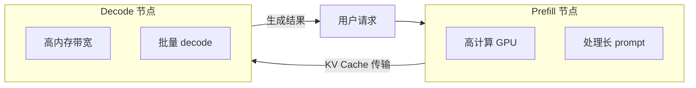
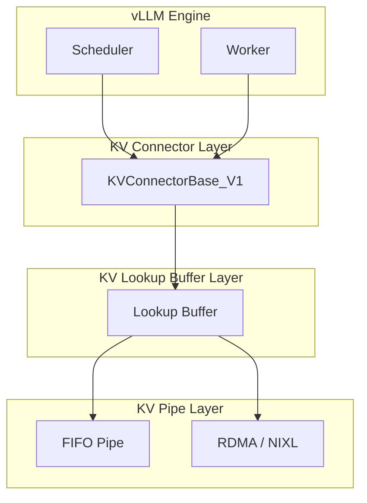
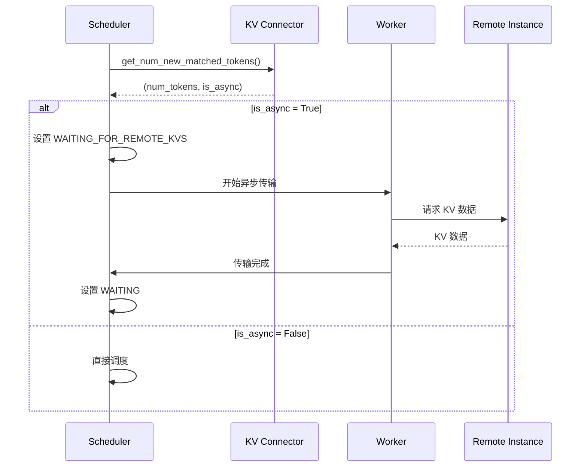
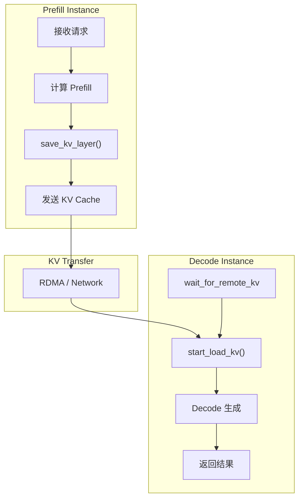

# vLLM Prefill-Decode 分离 (P/D Disaggregation) 深度解析

本文档深入分析 vLLM 的 Prefill-Decode 分离架构，涵盖 KV 传输机制、连接器实现、调度集成等核心内容。

---

## 1. 设计动机

### 1.1 问题背景

LLM 推理分为两个阶段，各有不同的资源特性：

| 阶段 | 特点 | 瓶颈 |
|------|------|------|
| **Prefill** | 计算密集、并行处理 prompt | GPU 计算 |
| **Decode** | 内存带宽密集、自回归生成 | 内存带宽 |

将两阶段部署在不同节点可以实现更好的资源利用。

### 1.2 P/D 分离优势



---

## 2. 架构概述

### 2.1 三层抽象

vLLM 的 KV 传输采用分层架构：



| 层 | 职责 | 可选 |
|---|------|------|
| **KV Connector** | 连接 vLLM 与传输层 | 必需 |
| **KV Lookup Buffer** | 缓存 KV，支持乱序访问 | 可选 |
| **KV Pipe** | FIFO 传输通道 | 可选 |

### 2.2 核心类

| 类 | 文件 | 职责 |
|---|------|------|
| `KVConnectorBase_V1` | [base.py](file:///Users/wesley/code/vllm/vllm/distributed/kv_transfer/kv_connector/v1/base.py) | 连接器抽象基类 |
| `NixlConnector` | [nixl_connector.py](file:///Users/wesley/code/vllm/vllm/distributed/kv_transfer/kv_connector/v1/nixl_connector.py) | NIXL RDMA 实现 |
| `LMCacheConnector` | [lmcache_connector.py](file:///Users/wesley/code/vllm/vllm/distributed/kv_transfer/kv_connector/v1/lmcache_connector.py) | LMCache 集成 |
| `MooncakeConnector` | [mooncake_connector.py](file:///Users/wesley/code/vllm/vllm/distributed/kv_transfer/kv_connector/v1/mooncake_connector.py) | Mooncake 存储 |

---

## 3. KVConnectorBase_V1 接口

### 3.1 角色分离

连接器分为 Scheduler 端和 Worker 端：

```python
class KVConnectorRole(enum.Enum):
    SCHEDULER = 0  # 调度进程中运行
    WORKER = 1     # 工作进程中运行
```

### 3.2 Scheduler 端方法

```python
class KVConnectorBase_V1(ABC):
    # 查询外部可用的 KV tokens 数量
    @abstractmethod
    def get_num_new_matched_tokens(
        self,
        request: Request,
        num_computed_tokens: int,
    ) -> tuple[int | None, bool]:
        """
        Returns:
            - 可从外部加载的新 token 数 (None = 需要等待)
            - 是否异步加载
        """
        pass
    
    # 分配后更新状态
    @abstractmethod
    def update_state_after_alloc(
        self, request: Request, blocks: KVCacheBlocks, num_external_tokens: int
    ):
        pass
    
    # 构建连接器元数据
    @abstractmethod
    def build_connector_meta(
        self, scheduler_output: SchedulerOutput
    ) -> KVConnectorMetadata:
        pass
    
    # 请求完成时调用
    def request_finished(
        self, request: Request, block_ids: list[int]
    ) -> tuple[bool, dict[str, Any] | None]:
        """
        Returns:
            - True = 连接器负责异步释放 blocks
            - KV 传输参数 (可选)
        """
        return False, None
```

### 3.3 Worker 端方法

```python
class KVConnectorBase_V1(ABC):
    # 开始加载 KV (可能异步)
    @abstractmethod
    def start_load_kv(self, forward_context: ForwardContext, **kwargs) -> None:
        pass
    
    # 等待特定层加载完成
    @abstractmethod
    def wait_for_layer_load(self, layer_name: str) -> None:
        pass
    
    # 保存特定层的 KV (可能异步)
    @abstractmethod
    def save_kv_layer(
        self, layer_name: str, kv_layer: torch.Tensor, attn_metadata: AttentionMetadata
    ) -> None:
        pass
    
    # 等待所有保存完成
    @abstractmethod
    def wait_for_save(self):
        pass
```

---

## 4. 调度器集成

### 4.1 请求状态

P/D 分离引入了新的请求状态：

```python
class RequestStatus(enum.IntEnum):
    WAITING_FOR_REMOTE_KVS = 4  # 等待远程 KV 加载
```

### 4.2 调度流程



### 4.3 Scheduler 中的处理

```python
# scheduler.py 中的关键逻辑
if self.connector is not None:
    ext_tokens, load_kv_async = self.connector.get_num_new_matched_tokens(
        request, num_new_local_computed_tokens
    )
    
    if load_kv_async:
        # 异步加载，设置等待状态
        request.status = RequestStatus.WAITING_FOR_REMOTE_KVS
        # ... 后续处理
```

---

## 5. 连接器实现

### 5.1 NIXL Connector

使用 NVIDIA NCCL/RDMA 进行高效 KV 传输：

```python
# nixl_connector.py
class NixlConnector(KVConnectorBase_V1, SupportsHMA):
    prefer_cross_layer_blocks = True  # 偏好跨层 blocks 以加速传输
    
    def start_load_kv(self, forward_context, **kwargs):
        # 使用 RDMA 异步加载
        self._start_rdma_read(...)
    
    def save_kv_layer(self, layer_name, kv_layer, attn_metadata):
        # 使用 RDMA 异步保存
        self._start_rdma_write(...)
```

### 5.2 LMCache Connector

与 LMCache 分布式缓存集成：

```python
# lmcache_connector.py
class LMCacheConnector(KVConnectorBase_V1):
    def get_num_new_matched_tokens(self, request, num_computed_tokens):
        # 查询 LMCache 中的缓存命中
        cached_tokens = self.lm_cache_client.check_cache(
            request.prompt_token_ids
        )
        return cached_tokens - num_computed_tokens, True
```

---

## 6. 配置与使用

### 6.1 启动 P/D 分离

**Prefill 节点**：
```bash
vllm serve model \
    --kv-transfer-role prefill \
    --kv-connector nixl \
    --kv-transfer-target-address decode-node:8080
```

**Decode 节点**：
```bash
vllm serve model \
    --kv-transfer-role decode \
    --kv-connector nixl
```

### 6.2 配置参数

| 参数 | 说明 |
|------|------|
| `--kv-transfer-role` | 角色: prefill/decode |
| `--kv-connector` | 连接器类型: nixl/lmcache/mooncake |
| `--kv-transfer-target-address` | 目标地址 |

---

## 7. 数据流



---

## 8. Hybrid Memory Allocator (HMA)

部分连接器支持 HMA，用于更高效的内存管理：

```python
class SupportsHMA(ABC):
    @abstractmethod
    def request_finished_all_groups(
        self, request: Request, block_ids: tuple[list[int], ...]
    ) -> tuple[bool, dict[str, Any] | None]:
        """所有 KV cache groups 完成时调用"""
        pass

# 检查连接器是否支持 HMA
if supports_hma(connector):
    # 使用 HMA 优化路径
    ...
```

---

## 9. 调试技巧

### 9.1 监控传输状态

```python
# 获取连接器统计
stats = connector.get_kv_connector_stats()
if stats:
    print(f"Transfer rate: {stats.transfer_rate_mbps} MB/s")
```

### 9.2 关键代码位置

1. **Connector 基类**: [base.py](file:///Users/wesley/code/vllm/vllm/distributed/kv_transfer/kv_connector/v1/base.py)
2. **调度器集成**: [scheduler.py L478-520](file:///Users/wesley/code/vllm/vllm/v1/core/sched/scheduler.py#L478-L520)
3. **请求状态**: [request.py (WAITING_FOR_REMOTE_KVS)](file:///Users/wesley/code/vllm/vllm/v1/request.py#L250)

---

## 参考文件

- [README.md](file:///Users/wesley/code/vllm/vllm/distributed/kv_transfer/README.md) - KV 传输概述
- [base.py](file:///Users/wesley/code/vllm/vllm/distributed/kv_transfer/kv_connector/v1/base.py) - 连接器基类
- [nixl_connector.py](file:///Users/wesley/code/vllm/vllm/distributed/kv_transfer/kv_connector/v1/nixl_connector.py) - NIXL 实现
- [lmcache_connector.py](file:///Users/wesley/code/vllm/vllm/distributed/kv_transfer/kv_connector/v1/lmcache_connector.py) - LMCache 实现
- [scheduler.py](file:///Users/wesley/code/vllm/vllm/v1/core/sched/scheduler.py) - 调度器集成
