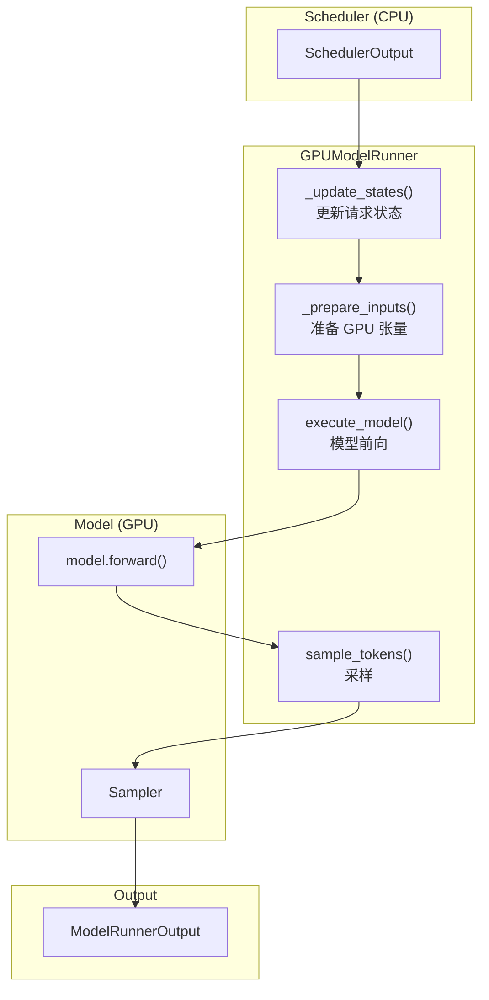
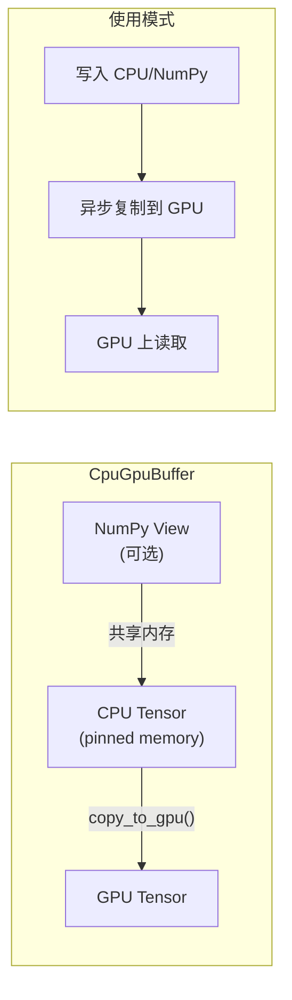
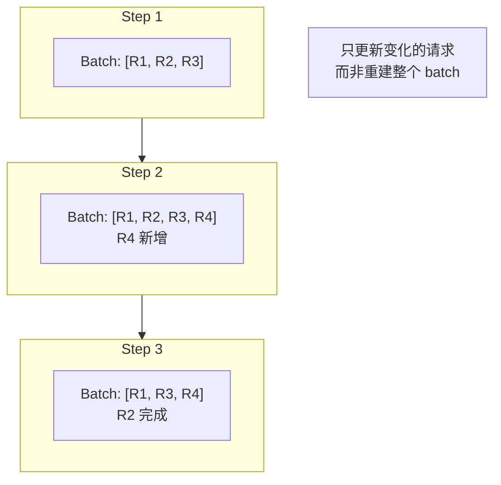
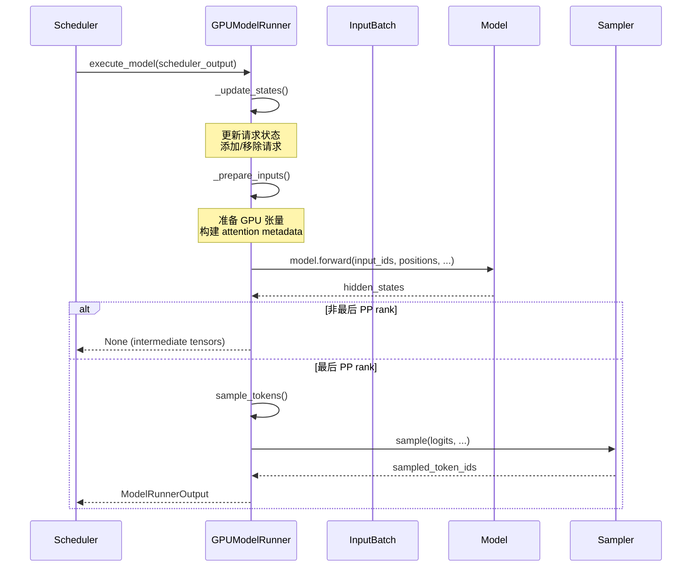
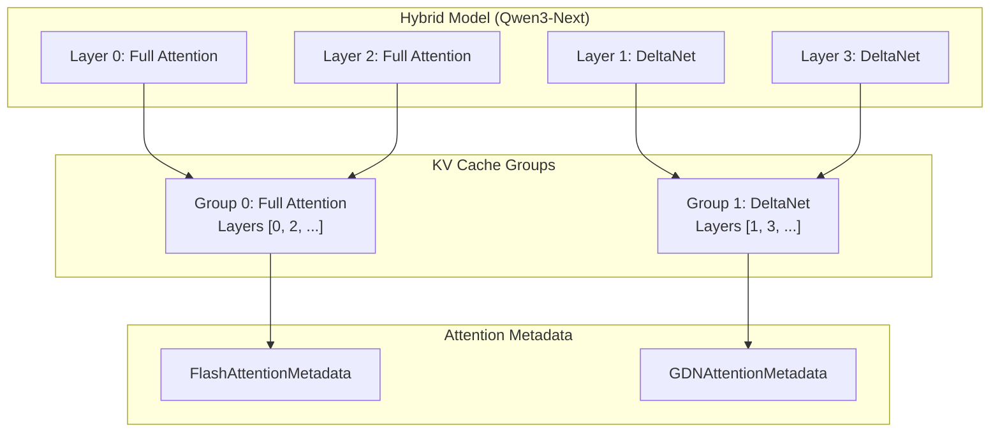
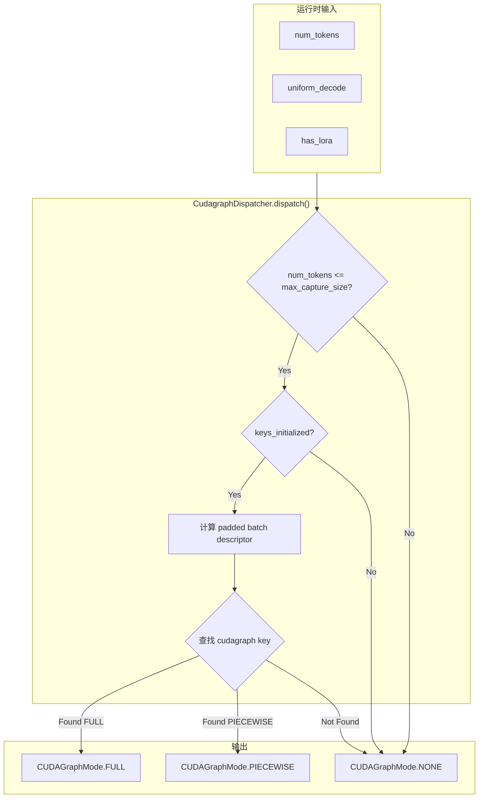
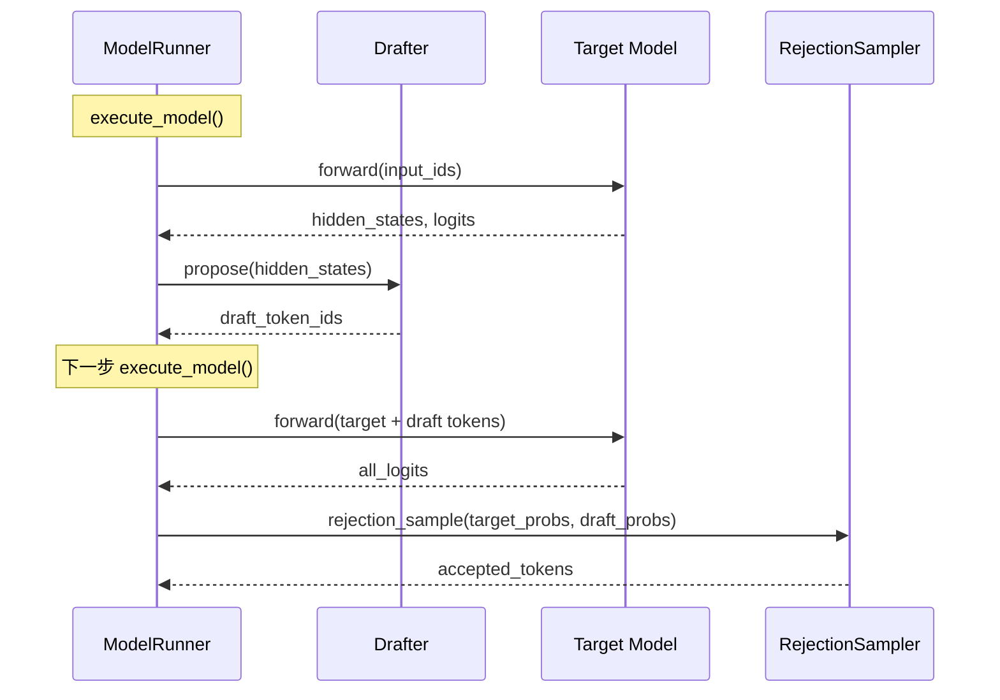
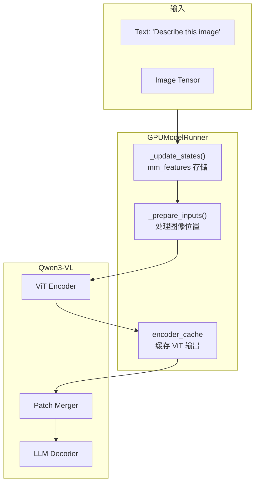
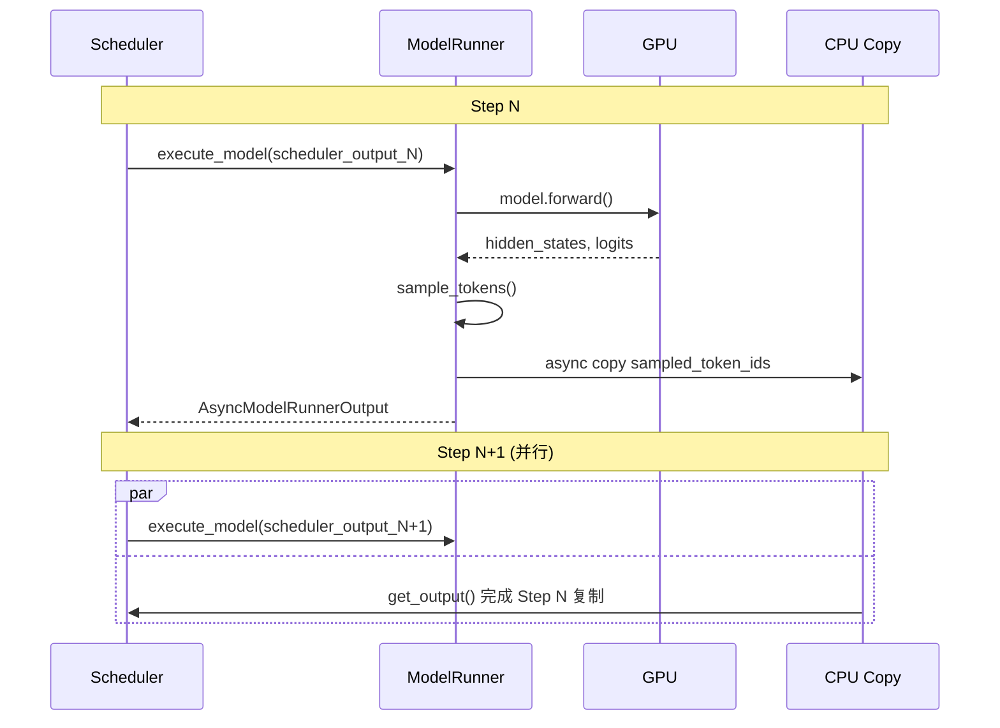
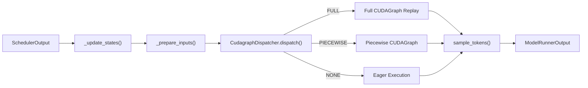

# 08 - ModelRunner 核心架构

> **前置阅读**: [07-paged-attention.md](./07-paged-attention.md)
>
> **核心文件**:
> - `vllm/v1/worker/gpu_model_runner.py` - GPUModelRunner 主类
> - `vllm/v1/worker/gpu_input_batch.py` - InputBatch 输入批处理
> - `vllm/v1/cudagraph_dispatcher.py` - CUDAGraph 调度器

---

## 1. 概述

ModelRunner 是 vLLM V1 架构中连接 Scheduler 和 Model 的核心组件，负责：
- 将 SchedulerOutput 转换为 GPU 张量
- 管理 KV Cache 的绑定和更新
- 执行模型前向传播
- 处理采样和 token 生成

### 1.1 整体架构



---

## 2. GPUModelRunner 初始化

### 2.1 核心属性

```python
# vllm/v1/worker/gpu_model_runner.py:323
class GPUModelRunner(
    LoRAModelRunnerMixin, KVConnectorModelRunnerMixin, ECConnectorModelRunnerMixin
):
    def __init__(
        self,
        vllm_config: VllmConfig,
        device: torch.device,
    ):
        # ============ 配置 ============
        self.vllm_config = vllm_config
        self.model_config = vllm_config.model_config
        self.cache_config = vllm_config.cache_config
        self.compilation_config = vllm_config.compilation_config
        self.scheduler_config = vllm_config.scheduler_config
        self.speculative_config = vllm_config.speculative_config
        
        # ============ 设备和数据类型 ============
        self.device = device
        self.dtype = self.model_config.dtype
        self.kv_cache_dtype = kv_cache_dtype_str_to_dtype(
            cache_config.cache_dtype, self.model_config
        )
        
        # ============ 批处理限制 ============
        self.max_num_tokens = scheduler_config.max_num_batched_tokens
        self.max_num_reqs = scheduler_config.max_num_seqs
        self.max_model_len = model_config.max_model_len
        
        # ============ 模型相关 ============
        self.num_query_heads = model_config.get_num_attention_heads(parallel_config)
        self.inputs_embeds_size = model_config.get_inputs_embeds_size()
        
        # ============ 分布式 ============
        self.dcp_world_size = self.parallel_config.decode_context_parallel_size
        self.dcp_rank = 0 if self.dcp_world_size <= 1 else get_dcp_group().rank_in_group
```

### 2.2 持久化 Buffer

```python
# vllm/v1/worker/gpu_model_runner.py:556
# 为 CUDA Graph 预分配的持久化 buffer
self.input_ids = self._make_buffer(self.max_num_tokens, dtype=torch.int32)
self.positions = self._make_buffer(self.max_num_tokens, dtype=torch.int64)
self.query_start_loc = self._make_buffer(
    self.max_num_reqs + 1, dtype=torch.int32
)
self.seq_lens = self._make_buffer(self.max_num_reqs, dtype=torch.int32)
self.inputs_embeds = self._make_buffer(
    self.max_num_tokens, self.inputs_embeds_size, dtype=self.dtype, numpy=False
)
```

### 2.3 CpuGpuBuffer 双缓冲



```python
# vllm/v1/utils.py
class CpuGpuBuffer:
    """双缓冲: CPU (pinned) + GPU"""
    
    def __init__(self, *size, dtype, device, pin_memory=True, with_numpy=True):
        self.cpu = torch.empty(*size, dtype=dtype, device="cpu", pin_memory=pin_memory)
        self.gpu = torch.empty(*size, dtype=dtype, device=device)
        if with_numpy:
            self.np = self.cpu.numpy()  # 零拷贝 NumPy view
    
    def copy_to_gpu(self, num_elements=None):
        """异步复制到 GPU"""
        if num_elements:
            self.gpu[:num_elements].copy_(self.cpu[:num_elements], non_blocking=True)
        else:
            self.gpu.copy_(self.cpu, non_blocking=True)
```

---

## 3. InputBatch 持久化批处理

### 3.1 设计思想

InputBatch 维护一个持久化的批处理状态，避免每个 step 重新创建请求数据：



### 3.2 核心结构

```python
# vllm/v1/worker/gpu_input_batch.py
class InputBatch:
    def __init__(
        self,
        max_num_reqs: int,
        max_model_len: int,
        max_num_batched_tokens: int,
        device: torch.device,
        ...
    ):
        # ============ 请求索引映射 ============
        self.req_id_to_index: dict[str, int] = {}
        self.req_ids: list[str] = []  # 按索引顺序的请求 ID
        
        # ============ Token IDs ============
        # shape: [max_num_reqs, max_model_len]
        self.token_ids_cpu = np.zeros(
            (max_num_reqs, max_model_len), dtype=np.int32
        )
        
        # ============ 每请求元数据 ============
        self.num_computed_tokens_cpu = np.zeros(max_num_reqs, dtype=np.int32)
        self.num_prompt_tokens = np.zeros(max_num_reqs, dtype=np.int32)
        self.num_tokens_no_spec = np.zeros(max_num_reqs, dtype=np.int32)
        
        # ============ Block Table ============
        self.block_table = [
            BlockTable(device, block_sizes[i], ...)
            for i in range(num_kv_cache_groups)
        ]
        
        # ============ 采样参数 ============
        self.sampling_metadata: SamplingMetadata
        self.logits_processors: LogitsProcessors
```

### 3.3 请求管理

```python
# vllm/v1/worker/gpu_input_batch.py
def add_request(self, request: CachedRequestState) -> None:
    """添加新请求到批处理"""
    # 找到空闲槽位
    if self.empty_req_indices:
        req_index = self.empty_req_indices.pop()
    else:
        req_index = self.num_reqs
        self.num_reqs += 1
    
    # 建立映射
    self.req_ids.insert(req_index, request.req_id)
    self.req_id_to_index[request.req_id] = req_index
    
    # 复制 token IDs
    num_tokens = len(request.prompt_token_ids)
    self.token_ids_cpu[req_index, :num_tokens] = request.prompt_token_ids
    self.num_prompt_tokens[req_index] = num_tokens
    
    # 设置 block table
    for i, block_ids in enumerate(request.block_ids):
        self.block_table[i].set_row(req_index, block_ids)

def remove_request(self, req_id: str) -> None:
    """移除完成的请求"""
    req_index = self.req_id_to_index.pop(req_id)
    self.req_ids.remove(req_id)
    self.empty_req_indices.append(req_index)  # 标记为空闲
```

---

## 4. execute_model 执行流程

### 4.1 主流程



### 4.2 _update_states 状态更新

```python
# vllm/v1/worker/gpu_model_runner.py:854
def _update_states(self, scheduler_output: "SchedulerOutput") -> None:
    """更新缓存状态和持久化批处理"""
    
    # ============ 1. 移除完成的请求 ============
    for req_id in scheduler_output.finished_req_ids:
        self.requests.pop(req_id, None)
        self.input_batch.remove_request(req_id)

    # ============ 2. 释放 encoder 缓存 ============
    for mm_hash in scheduler_output.free_encoder_mm_hashes:
        self.encoder_cache.pop(mm_hash, None)

    # ============ 3. 移除未调度的请求 ============
    scheduled_req_ids = scheduler_output.num_scheduled_tokens.keys()
    cached_req_ids = self.input_batch.req_id_to_index.keys()
    unscheduled_req_ids = cached_req_ids - scheduled_req_ids
    for req_id in unscheduled_req_ids:
        self.input_batch.remove_request(req_id)

    # ============ 4. 添加新请求 ============
    reqs_to_add = []
    for new_req_data in scheduler_output.scheduled_new_reqs:
        req_state = CachedRequestState(
            req_id=new_req_data.req_id,
            prompt_token_ids=new_req_data.prompt_token_ids,
            block_ids=new_req_data.block_ids,
            num_computed_tokens=new_req_data.num_computed_tokens,
            ...
        )
        self.requests[req_id] = req_state
        reqs_to_add.append(req_state)

    # ============ 5. 更新运行中请求的状态 ============
    for i, req_id in enumerate(scheduler_output.scheduled_cached_reqs.req_ids):
        req_state = self.requests[req_id]
        req_state.num_computed_tokens = ...
        # 更新 block_ids, output_token_ids 等

    # ============ 6. 添加新/恢复的请求 ============
    for request in reqs_to_add:
        self.input_batch.add_request(request)
    
    # ============ 7. 压缩和重排序 ============
    self.input_batch.condense()
    self._may_reorder_batch(scheduler_output)
    self.input_batch.refresh_metadata()
```

### 4.3 _prepare_inputs 输入准备

```python
# vllm/v1/worker/gpu_model_runner.py (simplified)
def _prepare_inputs(
    self,
    scheduler_output: "SchedulerOutput",
) -> tuple[...]:
    """准备模型输入张量"""
    
    num_reqs = self.input_batch.num_reqs
    
    # ============ 1. 计算调度的 token 数 ============
    num_scheduled_tokens = np.array([
        scheduler_output.num_scheduled_tokens[req_id]
        for req_id in self.input_batch.req_ids
    ])
    cu_num_tokens = np.cumsum(num_scheduled_tokens)
    num_tokens = cu_num_tokens[-1]
    
    # ============ 2. 填充 input_ids 和 positions ============
    for i, req_id in enumerate(self.input_batch.req_ids):
        start = 0 if i == 0 else cu_num_tokens[i-1]
        end = cu_num_tokens[i]
        num_computed = self.input_batch.num_computed_tokens_cpu[i]
        
        # input_ids: 从 token_ids_cpu 复制
        self.input_ids.np[start:end] = self.input_batch.token_ids_cpu[
            i, num_computed:num_computed + num_scheduled_tokens[i]
        ]
        
        # positions: 简单递增
        self.positions.np[start:end] = np.arange(
            num_computed, num_computed + num_scheduled_tokens[i]
        )
    
    # ============ 3. 填充 query_start_loc 和 seq_lens ============
    self.query_start_loc.np[:num_reqs + 1] = np.concatenate([[0], cu_num_tokens])
    self.seq_lens.np[:num_reqs] = (
        self.input_batch.num_computed_tokens_cpu[:num_reqs] + 
        num_scheduled_tokens
    )
    
    # ============ 4. 异步复制到 GPU ============
    self.input_ids.copy_to_gpu(num_tokens)
    self.positions.copy_to_gpu(num_tokens)
    self.query_start_loc.copy_to_gpu(num_reqs + 1)
    self.seq_lens.copy_to_gpu(num_reqs)
    
    # ============ 5. 计算 slot_mapping ============
    slot_mappings = self._compute_slot_mappings(...)
    
    # ============ 6. 构建 attention metadata ============
    attn_metadata, spec_decode_attn_metadata = self._build_attention_metadata(
        num_tokens=num_tokens,
        num_reqs=num_reqs,
        max_query_len=num_scheduled_tokens.max(),
        slot_mappings=slot_mappings,
        ...
    )
    
    return (
        self.input_ids.gpu[:num_tokens],
        self._get_positions(num_tokens),
        attn_metadata,
        logits_indices,
        ...
    )
```

---

## 5. Attention Metadata 构建

### 5.1 多 KV Cache Group 支持



### 5.2 _build_attention_metadata

```python
# vllm/v1/worker/gpu_model_runner.py:1633
def _build_attention_metadata(
    self,
    num_tokens: int,
    num_reqs: int,
    max_query_len: int,
    slot_mappings: dict[int, torch.Tensor],
    ...
) -> tuple[PerLayerAttnMetadata, CommonAttentionMetadata | None]:
    """为每个 KV Cache Group 构建 attention metadata"""
    
    # ============ 1. 构建公共元数据 ============
    cm_base = CommonAttentionMetadata(
        query_start_loc=self.query_start_loc.gpu[:num_reqs + 1],
        query_start_loc_cpu=self.query_start_loc.cpu[:num_reqs + 1],
        seq_lens=self.seq_lens.gpu[:num_reqs],
        num_reqs=num_reqs,
        num_actual_tokens=num_tokens,
        max_query_len=max_query_len,
        max_seq_len=max_seq_len,
        block_table_tensor=block_table_gid_0,
        slot_mapping=slot_mapping_gid_0,
        causal=True,
    )
    
    # ============ 2. 为每个 KV Cache Group 构建 ============
    attn_metadata: dict[str, AttentionMetadata] = {}
    
    for kv_cache_gid, kv_cache_group in enumerate(kv_cache_groups):
        cm = copy(cm_base)  # 浅拷贝
        
        # 更新 block_table 和 slot_mapping
        if kv_cache_gid > 0:
            cm.block_table_tensor = _get_block_table(kv_cache_gid)
            cm.slot_mapping = slot_mappings[kv_cache_gid]
        
        # 为每个 attention group 构建 metadata
        for attn_group in self.attn_groups[kv_cache_gid]:
            builder = attn_group.get_metadata_builder()
            
            attn_metadata_i = builder.build(
                common_prefix_len=cascade_attn_prefix_len,
                common_attn_metadata=cm,
            )
            
            # 所有共享同一 KV Cache 的层使用相同 metadata
            for layer_name in attn_group.layer_names:
                attn_metadata[layer_name] = attn_metadata_i
    
    return attn_metadata, spec_decode_common_attn_metadata
```

---

## 6. CUDAGraph 调度

### 6.1 CudagraphDispatcher



### 6.2 BatchDescriptor

```python
# vllm/forward_context.py
@dataclass(frozen=True)
class BatchDescriptor:
    """CUDA Graph 的 batch 描述符 (作为 cache key)"""
    num_tokens: int        # padded token 数
    num_reqs: int = 0      # padded 请求数
    uniform: bool = False  # 是否均匀 decode batch
    has_lora: bool = False # 是否有 LoRA
    
    def relax_for_mixed_batch_cudagraphs(self) -> "BatchDescriptor":
        """放松约束以支持混合批次"""
        return BatchDescriptor(
            num_tokens=self.num_tokens,
            num_reqs=0,      # 忽略请求数
            uniform=False,   # 不要求均匀
            has_lora=self.has_lora,
        )
```

### 6.3 调度逻辑

```python
# vllm/v1/cudagraph_dispatcher.py:184
def dispatch(
    self,
    num_tokens: int,
    uniform_decode: bool = False,
    has_lora: bool = False,
    disable_full: bool = False,
) -> tuple[CUDAGraphMode, BatchDescriptor]:
    """调度到合适的 CUDA Graph 模式"""
    
    # 1. 超出最大捕获大小
    if num_tokens > self.compilation_config.max_cudagraph_capture_size:
        return CUDAGraphMode.NONE, BatchDescriptor(num_tokens)
    
    # 2. 创建 padded batch descriptor
    batch_desc = self._create_padded_batch_descriptor(
        num_tokens, uniform_decode, has_lora
    )
    relaxed_batch_desc = batch_desc.relax_for_mixed_batch_cudagraphs()
    
    # 3. 优先检查 FULL cudagraph
    if not disable_full:
        if batch_desc in self.cudagraph_keys[CUDAGraphMode.FULL]:
            return CUDAGraphMode.FULL, batch_desc
        if relaxed_batch_desc in self.cudagraph_keys[CUDAGraphMode.FULL]:
            return CUDAGraphMode.FULL, relaxed_batch_desc
    
    # 4. 检查 PIECEWISE cudagraph
    if relaxed_batch_desc in self.cudagraph_keys[CUDAGraphMode.PIECEWISE]:
        return CUDAGraphMode.PIECEWISE, relaxed_batch_desc
    
    # 5. 无匹配
    return CUDAGraphMode.NONE, BatchDescriptor(num_tokens)
```

---

## 7. 投机解码支持

### 7.1 Drafter 集成

```python
# vllm/v1/worker/gpu_model_runner.py:440
if self.speculative_config and get_pp_group().is_last_rank:
    if self.speculative_config.method == "ngram":
        self.drafter = NgramProposer(self.vllm_config)
    elif self.speculative_config.uses_draft_model():
        self.drafter = DraftModelProposer(...)
    elif self.speculative_config.method == "suffix":
        self.drafter = SuffixDecodingProposer(self.vllm_config)
    elif self.speculative_config.use_eagle():
        self.drafter = EagleProposer(self.vllm_config, self.device, self)
    elif self.speculative_config.method == "medusa":
        self.drafter = MedusaProposer(...)
    
    self.rejection_sampler = RejectionSampler(self.sampler)
```

### 7.2 投机执行流程



---

## 8. 以 Qwen3-VL 为例

### 8.1 多模态输入处理



### 8.2 M-RoPE 位置编码

```python
# vllm/v1/worker/gpu_model_runner.py:596
if self.uses_mrope:
    # M-RoPE: 3D 位置编码 (temporal, height, width)
    # shape: [3, max_num_tokens + 1]
    self.mrope_positions = self._make_buffer(
        (3, self.max_num_tokens + 1), dtype=torch.int64
    )

# vllm/v1/worker/gpu_model_runner.py:2009
def _calc_mrope_positions(self, scheduler_output):
    """计算 M-RoPE 位置"""
    for index, req_id in enumerate(self.input_batch.req_ids):
        req = self.requests[req_id]
        # prompt 部分: 使用预计算的位置
        # completion 部分: 动态计算
        if prompt_part_len > 0:
            self.mrope_positions.cpu[:, dst_start:dst_end] = (
                req.mrope_positions[:, src_start:src_end]
            )
        if completion_part_len > 0:
            MRotaryEmbedding.get_next_input_positions_tensor(...)
```

---

## 9. 以 Qwen3-Next (DeltaNet) 为例

### 9.1 混合模型的 Attention Group

```python
# 混合模型会有多个 KV Cache Group
# 每个 Group 对应不同的 Attention 类型

# Group 0: Full Attention layers
# Group 1: DeltaNet layers (Linear Attention)

kv_cache_groups = [
    KVCacheGroupSpec(
        kv_cache_spec=FullAttentionSpec(...),
        layer_names=["layers.0.self_attn", "layers.2.self_attn", ...]
    ),
    KVCacheGroupSpec(
        kv_cache_spec=GDNSpec(...),  # DeltaNet
        layer_names=["layers.1.self_attn", "layers.3.self_attn", ...]
    ),
]
```

### 9.2 不同 Backend 的 Metadata

```python
# Full Attention 使用 FlashAttentionMetadataBuilder
# DeltaNet 使用 GDNAttentionMetadataBuilder

for kv_cache_gid, kv_cache_group in enumerate(kv_cache_groups):
    for attn_group in self.attn_groups[kv_cache_gid]:
        # 根据 kv_cache_spec 选择合适的 builder
        if isinstance(kv_cache_spec, FullAttentionSpec):
            builder = FlashAttentionMetadataBuilder(...)
        elif isinstance(kv_cache_spec, GDNSpec):
            builder = GDNAttentionMetadataBuilder(...)
        
        attn_metadata = builder.build(...)
```

---

## 10. 异步调度

### 10.1 Async Scheduling 流程



### 10.2 AsyncGPUModelRunnerOutput

```python
# vllm/v1/worker/gpu_model_runner.py:196
class AsyncGPUModelRunnerOutput(AsyncModelRunnerOutput):
    def __init__(
        self,
        model_runner_output: ModelRunnerOutput,
        sampled_token_ids: torch.Tensor,
        async_output_copy_stream: torch.cuda.Stream,
        ...
    ):
        # 在独立 stream 上发起异步复制
        default_stream = torch.cuda.current_stream()
        with torch.cuda.stream(async_output_copy_stream):
            async_output_copy_stream.wait_stream(default_stream)
            self.sampled_token_ids_cpu = self._sampled_token_ids.to(
                "cpu", non_blocking=True
            )
            self.async_copy_ready_event.record()
    
    def get_output(self) -> ModelRunnerOutput:
        """阻塞等待复制完成"""
        self.async_copy_ready_event.synchronize()
        # 处理采样结果
        return self._model_runner_output
```

---

## 11. 总结

### 11.1 关键设计点

| 设计 | 说明 |
|------|------|
| **持久化批处理** | InputBatch 跨 step 复用，只更新变化的请求 |
| **CpuGpuBuffer** | CPU/GPU 双缓冲 + 异步复制，减少同步开销 |
| **多 KV Cache Group** | 支持混合模型 (Full Attn + Linear Attn) |
| **CUDAGraph 调度** | 根据 batch 特征选择 FULL/PIECEWISE/NONE |
| **异步调度** | 采样结果异步复制，与下一步 forward 重叠 |

### 11.2 执行流程总结



---

> **下一步**: [09-cuda-graph.md](./09-cuda-graph.md) - CUDA Graph 优化机制
