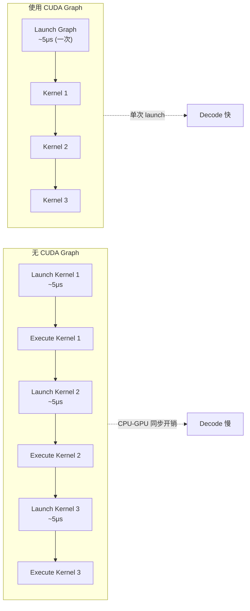
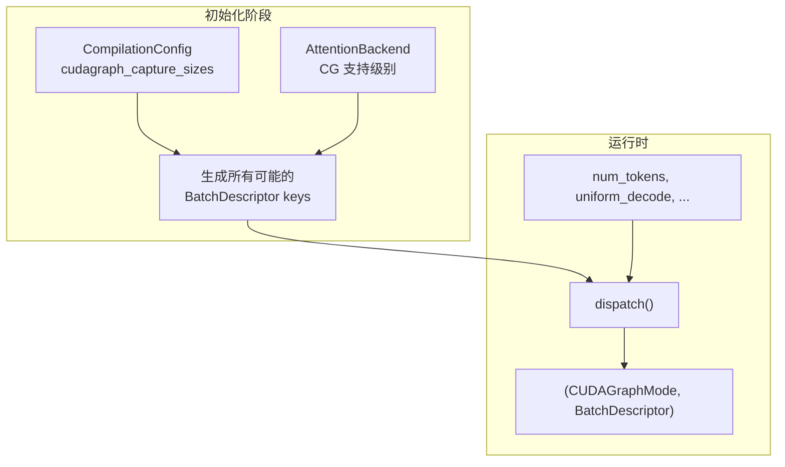
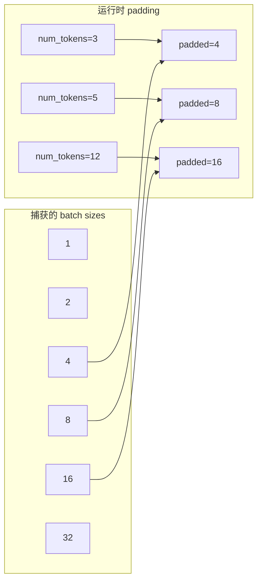
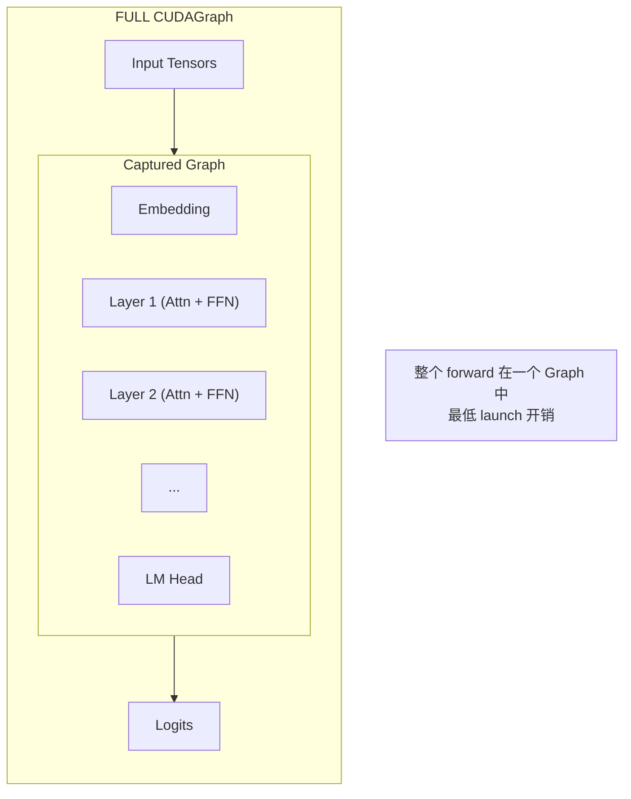
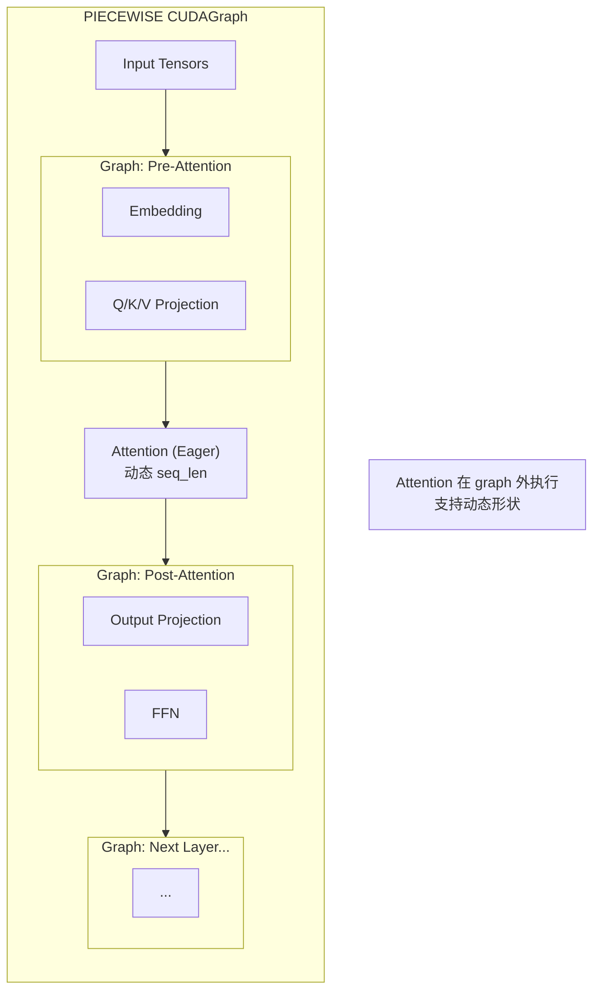
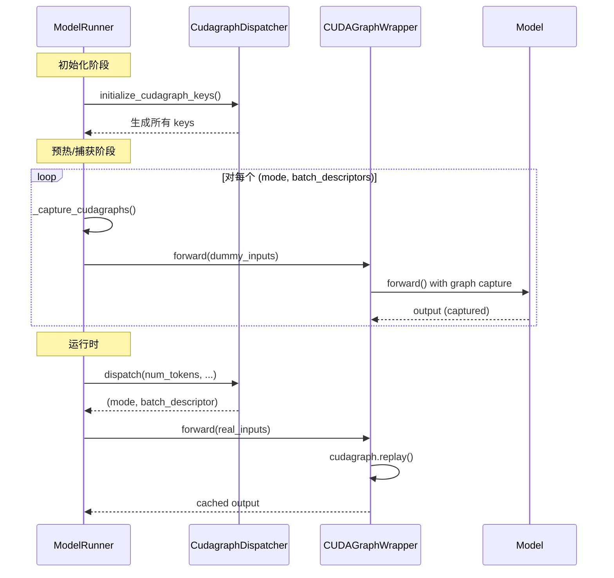
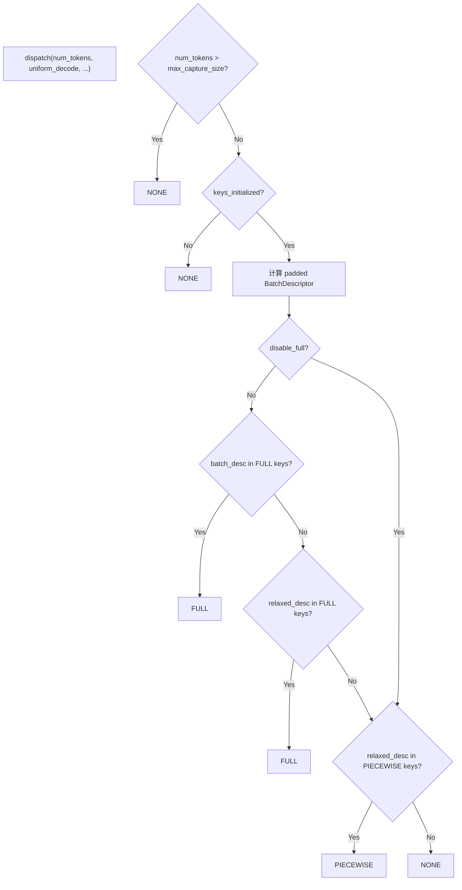
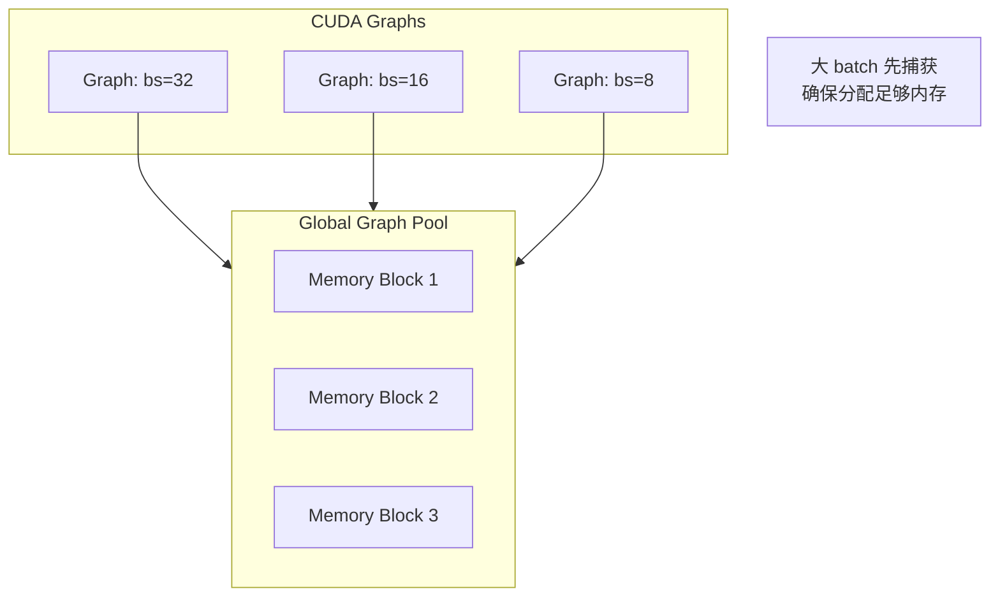
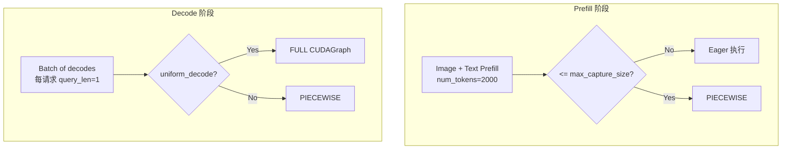
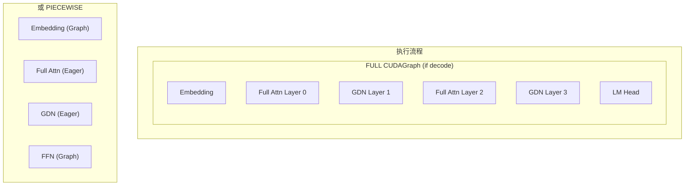

# 09 - CUDA Graph 优化机制

> **前置阅读**: [08-model-runner.md](./08-model-runner.md)
>
> **核心文件**:
> - `vllm/compilation/cuda_graph.py` - CUDAGraphWrapper
> - `vllm/v1/cudagraph_dispatcher.py` - CudagraphDispatcher
> - `vllm/config/compilation.py` - CUDAGraphMode 配置

---

## 1. 概述

CUDA Graph 是 NVIDIA 提供的优化技术，通过预先录制 GPU 操作序列，避免运行时的 kernel launch 开销。对于 LLM 推理的 decode 阶段（每次只生成 1 个 token），kernel launch 开销占比很高，CUDA Graph 可以显著提升吞吐量。

### 1.1 为什么需要 CUDA Graph



### 1.2 vLLM 的 CUDA Graph 模式

```python
# vllm/config/compilation.py
class CUDAGraphMode(Enum):
    """CUDA Graph 运行时模式"""
    
    NONE = 0
    """不使用 CUDA Graph"""
    
    PIECEWISE = 1
    """分片 CUDA Graph: 只对非 attention 部分使用"""
    
    FULL = 2
    """完整 CUDA Graph: 整个 forward 在 graph 内"""
    
    FULL_AND_PIECEWISE = 3
    """混合模式: decode 用 FULL, prefill 用 PIECEWISE"""
```

---

## 2. CUDAGraphWrapper 核心实现

### 2.1 类设计

```python
# vllm/compilation/cuda_graph.py:139
class CUDAGraphWrapper:
    """
    包装一个可调用对象，添加 CUDA Graph 捕获和重放能力。
    
    工作流程:
    1. 初始化时指定 runtime_mode (FULL 或 PIECEWISE)
    2. 运行时从 forward_context 获取 runtime_mode 和 batch_descriptor
    3. 如果 runtime_mode 匹配:
       - key 不存在: 捕获新的 CUDA Graph
       - key 存在: 重放已捕获的 Graph
    4. 如果不匹配或 mode=NONE: 直接调用原函数
    """
    
    def __init__(
        self,
        runnable: Callable[..., Any],
        vllm_config: VllmConfig,
        runtime_mode: CUDAGraphMode,
        cudagraph_options: CUDAGraphOptions | None = None,
    ) -> None:
        self.runnable = runnable
        self.runtime_mode = runtime_mode
        self.graph_pool = current_platform.get_global_graph_pool()
        
        # batch_descriptor -> CUDAGraphEntry 的缓存
        self.concrete_cudagraph_entries: dict[BatchDescriptor, CUDAGraphEntry] = {}
```

### 2.2 CUDAGraphEntry

```python
# vllm/compilation/cuda_graph.py:121
@dataclasses.dataclass
class CUDAGraphEntry:
    batch_descriptor: BatchDescriptor
    cudagraph: torch.cuda.CUDAGraph | None = None
    output: Any | None = None
    
    # 调试用: 捕获时的输入地址，重放时验证
    input_addresses: list[int] | None = None
```

### 2.3 捕获与重放

```python
# vllm/compilation/cuda_graph.py:207
def __call__(self, *args: Any, **kwargs: Any) -> Any | None:
    forward_context = get_forward_context()
    batch_descriptor = forward_context.batch_descriptor
    cudagraph_runtime_mode = forward_context.cudagraph_runtime_mode

    # ============ 1. 不使用 CUDA Graph 的情况 ============
    if (
        cudagraph_runtime_mode == CUDAGraphMode.NONE
        or cudagraph_runtime_mode != self.runtime_mode
    ):
        return self.runnable(*args, **kwargs)

    # ============ 2. 获取或创建 entry ============
    if batch_descriptor not in self.concrete_cudagraph_entries:
        self.concrete_cudagraph_entries[batch_descriptor] = CUDAGraphEntry(
            batch_descriptor=batch_descriptor
        )
    entry = self.concrete_cudagraph_entries[batch_descriptor]

    # ============ 3. 捕获新的 Graph ============
    if entry.cudagraph is None:
        input_addresses = [
            x.data_ptr() for x in args if isinstance(x, torch.Tensor)
        ]
        entry.input_addresses = input_addresses
        cudagraph = torch.cuda.CUDAGraph()

        with torch.cuda.graph(
            cudagraph,
            pool=self.graph_pool,
            stream=current_stream(),
        ):
            output = self.runnable(*args, **kwargs)
            if self.cudagraph_options.weak_ref_output:
                output = weak_ref_tensors(output)

        entry.output = weak_ref_tensors(output)
        entry.cudagraph = cudagraph
        return output

    # ============ 4. 重放已捕获的 Graph ============
    if self.is_debugging_mode:
        # 验证输入地址一致
        new_input_addresses = [
            x.data_ptr() for x in args if isinstance(x, torch.Tensor)
        ]
        assert new_input_addresses == entry.input_addresses

    entry.cudagraph.replay()
    return entry.output
```

---

## 3. CudagraphDispatcher 调度器

### 3.1 设计思想



### 3.2 初始化 Keys

```python
# vllm/v1/cudagraph_dispatcher.py:124
def initialize_cudagraph_keys(
    self, cudagraph_mode: CUDAGraphMode, uniform_decode_query_len: int = 1
):
    """在 attention backend 初始化后调用"""
    
    self.cudagraph_mode = cudagraph_mode
    if cudagraph_mode == CUDAGraphMode.NONE:
        return
    
    # 预计算 batch size -> padded size 的映射
    self._compute_bs_to_padded_graph_size()
    
    # LoRA 场景的特殊处理
    lora_cases = [True, False] if self.vllm_config.lora_config else [False]
    
    # ============ 生成 mixed-mode keys ============
    if cudagraph_mode.mixed_mode() != CUDAGraphMode.NONE:
        for bs, has_lora in product(
            self.compilation_config.cudagraph_capture_sizes, lora_cases
        ):
            self.add_cudagraph_key(
                cudagraph_mode.mixed_mode(),
                self._create_padded_batch_descriptor(
                    bs, uniform_decode=False, has_lora=has_lora
                ).relax_for_mixed_batch_cudagraphs(),
            )
    
    # ============ 生成 decode-only FULL keys ============
    if cudagraph_mode.decode_mode() == CUDAGraphMode.FULL:
        max_num_tokens = uniform_decode_query_len * self.max_num_seqs
        for bs, has_lora in product(
            [s for s in capture_sizes if s <= max_num_tokens],
            lora_cases
        ):
            self.add_cudagraph_key(
                CUDAGraphMode.FULL,
                self._create_padded_batch_descriptor(bs, uniform_decode=True, has_lora),
            )
```

### 3.3 Padding 策略



```python
# vllm/v1/cudagraph_dispatcher.py:63
def _compute_bs_to_padded_graph_size(self) -> None:
    """预计算 batch size 到 padded graph size 的映射"""
    max_size = self.compilation_config.max_cudagraph_capture_size
    capture_sizes = self.compilation_config.cudagraph_capture_sizes
    
    self._bs_to_padded_graph_size: list[int] = [0] * (max_size + 1)
    
    for end, start in zip(
        capture_sizes + [max_size + 1],
        [0] + capture_sizes,
    ):
        for bs in range(start, end):
            if bs == start:
                self._bs_to_padded_graph_size[bs] = start
            else:
                self._bs_to_padded_graph_size[bs] = end
```

---

## 4. FULL vs PIECEWISE 模式

### 4.1 FULL CUDA Graph



**优点**:
- 最小的 kernel launch 开销
- decode 吞吐量最高

**限制**:
- Attention 必须支持 CUDA Graph (FA3 完全支持, FA2 部分支持)
- Batch 内所有请求的 query_len 需要满足特定条件
- 不支持动态形状

### 4.2 PIECEWISE CUDA Graph



**优点**:
- 支持更多场景 (prefill, mixed batch)
- 兼容所有 attention backend

**限制**:
- 比 FULL 多几次 kernel launch (每层 attention 一次)

### 4.3 FULL_AND_PIECEWISE 混合模式

```python
# vllm/config/compilation.py
class CUDAGraphMode(Enum):
    FULL_AND_PIECEWISE = 3
    """
    混合模式:
    - Uniform decode batch: 使用 FULL CUDAGraph
    - Mixed prefill-decode batch: 使用 PIECEWISE
    """
    
    def mixed_mode(self) -> "CUDAGraphMode":
        """返回 mixed batch 使用的模式"""
        if self == CUDAGraphMode.FULL_AND_PIECEWISE:
            return CUDAGraphMode.PIECEWISE
        return self
    
    def decode_mode(self) -> "CUDAGraphMode":
        """返回 decode 使用的模式"""
        if self == CUDAGraphMode.FULL_AND_PIECEWISE:
            return CUDAGraphMode.FULL
        return self
```

---

## 5. 捕获流程

### 5.1 捕获时机



### 5.2 捕获代码

```python
# vllm/v1/worker/gpu_model_runner.py (simplified)
def _capture_cudagraphs(self):
    """捕获所有需要的 CUDA Graphs"""
    
    capture_descs = self.cudagraph_dispatcher.get_capture_descs()
    
    for runtime_mode, batch_descriptors in capture_descs:
        # 按 num_tokens 降序排列（大的先捕获，分配最大内存）
        for batch_desc in batch_descriptors:
            # 准备 dummy 输入
            num_tokens = batch_desc.num_tokens
            num_reqs = batch_desc.num_reqs
            
            # 填充持久化 buffer
            self.input_ids.np[:num_tokens].fill(0)
            self.positions.np[:num_tokens] = np.arange(num_tokens)
            self.seq_lens.np[:num_reqs] = num_tokens // num_reqs
            # ... 更多初始化
            
            # 设置 forward context
            with set_forward_context(
                batch_descriptor=batch_desc,
                cudagraph_runtime_mode=runtime_mode,
            ):
                # 执行 forward，触发捕获
                self._run_forward(
                    input_ids=self.input_ids.gpu[:num_tokens],
                    positions=self.positions.gpu[:num_tokens],
                    attn_metadata=capture_attn_metadata,
                    ...
                )
```

---

## 6. Attention Backend 的 CG 支持

### 6.1 AttentionCGSupport 级别

```python
# vllm/v1/attention/backend.py:416
class AttentionCGSupport(Enum):
    ALWAYS = 3
    """完全支持: 包括 mixed prefill-decode"""
    
    UNIFORM_BATCH = 2
    """仅支持均匀 batch: 所有请求 query_len 相同"""
    
    UNIFORM_SINGLE_TOKEN_DECODE = 1
    """仅支持单 token decode: query_len=1"""
    
    NEVER = 0
    """不支持 CUDA Graph"""
```

### 6.2 不同 Backend 的支持

| Backend | CG Support | 说明 |
|---------|------------|------|
| FlashAttention 3 | ALWAYS | 完全支持 |
| FlashAttention 2 | UNIFORM_BATCH | packed-GQA 限制 |
| FlashInfer | ALWAYS | 完全支持 |
| Triton | NEVER | 暂不支持 |
| MLA | UNIFORM_BATCH | DeepSeek MLA |
| GDN | UNIFORM_SINGLE_TOKEN_DECODE | DeltaNet |

### 6.3 根据 Backend 选择模式

```python
# vllm/v1/worker/gpu_model_runner.py
def _get_cudagraph_mode(self) -> CUDAGraphMode:
    """根据 attention backend 确定 CUDA Graph 模式"""
    
    config_mode = self.compilation_config.cudagraph_mode
    
    # 获取所有 attention builder 的 CG 支持级别
    min_support = AttentionCGSupport.ALWAYS
    for kv_cache_group in self.kv_cache_config.kv_cache_groups:
        for attn_group in self.attn_groups[kv_cache_group]:
            builder_cls = attn_group.backend.get_builder_cls()
            support = builder_cls.get_cudagraph_support(...)
            min_support = min(min_support, support)
    
    # 根据支持级别降级
    if min_support == AttentionCGSupport.NEVER:
        return CUDAGraphMode.NONE
    elif min_support == AttentionCGSupport.UNIFORM_SINGLE_TOKEN_DECODE:
        # 只能用 PIECEWISE
        if config_mode.has_full_cudagraphs():
            return CUDAGraphMode.PIECEWISE
    
    return config_mode
```

---

## 7. 运行时调度

### 7.1 dispatch 决策流程



### 7.2 调度代码

```python
# vllm/v1/cudagraph_dispatcher.py:184
def dispatch(
    self,
    num_tokens: int,
    uniform_decode: bool = False,
    has_lora: bool = False,
    disable_full: bool = False,
) -> tuple[CUDAGraphMode, BatchDescriptor]:
    
    # 超出范围
    if num_tokens > self.compilation_config.max_cudagraph_capture_size:
        return CUDAGraphMode.NONE, BatchDescriptor(num_tokens)
    
    # 创建 padded descriptor
    batch_desc = self._create_padded_batch_descriptor(
        num_tokens, uniform_decode, has_lora
    )
    relaxed_batch_desc = batch_desc.relax_for_mixed_batch_cudagraphs()
    
    # 优先 FULL
    if not disable_full:
        if batch_desc in self.cudagraph_keys[CUDAGraphMode.FULL]:
            return CUDAGraphMode.FULL, batch_desc
        if relaxed_batch_desc in self.cudagraph_keys[CUDAGraphMode.FULL]:
            return CUDAGraphMode.FULL, relaxed_batch_desc
    
    # 其次 PIECEWISE
    if relaxed_batch_desc in self.cudagraph_keys[CUDAGraphMode.PIECEWISE]:
        return CUDAGraphMode.PIECEWISE, relaxed_batch_desc
    
    return CUDAGraphMode.NONE, BatchDescriptor(num_tokens)
```

---

## 8. Graph Pool 管理

### 8.1 统一内存池

```python
# vllm/compilation/cuda_graph.py:183
self.graph_pool = current_platform.get_global_graph_pool()

# 捕获时使用共享的 pool
with torch.cuda.graph(
    cudagraph,
    pool=self.graph_pool,  # 所有 graph 共享
    stream=current_stream(),
):
    output = self.runnable(*args, **kwargs)
```

### 8.2 内存分配策略



---

## 9. 以 Qwen3-VL 为例

### 9.1 图像处理的 CG 限制

```python
# 图像处理 (ViT) 通常不使用 CUDA Graph
# 因为图像 token 数量不固定

# Prefill with images:
# - ViT forward: Eager
# - LLM prefill: PIECEWISE (if num_tokens <= max_capture_size)

# Decode:
# - 纯文本 decode: FULL (均匀 batch)
# - 混合 batch: PIECEWISE
```

### 9.2 运行时模式选择



---

## 10. 以 Qwen3-Next (DeltaNet) 为例

### 10.1 混合模型的 CG 支持

```python
# Qwen3-Next 有两种 attention:
# - Full Attention: FlashAttention (ALWAYS)
# - DeltaNet: GDN Attention (UNIFORM_SINGLE_TOKEN_DECODE)

# 取最低支持级别:
min_support = min(ALWAYS, UNIFORM_SINGLE_TOKEN_DECODE)
# = UNIFORM_SINGLE_TOKEN_DECODE

# 因此:
# - Decode (query_len=1): 可以用 FULL
# - 其他: 只能用 PIECEWISE
```

### 10.2 层级 CG 调度



---

## 11. 性能对比

### 11.1 典型加速效果

| 模式 | Decode 吞吐量 | 适用场景 |
|------|--------------|---------|
| NONE | 基准 | 调试、不支持 CG 的情况 |
| PIECEWISE | 1.2-1.5x | Prefill、混合 batch |
| FULL | 1.5-2.0x | 纯 decode batch |
| FULL_AND_PIECEWISE | 最优 | 生产环境 |

### 11.2 CUDAGraphLogging 统计

```python
# vllm/compilation/cuda_graph.py:34
class CUDAGraphLogging:
    """聚合和记录 cudagraph 指标"""
    
    def observe(self, cudagraph_stat: CUDAGraphStat) -> None:
        self.stats.append(cudagraph_stat)
    
    def generate_metric_table(self) -> str:
        # 生成统计表格
        """
        | Unpadded Tokens | Padded Tokens | Num Paddings | Runtime Mode | Count |
        |-----------------|---------------|--------------|--------------|-------|
        | 128             | 128           | 0            | FULL         | 1000  |
        | 64              | 128           | 64           | FULL         | 500   |
        | 200             | 256           | 56           | PIECEWISE    | 100   |
        """
```

---

## 12. 总结

### 12.1 关键要点

| 要点 | 说明 |
|------|------|
| **模式选择** | FULL_AND_PIECEWISE 是生产环境的最佳选择 |
| **Padding** | 运行时 batch size padding 到预定义的捕获尺寸 |
| **Backend 兼容** | 根据最低 CG 支持级别选择可用模式 |
| **内存管理** | 所有 Graph 共享 global pool |
| **大 batch 优先** | 捕获时大 batch 先执行，确保内存分配 |

### 12.2 配置建议

```python
# vllm 启动参数
--enforce-eager           # 禁用 CUDAGraph (调试用)
--max-num-seqs 256        # 最大并发请求数
--compilation-config '{
    "cudagraph_mode": "FULL_AND_PIECEWISE",
    "cudagraph_capture_sizes": [1, 2, 4, 8, 16, 32, 64, 128, 256],
    "max_cudagraph_capture_size": 512
}'
```

---

> **下一步**: [10-piecewise-cudagraph.md](./10-piecewise-cudagraph.md) - Piecewise CUDA Graph 详解
