# 10 - Piecewise CUDA Graph 详解

> **前置阅读**: [09-cuda-graph.md](./09-cuda-graph.md)
>
> **核心文件**:
> - `vllm/compilation/backends.py` - split_graph, VllmBackend
> - `vllm/compilation/piecewise_backend.py` - PiecewiseBackend
> - `vllm/compilation/partition_rules.py` - 分割规则

---

## 1. 概述

Piecewise CUDA Graph（分片 CUDA Graph）是 vLLM 的核心优化技术，它将模型的计算图在 attention 操作处分割，使得：
- 非 attention 部分可以使用 CUDA Graph
- Attention 部分可以在 graph 外 eager 执行，支持动态形状

### 1.1 为什么需要 Piecewise

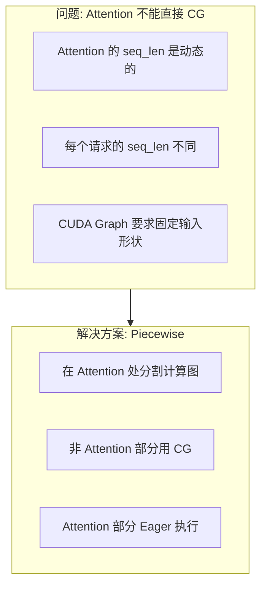

### 1.2 分割可视化

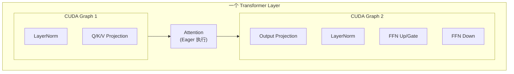

---

## 2. 图分割机制

### 2.1 split_graph 函数

```python
# vllm/compilation/backends.py:337
def split_graph(
    graph: fx.GraphModule, splitting_ops: list[str]
) -> tuple[fx.GraphModule, list[SplitItem]]:
    """按 splitting_ops 分割计算图"""
    
    subgraph_id = 0
    node_to_subgraph_id: dict[fx.Node, int] = {}
    split_op_graphs: list[int] = []
    
    for node in graph.graph.nodes:
        if node.op in ("output", "placeholder"):
            continue
        
        # getitem 操作保持在输入相同的子图
        if node.op == "call_function" and node.target == operator.getitem:
            input_node = node.args[0]
            if input_node.op != "placeholder":
                node_to_subgraph_id[node] = node_to_subgraph_id[input_node]
                continue
        
        # 检查是否需要分割
        if should_split(node, splitting_ops):
            subgraph_id += 1
            node_to_subgraph_id[node] = subgraph_id  # 分割点单独成子图
            split_op_graphs.append(subgraph_id)
            subgraph_id += 1
        else:
            node_to_subgraph_id[node] = subgraph_id
    
    # 使用 PyTorch 的 split_module
    split_gm = torch.fx.passes.split_module.split_module(
        graph, None,
        lambda node: node_to_subgraph_id[node],
        keep_original_order=True  # 保持原始顺序！
    )
    
    return split_gm, outputs
```

### 2.2 分割规则

```python
# vllm/compilation/partition_rules.py
def should_split(node: fx.Node, splitting_ops: list[str]) -> bool:
    """判断节点是否是分割点"""
    
    # 方法调用
    if node.op == "call_method":
        method_name = node.target
        return method_name in splitting_ops
    
    # 函数调用
    if node.op == "call_function":
        func = node.target
        if hasattr(func, "__name__"):
            return func.__name__ in splitting_ops
        if hasattr(func, "__qualname__"):
            return func.__qualname__ in splitting_ops
    
    # 模块调用
    if node.op == "call_module":
        return node.target in splitting_ops
    
    return False
```

### 2.3 默认分割操作

```python
# vllm/config/compilation.py
class CompilationConfig:
    splitting_ops: list[str] = field(default_factory=lambda: [
        "vllm.unified_attention",          # 标准 attention
        "vllm.unified_attention_with_output",  # attention + output
        "vllm.mla_attention",              # MLA attention
        # ... 其他 attention 变体
    ])
```

---

## 3. SplitItem 与子图管理

### 3.1 SplitItem 结构

```python
# vllm/compilation/backends.py:329
@dataclasses.dataclass
class SplitItem:
    submod_name: str        # 子模块名称, e.g., "submod_0"
    graph_id: int           # 子图 ID
    is_splitting_graph: bool  # 是否是分割点（attention）
    graph: fx.GraphModule   # 子图模块
```

### 3.2 分割结果示例

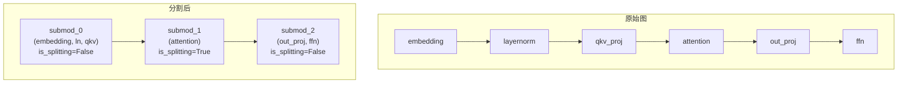

---

## 4. PiecewiseBackend

### 4.1 核心逻辑

```python
# vllm/compilation/piecewise_backend.py (conceptual)
class PiecewiseBackend:
    """分片编译后端"""
    
    def __init__(
        self,
        split_items: list[SplitItem],
        vllm_config: VllmConfig,
    ):
        self.compiled_graphs: list[Callable] = []
        self.cudagraph_wrappers: list[CUDAGraphWrapper | None] = []
        
        for item in split_items:
            if item.is_splitting_graph:
                # Attention: 不编译，保持 eager
                compiled = item.graph
                wrapper = None
            else:
                # 非 Attention: 编译 + CUDAGraph 包装
                compiled = torch.compile(item.graph, ...)
                wrapper = CUDAGraphWrapper(
                    compiled,
                    runtime_mode=CUDAGraphMode.PIECEWISE,
                )
            
            self.compiled_graphs.append(compiled)
            self.cudagraph_wrappers.append(wrapper)
    
    def __call__(self, *args):
        x = args
        for compiled, wrapper in zip(self.compiled_graphs, self.cudagraph_wrappers):
            if wrapper is not None:
                x = wrapper(*x)
            else:
                x = compiled(*x)
        return x
```

### 4.2 执行流程

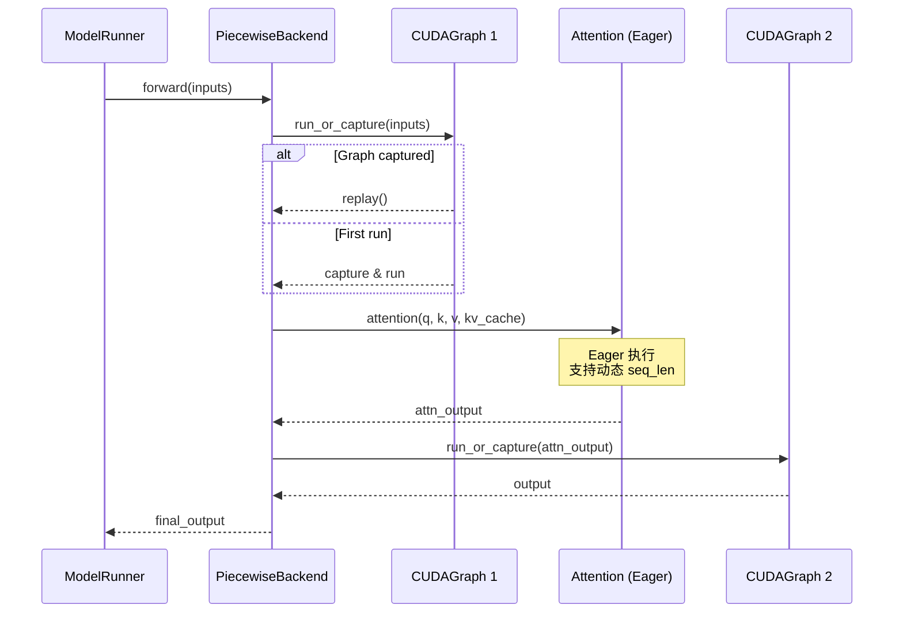

---

## 5. torch.compile 集成

### 5.1 编译配置

```python
# vllm/compilation/backends.py
def make_compiler(compilation_config: CompilationConfig) -> CompilerInterface:
    if compilation_config.backend == "inductor":
        if envs.VLLM_USE_STANDALONE_COMPILE:
            return InductorStandaloneAdaptor(...)
        else:
            return InductorAdaptor()
    elif compilation_config.backend == "eager":
        return EagerAdaptor()
```

### 5.2 Inductor 编译

```python
# vllm/compilation/compiler_interface.py
class InductorAdaptor(CompilerInterface):
    def compile(
        self,
        graph: fx.GraphModule,
        example_inputs: list[Any],
        additional_inductor_config: dict[str, Any],
        compile_range: Range,
        maybe_key: str | None,
    ) -> tuple[Callable, Any]:
        
        # 使用 torch._inductor.compile_fx
        compiled_fn = torch._inductor.compile_fx(
            graph,
            example_inputs,
            config_patches=additional_inductor_config,
        )
        
        return compiled_fn, None  # (compiled_fn, cache_handle)
```

---

## 6. 输入缓冲区管理

### 6.1 静态输入缓冲区

```python
# vllm/compilation/backends.py:52
def make_copy_and_call(
    sym_tensor_indices: list[int],
    input_buffers: list[torch.Tensor | None],
    callable_fn: Callable[..., Any],
) -> Callable[..., Any]:
    """创建包装器: 复制输入到静态缓冲区后调用"""
    
    def copy_and_call(*args: Any) -> Any:
        list_args = list(args)
        for i, index in enumerate(sym_tensor_indices):
            runtime_tensor = list_args[index]
            runtime_shape = runtime_tensor.shape[0]
            
            # 懒初始化缓冲区
            if input_buffers[i] is None:
                input_buffers[i] = runtime_tensor.clone()
            
            # 复制到静态缓冲区的切片
            static_tensor = input_buffers[i][:runtime_shape]
            static_tensor.copy_(runtime_tensor)
            list_args[index] = static_tensor
        
        return callable_fn(*list_args)
    
    return copy_and_call
```

### 6.2 为什么需要静态缓冲区

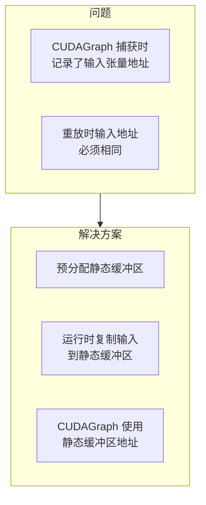

---

## 7. Piecewise 与 FULL 的配合

### 7.1 FULL_AND_PIECEWISE 模式

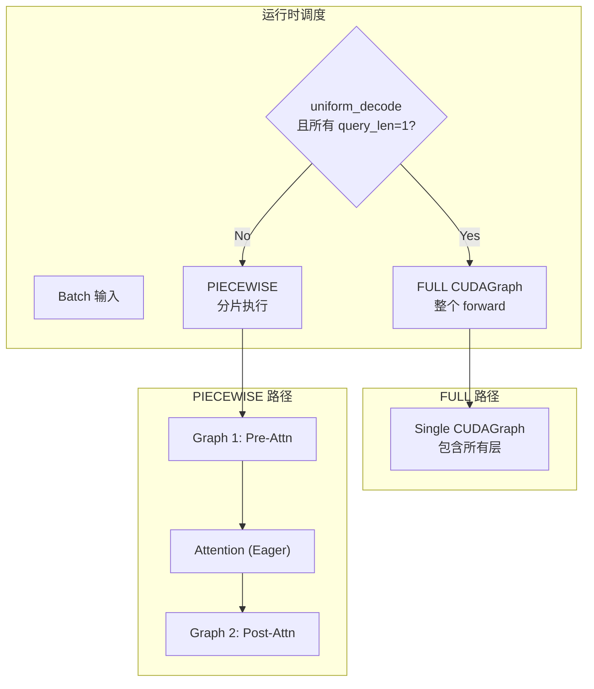

### 7.2 嵌套 CUDAGraphWrapper

```python
# 在 FULL_AND_PIECEWISE 模式下，可能有两层包装:
# 1. 外层: FULL CUDAGraphWrapper
# 2. 内层: 每个非 attention 子图的 PIECEWISE Wrapper

class Model:
    def forward(self, ...):
        # 如果 FULL mode 匹配，直接重放外层 graph
        # 否则，进入内层 PIECEWISE 执行
        pass

# CUDAGraphWrapper.__call__ 中的逻辑确保:
# - 如果 runtime_mode != self.runtime_mode，直接调用原函数
# - 这样 PIECEWISE wrapper 在 FULL mode 时会被跳过（不 capture/replay）
```

---

## 8. 多层模型的 Graph 共享

### 8.1 层间 Graph 复用

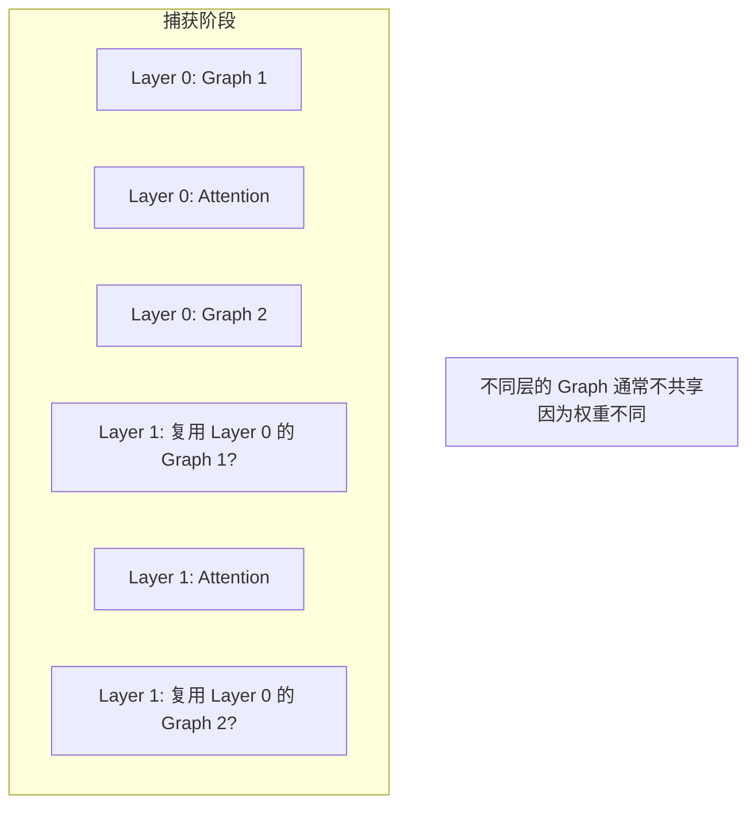

### 8.2 实际情况

```python
# 每层有独立的 CUDAGraph entries
# 因为:
# 1. 每层的权重张量地址不同
# 2. CUDAGraph 记录了张量地址
# 3. 不同层必须有不同的 graph

# 但是! 同一层在不同 batch size 下会有不同的 graph entries
# 通过 BatchDescriptor 区分
```

---

## 9. 以 Qwen3-VL 为例

### 9.1 Vision Transformer 的处理

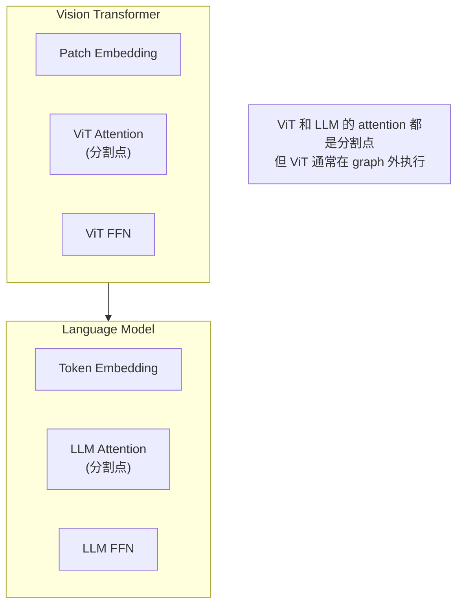

### 9.2 多模态 Piecewise 配置

```python
# Qwen3-VL 的 attention 变体
splitting_ops = [
    "vllm.unified_attention",           # LLM attention
    "vllm.unified_attention_with_output",
    # ViT attention 可能用不同的 op
]

# 图像处理通常不用 CUDAGraph:
# 1. 图像 token 数不固定
# 2. ViT 只在 prefill 时运行
# 3. 不值得为每种图像大小捕获 graph
```

---

## 10. 以 Qwen3-Next (DeltaNet) 为例

### 10.1 混合 Attention 的分割

```python
# Qwen3-Next 有两种 attention:
# 1. Full Attention (FlashAttention)
# 2. DeltaNet (Linear Attention)

# 两者都是分割点
splitting_ops = [
    "vllm.unified_attention",  # Full Attention
    "vllm.gdn_attention",      # DeltaNet
    "vllm.linear_attention",   # Generic Linear Attention
]
```

### 10.2 不同层的 Graph 结构

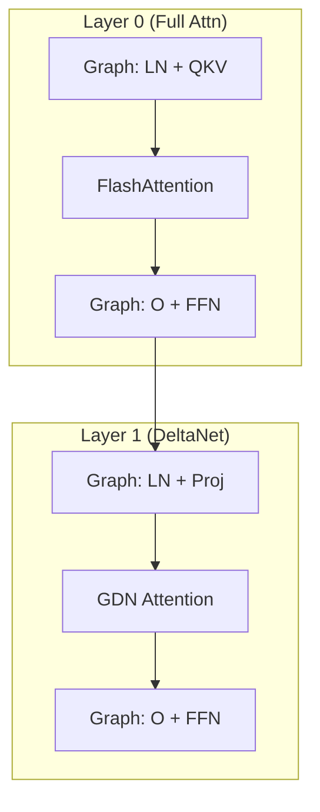

---

## 11. 性能分析

### 11.1 Overhead 分析

| 组件 | PIECEWISE 开销 | 说明 |
|------|---------------|------|
| Graph Launch | 每层 ~2 次 | Pre-attn + Post-attn |
| Input Copy | ~1μs | 复制到静态缓冲区 |
| Attention | ~10-100μs | Eager 执行，取决于 seq_len |

### 11.2 与 FULL 对比

```mermaid
gantt
    title 单步执行时间对比
    dateFormat X
    axisFormat %s
    
    section FULL CG
    Graph Launch :a1, 0, 5
    Graph Execution :a2, after a1, 100
    
    section PIECEWISE
    Graph 1 Launch :b1, 0, 5
    Graph 1 Exec :b2, after b1, 30
    Attn Launch :b3, after b2, 5
    Attn Exec :b4, after b3, 20
    Graph 2 Launch :b5, after b4, 5
    Graph 2 Exec :b6, after b5, 50
```

---

## 12. 调试与监控

### 12.1 编译计数器

```python
# vllm/compilation/counter.py
class CompilationCounter:
    num_cudagraph_captured: int = 0
    num_backend_compilations: int = 0
    num_cache_entries_updated: int = 0

# 使用
compilation_counter.num_cudagraph_captured += 1
```

### 12.2 调试模式

```python
# 环境变量
VLLM_LOGGING_LEVEL=DEBUG  # 启用详细日志

# CUDAGraphWrapper 在调试模式下验证输入地址
if self.is_debugging_mode:
    new_input_addresses = [
        x.data_ptr() for x in args if isinstance(x, torch.Tensor)
    ]
    assert new_input_addresses == entry.input_addresses
```

---

## 13. 总结

### 13.1 关键要点

| 要点 | 说明 |
|------|------|
| **分割点** | Attention 操作是天然的分割点 |
| **非 Attention** | 使用 torch.compile + CUDAGraph |
| **Attention** | Eager 执行，支持动态形状 |
| **静态缓冲区** | 确保 CUDAGraph 输入地址一致 |
| **嵌套包装** | FULL 和 PIECEWISE 可以共存 |

### 13.2 适用场景

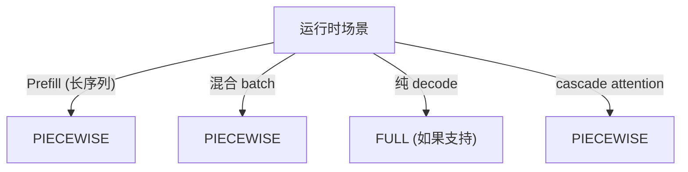

---

> **下一步**: [11-torch-compile.md](./11-torch-compile.md) - torch.compile 集成与优化
