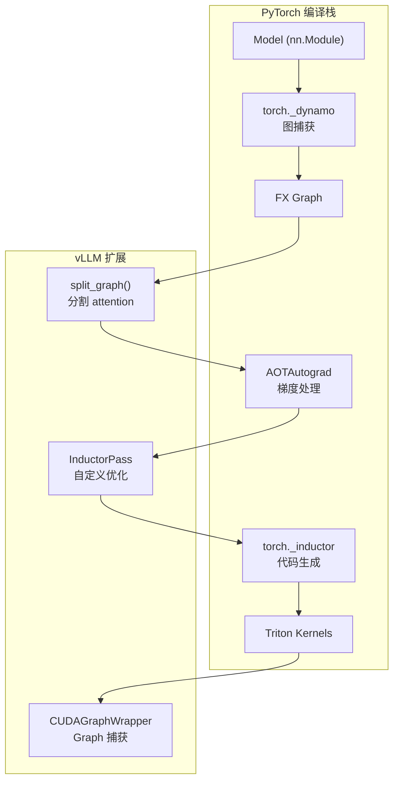
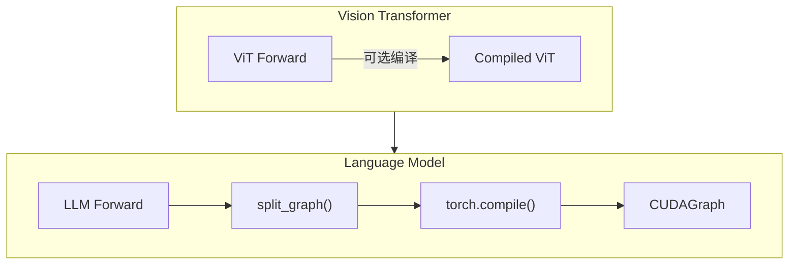
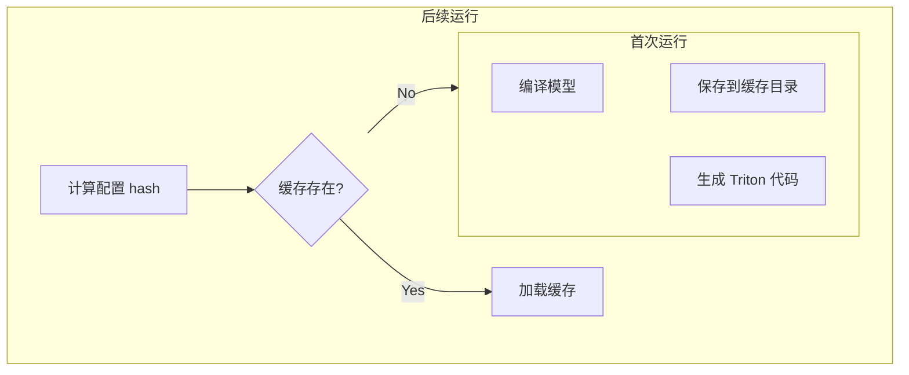

# 11 - torch.compile 集成与优化

> **前置阅读**: [10-piecewise-cudagraph.md](./10-piecewise-cudagraph.md)
>
> **核心文件**:
> - `vllm/compilation/backends.py` - VllmBackend, CompilerManager
> - `vllm/compilation/compiler_interface.py` - InductorAdaptor
> - `vllm/compilation/decorators.py` - @support_torch_compile

---

## 1. 概述

vLLM 深度集成 PyTorch 2.0 的 torch.compile，通过 Inductor 后端生成高效的 GPU 代码。主要优化包括：
- 算子融合（减少 kernel launch 和内存访问）
- 内存布局优化
- 与 CUDA Graph 的无缝集成

### 1.1 编译流程



---

## 2. CompilationConfig

### 2.1 配置结构

```python
# vllm/config/compilation.py
@dataclass
class CompilationConfig:
    # 编译模式
    mode: CompilationMode = CompilationMode.VLLM_COMPILE
    
    # 后端选择
    backend: str = "inductor"  # "inductor" | "eager"
    
    # CUDA Graph 模式
    cudagraph_mode: CUDAGraphMode = CUDAGraphMode.FULL_AND_PIECEWISE
    
    # 捕获的 batch sizes
    cudagraph_capture_sizes: list[int] = field(default_factory=lambda: [
        1, 2, 4, 8, 16, 24, 32, 48, 64, 96, 128, 192, 256
    ])
    max_cudagraph_capture_size: int = 512
    
    # 分割点
    splitting_ops: list[str] = field(default_factory=lambda: [
        "vllm.unified_attention",
        "vllm.unified_attention_with_output",
        # ...
    ])
    
    # 自定义 pass
    custom_passes: list[str] = field(default_factory=list)
    
    # 编译缓存
    cache_dir: str = ""
    compile_cache_save_format: str = "triton_artifacts"
```

### 2.2 CompilationMode

```python
class CompilationMode(Enum):
    NO_COMPILE = 0
    """不使用 torch.compile"""
    
    DYNAMO_ONCE = 1
    """使用 torch.compile 但不做 vLLM 特定优化"""
    
    VLLM_COMPILE = 2
    """完整 vLLM 编译: 分割 + 优化 pass + CUDAGraph"""
```

---

## 3. VllmBackend

### 3.1 核心类

```python
# vllm/compilation/backends.py
class VllmBackend:
    """vLLM 的 torch.compile 后端"""
    
    def __init__(self, vllm_config: VllmConfig):
        self.vllm_config = vllm_config
        self.compilation_config = vllm_config.compilation_config
        self.compiler_manager = CompilerManager(self.compilation_config)
        
        # 后置 pass 管理器
        self.post_grad_pass_manager = PostGradPassManager(
            vllm_config=vllm_config,
            custom_passes=self.compilation_config.custom_passes,
        )
    
    def __call__(
        self,
        graph: fx.GraphModule,
        example_inputs: list[Any],
    ) -> Callable:
        """torch.compile 调用入口"""
        
        # 1. 分割图
        if self.compilation_config.splitting_ops:
            split_gm, split_items = split_graph(
                graph, self.compilation_config.splitting_ops
            )
        else:
            split_gm = graph
            split_items = [SplitItem("", 0, False, graph)]
        
        # 2. 编译每个子图
        compiled_subgraphs = []
        for item in split_items:
            if item.is_splitting_graph:
                # Attention: 保持 eager
                compiled = item.graph
            else:
                # 非 Attention: 编译
                compiled = self._compile_subgraph(item.graph, example_inputs)
            compiled_subgraphs.append(compiled)
        
        # 3. 组装
        return self._assemble(split_gm, compiled_subgraphs)
```

### 3.2 子图编译

```python
def _compile_subgraph(
    self,
    subgraph: fx.GraphModule,
    example_inputs: list[Any],
) -> Callable:
    """编译单个子图"""
    
    # 应用自定义 pass
    subgraph = self.post_grad_pass_manager(subgraph)
    
    # 调用 Inductor
    compiled = self.compiler_manager.compile(
        graph=subgraph,
        example_inputs=example_inputs,
        additional_inductor_config=self.get_inductor_config(),
        compilation_config=self.compilation_config,
        compile_range=self.current_compile_range,
    )
    
    return compiled
```

---

## 4. CompilerManager 缓存

### 4.1 编译缓存

```python
# vllm/compilation/backends.py:119
class CompilerManager:
    """管理编译过程和缓存"""
    
    def __init__(self, compilation_config: CompilationConfig):
        self.cache: dict[tuple[Range, int, str], Any] = {}
        self.compiler = make_compiler(compilation_config)
    
    def compile(
        self,
        graph: fx.GraphModule,
        example_inputs: list[Any],
        compile_range: Range,
        graph_index: int,
        ...
    ) -> Callable:
        # 尝试从缓存加载
        cache_key = (compile_range, graph_index, self.compiler.name)
        if cache_key in self.cache:
            return self.load(cache_key, graph, example_inputs)
        
        # 编译
        compiled, handle = self.compiler.compile(graph, example_inputs, ...)
        
        # 存入缓存
        self.cache[cache_key] = handle
        return compiled
```

### 4.2 缓存目录结构

```
cache_dir/
├── vllm_compile_cache.py     # 缓存索引
├── computation_graph.py      # 计算图 (可读)
├── transformed_code.py       # 生成的代码
└── triton_artifacts/         # Triton kernel
    ├── kernel_0.py
    └── kernel_1.py
```

---

## 5. InductorPass 自定义优化

### 5.1 Pass 接口

```python
# vllm/compilation/inductor_pass.py
class InductorPass(ABC):
    """Inductor 优化 pass 基类"""
    
    @abstractmethod
    def __call__(self, graph: fx.GraphModule) -> fx.GraphModule:
        """应用优化"""
        raise NotImplementedError
```

### 5.2 内置 Pass

```python
# vllm/compilation/passes/
class FuseActivationPass(InductorPass):
    """融合激活函数"""
    
    def __call__(self, graph: fx.GraphModule) -> fx.GraphModule:
        # 查找 linear + activation 模式
        # 替换为融合算子
        return optimized_graph

class QuantizationFusionPass(InductorPass):
    """融合量化操作"""
    pass
```

### 5.3 PostGradPassManager

```python
# vllm/compilation/pass_manager.py
class PostGradPassManager:
    def __init__(self, vllm_config: VllmConfig, custom_passes: list[str]):
        self.passes: list[InductorPass] = []
        
        # 加载内置 pass
        self.passes.extend(self._load_builtin_passes())
        
        # 加载自定义 pass
        for pass_name in custom_passes:
            pass_cls = resolve_obj_by_qualname(pass_name)
            self.passes.append(pass_cls())
    
    def __call__(self, graph: fx.GraphModule) -> fx.GraphModule:
        for p in self.passes:
            graph = p(graph)
        return graph
```

---

## 6. @support_torch_compile 装饰器

### 6.1 装饰器定义

```python
# vllm/compilation/decorators.py
def support_torch_compile(
    cls: type[nn.Module],
) -> type[nn.Module]:
    """
    标记模型支持 torch.compile
    
    使用方法:
    @support_torch_compile
    class MyModel(nn.Module):
        pass
    """
    
    original_forward = cls.forward
    
    def compiled_forward(self, *args, **kwargs):
        if should_use_compile():
            return self._compiled_forward(*args, **kwargs)
        return original_forward(self, *args, **kwargs)
    
    cls.forward = compiled_forward
    cls._original_forward = original_forward
    
    return cls
```

### 6.2 使用示例

```python
# vllm/model_executor/models/llama.py
@support_torch_compile
class LlamaForCausalLM(nn.Module):
    def forward(
        self,
        input_ids: torch.Tensor,
        positions: torch.Tensor,
        ...
    ) -> torch.Tensor:
        # 模型前向
        pass
```

---

## 7. Inductor 配置

### 7.1 vLLM 的 Inductor 设置

```python
# vllm/compilation/backends.py
def get_inductor_config(self) -> dict[str, Any]:
    return {
        # 启用 Triton 后端
        "triton.cudagraphs": False,  # vLLM 自己管理 cudagraph
        
        # 优化选项
        "coordinate_descent_tuning": True,
        "aggressive_fusion": True,
        
        # 缓存
        "fx_graph_cache": True,
        "fx_graph_remote_cache": False,
        
        # 调试
        "trace.enabled": False,
    }
```

### 7.2 环境变量

```bash
# Triton 缓存
TRITON_CACHE_DIR=/path/to/cache

# Inductor 调试
TORCH_COMPILE_DEBUG=1

# 禁用特定优化
TORCHINDUCTOR_DISABLE_MAX_AUTOTUNE=1
```

---

## 8. 动态形状处理

### 8.1 Symbolic Shapes

```python
# vllm/config/compilation.py
class DynamicShapesType(Enum):
    INFERRED = "inferred"     # 自动推断
    STATIC = "static"         # 静态形状
    MANUAL = "manual"         # 手动指定
```

### 8.2 Range-based 编译

```python
# vllm/config/utils.py
@dataclass(frozen=True)
class Range:
    start: int
    end: int
    
    def contains(self, value: int) -> bool:
        return self.start <= value < self.end

# 不同 range 使用不同的编译 artifact
compile_ranges = [
    Range(1, 32),      # 小 batch
    Range(32, 128),    # 中 batch
    Range(128, 512),   # 大 batch
]
```

---

## 9. 以 Qwen3-VL 为例

### 9.1 多模态模型的编译

```python
# Qwen3-VL 包含:
# 1. Vision Transformer (ViT)
# 2. Language Model (LLM)
# 3. Multimodal Projector

# 编译策略:
# - ViT: 可选编译（图像大小变化）
# - LLM: 完整编译 + CUDAGraph
# - Projector: 与 LLM 一起编译
```

### 9.2 编译分离



---

## 10. 以 Qwen3-Next (DeltaNet) 为例

### 10.1 混合 Attention 的编译

```python
# Qwen3-Next 的两种 attention:
# 1. FlashAttention - 在 splitting_ops 中
# 2. GDN (DeltaNet) - 也在 splitting_ops 中

splitting_ops = [
    "vllm.unified_attention",     # FlashAttention
    "vllm.gdn_attention",         # DeltaNet  
    "vllm.linear_attention",      # 通用 linear attention
]

# 两种 attention 都作为分割点
# 非 attention 部分被编译
```

### 10.2 DeltaNet 特定优化

```python
# DeltaNet 的 chunk-wise 计算可能有专门的 pass
class DeltaNetFusionPass(InductorPass):
    """融合 DeltaNet 的状态更新操作"""
    
    def __call__(self, graph: fx.GraphModule) -> fx.GraphModule:
        # 查找 state update pattern
        # 融合 gate, delta, state 计算
        pass
```

---

## 11. 编译缓存

### 11.1 缓存策略



### 11.2 缓存 Key 计算

```python
# vllm/compilation/compiler_interface.py
class CompilerInterface:
    def compute_hash(self, vllm_config: VllmConfig) -> str:
        """计算编译配置的 hash"""
        factors = {
            "model_name": vllm_config.model_config.model,
            "dtype": str(vllm_config.model_config.dtype),
            "tensor_parallel_size": vllm_config.parallel_config.tensor_parallel_size,
            "pipeline_parallel_size": vllm_config.parallel_config.pipeline_parallel_size,
            # ...
        }
        return hash_factors(factors)
```

---

## 12. 性能分析

### 12.1 编译开销

| 阶段 | 时间 | 说明 |
|------|------|------|
| Dynamo 捕获 | ~1-5s | 首次前向 |
| AOTAutograd | ~1-2s | 梯度处理 |
| Inductor | ~10-60s | 代码生成 |
| Triton 编译 | ~5-30s | Kernel 编译 |

### 12.2 运行时加速

| 操作类型 | 加速比 | 说明 |
|----------|--------|------|
| FFN 融合 | 1.2-1.5x | LayerNorm + Linear 融合 |
| 激活融合 | 1.1-1.3x | Linear + Activation 融合 |
| 内存优化 | 1.1-1.2x | 减少中间张量 |

---

## 13. 总结

### 13.1 关键要点

| 要点 | 说明 |
|------|------|
| **VllmBackend** | torch.compile 的 vLLM 后端 |
| **split_graph** | 在 attention 处分割计算图 |
| **InductorPass** | 自定义优化 pass |
| **CompilerManager** | 编译缓存管理 |
| **Range 编译** | 不同 batch 范围不同编译 |

### 13.2 配置建议

```python
# 生产环境配置
CompilationConfig(
    mode=CompilationMode.VLLM_COMPILE,
    backend="inductor",
    cudagraph_mode=CUDAGraphMode.FULL_AND_PIECEWISE,
    cache_dir="/path/to/cache",
    compile_cache_save_format="triton_artifacts",
)

# 调试配置
CompilationConfig(
    mode=CompilationMode.NO_COMPILE,  # 或 DYNAMO_ONCE
)
```

---

> **下一步**: [12-chunked-prefill.md](./12-chunked-prefill.md) - 分块预填充
