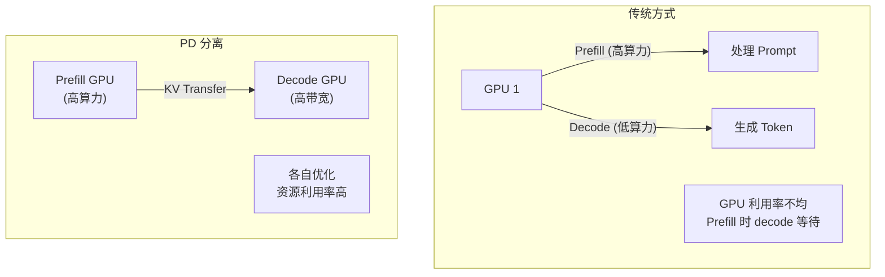
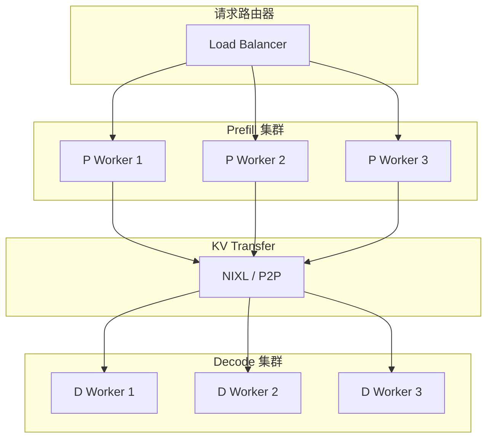
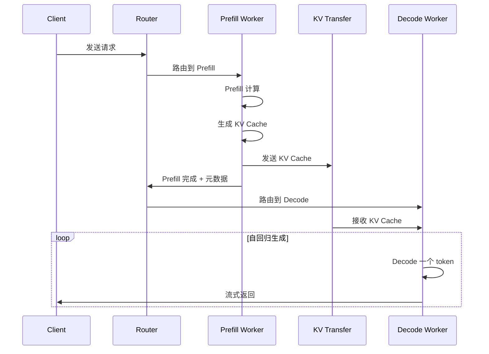
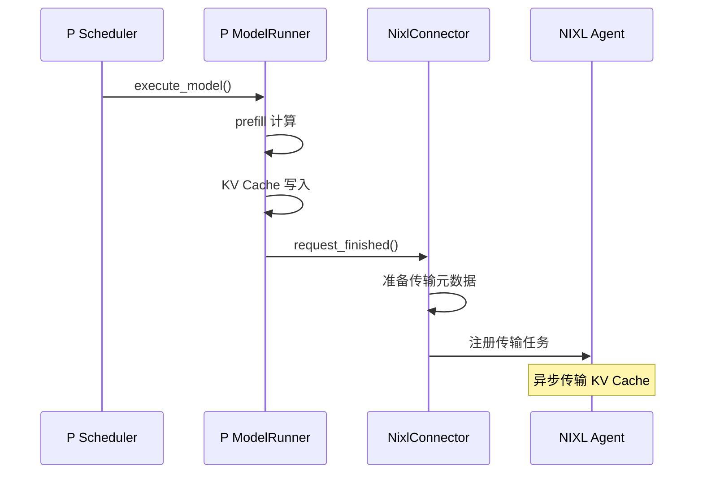
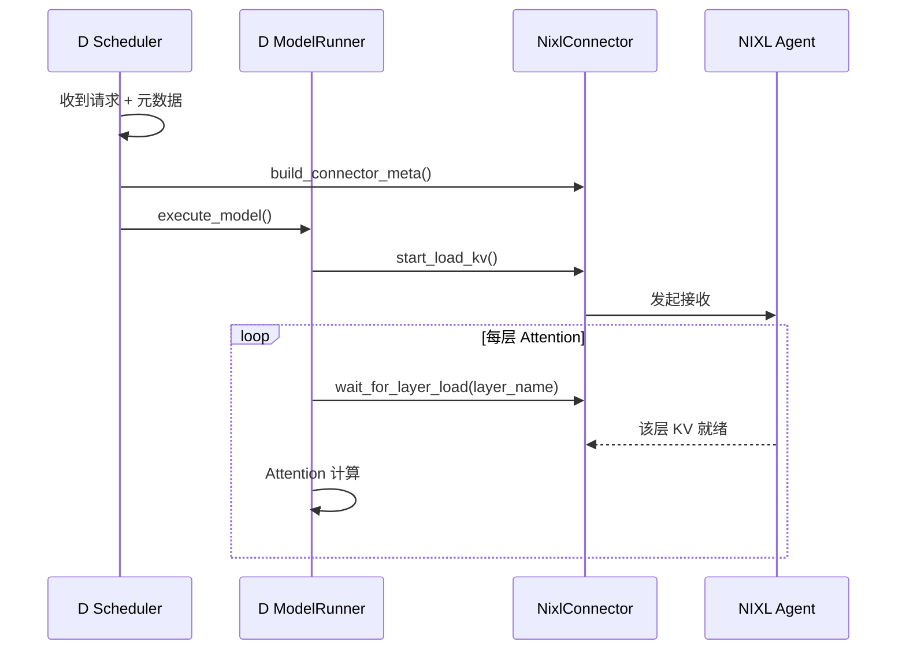
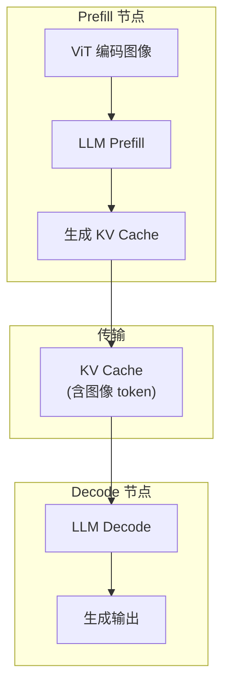
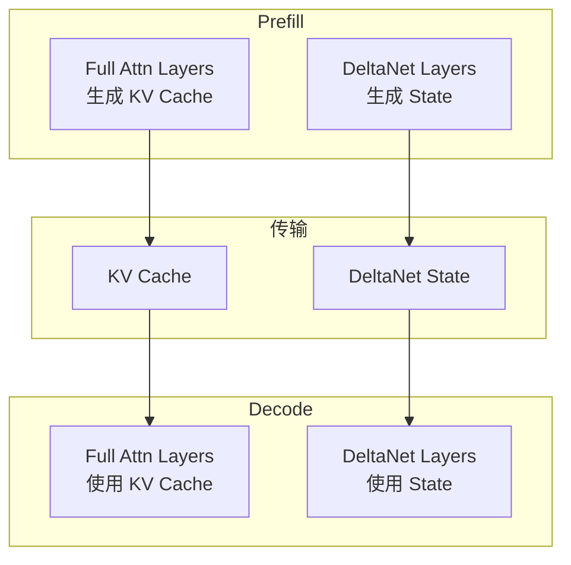
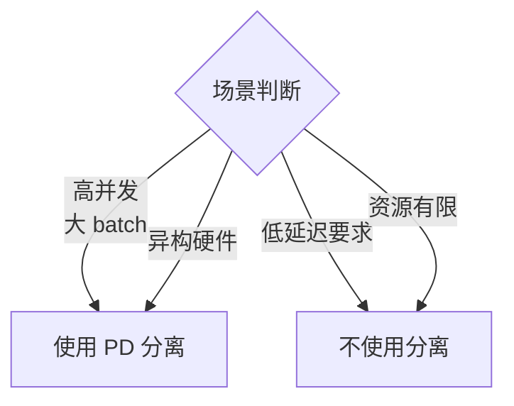

# 13 - Prefill-Decode 分离 (PD Disaggregation)

> **前置阅读**: [12-chunked-prefill.md](./12-chunked-prefill.md)
>
> **核心文件**:
> - `vllm/distributed/kv_transfer/kv_connector/v1/base.py` - KVConnectorBase_V1
> - `vllm/distributed/kv_transfer/kv_connector/v1/nixl_connector.py` - NixlConnector
> - `vllm/v1/worker/kv_connector_model_runner_mixin.py` - ModelRunner 集成

---

## 1. 概述

Prefill-Decode 分离（PD Disaggregation）是一种系统架构优化，将 prefill 和 decode 两个计算阶段部署在不同的 GPU 集群上：

- **Prefill 节点 (P)**: 专门处理 prompt 的首次计算，计算密集型
- **Decode 节点 (D)**: 专门处理自回归 token 生成，内存带宽密集型

### 1.1 为什么分离



### 1.2 核心挑战

| 挑战 | 解决方案 |
|------|---------|
| KV Cache 传输 | NIXL/P2P 高速传输 |
| 调度协调 | 请求路由和元数据同步 |
| 延迟开销 | 流水线隐藏传输延迟 |

---

## 2. 架构设计

### 2.1 系统拓扑



### 2.2 请求生命周期



---

## 3. KVConnector 接口

### 3.1 基类定义

```python
# vllm/distributed/kv_transfer/kv_connector/v1/base.py
class KVConnectorBase_V1(ABC):
    """V1 KV 传输连接器基类"""
    
    def __init__(
        self,
        vllm_config: VllmConfig,
        role: KVConnectorRole,
        kv_cache_config: Optional["KVCacheConfig"] = None,
    ):
        self.role = role  # SCHEDULER 或 WORKER
    
    # ============ Scheduler 端方法 ============
    @abstractmethod
    def get_num_new_matched_tokens(
        self, request: "Request", num_computed_tokens: int
    ) -> tuple[int | None, bool]:
        """获取可复用的 token 数"""
        pass
    
    @abstractmethod
    def build_connector_meta(
        self, scheduler_output: SchedulerOutput
    ) -> KVConnectorMetadata:
        """构建传输元数据"""
        pass
    
    @abstractmethod
    def request_finished(
        self, request: "Request", block_ids: list[int]
    ) -> tuple[bool, dict[str, Any] | None]:
        """请求完成时的清理"""
        pass
    
    # ============ Worker 端方法 ============
    @abstractmethod
    def register_kv_caches(self, kv_caches: dict[str, torch.Tensor]):
        """注册 KV Cache 张量"""
        pass
    
    @abstractmethod
    def start_load_kv(
        self, forward_context: ForwardContext, **kwargs
    ) -> None:
        """开始加载 KV Cache"""
        pass
    
    @abstractmethod
    def wait_for_layer_load(self, layer_name: str) -> bool:
        """等待特定层的 KV 加载完成"""
        pass
```

### 3.2 KVConnectorRole

```python
class KVConnectorRole(Enum):
    SCHEDULER = "scheduler"  # 在 Scheduler 进程中运行
    WORKER = "worker"        # 在 Worker 进程中运行
```

---

## 4. NIXL Connector 实现

### 4.1 概述

NIXL (NVIDIA Inference eXchange Library) 是 NVIDIA 提供的高性能 KV Cache 传输库。

```python
# vllm/distributed/kv_transfer/kv_connector/v1/nixl_connector.py
class NixlConnector(KVConnectorBase_V1):
    def __init__(
        self,
        vllm_config: VllmConfig,
        role: KVConnectorRole,
        kv_cache_config: Optional["KVCacheConfig"] = None,
    ):
        super().__init__(vllm_config, role, kv_cache_config)
        
        self.engine_id: EngineId = vllm_config.kv_transfer_config.engine_id
        
        if role == KVConnectorRole.SCHEDULER:
            self.connector_scheduler = NixlConnectorScheduler(...)
        elif role == KVConnectorRole.WORKER:
            self.connector_worker = NixlConnectorWorker(...)
```

### 4.2 元数据结构

```python
@dataclass
class NixlAgentMetadata:
    engine_id: str              # 引擎标识
    agent_metadata: bytes       # NIXL agent 元数据
    kv_caches_base_addr: list[int]  # KV Cache 基地址
    device_id: int              # GPU 设备 ID
    num_blocks: int             # block 数量
    block_lens: list[int]       # 每层 block 长度
    kv_cache_layout: str        # 内存布局 (NHD/HND)
    block_size: int             # block 大小
```

### 4.3 兼容性检查

```python
def compute_nixl_compatibility_hash(
    vllm_config: VllmConfig, attn_backend_name: str
) -> str:
    """计算 NIXL 兼容性 hash"""
    factors = {
        "vllm_version": vllm_version,
        "nixl_connector_version": NIXL_CONNECTOR_VERSION,
        "model": model_config.model,
        "dtype": str(model_config.dtype),
        "num_kv_heads": model_config.get_total_num_kv_heads(),
        "head_size": model_config.get_head_size(),
        "num_hidden_layers": model_config.get_total_num_hidden_layers(),
        "attn_backend_name": attn_backend_name,
        "cache_dtype": str(cache_config.cache_dtype),
    }
    return hash_factors(factors)
```

---

## 5. KV 传输流程

### 5.1 Prefill 端 (发送)



### 5.2 Decode 端 (接收)



---

## 6. 流水线优化

### 6.1 层级流水线

```mermaid
gantt
    title KV 传输与计算流水线
    dateFormat X
    axisFormat %s
    
    section Transfer
    Layer 0 KV :t0, 0, 10
    Layer 1 KV :t1, 10, 20
    Layer 2 KV :t2, 20, 30
    Layer 3 KV :t3, 30, 40
    
    section Compute
    Wait L0 :w0, 0, 10
    Layer 0 Attn :a0, 10, 15
    Wait L1 :w1, 15, 20
    Layer 1 Attn :a1, 20, 25
    Wait L2 :w2, 25, 30
    Layer 2 Attn :a2, 30, 35
    Layer 3 Attn :a3, 40, 45
```



### 6.2 代码实现

```python
# vllm/v1/worker/kv_connector_model_runner_mixin.py
class KVConnectorModelRunnerMixin:
    def _forward_with_kv_transfer(self, ...):
        """带 KV 传输的前向传播"""
        
        # 开始异步加载
        self.kv_connector.start_load_kv(forward_context)
        
        for layer_name, layer in self.model.layers:
            # 等待该层 KV 就绪
            if needs_kv_load[layer_name]:
                success = self.kv_connector.wait_for_layer_load(layer_name)
                if not success:
                    # 传输失败，回退到重新计算
                    return self._fallback_recompute(...)
            
            # 执行该层计算
            hidden_states = layer(hidden_states, ...)
        
        return hidden_states
```

---

## 7. 配置与部署

### 7.1 KVTransferConfig

```python
# vllm/config.py
@dataclass
class KVTransferConfig:
    kv_connector: str = "NixlConnector"
    """使用的 connector 类型"""
    
    kv_buffer_device: str = "cuda"
    """KV 缓冲区设备 (cuda/cpu)"""
    
    kv_buffer_size: float = 1e9
    """缓冲区大小 (bytes)"""
    
    engine_id: str = ""
    """引擎 ID，用于多引擎场景"""
```

### 7.2 启动参数

```bash
# Prefill 节点
vllm serve model_name \
    --kv-connector NixlConnector \
    --kv-role prefill \
    --engine-id prefill-0

# Decode 节点
vllm serve model_name \
    --kv-connector NixlConnector \
    --kv-role decode \
    --engine-id decode-0
```

---

## 8. 以 Qwen3-VL 为例

### 8.1 多模态 PD 分离



### 8.2 注意事项

```python
# 多模态特殊考虑:
# 1. 图像 token 的 KV Cache 也需要传输
# 2. M-RoPE 位置信息需要同步
# 3. 图像编码器只在 Prefill 节点运行
```

---

## 9. 以 Qwen3-Next (DeltaNet) 为例

### 9.1 混合模型的 PD 分离



### 9.2 状态传输

```python
# DeltaNet 的 recurrent state 也需要传输
# State shape: [batch, heads, head_dim, head_dim]

# 与 KV Cache 不同:
# 1. State 是 O(d^2)，KV 是 O(n*d)
# 2. State 不随序列长度增长
# 3. 可能需要专门的传输路径
```

---

## 10. 性能分析

### 10.1 传输带宽需求

```python
# KV Cache 大小计算
kv_size = (
    num_layers * 
    2 *  # K 和 V
    num_kv_heads * 
    head_dim * 
    seq_len * 
    dtype_size
)

# 例如 Qwen3-VL 235B, seq_len=4096:
# 94 layers * 2 * 8 heads * 128 dim * 4096 * 2 bytes
# ≈ 15.5 GB

# NVLink: 600 GB/s -> 传输时间 ~25ms
# PCIe Gen5: 64 GB/s -> 传输时间 ~242ms
```

### 10.2 与计算时间对比

| 操作 | 时间 (A100) | 说明 |
|------|-------------|------|
| Prefill 4K tokens | ~100ms | 计算密集 |
| KV 传输 (NVLink) | ~25ms | 带宽密集 |
| Decode 1 token | ~10ms | 内存带宽密集 |

---

## 11. 总结

### 11.1 关键要点

| 要点 | 说明 |
|------|------|
| **分离架构** | Prefill 和 Decode 在不同 GPU 集群 |
| **KVConnector** | 统一的 KV 传输接口 |
| **NIXL** | NVIDIA 高性能传输库 |
| **流水线** | 层级传输隐藏延迟 |
| **兼容性** | Hash 检查确保 P/D 配置匹配 |

### 11.2 适用场景



---

> **下一步**: [14-kv-transfer.md](./14-kv-transfer.md) - KV 传输机制 (NIXL/P2P)
