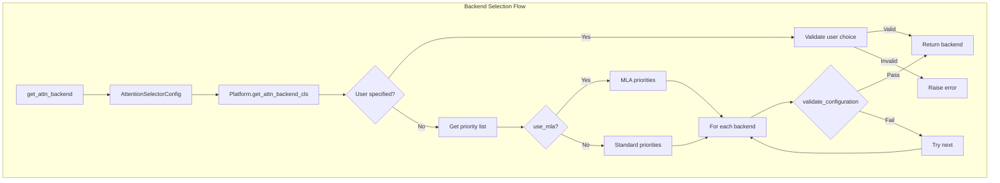
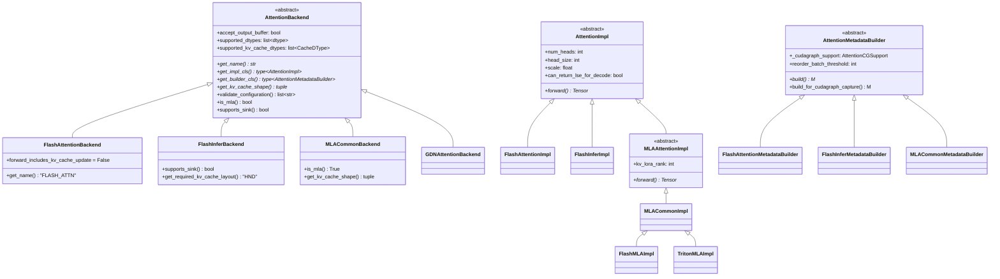
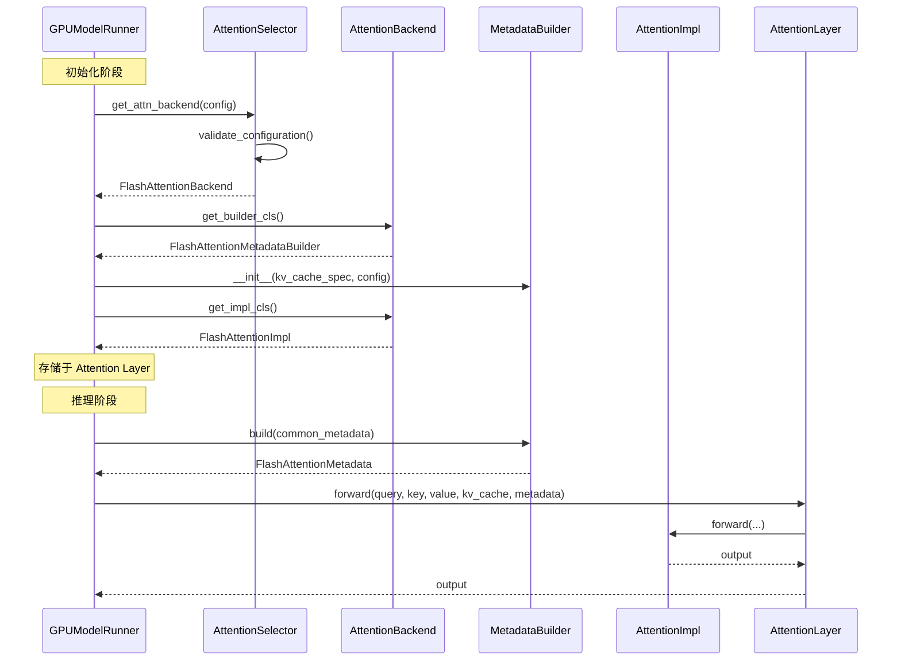

# 15. Attention Backend 架构与抽象

## 概述

vLLM V1 的 Attention Backend 系统是一个高度模块化的架构，通过抽象接口支持多种注意力后端实现。这种设计使得 vLLM 能够在不同硬件平台（NVIDIA/AMD/CPU）和不同模型架构（标准 Transformer/MLA/线性注意力）上实现最优性能。

## 核心设计理念

```
┌─────────────────────────────────────────────────────────────────┐
│                    Attention Layer (用户接口)                    │
├─────────────────────────────────────────────────────────────────┤
│                    AttentionBackend (工厂类)                     │
│  ┌─────────────┐  ┌──────────────────┐  ┌───────────────────┐  │
│  │ get_impl_cls │  │ get_builder_cls  │  │ get_kv_cache_shape│  │
│  └─────────────┘  └──────────────────┘  └───────────────────┘  │
├─────────────────────────────────────────────────────────────────┤
│  AttentionImpl                 │  AttentionMetadataBuilder      │
│  (前向计算实现)                  │  (元数据构建)                   │
│  ┌──────────┐                  │  ┌────────────────┐            │
│  │ forward() │                  │  │ build()        │            │
│  └──────────┘                  │  └────────────────┘            │
└─────────────────────────────────────────────────────────────────┘
```

## 源代码位置

| 文件 | 说明 |
|------|------|
| `vllm/v1/attention/backend.py` | 核心抽象类定义 |
| `vllm/v1/attention/selector.py` | 后端选择逻辑 |
| `vllm/v1/attention/backends/registry.py` | 后端注册表 |
| `vllm/v1/attention/backends/*.py` | 各具体后端实现 |

## AttentionBackend 抽象类

`AttentionBackend` 是所有注意力后端的基类，定义了后端必须实现的接口：

```python
# vllm/v1/attention/backend.py

class AttentionBackend(ABC):
    """Abstract class for attention backends.
    
    核心职责:
    1. 作为工厂类，创建 AttentionImpl 和 AttentionMetadataBuilder
    2. 定义 KV Cache 的形状和布局
    3. 声明后端支持的特性（数据类型、block size、特殊功能等）
    """
    
    # ============ 类属性：能力声明 ============
    
    # 是否接受预分配的输出 buffer
    # 对于 piecewise cudagraph，需要在 graph 内分配输出
    accept_output_buffer: bool = False
    
    # 支持的模型数据类型
    supported_dtypes: ClassVar[list[torch.dtype]] = [torch.float16, torch.bfloat16]
    
    # 支持的 KV Cache 数据类型
    supported_kv_cache_dtypes: ClassVar[list[CacheDType]] = ["auto", "bfloat16"]
    
    # forward() 是否包含 KV Cache 更新
    # FlashAttention 分离了 cache 更新，所以为 False
    forward_includes_kv_cache_update: bool = True
    
    # ============ 核心抽象方法 ============
    
    @staticmethod
    @abstractmethod
    def get_name() -> str:
        """返回后端标识符，如 'FLASH_ATTN', 'FLASHINFER'"""
        raise NotImplementedError
    
    @staticmethod
    @abstractmethod
    def get_impl_cls() -> type["AttentionImpl"]:
        """返回实际执行注意力计算的实现类"""
        raise NotImplementedError
    
    @staticmethod
    @abstractmethod
    def get_builder_cls() -> type["AttentionMetadataBuilder"]:
        """返回元数据构建器类"""
        raise NotImplementedError
    
    @staticmethod
    @abstractmethod
    def get_kv_cache_shape(
        num_blocks: int,
        block_size: int,
        num_kv_heads: int,
        head_size: int,
        cache_dtype_str: str = "auto",
    ) -> tuple[int, ...]:
        """定义 KV Cache tensor 的形状
        
        标准 FlashAttention: (2, num_blocks, block_size, num_kv_heads, head_size)
        FlashInfer:          (num_blocks, 2, block_size, num_kv_heads, head_size)
        MLA:                 (num_blocks, block_size, head_size)  # 压缩的 latent
        """
        raise NotImplementedError
```

### KV Cache 布局控制

不同后端对 KV Cache 的物理内存布局有不同要求：

```python
@staticmethod
def get_kv_cache_stride_order(
    include_num_layers_dimension: bool = False,
) -> tuple[int, ...]:
    """定义 KV Cache 的物理内存布局
    
    stride_order 是一个排列，将逻辑形状映射到物理布局
    
    示例 - FlashAttention NHD 布局:
      逻辑形状: [2, num_blocks, block_size, num_kv_heads, head_size]
      stride_order: (0, 1, 2, 3, 4)  # 物理布局与逻辑相同
    
    示例 - FlashInfer HND 布局:
      逻辑形状: [num_blocks, 2, block_size, num_kv_heads, head_size]
      stride_order: (0, 1, 3, 2, 4)  # 交换 block_size 和 num_kv_heads
      物理布局: [num_blocks, 2, num_kv_heads, block_size, head_size]
    """
```

### 能力检查方法

```python
class AttentionBackend(ABC):
    # ============ 能力检查 ============
    
    @classmethod
    def supports_head_size(cls, head_size: int) -> bool:
        """检查是否支持指定的 head size"""
        supported_head_sizes = cls.get_supported_head_sizes()
        return (not supported_head_sizes) or head_size in supported_head_sizes
    
    @classmethod
    def supports_dtype(cls, dtype: torch.dtype) -> bool:
        """检查是否支持指定的数据类型"""
        return dtype in cls.supported_dtypes
    
    @classmethod
    def supports_kv_cache_dtype(cls, kv_cache_dtype: CacheDType | None) -> bool:
        """检查是否支持指定的 KV Cache 数据类型"""
        if kv_cache_dtype is None:
            return True
        return kv_cache_dtype in cls.supported_kv_cache_dtypes
    
    @classmethod
    def supports_block_size(cls, block_size: int | None) -> bool:
        """检查是否支持指定的 block size
        
        不同后端有不同的 block size 要求:
        - FlashAttention: MultipleOf(16)
        - FlashInfer: [16, 32, 64]
        - FlashMLA: [64]
        """
        supported_kernel_block_sizes = cls.get_supported_kernel_block_sizes()
        for supported_size in supported_kernel_block_sizes:
            if isinstance(supported_size, MultipleOf):
                if block_size % supported_size.base == 0:
                    return True
            elif block_size == supported_size:
                return True
        return False
    
    @classmethod
    def is_mla(cls) -> bool:
        """是否是 MLA (Multi-head Latent Attention) 后端"""
        return False
    
    @classmethod
    def supports_sink(cls) -> bool:
        """是否支持 attention sink (StreamingLLM)"""
        return False
    
    @classmethod
    def supports_mm_prefix(cls) -> bool:
        """是否支持多模态 prefix attention"""
        return False
    
    @classmethod
    def is_sparse(cls) -> bool:
        """是否是稀疏注意力后端"""
        return False
```

### 配置验证

```python
@classmethod
def validate_configuration(
    cls,
    head_size: int,
    dtype: torch.dtype,
    kv_cache_dtype: CacheDType | None,
    block_size: int,
    use_mla: bool,
    has_sink: bool,
    use_sparse: bool,
    use_mm_prefix: bool,
    device_capability: DeviceCapability,
    attn_type: str,
) -> list[str]:
    """验证完整配置，返回不支持原因列表
    
    这是后端选择器使用的核心方法，检查所有约束条件
    """
    invalid_reasons = []
    
    if not cls.supports_head_size(head_size):
        invalid_reasons.append("head_size not supported")
    if not cls.supports_dtype(dtype):
        invalid_reasons.append("dtype not supported")
    if not cls.supports_kv_cache_dtype(kv_cache_dtype):
        invalid_reasons.append("kv_cache_dtype not supported")
    if not cls.supports_block_size(block_size):
        invalid_reasons.append("block_size not supported")
    if use_mla != cls.is_mla():
        invalid_reasons.append("MLA mismatch")
    if has_sink and not cls.supports_sink():
        invalid_reasons.append("sink not supported")
    if use_sparse != cls.is_sparse():
        invalid_reasons.append("sparse mismatch")
    if not cls.supports_compute_capability(device_capability):
        invalid_reasons.append("compute capability not supported")
    if not cls.supports_attn_type(attn_type):
        invalid_reasons.append(f"attention type {attn_type} not supported")
    
    return invalid_reasons
```

## AttentionImpl 实现类

`AttentionImpl` 是实际执行注意力计算的类：

```python
# vllm/v1/attention/backend.py

class AttentionImpl(ABC, Generic[T]):
    """注意力计算的具体实现
    
    每个 attention layer 会创建一个 AttentionImpl 实例
    实例会在推理过程中被重复调用
    """
    
    # ============ 必须的属性 ============
    num_heads: int       # Query heads 数量
    head_size: int       # 每个 head 的维度
    scale: float         # softmax 缩放因子
    
    # ============ 能力标志 ============
    
    # 是否支持返回 softmax LSE (Log-Sum-Exp)
    # Decode Context Parallelism 需要 LSE 来合并分布式结果
    can_return_lse_for_decode: bool = False
    
    # 是否支持 Prefill Context Parallelism
    supports_pcp: bool = False
    
    # 是否支持预量化的 query 输入
    supports_quant_query_input: bool = False
    
    # ============ Context Parallelism 属性 ============
    # 在 __new__ 中自动初始化
    dcp_world_size: int  # Decode CP world size
    dcp_rank: int        # Decode CP rank
    pcp_world_size: int  # Prefill CP world size
    pcp_rank: int        # Prefill CP rank
    
    def __new__(cls, *args, **kwargs):
        """自动初始化 Context Parallelism 属性"""
        self = super().__new__(cls)
        try:
            from vllm.distributed.parallel_state import get_dcp_group
            self.dcp_world_size = get_dcp_group().world_size
            self.dcp_rank = get_dcp_group().rank_in_group
        except AssertionError:
            self.dcp_world_size = 1
            self.dcp_rank = 0
        # ... pcp 类似
        
        # 只有在启用 DCP 且后端支持时才返回 LSE
        self.need_to_return_lse_for_decode = (
            self.dcp_world_size > 1 and self.can_return_lse_for_decode
        )
        return self
    
    @abstractmethod
    def __init__(
        self,
        num_heads: int,
        head_size: int,
        scale: float,
        num_kv_heads: int | None = None,
        alibi_slopes: list[float] | None = None,
        sliding_window: int | None = None,
        kv_cache_dtype: str = "auto",
        logits_soft_cap: float | None = None,
        attn_type: str = AttentionType.DECODER,
        kv_sharing_target_layer_name: str | None = None,
    ) -> None:
        """初始化注意力实现
        
        Args:
            num_heads: Query heads 数量
            head_size: Head 维度
            scale: Softmax 缩放因子 (通常是 1/sqrt(head_size))
            num_kv_heads: KV heads 数量 (GQA/MQA)
            alibi_slopes: ALiBi 位置编码斜率
            sliding_window: 滑动窗口大小
            kv_cache_dtype: KV Cache 数据类型
            logits_soft_cap: Logits 软上限 (Gemma2 使用)
            attn_type: 注意力类型 (decoder/encoder/encoder_decoder)
            kv_sharing_target_layer_name: KV 共享目标层名
        """
        raise NotImplementedError
    
    @abstractmethod
    def forward(
        self,
        layer: AttentionLayer,
        query: torch.Tensor,           # [num_tokens, num_heads, head_size]
        key: torch.Tensor,             # [num_tokens, num_kv_heads, head_size]
        value: torch.Tensor,           # [num_tokens, num_kv_heads, head_size]
        kv_cache: torch.Tensor,        # 后端特定形状
        attn_metadata: T,              # 后端特定元数据
        output: torch.Tensor | None = None,
        output_scale: torch.Tensor | None = None,
        output_block_scale: torch.Tensor | None = None,
    ) -> torch.Tensor:
        """执行注意力前向计算
        
        Returns:
            output: [num_tokens, num_heads * head_size]
        """
        raise NotImplementedError
```

### MLA 特化接口

MLA (Multi-head Latent Attention) 使用不同的前向签名：

```python
class MLAAttentionImpl(AttentionImpl[T], Generic[T]):
    """MLA 注意力实现的扩展接口
    
    MLA 使用压缩的 latent 表示 KV，因此前向签名不同
    """
    
    @abstractmethod
    def __init__(
        self,
        # ... 标准参数 ...
        # MLA 特有参数
        q_lora_rank: int | None,      # Q 的 LoRA 压缩维度
        kv_lora_rank: int,            # KV 的 latent 维度 (512 in DeepSeek)
        qk_nope_head_dim: int,        # 非 RoPE 部分的 head dim (128)
        qk_rope_head_dim: int,        # RoPE 部分的 head dim (64)
        qk_head_dim: int,             # 总 QK head dim
        v_head_dim: int,              # V head dim (128)
        kv_b_proj: ColumnParallelLinear,  # KV 反投影矩阵
        indexer: object | None = None,
    ) -> None:
        raise NotImplementedError
    
    @abstractmethod
    def forward(
        self,
        layer: AttentionLayer,
        hidden_states_or_cq: torch.Tensor,  # 压缩的 Q
        kv_c_normed: torch.Tensor,          # 压缩的 KV (经过 LayerNorm)
        k_pe: torch.Tensor,                 # K 的位置编码部分
        kv_cache: torch.Tensor,
        attn_metadata: T,
        output: torch.Tensor | None = None,
        output_scale: torch.Tensor | None = None,
        output_block_scale: torch.Tensor | None = None,
    ) -> torch.Tensor:
        """MLA 前向计算
        
        与标准 attention 的主要区别:
        1. 输入是压缩的 latent (kv_c_normed) 而不是完整的 K/V
        2. K 的 RoPE 部分单独提供 (k_pe)
        3. KV Cache 存储的是 latent 而不是完整的 K/V
        """
        raise NotImplementedError
```

## AttentionMetadataBuilder

`AttentionMetadataBuilder` 负责从调度器输出构建后端特定的元数据：

```python
class AttentionMetadataBuilder(ABC, Generic[M]):
    """构建每批次的注意力元数据
    
    职责:
    1. 将通用的 CommonAttentionMetadata 转换为后端特定格式
    2. 管理 wrapper 对象 (如 FlashInfer 的 wrappers)
    3. 处理 CUDA Graph 相关的特殊逻辑
    """
    
    # ============ 类属性 ============
    
    # CUDA Graph 支持级别
    _cudagraph_support: ClassVar[AttentionCGSupport] = AttentionCGSupport.NEVER
    
    # 批次重排序阈值
    # 如果设置，query_len >= threshold 的请求会被分离到 prefill 路径
    reorder_batch_threshold: int | None = None
    
    # 是否支持更新现有 metadata 的 block table
    supports_update_block_table: bool = False
    
    @abstractmethod
    def __init__(
        self,
        kv_cache_spec: AttentionSpec,
        layer_names: list[str],
        vllm_config: VllmConfig,
        device: torch.device,
    ):
        """初始化 builder
        
        Args:
            kv_cache_spec: KV Cache 规格
            layer_names: 使用此 builder 的层名称列表
            vllm_config: vLLM 配置
            device: 目标设备
        """
        self.kv_cache_spec = kv_cache_spec
        self.layer_names = layer_names
        self.vllm_config = vllm_config
        self.device = device
    
    @abstractmethod
    def build(
        self,
        common_prefix_len: int,
        common_attn_metadata: CommonAttentionMetadata,
        fast_build: bool = False,
    ) -> M:
        """构建注意力元数据
        
        Args:
            common_prefix_len: 共享前缀长度 (用于 cascade attention)
            common_attn_metadata: 通用元数据
            fast_build: 快速构建模式 (牺牲执行速度换取构建速度)
                       用于 speculative decoding 等场景
        
        Returns:
            后端特定的元数据对象
        """
        raise NotImplementedError
    
    def build_for_cudagraph_capture(
        self, common_attn_metadata: CommonAttentionMetadata
    ) -> M:
        """为 CUDA Graph 捕获构建元数据
        
        默认调用 build()，子类可以覆盖以提供特殊处理
        """
        return self.build(
            common_prefix_len=0, common_attn_metadata=common_attn_metadata
        )
    
    def build_for_drafting(
        self,
        common_attn_metadata: CommonAttentionMetadata,
        draft_index: int,
    ) -> M:
        """为 draft model 构建元数据
        
        用于 speculative decoding 的 draft 阶段
        
        Args:
            draft_index: 当前 draft token 的索引
        """
        return self.build(
            common_prefix_len=0,
            common_attn_metadata=common_attn_metadata,
            fast_build=True,  # 使用快速构建
        )
    
    def use_cascade_attention(
        self,
        common_prefix_len: int,
        query_lens: np.ndarray,
        num_query_heads: int,
        num_kv_heads: int,
        use_alibi: bool,
        use_sliding_window: bool,
        use_local_attention: bool,
        num_sms: int,
        dcp_world_size: int,
    ) -> bool:
        """决定是否使用 cascade attention
        
        Cascade attention 用于共享前缀场景，
        将前缀和后缀分开计算，然后合并结果
        """
        return False
```

### AttentionCGSupport 枚举

```python
class AttentionCGSupport(Enum):
    """CUDA Graph 支持级别
    
    不同后端对 CUDA Graph 的支持程度不同
    """
    
    ALWAYS = 3
    """完全支持，包括混合 prefill-decode 批次
    
    FA3 达到这个级别，因为其内部实现可以处理变长输入
    """
    
    UNIFORM_BATCH = 2
    """支持 uniform batch，所有请求的 query_len 必须相同
    
    这对于 speculative decoding 足够用
    FA2 和大多数 TRT-LLM 后端达到这个级别
    """
    
    UNIFORM_SINGLE_TOKEN_DECODE = 1
    """只支持单 token decode (query_len=1)
    
    最基础的支持，只能用于纯 decode 批次
    """
    
    NEVER = 0
    """不支持 CUDA Graph
    
    每次调用都会有 kernel launch 开销
    """
```

## CommonAttentionMetadata

`CommonAttentionMetadata` 是后端无关的通用元数据：

```python
@dataclass
class CommonAttentionMetadata:
    """每批次的通用注意力元数据
    
    由 GPUModelRunner 构建，传递给 AttentionMetadataBuilder
    """
    
    # ============ 查询位置信息 ============
    query_start_loc: torch.Tensor
    """(batch_size + 1,) - 每个请求在 query tensor 中的起始位置
    
    例如: [0, 5, 8, 15] 表示 3 个请求
         - 请求 0: token 0-4 (5 tokens)
         - 请求 1: token 5-7 (3 tokens)
         - 请求 2: token 8-14 (7 tokens)
    """
    
    query_start_loc_cpu: torch.Tensor
    """query_start_loc 的 CPU 副本，用于避免同步"""
    
    # ============ 序列长度信息 ============
    seq_lens: torch.Tensor
    """(batch_size,) - 每个请求的已计算 token 数量
    
    对于 decode: seq_lens = context_len + 1
    对于 prefill: seq_lens = context_len + query_len
    """
    
    # ============ 批次统计 ============
    num_reqs: int
    """请求数量"""
    
    num_actual_tokens: int
    """批次中的实际 token 总数 (不含 padding)"""
    
    max_query_len: int
    """最长的 query 长度"""
    
    max_seq_len: int
    """最长的序列长度"""
    
    # ============ KV Cache 信息 ============
    block_table_tensor: torch.Tensor
    """(batch_size, max_blocks_per_seq) - 每个请求的 block 索引"""
    
    slot_mapping: torch.Tensor
    """(num_actual_tokens,) - 每个 token 在 KV Cache 中的 slot 索引"""
    
    # ============ 可选信息 ============
    causal: bool = True
    """是否使用因果 mask (decoder attention)"""
    
    encoder_seq_lens: torch.Tensor | None = None
    """编码器序列长度 (encoder-decoder 模型)"""
    
    dcp_local_seq_lens: torch.Tensor | None = None
    """DCP 本地序列长度 (decode context parallelism)"""
    
    def compute_num_computed_tokens(self) -> torch.Tensor:
        """计算每个请求已计算的 token 数 (seq_len - query_len)"""
        query_lens = self.query_start_loc[1:] - self.query_start_loc[:-1]
        return self.seq_lens - query_lens
```

## AttentionType 枚举

```python
class AttentionType(str, Enum):
    """注意力类型
    
    使用字符串值以兼容 torch.compile
    """
    
    DECODER = "decoder"
    """Decoder 自注意力 (因果 mask)
    
    最常见的类型，用于 GPT/Llama 等模型
    """
    
    ENCODER = "encoder"
    """Encoder 自注意力 (encoder-decoder 模型)
    
    双向注意力，用于 encoder 处理输入
    """
    
    ENCODER_ONLY = "encoder_only"
    """纯 Encoder 模型的注意力 (BERT 等)
    
    双向注意力，用于 embedding 模型
    """
    
    ENCODER_DECODER = "encoder_decoder"
    """Cross attention (encoder-decoder 模型)
    
    Decoder query 与 encoder output 的交叉注意力
    """
```

## Backend 选择机制

### 选择流程



### 选择代码

```python
# vllm/v1/attention/selector.py

def get_attn_backend(
    head_size: int,
    dtype: torch.dtype,
    kv_cache_dtype: str | None,
    block_size: int | None,
    use_mla: bool = False,
    has_sink: bool = False,
    use_sparse: bool = False,
    use_mm_prefix: bool = False,
    attn_type: str | None = None,
) -> type[AttentionBackend]:
    """选择注意力后端
    
    根据模型配置和硬件能力选择最优的后端
    """
    # 验证 KV Cache dtype
    if kv_cache_dtype is not None:
        valid_cache_dtypes = get_args(CacheDType)
        assert kv_cache_dtype in valid_cache_dtypes
    
    # 获取用户指定的后端 (如果有)
    from vllm.config import get_current_vllm_config
    vllm_config = get_current_vllm_config()
    backend_enum = vllm_config.attention_config.backend
    
    # 创建选择配置
    attn_selector_config = AttentionSelectorConfig(
        head_size=head_size,
        dtype=dtype,
        kv_cache_dtype=cast(CacheDType | None, kv_cache_dtype),
        block_size=block_size,
        use_mla=use_mla,
        has_sink=has_sink,
        use_sparse=use_sparse,
        use_mm_prefix=use_mm_prefix,
        attn_type=attn_type or AttentionType.DECODER,
    )
    
    return _cached_get_attn_backend(
        backend=backend_enum,
        attn_selector_config=attn_selector_config,
    )

@cache
def _cached_get_attn_backend(backend, attn_selector_config) -> type[AttentionBackend]:
    """缓存的后端选择 (每个配置只选择一次)"""
    from vllm.platforms import current_platform
    
    # 平台特定的选择逻辑
    attention_cls = current_platform.get_attn_backend_cls(
        backend,
        attn_selector_config=attn_selector_config,
    )
    
    backend = resolve_obj_by_qualname(attention_cls)
    
    # 设置 KV Cache 布局
    required_layout = backend.get_required_kv_cache_layout()
    if required_layout is not None:
        set_kv_cache_layout(required_layout)
    
    return backend
```

### 优先级列表 (CUDA 平台)

```python
# vllm/platforms/cuda.py

@cache
def _get_backend_priorities(
    use_mla: bool,
    device_capability: DeviceCapability,
) -> list[AttentionBackendEnum]:
    """获取后端优先级列表
    
    根据模型类型和 GPU 架构返回优先级排序的后端列表
    """
    if use_mla:
        # MLA 模型 (DeepSeek V2/V3)
        if device_capability.major == 10:  # Blackwell
            return [
                AttentionBackendEnum.FLASHINFER_MLA,
                AttentionBackendEnum.CUTLASS_MLA,
                AttentionBackendEnum.FLASH_ATTN_MLA,
                AttentionBackendEnum.FLASHMLA,
                AttentionBackendEnum.TRITON_MLA,
                AttentionBackendEnum.FLASHMLA_SPARSE,
            ]
        else:  # Hopper 及更早
            return [
                AttentionBackendEnum.FLASH_ATTN_MLA,
                AttentionBackendEnum.FLASHMLA,
                AttentionBackendEnum.FLASHINFER_MLA,
                AttentionBackendEnum.TRITON_MLA,
                AttentionBackendEnum.FLASHMLA_SPARSE,
            ]
    else:
        # 标准 Transformer 模型
        if device_capability.major == 10:  # Blackwell
            return [
                AttentionBackendEnum.FLASHINFER,  # Blackwell 优先 FlashInfer
                AttentionBackendEnum.FLASH_ATTN,
                AttentionBackendEnum.TRITON_ATTN,
                AttentionBackendEnum.FLEX_ATTENTION,
            ]
        else:  # Hopper 及更早
            return [
                AttentionBackendEnum.FLASH_ATTN,  # 优先 FlashAttention
                AttentionBackendEnum.FLASHINFER,
                AttentionBackendEnum.TRITON_ATTN,
                AttentionBackendEnum.FLEX_ATTENTION,
            ]
```

## Backend 注册表

```python
# vllm/v1/attention/backends/registry.py

class AttentionBackendEnum(Enum, metaclass=_AttentionBackendEnumMeta):
    """所有支持的注意力后端枚举
    
    枚举值是默认的类路径，可以通过 register_backend() 覆盖
    """
    
    # ============ 标准 Transformer 后端 ============
    FLASH_ATTN = "vllm.v1.attention.backends.flash_attn.FlashAttentionBackend"
    FLASH_ATTN_DIFFKV = "vllm.v1.attention.backends.flash_attn_diffkv.FlashAttentionDiffKVBackend"
    TRITON_ATTN = "vllm.v1.attention.backends.triton_attn.TritonAttentionBackend"
    FLASHINFER = "vllm.v1.attention.backends.flashinfer.FlashInferBackend"
    FLEX_ATTENTION = "vllm.v1.attention.backends.flex_attention.FlexAttentionBackend"
    
    # ============ MLA 后端 ============
    FLASHMLA = "vllm.v1.attention.backends.mla.flashmla.FlashMLABackend"
    TRITON_MLA = "vllm.v1.attention.backends.mla.triton_mla.TritonMLABackend"
    CUTLASS_MLA = "vllm.v1.attention.backends.mla.cutlass_mla.CutlassMLABackend"
    FLASH_ATTN_MLA = "vllm.v1.attention.backends.mla.flashattn_mla.FlashAttnMLABackend"
    FLASHINFER_MLA = "vllm.v1.attention.backends.mla.flashinfer_mla.FlashInferMLABackend"
    FLASHMLA_SPARSE = "vllm.v1.attention.backends.mla.flashmla_sparse.FlashMLASparseBackend"
    
    # ============ ROCm (AMD) 后端 ============
    ROCM_ATTN = "vllm.v1.attention.backends.rocm_attn.RocmAttentionBackend"
    ROCM_AITER_FA = "vllm.v1.attention.backends.rocm_aiter_fa.AiterFlashAttentionBackend"
    ROCM_AITER_MLA = "vllm.v1.attention.backends.mla.rocm_aiter_mla.AiterMLABackend"
    
    # ============ CPU 后端 ============
    CPU_ATTN = "vllm.v1.attention.backends.cpu_attn.CPUAttentionBackend"
    
    # ============ 特殊后端 ============
    TREE_ATTN = "vllm.v1.attention.backends.tree_attn.TreeAttentionBackend"
    NO_ATTENTION = "vllm.v1.attention.backends.no_attention.NoAttentionBackend"
    
    # ============ 自定义后端占位符 ============
    CUSTOM = None  # 需要通过 register_backend() 注册
    
    def get_class(self) -> type[AttentionBackend]:
        """获取后端类 (尊重覆盖)"""
        return resolve_obj_by_qualname(self.get_path())


class MambaAttentionBackendEnum(Enum, metaclass=_AttentionBackendEnumMeta):
    """Mamba/SSM 注意力后端枚举"""
    
    MAMBA1 = "vllm.v1.attention.backends.mamba1_attn.Mamba1AttentionBackend"
    MAMBA2 = "vllm.v1.attention.backends.mamba2_attn.Mamba2AttentionBackend"
    SHORT_CONV = "vllm.v1.attention.backends.short_conv_attn.ShortConvAttentionBackend"
    LINEAR = "vllm.v1.attention.backends.linear_attn.LinearAttentionBackend"
    GDN_ATTN = "vllm.v1.attention.backends.gdn_attn.GDNAttentionBackend"
    CUSTOM = None
```

## 类层次结构总览



## 与其他组件的交互



## 总结

vLLM V1 的 Attention Backend 架构具有以下特点：

1. **高度模块化**: 通过抽象接口分离后端选择、元数据构建和前向计算
2. **可扩展性强**: 通过 `register_backend()` 可以轻松添加自定义后端
3. **硬件适配**: 根据 GPU 架构自动选择最优后端
4. **特性发现**: 通过 `validate_configuration()` 自动检查兼容性
5. **性能优化**: 支持 CUDA Graph、FP8 量化、Context Parallelism 等高级特性
