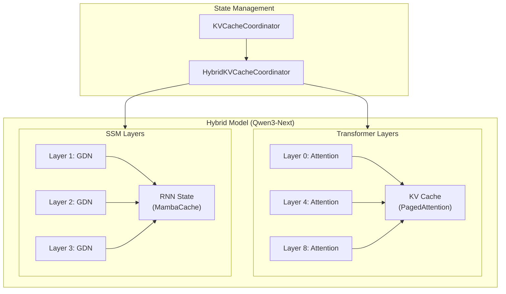

# 18. GDN/DeltaNet 线性注意力实现

## 概述

GDN (Gated DeltaNet) 是一种高效的线性注意力机制，作为 Transformer 注意力的替代方案。它属于 State Space Models (SSM) 家族，与 Mamba 类似但有不同的设计。vLLM V1 通过 `GDNAttentionBackend` 支持这类混合模型（如 Qwen3-Next）。

## 线性注意力 vs 标准注意力

```
┌───────────────────────────────────────────────────────────────────┐
│                    Attention 复杂度对比                            │
├──────────────────────────────┬────────────────────────────────────┤
│        标准 Attention         │        线性 Attention              │
├──────────────────────────────┼────────────────────────────────────┤
│  Softmax(QK^T)V              │  φ(Q)(φ(K)^T V)                    │
│                              │                                    │
│  时间: O(n²d)                │  时间: O(nd²)                      │
│  空间: O(n²) attention map   │  空间: O(d²) state                 │
│                              │                                    │
│  ✓ 长程依赖                   │  ✓ 线性扩展                        │
│  ✗ 长序列慢                   │  ✓ 适合长序列                      │
│                              │  ✗ 表达能力可能受限                 │
├──────────────────────────────┴────────────────────────────────────┤
│  GDN/DeltaNet: 结合两者优点的混合架构                              │
└───────────────────────────────────────────────────────────────────┘
```

## DeltaNet 核心原理

DeltaNet 使用 delta rule 更新状态:

```python
"""
DeltaNet 更新规则

状态 S: [d_key, d_value] 矩阵
对于每个 token:
    k: [d_key]
    v: [d_value]
    β: 衰减因子 (gating)
    
    # Delta rule 更新
    S_new = β * S + k^T @ v  # 外积更新
    
    # 输出
    o = q @ S
"""

def deltanet_forward(q, k, v, beta, state):
    """DeltaNet 前向计算
    
    Args:
        q: [batch, seq, d_key]
        k: [batch, seq, d_key]
        v: [batch, seq, d_value]
        beta: [batch, seq] 衰减因子
        state: [batch, d_key, d_value] 初始状态
    
    Returns:
        output: [batch, seq, d_value]
        new_state: [batch, d_key, d_value]
    """
    batch, seq_len = q.shape[:2]
    outputs = []
    
    for t in range(seq_len):
        # 状态衰减
        state = beta[:, t:t+1, None, None] * state
        
        # Delta 更新: 外积
        # k: [batch, d_key] -> [batch, d_key, 1]
        # v: [batch, d_value] -> [batch, 1, d_value]
        delta = k[:, t:t+1].unsqueeze(-1) @ v[:, t:t+1].unsqueeze(-2)
        state = state + delta
        
        # 输出: q @ state
        # q: [batch, d_key] -> [batch, 1, d_key]
        o = q[:, t:t+1] @ state
        outputs.append(o.squeeze(1))
    
    return torch.stack(outputs, dim=1), state
```

## GDN (Gated DeltaNet)

GDN 在 DeltaNet 基础上增加了门控机制:

```python
"""
Gated DeltaNet

增强版本:
1. Short Convolution: 局部特征提取
2. Gating: 控制信息流
3. Multi-head: 并行多组状态
"""

class GatedDeltaNet:
    def __init__(self, d_model, d_key, d_value, n_heads, conv_size=4):
        self.n_heads = n_heads
        self.d_key = d_key
        self.d_value = d_value
        self.conv_size = conv_size
        
        # 投影
        self.q_proj = nn.Linear(d_model, n_heads * d_key)
        self.k_proj = nn.Linear(d_model, n_heads * d_key)
        self.v_proj = nn.Linear(d_model, n_heads * d_value)
        
        # Short conv (类似 Mamba)
        self.short_conv = nn.Conv1d(n_heads * d_key, n_heads * d_key,
                                     kernel_size=conv_size, groups=n_heads)
        
        # Beta gate
        self.beta_proj = nn.Linear(d_model, n_heads)
        
        # 输出投影
        self.out_proj = nn.Linear(n_heads * d_value, d_model)
    
    def forward(self, x, state=None, conv_state=None):
        batch, seq_len, _ = x.shape
        
        # 投影
        q = self.q_proj(x).view(batch, seq_len, self.n_heads, self.d_key)
        k = self.k_proj(x).view(batch, seq_len, self.n_heads, self.d_key)
        v = self.v_proj(x).view(batch, seq_len, self.n_heads, self.d_value)
        
        # Short convolution
        k, conv_state = self.apply_short_conv(k, conv_state)
        
        # Beta (衰减因子)
        beta = torch.sigmoid(self.beta_proj(x))  # [batch, seq, n_heads]
        
        # DeltaNet 计算
        if state is None:
            state = torch.zeros(batch, self.n_heads, self.d_key, self.d_value,
                              device=x.device, dtype=x.dtype)
        
        outputs = []
        for t in range(seq_len):
            # 衰减
            state = beta[:, t:t+1, :, None, None] * state
            
            # Delta 更新
            kt = k[:, t]  # [batch, n_heads, d_key]
            vt = v[:, t]  # [batch, n_heads, d_value]
            delta = kt.unsqueeze(-1) @ vt.unsqueeze(-2)  # [batch, n_heads, d_key, d_value]
            state = state + delta
            
            # 输出
            qt = q[:, t]  # [batch, n_heads, d_key]
            ot = (qt.unsqueeze(-2) @ state).squeeze(-2)  # [batch, n_heads, d_value]
            outputs.append(ot)
        
        output = torch.stack(outputs, dim=1)  # [batch, seq, n_heads, d_value]
        output = output.view(batch, seq_len, -1)
        output = self.out_proj(output)
        
        return output, state, conv_state
```

## 源码位置

```
vllm/v1/attention/backends/gdn_attn.py       # GDN 后端
vllm/v1/attention/backends/linear_attn.py    # 通用线性注意力
vllm/v1/attention/backends/mamba_attn.py     # Mamba 基类
vllm/v1/attention/backends/mamba1_attn.py    # Mamba 1
vllm/v1/attention/backends/mamba2_attn.py    # Mamba 2
vllm/v1/attention/backends/short_conv_attn.py # Short Conv
```

## GDNAttentionBackend

```python
# vllm/v1/attention/backends/gdn_attn.py

class GDNAttentionBackend(AttentionBackend):
    """GDN (Gated DeltaNet) 注意力后端
    
    用于 Qwen3-Next 等混合模型中的线性注意力层
    """
    
    @staticmethod
    def get_name() -> str:
        return "GDN_ATTN"
    
    @staticmethod
    def get_builder_cls() -> type["GDNAttentionMetadataBuilder"]:
        return GDNAttentionMetadataBuilder
```

## GDNAttentionMetadata

```python
@dataclass
class GDNAttentionMetadata:
    """GDN 注意力元数据
    
    与 Transformer 注意力不同，GDN 需要:
    1. 区分 speculative decoding 和普通 decode
    2. 管理 RNN 状态索引
    3. Short conv 的元数据
    """
    
    # ============ 请求计数 ============
    num_prefills: int
    num_prefill_tokens: int
    num_decodes: int
    num_decode_tokens: int
    num_spec_decodes: int      # Speculative decode 请求数
    num_spec_decode_tokens: int
    num_actual_tokens: int
    
    # ============ 状态管理 ============
    has_initial_state: torch.Tensor | None = None
    """[batch] 布尔值，标识是否有初始状态"""
    
    # ============ Speculative Decoding ============
    spec_query_start_loc: torch.Tensor | None = None
    """[num_spec_decodes + 1] spec decode 的 query 起始位置"""
    
    non_spec_query_start_loc: torch.Tensor | None = None
    """[batch - num_spec_decodes + 1] 非 spec 的 query 起始位置"""
    
    spec_state_indices_tensor: torch.Tensor | None = None
    """[batch, num_spec + 1] spec decode 的状态索引"""
    
    non_spec_state_indices_tensor: torch.Tensor | None = None
    """[batch - num_spec_decodes] 非 spec 的状态索引"""
    
    spec_sequence_masks: torch.Tensor | None = None
    """[batch] 标识哪些请求是 spec decode"""
    
    spec_token_indx: torch.Tensor | None = None
    non_spec_token_indx: torch.Tensor | None = None
    
    num_accepted_tokens: torch.Tensor | None = None
    """[batch] 每个请求接受的 token 数"""
    
    # ============ Causal Conv1d ============
    nums_dict: dict | None = None
    batch_ptr: torch.Tensor | None = None
    token_chunk_offset_ptr: torch.Tensor | None = None
    """Triton causal_conv1d 的元数据"""
```

## GDNAttentionMetadataBuilder

```python
class GDNAttentionMetadataBuilder(AttentionMetadataBuilder[GDNAttentionMetadata]):
    """GDN 元数据构建器
    
    处理复杂的 speculative decoding 状态管理
    """
    
    _cudagraph_support = AttentionCGSupport.UNIFORM_BATCH
    reorder_batch_threshold: int = 1
    
    def __init__(
        self,
        kv_cache_spec: AttentionSpec,
        layer_names: list[str],
        vllm_config: VllmConfig,
        device: torch.device,
    ):
        assert isinstance(kv_cache_spec, MambaSpec)
        
        self.speculative_config = vllm_config.speculative_config
        if self.speculative_config:
            self.num_spec = self.speculative_config.num_speculative_tokens
        else:
            self.num_spec = 0
        self.use_spec_decode = self.num_spec > 0
        
        self.use_full_cuda_graph = (
            vllm_config.compilation_config.cudagraph_mode.has_full_cudagraphs()
        )
        
        # 预分配 CUDA Graph 用的 buffer
        self.decode_cudagraph_max_bs = (
            vllm_config.scheduler_config.max_num_seqs * (self.num_spec + 1)
        )
        
        if vllm_config.compilation_config.max_cudagraph_capture_size is not None:
            self.decode_cudagraph_max_bs = min(
                self.decode_cudagraph_max_bs,
                vllm_config.compilation_config.max_cudagraph_capture_size,
            )
        
        # 预分配 tensor
        self.spec_state_indices_tensor = torch.empty(
            (self.decode_cudagraph_max_bs, self.num_spec + 1),
            dtype=torch.int32, device=device,
        )
        self.non_spec_state_indices_tensor = torch.empty(
            (self.decode_cudagraph_max_bs,),
            dtype=torch.int32, device=device,
        )
        # ... 更多预分配
    
    def build(
        self,
        common_prefix_len: int,
        common_attn_metadata: CommonAttentionMetadata,
        num_accepted_tokens: torch.Tensor | None = None,
        num_decode_draft_tokens_cpu: torch.Tensor | None = None,
        fast_build: bool = False,
    ) -> GDNAttentionMetadata:
        """构建 GDN 元数据
        
        复杂性主要来自 speculative decoding:
        1. 需要分离 spec decode 和普通请求
        2. 状态索引需要考虑多个 draft token
        3. 需要正确处理接受/拒绝的 token
        """
        m = common_attn_metadata
        query_start_loc = m.query_start_loc
        context_lens_tensor = m.compute_num_computed_tokens()
        
        # 获取 block table (Mamba 使用不同的格式)
        block_table_tensor = mamba_get_block_table_tensor(
            m.block_table_tensor,
            m.seq_lens,
            self.kv_cache_spec,
            self.vllm_config.cache_config.mamba_cache_mode,
        )
        
        # 检测 speculative decoding 请求
        if (not self.use_spec_decode or 
            num_decode_draft_tokens_cpu is None or
            num_decode_draft_tokens_cpu[num_decode_draft_tokens_cpu >= 0].sum() == 0):
            # 无 spec decode
            spec_sequence_masks = None
            num_spec_decodes = 0
        else:
            # 有 spec decode
            spec_sequence_masks_cpu = num_decode_draft_tokens_cpu >= 0
            num_spec_decodes = spec_sequence_masks_cpu.sum().item()
            spec_sequence_masks = spec_sequence_masks_cpu.to(
                query_start_loc.device, non_blocking=True
            )
        
        if spec_sequence_masks is None:
            # 简单路径: 无 spec decode
            num_decodes, num_prefills, num_decode_tokens, num_prefill_tokens = (
                split_decodes_and_prefills(m, decode_threshold=1)
            )
            num_spec_decode_tokens = 0
            non_spec_state_indices_tensor = block_table_tensor[:, 0]
            non_spec_query_start_loc = query_start_loc
        else:
            # 复杂路径: 有 spec decode
            query_lens = query_start_loc[1:] - query_start_loc[:-1]
            
            # 分离 spec 和非 spec 请求
            non_spec_query_lens = query_lens[~spec_sequence_masks]
            num_decodes = (non_spec_query_lens == 1).sum().item()
            num_prefills = non_spec_query_lens.size(0) - num_decodes
            
            # 计算 token 索引
            if num_prefills == 0 and num_decodes == 0:
                # 纯 spec decode
                spec_token_indx = torch.arange(
                    num_spec_decodes * (self.num_spec + 1),
                    dtype=torch.int32, device=query_start_loc.device,
                )
                non_spec_token_indx = torch.empty(0, dtype=torch.int32, device=query_start_loc.device)
                spec_state_indices_tensor = block_table_tensor[:, :self.num_spec + 1]
                non_spec_state_indices_tensor = None
            else:
                # 混合: spec + 非 spec
                spec_token_masks = torch.repeat_interleave(spec_sequence_masks, query_lens)
                index = torch.argsort(spec_token_masks, stable=True)
                
                num_non_spec_tokens = num_prefill_tokens + num_decode_tokens
                non_spec_token_indx = index[:num_non_spec_tokens]
                spec_token_indx = index[num_non_spec_tokens:]
                
                spec_state_indices_tensor = block_table_tensor[spec_sequence_masks, :self.num_spec + 1]
                non_spec_state_indices_tensor = block_table_tensor[~spec_sequence_masks, 0]
        
        # Prefill 需要 causal conv1d 元数据
        if num_prefills > 0:
            has_initial_state = context_lens_tensor > 0
            if spec_sequence_masks is not None:
                has_initial_state = has_initial_state[~spec_sequence_masks]
            
            nums_dict, batch_ptr, token_chunk_offset_ptr = (
                compute_causal_conv1d_metadata(
                    non_spec_query_start_loc_cpu,
                    device=query_start_loc.device,
                )
            )
        else:
            has_initial_state = None
            nums_dict, batch_ptr, token_chunk_offset_ptr = None, None, None
        
        # CUDA Graph 处理
        if (self.use_full_cuda_graph and 
            num_prefills == 0 and num_decodes == 0 and
            num_spec_decodes <= self.decode_cudagraph_max_bs):
            # 复制到预分配的 buffer
            self.spec_state_indices_tensor[:num_spec_decodes].copy_(
                spec_state_indices_tensor, non_blocking=True
            )
            spec_state_indices_tensor = self.spec_state_indices_tensor[:batch_size]
            spec_state_indices_tensor[num_spec_decodes:].fill_(PAD_SLOT_ID)
            # ... 类似处理其他 tensor
        
        return GDNAttentionMetadata(
            num_prefills=num_prefills,
            num_prefill_tokens=num_prefill_tokens,
            num_decodes=num_decodes,
            num_decode_tokens=num_decode_tokens,
            num_spec_decodes=num_spec_decodes,
            num_spec_decode_tokens=num_spec_decode_tokens,
            num_actual_tokens=m.num_actual_tokens,
            has_initial_state=has_initial_state,
            spec_query_start_loc=spec_query_start_loc,
            non_spec_query_start_loc=non_spec_query_start_loc,
            spec_state_indices_tensor=spec_state_indices_tensor,
            non_spec_state_indices_tensor=non_spec_state_indices_tensor,
            spec_sequence_masks=spec_sequence_masks,
            spec_token_indx=spec_token_indx,
            non_spec_token_indx=non_spec_token_indx,
            num_accepted_tokens=num_accepted_tokens,
            nums_dict=nums_dict,
            batch_ptr=batch_ptr,
            token_chunk_offset_ptr=token_chunk_offset_ptr,
        )
```

## 混合模型状态管理

混合模型（如 Qwen3-Next）同时包含 Transformer 和 SSM 层，需要管理两种不同的"KV Cache":



## 状态缓存格式

```python
"""
GDN/Mamba State Cache 格式

对于 GDN:
- State: [num_blocks, block_size, d_key, d_value]
- Conv State: [num_blocks, block_size, d_conv, d_inner]

对于 Mamba:
- State: [num_blocks, block_size, d_state, d_inner]
- Conv State: [num_blocks, block_size, d_conv, d_inner]

注意: 这些"block"不是 PagedAttention 的 block
而是预分配的状态槽
"""

class MambaSpec(KVCacheSpec):
    """Mamba/GDN 缓存规格"""
    
    # RNN 状态维度
    state_size: int      # d_key 或 d_state
    inner_size: int      # d_value 或 d_inner
    
    # Short conv 维度
    conv_dim: int        # d_conv
    conv_inner: int      # d_inner
    
    # 数据类型
    state_dtype: torch.dtype = torch.float32  # 状态通常使用 FP32
    
    def get_kv_cache_shape(
        self, num_blocks: int, block_size: int
    ) -> tuple[int, ...]:
        """返回状态缓存形状"""
        return (
            num_blocks,
            block_size,
            self.state_size,
            self.inner_size,
        )
```

## Speculative Decoding 支持

GDN 对 speculative decoding 有特殊处理:

```python
"""
GDN Speculative Decoding

挑战:
- SSM 状态是递归更新的
- 需要在验证时能够回滚状态

解决方案:
- 为每个 draft token 维护独立状态槽
- 验证后只保留接受的 token 对应状态
"""

def gdn_spec_decode_flow():
    """
    1. Draft 阶段:
       - 为每个 draft token 创建状态副本
       - state_indices: [batch, num_spec + 1]
       - 第 0 列是 target token 状态
       - 第 1-N 列是 draft token 状态
    
    2. Verify 阶段:
       - 检查每个 draft token 是否被接受
       - num_accepted_tokens: [batch] 接受的数量
    
    3. 更新阶段:
       - 只保留 state_indices[:, :num_accepted + 1]
       - 丢弃未接受 token 的状态
    """
    pass
```

## Triton Causal Conv1d

GDN 使用 Triton 实现的 causal conv1d:

```python
"""
Causal Conv1d for GDN

用于 short convolution 操作:
- 对输入序列应用因果卷积
- 维护 conv_state 用于增量推理

Triton 实现提供:
- 高效的 prefill 处理
- CUDA Graph 兼容
"""

def compute_causal_conv1d_metadata(
    query_start_loc_cpu: torch.Tensor,
    device: torch.device,
) -> tuple[dict, torch.Tensor, torch.Tensor]:
    """计算 causal conv1d 的 Triton 元数据
    
    Args:
        query_start_loc_cpu: [batch + 1] query 起始位置 (CPU)
        device: 目标设备
    
    Returns:
        nums_dict: 各种计数
        batch_ptr: batch 指针
        token_chunk_offset_ptr: token chunk 偏移
    """
    # 计算每个请求的 token 数
    query_lens = query_start_loc_cpu[1:] - query_start_loc_cpu[:-1]
    
    # 分块处理长序列
    # ...
    
    return nums_dict, batch_ptr, token_chunk_offset_ptr
```

## 与其他 SSM 后端的对比

| 特性 | GDN | Mamba1 | Mamba2 |
|------|-----|--------|--------|
| **更新规则** | Delta rule | SSM | Chunk-wise SSM |
| **状态大小** | d_key × d_value | d_state × d_inner | d_state × d_inner |
| **Short Conv** | 是 | 是 | 是 |
| **Gating** | 显式 beta | 隐式 | 隐式 |
| **Chunk 处理** | 否 | 否 | 是 |
| **Spec Decode** | 支持 | 支持 | 支持 |

## 总结

GDN 注意力后端的关键特点:

1. **线性复杂度**: O(nd²) 时间，O(d²) 状态空间
2. **递归状态**: 维护 d_key × d_value 的状态矩阵
3. **Speculative Decoding**: 完整支持，需要状态管理
4. **CUDA Graph**: 支持 UNIFORM_BATCH 模式
5. **混合模型**: 与 Transformer 层共存于同一模型

适用场景:
- 长序列处理
- 内存受限环境
- Qwen3-Next 等混合架构模型
