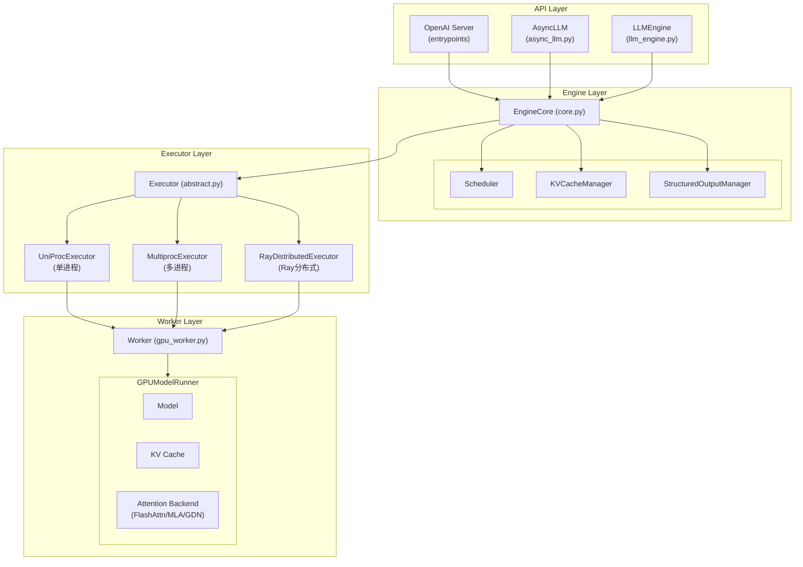
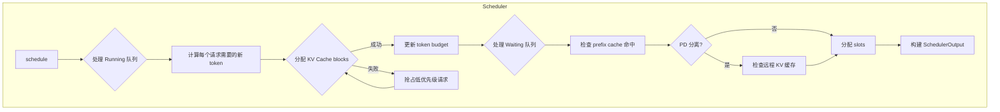
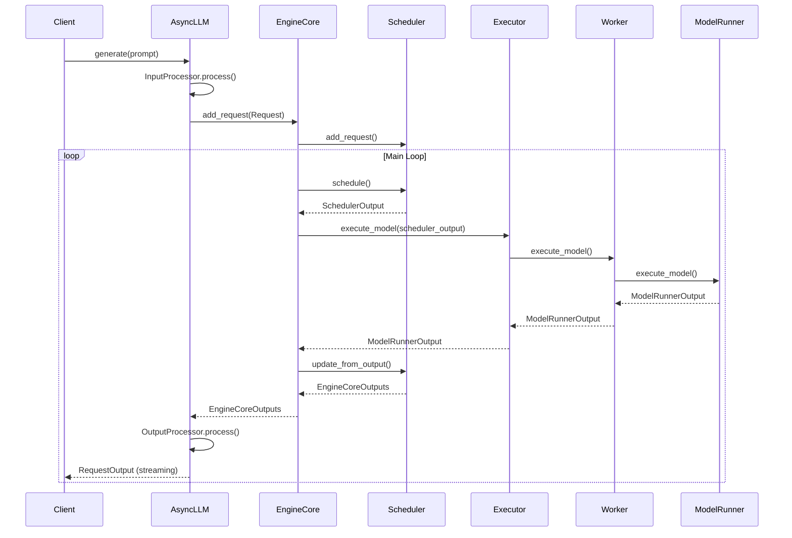
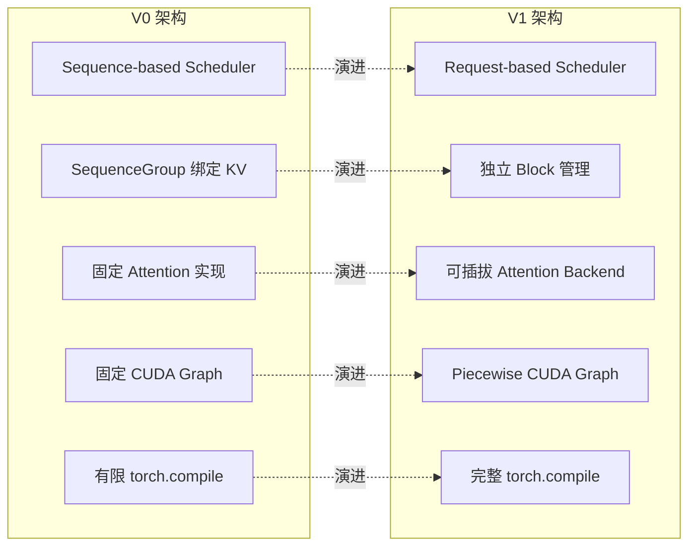

# 01 - vLLM V1 整体架构概述

> 本文档从整体视角介绍 vLLM V1 架构的核心组件和数据流

---

## 目录

- [架构总览](#架构总览)
- [核心组件](#核心组件)
- [数据流](#数据流)
- [关键文件索引](#关键文件索引)
- [V1 vs V0 架构差异](#v1-vs-v0-架构差异)

---

## 架构总览

vLLM V1 采用分层架构设计，从上到下可以分为以下几层：



**分层说明**:

| 层级 | 职责 | 关键组件 |
|------|------|---------|
| **API Layer** | 对外接口，处理用户请求 | OpenAI Server, AsyncLLM, LLMEngine |
| **Engine Layer** | 核心引擎，协调调度与执行 | EngineCore, Scheduler, KVCacheManager |
| **Executor Layer** | 执行器抽象，管理 Worker 进程 | UniProc, Multiproc, RayDistributed |
| **Worker Layer** | GPU 执行，模型前向推理 | GPUWorker, GPUModelRunner, Attention Backend |

---

## 核心组件

### 1. EngineCore - 引擎核心

**文件**: `vllm/v1/engine/core.py`

EngineCore 是 vLLM 的核心引擎，负责协调调度器和执行器：

```python
class EngineCore:
    """Inner loop of vLLM's Engine."""
    
    def __init__(self, vllm_config, executor_class, log_stats, ...):
        # 1. 初始化 Executor
        self.model_executor = executor_class(vllm_config)
        
        # 2. 初始化 KV Cache
        num_gpu_blocks, num_cpu_blocks, kv_cache_config = self._initialize_kv_caches()
        
        # 3. 初始化 Scheduler
        Scheduler = vllm_config.scheduler_config.get_scheduler_cls()
        self.scheduler = Scheduler(vllm_config, kv_cache_config, ...)
        
        # 4. 初始化 StructuredOutputManager
        self.structured_output_manager = StructuredOutputManager(vllm_config)
```

#### step() 方法 - 主循环

```python
def step(self) -> tuple[dict[int, EngineCoreOutputs], bool]:
    """Schedule, execute, and make output."""
    
    # 1. 检查是否有待处理请求
    if not self.scheduler.has_requests():
        return {}, False
    
    # 2. 调度 - 决定本次迭代处理哪些请求
    scheduler_output = self.scheduler.schedule()
    
    # 3. 执行模型 (异步)
    future = self.model_executor.execute_model(scheduler_output, non_block=True)
    
    # 4. 获取语法约束 bitmask (结构化输出)
    grammar_output = self.scheduler.get_grammar_bitmask(scheduler_output)
    
    # 5. 等待模型执行完成
    model_output = future.result()
    if model_output is None:
        model_output = self.model_executor.sample_tokens(grammar_output)
    
    # 6. 处理中止请求
    self._process_aborts_queue()
    
    # 7. 更新调度器状态
    engine_core_outputs = self.scheduler.update_from_output(
        scheduler_output, model_output
    )
    
    return engine_core_outputs, scheduler_output.total_num_scheduled_tokens > 0
```

### 2. Scheduler - 调度器

**文件**: `vllm/v1/core/sched/scheduler.py`

调度器负责决定每次迭代处理哪些请求，以及分配多少 token：



核心职责：
- **请求管理**: 维护 waiting/running 队列
- **Token 分配**: 决定每个请求处理多少 token
- **KV Cache 分配**: 调用 KVCacheManager 分配内存
- **抢占处理**: 内存不足时抢占低优先级请求

### 3. Executor - 执行器

**文件**: `vllm/v1/executor/abstract.py`

执行器负责管理 Worker 进程，有三种实现：

| Executor | 文件 | 适用场景 |
|----------|------|---------|
| `UniProcExecutor` | `uniproc_executor.py` | 单 GPU，无分布式 |
| `MultiprocExecutor` | `multiproc_executor.py` | 多 GPU，本地多进程 |
| `RayDistributedExecutor` | `ray_executor.py` | 多节点 Ray 分布式 |

```python
class Executor(ABC):
    """Abstract base class for vLLM executors."""
    
    @staticmethod
    def get_class(vllm_config) -> type["Executor"]:
        # 根据配置选择 Executor 类型
        if distributed_executor_backend == "ray":
            return RayDistributedExecutor
        elif distributed_executor_backend == "mp":
            return MultiprocExecutor
        elif distributed_executor_backend == "uni":
            return UniProcExecutor
    
    @abstractmethod
    def execute_model(self, scheduler_output) -> ModelRunnerOutput:
        """Execute the model on the given inputs."""
        raise NotImplementedError
    
    def collective_rpc(self, method, args=(), kwargs=None) -> list:
        """Execute RPC call on all workers."""
        raise NotImplementedError
```

### 4. Worker - 工作进程

**文件**: `vllm/v1/worker/gpu_worker.py`

每个 Worker 管理一个 GPU 设备：

```python
class Worker(WorkerBase):
    def __init__(self, vllm_config, local_rank, rank, ...):
        # GPU 设备绑定
        self.local_rank = local_rank
        self.rank = rank
        
        # 初始化分布式环境
        init_distributed_environment(...)
        
    def init_model(self):
        # 创建 ModelRunner
        self.model_runner = GPUModelRunner(self.vllm_config, ...)
        
    def execute_model(self, scheduler_output) -> ModelRunnerOutput:
        return self.model_runner.execute_model(scheduler_output)
```

### 5. GPUModelRunner - 模型执行器

**文件**: `vllm/v1/worker/gpu_model_runner.py` (5400+ 行)

ModelRunner 是最核心的执行组件，负责：

```python
class GPUModelRunner(LoRAModelRunnerMixin, KVConnectorModelRunnerMixin, ...):
    def __init__(self, vllm_config, ...):
        # 1. 加载模型
        self.model = self._maybe_wrap_with_compile(self._build_model())
        
        # 2. 初始化 Attention Backend
        self.attn_backends = self._create_attn_backends()
        
        # 3. 初始化 KV Cache
        self.kv_caches = self._allocate_kv_caches()
        
        # 4. 初始化 CUDA Graph (可选)
        if cudagraph_mode != CUDAGraphMode.NONE:
            self.model = CUDAGraphWrapper(self.model, ...)
    
    def execute_model(self, scheduler_output) -> ModelRunnerOutput:
        # 1. 准备输入
        attn_metadata = self._build_attention_metadata(scheduler_output)
        inputs = self._prepare_inputs(scheduler_output)
        
        # 2. 模型前向
        hidden_states = self.model(
            input_ids=inputs.input_ids,
            positions=inputs.positions,
            kv_caches=self.kv_caches,
            attn_metadata=attn_metadata,
        )
        
        # 3. 采样
        logits = self.model.compute_logits(hidden_states)
        output = self.sampler(logits, ...)
        
        return output
```

---

## 数据流

### 请求处理流程



### SchedulerOutput 结构

```python
@dataclass
class SchedulerOutput:
    """调度器输出，传递给 Executor"""
    
    # 新请求数据
    new_reqs: list[NewRequestData]
    
    # 已缓存请求数据 (继续生成)
    cached_reqs: list[CachedRequestData]
    
    # 每个请求调度的 token 数
    num_scheduled_tokens: dict[str, int]
    
    # 总调度 token 数
    total_num_scheduled_tokens: int
    
    # Encoder 输入 (多模态)
    encoder_inputs: list[EncoderInput]
    
    # KV Connector 元数据 (PD 分离)
    kv_connector_metadata: Any
    
    # 结构化输出待处理 tokens
    pending_structured_output_tokens: dict[str, int]
```

### ModelRunnerOutput 结构

```python
@dataclass
class ModelRunnerOutput:
    """模型执行输出"""
    
    # 采样结果
    sampled_token_ids: torch.Tensor  # [num_reqs]
    
    # Logprobs (可选)
    logprobs: torch.Tensor | None
    prompt_logprobs: torch.Tensor | None
    
    # 投机解码相关
    spec_token_ids: torch.Tensor | None
    
    # Pooling 输出 (Embedding 模型)
    pooler_output: list[PoolingSequenceGroupOutput] | None
```

---

## 关键文件索引

### Engine Layer

| 文件 | 类/函数 | 职责 |
|------|--------|------|
| `vllm/v1/engine/core.py` | `EngineCore` | 引擎核心，协调调度和执行 |
| `vllm/v1/engine/async_llm.py` | `AsyncLLM` | 异步 LLM 引擎，处理 API 请求 |
| `vllm/v1/engine/llm_engine.py` | `LLMEngine` | 同步 LLM 引擎 |
| `vllm/v1/engine/core_client.py` | `EngineCoreClient` | 进程间通信客户端 |

### Scheduler Layer

| 文件 | 类/函数 | 职责 |
|------|--------|------|
| `vllm/v1/core/sched/scheduler.py` | `Scheduler` | 核心调度器 |
| `vllm/v1/core/sched/async_scheduler.py` | `AsyncScheduler` | 异步调度器 |
| `vllm/v1/core/sched/output.py` | `SchedulerOutput` | 调度输出结构 |
| `vllm/v1/core/sched/request_queue.py` | `RequestQueue` | 请求队列 |

### Memory Layer

| 文件 | 类/函数 | 职责 |
|------|--------|------|
| `vllm/v1/core/kv_cache_manager.py` | `KVCacheManager` | KV Cache 管理 |
| `vllm/v1/core/block_pool.py` | `BlockPool` | Block 池管理 |
| `vllm/v1/core/kv_cache_coordinator.py` | `KVCacheCoordinator` | KV Cache 协调 |

### Executor Layer

| 文件 | 类/函数 | 职责 |
|------|--------|------|
| `vllm/v1/executor/abstract.py` | `Executor` | 执行器抽象基类 |
| `vllm/v1/executor/uniproc_executor.py` | `UniProcExecutor` | 单进程执行器 |
| `vllm/v1/executor/multiproc_executor.py` | `MultiprocExecutor` | 多进程执行器 |
| `vllm/v1/executor/ray_executor.py` | `RayDistributedExecutor` | Ray 分布式执行器 |

### Worker Layer

| 文件 | 类/函数 | 职责 |
|------|--------|------|
| `vllm/v1/worker/gpu_worker.py` | `Worker` | GPU Worker |
| `vllm/v1/worker/gpu_model_runner.py` | `GPUModelRunner` | 模型执行器 |
| `vllm/v1/worker/gpu_input_batch.py` | `InputBatch` | 输入批次管理 |

### Request & Output

| 文件 | 类/函数 | 职责 |
|------|--------|------|
| `vllm/v1/request.py` | `Request`, `RequestStatus` | 请求定义 |
| `vllm/v1/outputs.py` | `ModelRunnerOutput` | 模型输出 |
| `vllm/v1/engine/__init__.py` | `EngineCoreOutput` | 引擎输出 |

---

## V1 vs V0 架构差异

V1 是 vLLM 的新一代架构，主要改进：



| 特性 | V0 | V1 |
|------|----|----|
| **调度器** | Sequence-based | Request-based |
| **KV Cache** | SequenceGroup 绑定 | 独立 Block 管理 |
| **Attention Backend** | 固定实现 | 可插拔 Backend |
| **CUDA Graph** | 固定捕获 | Piecewise CUDA Graph |
| **torch.compile** | 有限支持 | 完整集成 |
| **Prefix Caching** | 基础支持 | 增强的 Block 级缓存 |
| **混合模型** | 不支持 | 支持 IsHybrid 接口 |

### V1 架构优势

1. **更灵活的调度**: Request-based 调度支持更细粒度的控制
2. **更高效的内存**: 独立 Block 管理减少内存碎片
3. **更好的可扩展性**: 可插拔 Backend 支持新的 Attention 实现
4. **更强的编译优化**: Piecewise CUDA Graph + torch.compile

### 启用 V1

```python
# 通过环境变量
export VLLM_USE_V1=1

# 或通过 API
from vllm import LLM
llm = LLM(model="...", use_v1=True)
```

---

## 下一步

- [02-core-data-structures.md](./02-core-data-structures.md) - 核心数据结构详解
- [03-scheduler-design.md](./03-scheduler-design.md) - 调度器设计深入分析
