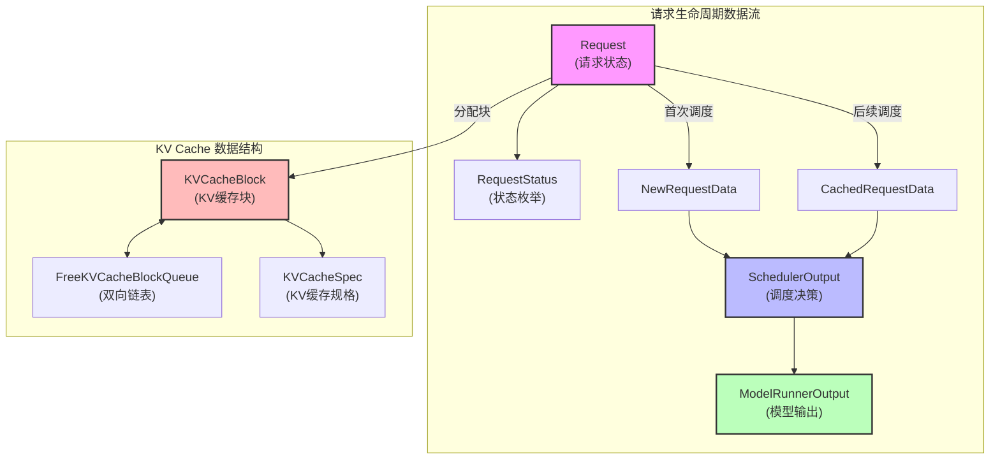
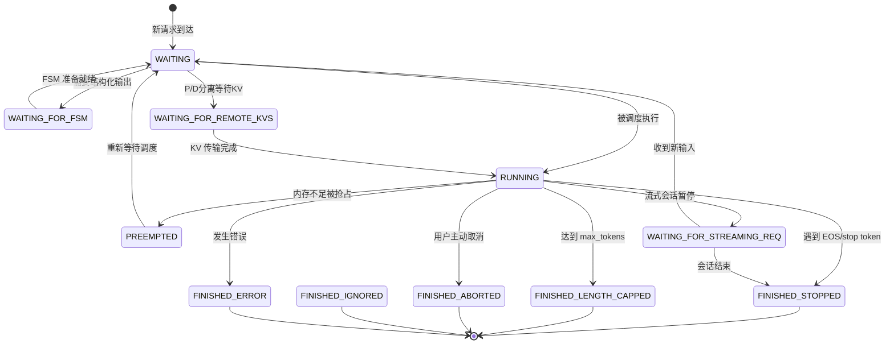
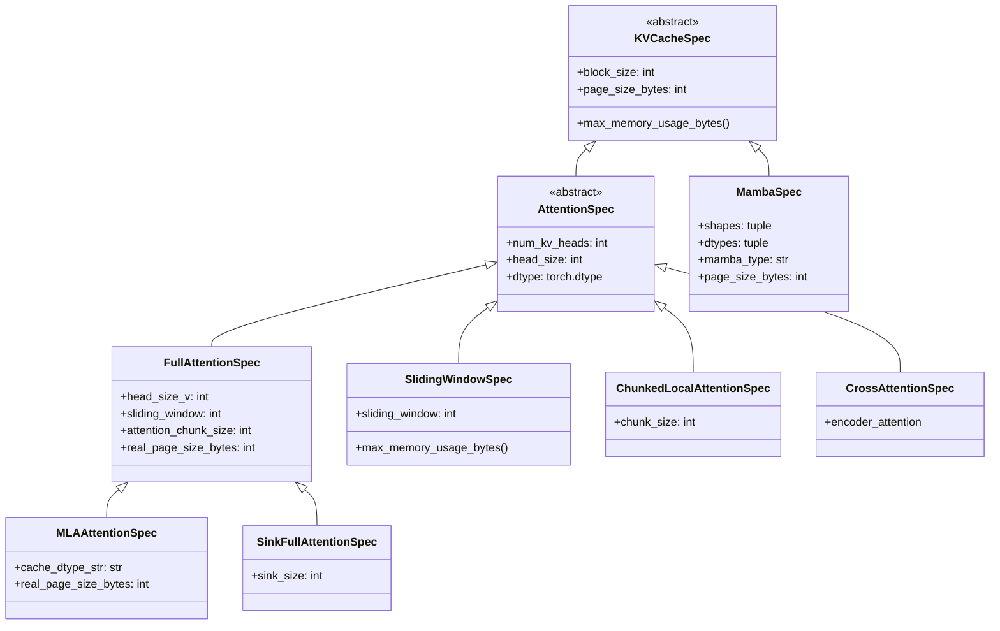
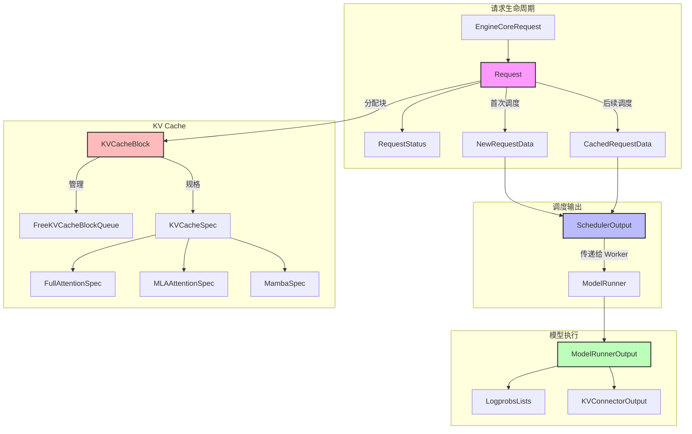

# 02 - 核心数据结构详解

> **学习目标**: 深入理解 vLLM V1 中的核心数据结构设计
>
> **关键文件**:
> - `vllm/v1/request.py` - Request, RequestStatus
> - `vllm/v1/core/sched/output.py` - SchedulerOutput, NewRequestData, CachedRequestData
> - `vllm/v1/core/kv_cache_utils.py` - KVCacheBlock, FreeKVCacheBlockQueue
> - `vllm/v1/kv_cache_interface.py` - KVCacheSpec 系列
> - `vllm/v1/outputs.py` - ModelRunnerOutput

---

## 数据结构总览



---

## 1. Request - 请求核心类

`Request` 是 vLLM 中最重要的数据结构，封装了一个推理请求的所有状态信息。

### 1.1 Request 类定义

```python
# vllm/v1/request.py:59-170

class Request:
    def __init__(
        self,
        request_id: str,                              # 请求唯一标识
        prompt_token_ids: list[int] | None,           # prompt 的 token IDs
        sampling_params: SamplingParams | None,       # 采样参数
        pooling_params: PoolingParams | None,         # 池化参数 (embedding模型)
        eos_token_id: int | None,                     # 结束符 ID
        client_index: int = 0,                        # 客户端索引
        arrival_time: float | None = None,            # 到达时间
        prompt_embeds: torch.Tensor | None = None,    # 直接提供的 prompt embeddings
        mm_features: list[MultiModalFeatureSpec] | None = None,  # 多模态特征
        lora_request: Optional["LoRARequest"] = None, # LoRA 请求
        cache_salt: str | None = None,                # 缓存盐值 (prefix caching)
        priority: int = 0,                            # 请求优先级
        trace_headers: Mapping[str, str] | None = None,
        block_hasher: Callable[[...]] | None = None,  # 块哈希计算器
        resumable: bool = False,                      # 流式会话可恢复
    ) -> None:
        self.request_id = request_id
        self.client_index = client_index
        self.priority = priority
        self.sampling_params = sampling_params
        self.pooling_params = pooling_params
        self.eos_token_id = eos_token_id
        self.lora_request = lora_request
        
        # 结构化输出请求
        self.structured_output_request = StructuredOutputRequest.from_sampling_params(
            sampling_params
        )
        self.arrival_time = arrival_time if arrival_time is not None else time.time()

        # ═══════════════════════════════════════════════════════════════════
        # 核心状态字段
        # ═══════════════════════════════════════════════════════════════════
        
        self.status = RequestStatus.WAITING           # 当前状态
        self.events: list[EngineCoreEvent] = []       # 事件记录
        self.stop_reason: int | str | None = None     # 停止原因

        # ═══════════════════════════════════════════════════════════════════
        # Token 相关
        # ═══════════════════════════════════════════════════════════════════
        
        self.prompt_token_ids = prompt_token_ids
        self.prompt_embeds = prompt_embeds
        self.num_prompt_tokens = length_from_prompt_token_ids_or_embeds(
            prompt_token_ids, prompt_embeds
        )
        self._output_token_ids: list[int] = []        # 已生成的 token
        self._all_token_ids: list[int] = (            # prompt + output tokens
            self.prompt_token_ids.copy()
            if self.prompt_token_ids is not None
            else [0] * self.num_prompt_tokens
        )
        
        self.spec_token_ids: list[int] = []           # 投机采样的候选 tokens
        self.num_computed_tokens = 0                   # 已计算的 token 数
        
        # ═══════════════════════════════════════════════════════════════════
        # Prefix Caching 相关
        # ═══════════════════════════════════════════════════════════════════
        
        self.cache_salt: str | None = cache_salt
        self.num_cached_tokens = -1                   # prefix cache 命中的 token 数
        self.block_hashes: list[BlockHash] = []       # 块哈希列表
        
        # ═══════════════════════════════════════════════════════════════════
        # 多模态相关
        # ═══════════════════════════════════════════════════════════════════
        
        self.mm_features = mm_features or []          # 多模态特征 (图像/视频)
        
        # ═══════════════════════════════════════════════════════════════════
        # P/D 分离相关
        # ═══════════════════════════════════════════════════════════════════
        
        self.kv_transfer_params: dict[str, Any] | None = None
        self.num_external_computed_tokens = 0         # 远程计算的 token 数
```

### 1.2 关键属性解析

```python
# Token 数量计算
@property
def num_tokens(self) -> int:
    """返回所有 token 数量 (prompt + output)"""
    return len(self._all_token_ids)

@property
def num_tokens_with_spec(self) -> int:
    """包含投机候选 token 的总数"""
    return len(self._all_token_ids) + len(self.spec_token_ids)

@property
def num_output_tokens(self) -> int:
    """已生成的 output token 数"""
    return len(self._output_token_ids)

@property
def num_encoder_inputs(self) -> int:
    """多模态输入数量 (如图像数量)"""
    return len(self.mm_features)
```

### 1.3 Token 追加方法

```python
# vllm/v1/request.py:197-209

def append_output_token_ids(
    self,
    token_ids: int | list[int],
) -> None:
    """追加新生成的 token，同时更新 block_hashes"""
    if isinstance(token_ids, int):
        self._output_token_ids.append(token_ids)
        self._all_token_ids.append(token_ids)
    else:
        self._output_token_ids.extend(token_ids)
        self._all_token_ids.extend(token_ids)

    # 如果新增了完整的 block，计算并追加其 hash
    if self.get_hash_new_full_blocks is not None:
        self.block_hashes.extend(self.get_hash_new_full_blocks())
```

### 1.4 优先级比较

```python
# vllm/v1/request.py:271-282

def __lt__(self, other: "Request") -> bool:
    """
    优先级调度的比较逻辑:
    1. priority 数值小的优先
    2. 相同 priority 时，先到达的优先 (FIFO)
    3. 相同 arrival_time 时，按 request_id 排序
    """
    if self.priority != other.priority:
        return self.priority < other.priority
    if self.arrival_time != other.arrival_time:
        return self.arrival_time < other.arrival_time
    if self.request_id != other.request_id:
        return self.request_id < other.request_id
    return id(self) < id(other)
```

---

## 2. RequestStatus - 请求状态枚举

### 2.1 状态定义

```python
# vllm/v1/request.py:285-324

class RequestStatus(enum.IntEnum):
    """请求状态枚举"""

    # ═══════════════════════════════════════════════════════════════════════
    # 等待状态
    # ═══════════════════════════════════════════════════════════════════════
    WAITING = enum.auto()                    # 等待调度
    WAITING_FOR_FSM = enum.auto()            # 等待 FSM (结构化输出)
    WAITING_FOR_REMOTE_KVS = enum.auto()     # 等待远程 KV 传输 (P/D分离)
    WAITING_FOR_STREAMING_REQ = enum.auto()  # 等待流式请求更新
    
    # ═══════════════════════════════════════════════════════════════════════
    # 运行状态
    # ═══════════════════════════════════════════════════════════════════════
    RUNNING = enum.auto()                    # 正在运行
    PREEMPTED = enum.auto()                  # 被抢占
    
    # ═══════════════════════════════════════════════════════════════════════
    # 完成状态 (所有 > PREEMPTED 的状态都是完成状态)
    # ═══════════════════════════════════════════════════════════════════════
    FINISHED_STOPPED = enum.auto()           # 正常完成 (遇到 stop token)
    FINISHED_LENGTH_CAPPED = enum.auto()     # 达到 max_tokens
    FINISHED_ABORTED = enum.auto()           # 被中止
    FINISHED_IGNORED = enum.auto()           # 被忽略 (prompt 太长)
    FINISHED_ERROR = enum.auto()             # 发生错误

    @staticmethod
    def is_finished(status: "RequestStatus") -> bool:
        return status > RequestStatus.PREEMPTED

# 完成原因映射
_FINISHED_REASON_MAP = {
    RequestStatus.FINISHED_STOPPED: FinishReason.STOP,
    RequestStatus.FINISHED_LENGTH_CAPPED: FinishReason.LENGTH,
    RequestStatus.FINISHED_ABORTED: FinishReason.ABORT,
    RequestStatus.FINISHED_IGNORED: FinishReason.LENGTH,
    RequestStatus.FINISHED_ERROR: FinishReason.ERROR,
    RequestStatus.WAITING_FOR_STREAMING_REQ: FinishReason.STOP,
}
```

### 2.2 状态流转图



---

## 3. SchedulerOutput - 调度输出

### 3.1 核心结构

```python
# vllm/v1/core/sched/output.py:182-253

@dataclass
class SchedulerOutput:
    """调度器输出，传递给 ModelRunner 执行"""
    
    # ═══════════════════════════════════════════════════════════════════════
    # 新请求数据 (首次调度)
    # ═══════════════════════════════════════════════════════════════════════
    scheduled_new_reqs: list[NewRequestData]
    # 这些请求的数据会被缓存到 Worker 进程中
    
    # ═══════════════════════════════════════════════════════════════════════
    # 已缓存请求数据 (非首次调度)
    # ═══════════════════════════════════════════════════════════════════════
    scheduled_cached_reqs: CachedRequestData
    # 只发送增量信息，减少通信开销
    
    # ═══════════════════════════════════════════════════════════════════════
    # Token 调度信息
    # ═══════════════════════════════════════════════════════════════════════
    num_scheduled_tokens: dict[str, int]       # req_id -> 本次调度的 token 数
    total_num_scheduled_tokens: int            # 总调度 token 数
    
    # ═══════════════════════════════════════════════════════════════════════
    # 投机采样
    # ═══════════════════════════════════════════════════════════════════════
    scheduled_spec_decode_tokens: dict[str, list[int]]  # req_id -> 候选 tokens
    
    # ═══════════════════════════════════════════════════════════════════════
    # 多模态
    # ═══════════════════════════════════════════════════════════════════════
    scheduled_encoder_inputs: dict[str, list[int]]  # req_id -> encoder 输入索引
    # 例如: {"req_1": [0, 1]} 表示需要处理该请求的第0和第1张图片
    
    # ═══════════════════════════════════════════════════════════════════════
    # Cascade Attention
    # ═══════════════════════════════════════════════════════════════════════
    num_common_prefix_blocks: list[int]        # 每个 KV cache group 的公共前缀块数
    
    # ═══════════════════════════════════════════════════════════════════════
    # 清理信息
    # ═══════════════════════════════════════════════════════════════════════
    finished_req_ids: set[str]                 # 已完成的请求 ID
    free_encoder_mm_hashes: list[str]          # 需要释放的 encoder cache
    preempted_req_ids: set[str] | None = None  # 被抢占的请求 ID
    
    # ═══════════════════════════════════════════════════════════════════════
    # 结构化输出
    # ═══════════════════════════════════════════════════════════════════════
    has_structured_output_requests: bool = False
    pending_structured_output_tokens: bool = False
    
    # ═══════════════════════════════════════════════════════════════════════
    # KV 传输 (P/D 分离)
    # ═══════════════════════════════════════════════════════════════════════
    kv_connector_metadata: KVConnectorMetadata | None = None
    ec_connector_metadata: ECConnectorMetadata | None = None
```

### 3.2 NewRequestData - 新请求数据

```python
# vllm/v1/core/sched/output.py:32-66

@dataclass
class NewRequestData:
    """首次调度请求时发送的完整数据"""
    
    req_id: str                                    # 请求 ID
    prompt_token_ids: list[int] | None             # prompt tokens
    mm_features: list[MultiModalFeatureSpec]       # 多模态特征
    sampling_params: SamplingParams | None         # 采样参数
    pooling_params: PoolingParams | None           # 池化参数
    block_ids: tuple[list[int], ...]               # 分配的物理块 ID
    num_computed_tokens: int                       # 已计算的 token 数 (prefix cache)
    lora_request: LoRARequest | None               # LoRA 请求
    prompt_embeds: torch.Tensor | None = None      # prompt embeddings
    prefill_token_ids: list[int] | None = None     # v2 model runner 专用

    @classmethod
    def from_request(
        cls,
        request: Request,
        block_ids: tuple[list[int], ...],
        prefill_token_ids: list[int] | None = None,
    ) -> "NewRequestData":
        """从 Request 对象创建 NewRequestData"""
        return cls(
            req_id=request.request_id,
            prompt_token_ids=request.prompt_token_ids,
            mm_features=request.mm_features,
            sampling_params=request.sampling_params,
            pooling_params=request.pooling_params,
            block_ids=block_ids,
            num_computed_tokens=request.num_computed_tokens,
            lora_request=request.lora_request,
            prompt_embeds=request.prompt_embeds,
            prefill_token_ids=prefill_token_ids,
        )
```

### 3.3 CachedRequestData - 缓存请求增量

```python
# vllm/v1/core/sched/output.py:112-179

@dataclass
class CachedRequestData:
    """非首次调度时的增量数据，减少通信开销"""
    
    req_ids: list[str]                             # 请求 ID 列表
    resumed_req_ids: set[str]                      # 恢复的请求 (block_ids 替换而非追加)
    new_token_ids: list[list[int]]                 # 新 token IDs (PP 使用)
    all_token_ids: dict[str, list[int]]            # 完整 token IDs (未调度的请求)
    new_block_ids: list[tuple[list[int], ...] | None]  # 新分配的块 ID
    num_computed_tokens: list[int]                 # 各请求已计算 token 数
    num_output_tokens: list[int]                   # 各请求已输出 token 数

    @cached_property
    def _req_id_to_num_output_tokens(self) -> dict[str, int]:
        """缓存 req_id -> num_output_tokens 映射，O(1) 查找"""
        return dict(zip(self.req_ids, self.num_output_tokens))

    def is_context_phase(self, req_id: str) -> bool:
        """判断请求是否在 context phase (prefill)"""
        num_output_tokens = self._req_id_to_num_output_tokens.get(req_id)
        return num_output_tokens is not None and num_output_tokens == 0

    @classmethod
    def make_empty(cls) -> "CachedRequestData":
        return cls(
            req_ids=[],
            resumed_req_ids=set(),
            new_token_ids=[],
            all_token_ids={},
            new_block_ids=[],
            num_computed_tokens=[],
            num_output_tokens=[],
        )
```

---

## 4. KVCacheBlock - KV 缓存块

### 4.1 块定义

```python
# vllm/v1/core/kv_cache_utils.py:107-153

@dataclass
class KVCacheBlock:
    """KV-cache 块元数据"""

    # 块 ID，范围 [0, num_gpu_blocks - 1]
    block_id: int
    
    # 引用计数
    ref_cnt: int = 0
    
    # 块哈希 (block hash + group id)
    # 仅当块已满且被缓存时才有值
    _block_hash: BlockHashWithGroupId | None = None

    # 双向链表指针 (用于 FreeKVCacheBlockQueue)
    # 这两个属性只能被 FreeKVCacheBlockQueue 操作
    prev_free_block: "KVCacheBlock | None" = None
    next_free_block: "KVCacheBlock | None" = None

    # 是否为 null block (永不缓存)
    is_null: bool = False

    @property
    def block_hash(self) -> BlockHashWithGroupId | None:
        return self._block_hash

    @block_hash.setter
    def block_hash(self, block_hash: BlockHashWithGroupId):
        assert self.block_hash is None, "The block already has a hash."
        self._block_hash = block_hash

    def reset_hash(self):
        """块被驱逐时重置哈希"""
        self._block_hash = None
```

### 4.2 块的设计要点

```
┌────────────────────────────────────────────────────────────────────────────┐
│                            KVCacheBlock 设计                                │
├────────────────────────────────────────────────────────────────────────────┤
│                                                                            │
│  1. 引用计数 (ref_cnt)                                                      │
│     ┌─────┐                                                                │
│     │ req1│──┐                                                             │
│     └─────┘  │   ┌───────────────┐                                         │
│              ├──>│ block_id: 5   │  ref_cnt = 2                            │
│     ┌─────┐  │   │ ref_cnt: 2    │  被两个请求共享                          │
│     │ req2│──┘   └───────────────┘  (prefix caching)                       │
│     └─────┘                                                                │
│                                                                            │
│  2. 双向链表结构                                                             │
│                                                                            │
│    ┌──────┐     ┌──────┐     ┌──────┐     ┌──────┐                         │
│    │ fake │<--->│block1│<--->│block2│<--->│ fake │                         │
│    │ head │     │(free)│     │(free)│     │ tail │                         │
│    └──────┘     └──────┘     └──────┘     └──────┘                         │
│                                                                            │
│  3. Prefix Caching                                                         │
│     - block_hash: 用于快速查找相同内容的块                                    │
│     - is_null: 标记为 null block (sliding window 等场景)                    │
│                                                                            │
└────────────────────────────────────────────────────────────────────────────┘
```

---

## 5. FreeKVCacheBlockQueue - 空闲块队列

### 5.1 双向链表实现

```python
# vllm/v1/core/kv_cache_utils.py:156-364

class FreeKVCacheBlockQueue:
    """
    空闲块双向链表，支持 O(1) 的增删操作。
    
    设计目标:
    1. 避免 Python deque 的 GC 开销
    2. 支持从中间删除块 (prefix cache hit 时)
    3. LRU 驱逐策略
    
    队列顺序:
    1. 最近最少使用 (LRU) 的块在前
    2. 相同使用时间的块，有更多 hash tokens 的在前
    """

    def __init__(self, blocks: list[KVCacheBlock]) -> None:
        self.num_free_blocks = len(blocks)

        # 初始化连续块的双向链接
        for i in range(self.num_free_blocks):
            if i > 0:
                blocks[i].prev_free_block = blocks[i - 1]
            if i < self.num_free_blocks - 1:
                blocks[i].next_free_block = blocks[i + 1]

        # 创建假头和假尾，减少边界检查
        # 保证这两个假节点永远不会被弹出
        self.fake_free_list_head = KVCacheBlock(block_id=-1)
        self.fake_free_list_tail = KVCacheBlock(block_id=-1)
        
        if self.num_free_blocks > 0:
            self.fake_free_list_head.next_free_block = blocks[0]
            blocks[0].prev_free_block = self.fake_free_list_head
            self.fake_free_list_tail.prev_free_block = blocks[-1]
            blocks[-1].next_free_block = self.fake_free_list_tail
        else:
            # 空列表：头尾直接相连
            self.fake_free_list_head.next_free_block = self.fake_free_list_tail
            self.fake_free_list_tail.prev_free_block = self.fake_free_list_head
```

### 5.2 核心操作

```python
def popleft(self) -> KVCacheBlock:
    """O(1) 从队首弹出一个块 (LRU 驱逐)"""
    first_block = self.fake_free_list_head.next_free_block
    
    # 更新链接
    self.fake_free_list_head.next_free_block = first_block.next_free_block
    first_block.next_free_block.prev_free_block = self.fake_free_list_head
    
    # 清理指针
    first_block.prev_free_block = first_block.next_free_block = None
    self.num_free_blocks -= 1
    return first_block

def popleft_n(self, n: int) -> list[KVCacheBlock]:
    """批量弹出 n 个块，比循环调用 popleft() 更高效"""
    ret = []
    curr_block = self.fake_free_list_head.next_free_block
    for _ in range(n):
        ret.append(curr_block)
        last_block = curr_block
        curr_block = curr_block.next_free_block
        last_block.prev_free_block = None
        last_block.next_free_block = None
    
    # 重新链接
    self.fake_free_list_head.next_free_block = curr_block
    curr_block.prev_free_block = self.fake_free_list_head
    self.num_free_blocks -= n
    return ret

def remove(self, block: KVCacheBlock) -> None:
    """O(1) 从队列中间删除块 (prefix cache hit)"""
    block.prev_free_block.next_free_block = block.next_free_block
    block.next_free_block.prev_free_block = block.prev_free_block
    block.prev_free_block = block.next_free_block = None
    self.num_free_blocks -= 1

def append(self, block: KVCacheBlock) -> None:
    """O(1) 追加块到队尾 (释放块)"""
    last_block = self.fake_free_list_tail.prev_free_block
    last_block.next_free_block = block
    block.prev_free_block = last_block
    block.next_free_block = self.fake_free_list_tail
    self.fake_free_list_tail.prev_free_block = block
    self.num_free_blocks += 1
```

### 5.3 链表操作图示

```
初始状态 (3个空闲块):
┌──────┐     ┌──────┐     ┌──────┐     ┌──────┐     ┌──────┐
│ fake │<--->│  B0  │<--->│  B1  │<--->│  B2  │<--->│ fake │
│ head │     │      │     │      │     │      │     │ tail │
└──────┘     └──────┘     └──────┘     └──────┘     └──────┘

popleft() 后:
┌──────┐     ┌──────┐     ┌──────┐     ┌──────┐
│ fake │<--->│  B1  │<--->│  B2  │<--->│ fake │     返回 B0
│ head │     │      │     │      │     │ tail │
└──────┘     └──────┘     └──────┘     └──────┘

remove(B2) 后:
┌──────┐     ┌──────┐     ┌──────┐
│ fake │<--->│  B1  │<--->│ fake │     返回 B2 (prefix cache hit)
│ head │     │      │     │ tail │
└──────┘     └──────┘     └──────┘

append(B3) 后:
┌──────┐     ┌──────┐     ┌──────┐     ┌──────┐
│ fake │<--->│  B1  │<--->│  B3  │<--->│ fake │     新释放的块追加到尾部
│ head │     │      │     │      │     │ tail │
└──────┘     └──────┘     └──────┘     └──────┘
```

---

## 6. KVCacheSpec 系列 - KV 缓存规格

### 6.1 类层次结构



**使用场景**:

| Spec 类型 | 适用模型 | 特点 |
|----------|---------|------|
| `FullAttentionSpec` | Llama, Qwen, GPT | 标准全注意力 |
| `MLAAttentionSpec` | DeepSeek | MLA 压缩 KV |
| `SlidingWindowSpec` | Mistral, Gemma3 (部分层) | 滑动窗口注意力 |
| `MambaSpec` | Jamba, Mamba2 | 状态空间模型 |
| `ChunkedLocalAttentionSpec` | LLaMA4 | 分块局部注意力 |

### 6.2 基类定义

```python
# vllm/v1/kv_cache_interface.py:19-61

@dataclass(frozen=True)
class KVCacheSpec:
    """
    KV 缓存格式规格基类
    每层定义自己的 KVCacheSpec
    """

    block_size: int  # 每个块包含的 token 数

    @property
    def page_size_bytes(self) -> int:
        """每页 (block_size 个 token) 的字节大小"""
        raise NotImplementedError

    def max_memory_usage_bytes(self, vllm_config: VllmConfig) -> int:
        """该 KV cache 的最大内存使用量"""
        raise NotImplementedError
```

### 6.3 FullAttentionSpec - 标准注意力

```python
# vllm/v1/kv_cache_interface.py:90-187

@dataclass(frozen=True, kw_only=True)
class FullAttentionSpec(AttentionSpec):
    """
    标准全注意力的 KV cache 规格
    
    当 hybrid allocator 禁用且模型同时包含 full attention 和
    sliding window 时，sliding window 也用 FullAttentionSpec 表示
    (分配所有 token 的 KV cache，但计算时使用滑动窗口)
    """

    head_size_v: int | None = None      # V 的 head size (可能与 K 不同)
    sliding_window: int | None = None    # 滑动窗口大小
    attention_chunk_size: int | None = None  # 分块注意力大小

    @property
    def real_page_size_bytes(self) -> int:
        """实际页大小 = block_size * num_kv_heads * (head_size_k + head_size_v) * dtype_size"""
        return (
            self.block_size
            * self.num_kv_heads
            * (self.head_size + self.head_size_v)
            * get_dtype_size(self.dtype)
        )
```

### 6.4 MLAAttentionSpec - MLA 注意力 (DeepSeek)

```python
# vllm/v1/kv_cache_interface.py:190-225

@dataclass(frozen=True, kw_only=True)
class MLAAttentionSpec(FullAttentionSpec):
    """
    Multi-head Latent Attention (MLA) 的 KV cache 规格
    
    MLA 将 KV 压缩到 latent space，显著减少 KV cache 大小
    """
    
    cache_dtype_str: str | None = None  # 缓存数据类型

    @property
    def real_page_size_bytes(self) -> int:
        if self.cache_dtype_str == "fp8_ds_mla":
            # FP8 量化的 MLA: block_size * 656 (参见 flashmla_sparse.py)
            return self.block_size * 656
        return (
            self.block_size
            * self.num_kv_heads
            * self.head_size
            * get_dtype_size(self.dtype)
        )
```

### 6.5 MambaSpec - Mamba 状态

```python
# vllm/v1/kv_cache_interface.py:273-300

@dataclass(frozen=True)
class MambaSpec(KVCacheSpec):
    """
    Mamba 模型的状态缓存规格
    
    Mamba 不使用 KV cache，而是维护隐藏状态
    """
    
    shapes: tuple[tuple[int, ...], ...]  # 状态张量形状
    dtypes: tuple[torch.dtype]           # 数据类型
    page_size_padded: int | None = None
    mamba_type: str = "mamba2"           # mamba1 或 mamba2
    mamba_cache_mode: str = "none"       # 缓存模式
    num_speculative_blocks: int = 0      # 投机块数

    @property
    def page_size_bytes(self) -> int:
        page_size = sum(
            prod(shape) * get_dtype_size(dtype)
            for (shape, dtype) in zip(self.shapes, self.dtypes)
        )
        if self.page_size_padded is not None:
            return self.page_size_padded
        return page_size
```

---

## 7. ModelRunnerOutput - 模型输出

### 7.1 输出结构

```python
# vllm/v1/outputs.py:151-189

@dataclass
class ModelRunnerOutput:
    """
    ModelRunner 的输出，序列化后发送给调度器进程
    
    注意: 序列化 torch.Tensor 开销大，尽量使用 list
    """

    # 请求信息
    req_ids: list[str]                             # 请求 ID 列表
    req_id_to_index: dict[str, int]                # req_id -> 索引映射

    # ═══════════════════════════════════════════════════════════════════════
    # 采样输出
    # ═══════════════════════════════════════════════════════════════════════
    sampled_token_ids: list[list[int]] = field(default_factory=list)
    # [num_reqs, num_generated_tokens]
    # 不同请求可能生成不同数量的 token (投机采样/jump decoding)

    # ═══════════════════════════════════════════════════════════════════════
    # Logprobs
    # ═══════════════════════════════════════════════════════════════════════
    logprobs: LogprobsLists | None = None
    prompt_logprobs_dict: dict[str, LogprobsTensors | None] = field(
        default_factory=dict
    )

    # ═══════════════════════════════════════════════════════════════════════
    # Pooler 输出 (Embedding 模型)
    # ═══════════════════════════════════════════════════════════════════════
    pooler_output: list[torch.Tensor | None] | None = None

    # ═══════════════════════════════════════════════════════════════════════
    # KV/EC 连接器输出 (P/D 分离)
    # ═══════════════════════════════════════════════════════════════════════
    kv_connector_output: KVConnectorOutput | None = None
    ec_connector_output: ECConnectorOutput | None = None

    # ═══════════════════════════════════════════════════════════════════════
    # 诊断信息
    # ═══════════════════════════════════════════════════════════════════════
    num_nans_in_logits: dict[str, int] | None = None  # NaN 检测
    cudagraph_stats: CUDAGraphStat | None = None      # CUDA Graph 统计
```

### 7.2 LogprobsLists - Logprobs 数据

```python
# vllm/v1/outputs.py:22-44

class LogprobsLists(NamedTuple):
    """Logprobs 数据 (NumPy 格式，便于序列化)"""
    
    # [num_reqs x num_generated_tokens, max_num_logprobs + 1]
    logprob_token_ids: np.ndarray
    
    # [num_reqs x num_generated_tokens, max_num_logprobs + 1]
    logprobs: np.ndarray
    
    # [num_reqs x num_generated_tokens]
    sampled_token_ranks: np.ndarray
    
    # [num_reqs] - 用于投机采样时切片
    cu_num_generated_tokens: list[int] | None = None

    def slice_request(self, req_idx: int, num_positions: int):
        """切片单个请求的 logprobs"""
        if self.cu_num_generated_tokens is not None:
            req_idx = self.cu_num_generated_tokens[req_idx]
        end_idx = req_idx + num_positions
        return LogprobsLists(
            self.logprob_token_ids[req_idx:end_idx],
            self.logprobs[req_idx:end_idx],
            self.sampled_token_ranks[req_idx:end_idx],
            None,
        )
```

---

## 8. 数据结构关系图



---

## 9. Qwen3-VL 中的数据结构应用

### 9.1 多模态请求

```python
# Qwen3-VL 请求示例

request = Request(
    request_id="qwen3vl-001",
    prompt_token_ids=[151644, 8948, ...],  # <|im_start|>user...
    sampling_params=SamplingParams(
        max_tokens=512,
        temperature=0.7,
    ),
    mm_features=[
        MultiModalFeatureSpec(
            identifier="image_1_hash",
            mm_position=MultiModalPosition(offset=10, length=256),
            # 256 个 vision tokens 从位置 10 开始
        ),
    ],
)

# 多模态特征影响 block hash 计算
# 相同图片的请求可以共享 prefix cache
```

### 9.2 KV Cache 规格

```python
# Qwen3-VL 235B 的 KV Cache 规格 (假设配置)

# LLM 层使用 FullAttentionSpec
llm_kv_spec = FullAttentionSpec(
    block_size=16,
    num_kv_heads=64,        # GQA: 64 KV heads
    head_size=128,
    dtype=torch.bfloat16,
)

# 每页大小 = 16 * 64 * 128 * 2 (K+V) * 2 bytes
# = 524,288 bytes = 512 KB per layer per block
```

---

## 10. Qwen3-Next 中的数据结构应用

### 10.1 混合模型 KV Cache

```python
# Qwen3-Next 使用混合 attention

# Full attention 层
full_attn_spec = FullAttentionSpec(
    block_size=16,
    num_kv_heads=8,
    head_size=128,
    dtype=torch.bfloat16,
)

# DeltaNet 层使用 MambaSpec (类似状态管理)
# 实际上 DeltaNet 在 vLLM 中通过 GDN backend 处理
gdn_spec = FullAttentionSpec(
    block_size=16,
    num_kv_heads=8,
    head_size=256,  # GDN 使用 d_delta_v
    dtype=torch.bfloat16,
)

# 混合模型创建多个 KVCacheGroup
kv_cache_groups = [
    KVCacheGroupSpec(
        layer_names=["layers.0", "layers.3", ...],  # full attention 层
        kv_cache_spec=full_attn_spec,
    ),
    KVCacheGroupSpec(
        layer_names=["layers.1", "layers.2", ...],  # GDN 层
        kv_cache_spec=gdn_spec,
    ),
]
```

---

## 总结

### 核心设计理念

1. **Request 是中心**: 所有状态围绕 Request 组织
2. **增量通信**: CachedRequestData 只传递增量，减少开销
3. **O(1) 块管理**: 双向链表实现高效的块分配/释放
4. **统一抽象**: KVCacheSpec 抽象不同类型的 KV cache
5. **支持混合模型**: 通过 KVCacheGroup 支持不同层的不同规格

### 关键文件速查

| 数据结构 | 文件位置 |
|---------|---------|
| Request | `vllm/v1/request.py:59` |
| RequestStatus | `vllm/v1/request.py:285` |
| SchedulerOutput | `vllm/v1/core/sched/output.py:182` |
| NewRequestData | `vllm/v1/core/sched/output.py:32` |
| CachedRequestData | `vllm/v1/core/sched/output.py:112` |
| KVCacheBlock | `vllm/v1/core/kv_cache_utils.py:107` |
| FreeKVCacheBlockQueue | `vllm/v1/core/kv_cache_utils.py:156` |
| KVCacheSpec | `vllm/v1/kv_cache_interface.py:19` |
| ModelRunnerOutput | `vllm/v1/outputs.py:151` |

---

> **下一步**: [03-scheduler-design.md](./03-scheduler-design.md) - 调度器核心设计
