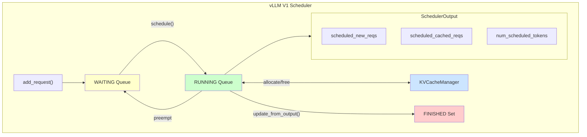
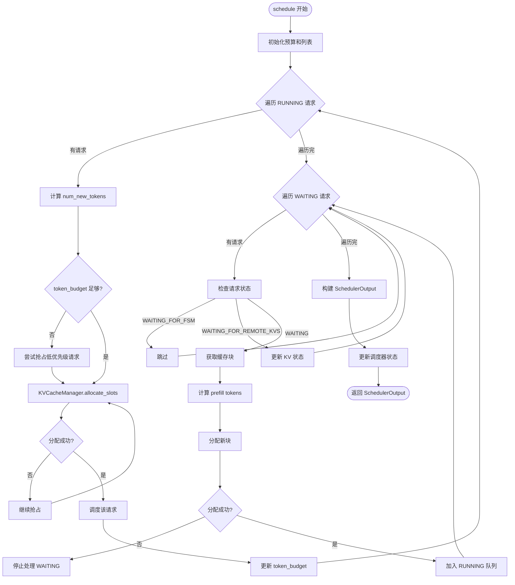
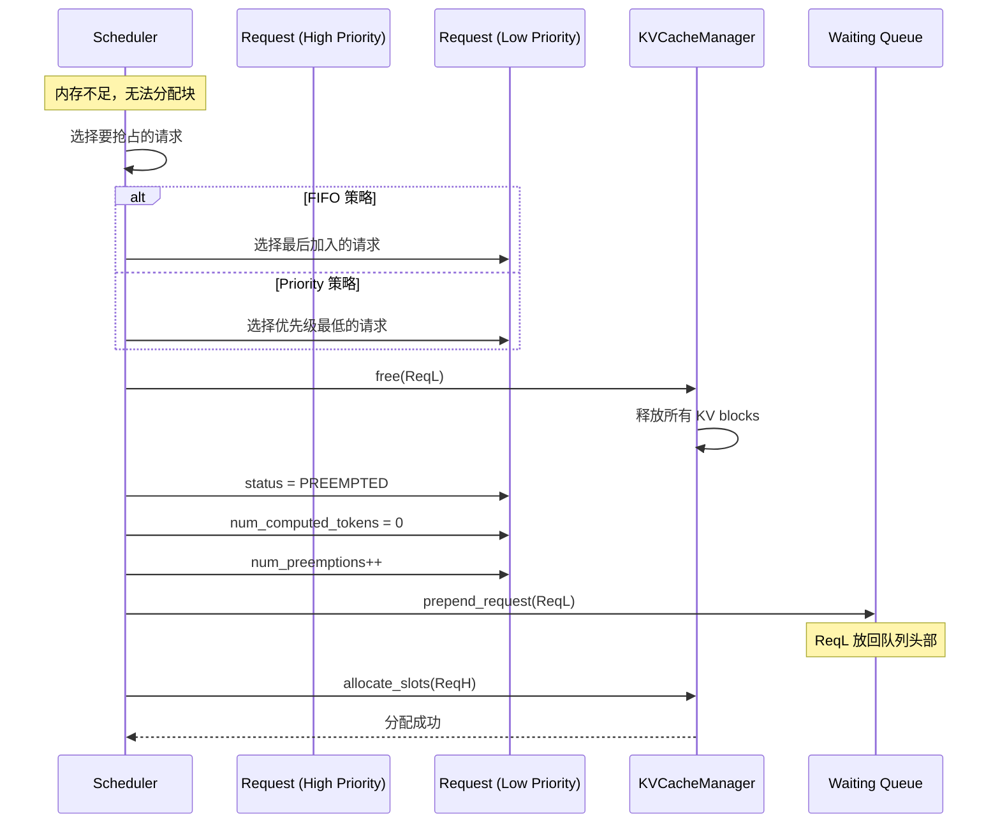
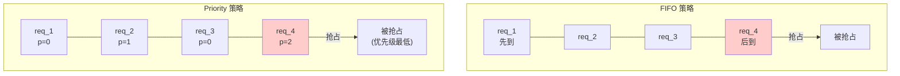
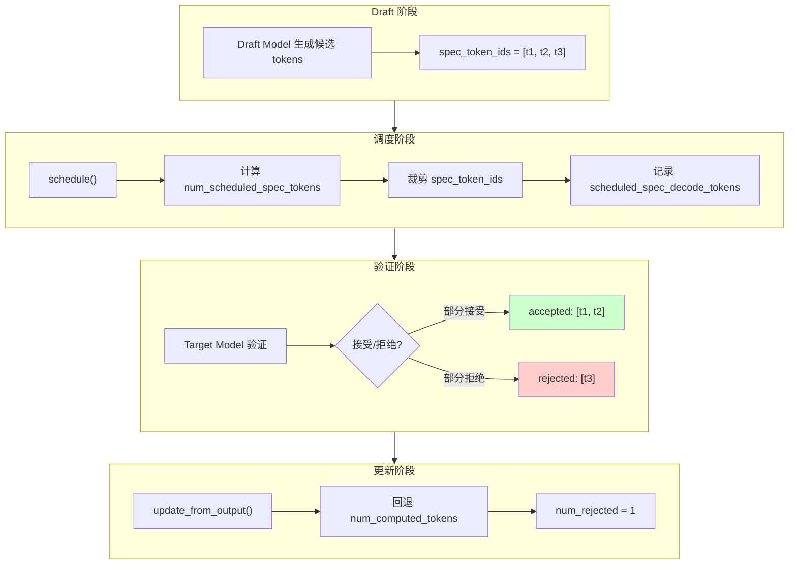

# 03 - 调度器核心设计

> **学习目标**: 深入理解 vLLM V1 调度器的核心设计与实现
>
> **关键文件**:
> - `vllm/v1/core/sched/scheduler.py` - Scheduler 类核心实现
> - `vllm/v1/core/sched/interface.py` - SchedulerInterface 抽象接口
> - `vllm/v1/core/sched/output.py` - SchedulerOutput 数据结构

---

## 调度器总览



---

## 1. Scheduler 类初始化

### 1.1 核心配置

```python
# vllm/v1/core/sched/scheduler.py:63-160

class Scheduler(SchedulerInterface):
    def __init__(
        self,
        vllm_config: VllmConfig,
        kv_cache_config: KVCacheConfig,
        structured_output_manager: StructuredOutputManager,
        block_size: int,
        mm_registry: MultiModalRegistry = MULTIMODAL_REGISTRY,
        include_finished_set: bool = False,
        log_stats: bool = False,
    ) -> None:
        # ═══════════════════════════════════════════════════════════════════
        # 基础配置
        # ═══════════════════════════════════════════════════════════════════
        self.vllm_config = vllm_config
        self.scheduler_config = vllm_config.scheduler_config
        self.cache_config = vllm_config.cache_config
        self.lora_config = vllm_config.lora_config
        self.kv_cache_config = kv_cache_config

        # ═══════════════════════════════════════════════════════════════════
        # 调度约束
        # ═══════════════════════════════════════════════════════════════════
        self.max_num_running_reqs = self.scheduler_config.max_num_seqs
        # 最大并发请求数
        
        self.max_num_scheduled_tokens = self.scheduler_config.max_num_batched_tokens
        # 单次调度最大 token 数
        
        self.max_model_len = vllm_config.model_config.max_model_len
        # 模型最大序列长度

        # ═══════════════════════════════════════════════════════════════════
        # 请求队列
        # ═══════════════════════════════════════════════════════════════════
        self.requests: dict[str, Request] = {}      # req_id -> Request
        
        # 调度策略: FIFO 或 PRIORITY
        self.policy = SchedulingPolicy(self.scheduler_config.policy)
        
        # 等待队列 (优先队列)
        self.waiting = create_request_queue(self.policy)
        
        # 运行队列 (列表)
        self.running: list[Request] = []
        
        # 已完成请求 ID 集合 (用于通知 Worker 清理缓存)
        self.finished_req_ids: set[str] = set()
```

### 1.2 KV Cache Manager 创建

```python
# vllm/v1/core/sched/scheduler.py:216-228

# 创建 KV Cache Manager
self.kv_cache_manager = KVCacheManager(
    kv_cache_config=kv_cache_config,
    max_model_len=self.max_model_len,
    enable_caching=self.cache_config.enable_prefix_caching,
    use_eagle=self.use_eagle,
    log_stats=self.log_stats,
    enable_kv_cache_events=self.enable_kv_cache_events,
    dcp_world_size=self.dcp_world_size,
    pcp_world_size=self.pcp_world_size,
    hash_block_size=self.block_size,
    metrics_collector=self.kv_metrics_collector,
)
```

### 1.3 KV Connector (P/D 分离)

```python
# vllm/v1/core/sched/scheduler.py:109-129

# 为 P/D 分离创建 KV Connector
self.connector = None
if self.vllm_config.kv_transfer_config is not None:
    self.connector = KVConnectorFactory.create_connector(
        config=self.vllm_config,
        role=KVConnectorRole.SCHEDULER,  # 调度器角色
        kv_cache_config=self.kv_cache_config,
    )
    # KV 加载失败策略: "recompute" 或 "fail"
    kv_load_failure_policy = (
        self.vllm_config.kv_transfer_config.kv_load_failure_policy
    )
    self.recompute_kv_load_failures = kv_load_failure_policy == "recompute"
```

---

## 2. schedule() - 核心调度方法

### 2.1 调度算法概述

```python
# vllm/v1/core/sched/scheduler.py:313-324

def schedule(self) -> SchedulerOutput:
    # NOTE(woosuk) on the scheduling algorithm:
    # There's no "decoding phase" nor "prefill phase" in the scheduler.
    # Each request just has the num_computed_tokens and
    # num_tokens_with_spec. num_tokens_with_spec =
    # len(prompt_token_ids) + len(output_token_ids) + len(spec_token_ids).
    # 
    # At each step, the scheduler tries to assign tokens to the requests
    # so that each request's num_computed_tokens can catch up its
    # num_tokens_with_spec. This is general enough to cover
    # chunked prefills, prefix caching, speculative decoding,
    # and the "jump decoding" optimization in the future.
```

**核心思想**:
- 没有显式的 "prefill 阶段" 和 "decode 阶段"
- 统一使用 `num_computed_tokens` 追赶 `num_tokens_with_spec`
- 自然支持 chunked prefill、prefix caching、投机采样

### 2.2 调度流程图



### 2.3 调度 RUNNING 请求

```python
# vllm/v1/core/sched/scheduler.py:342-520

# First, schedule the RUNNING requests.
req_index = 0
while req_index < len(self.running) and token_budget > 0:
    request = self.running[req_index]

    # 计算需要调度的 token 数
    num_new_tokens = (
        request.num_tokens_with_spec           # 目标 token 数
        + request.num_output_placeholders      # PP 的占位符
        - request.num_computed_tokens          # 已计算的 token 数
    )
    
    # 应用 long_prefill 阈值 (chunked prefill)
    if 0 < self.scheduler_config.long_prefill_token_threshold < num_new_tokens:
        num_new_tokens = self.scheduler_config.long_prefill_token_threshold
    
    # 限制在 token_budget 内
    num_new_tokens = min(num_new_tokens, token_budget)
    
    # 确保不超过 max_model_len
    num_new_tokens = min(
        num_new_tokens, self.max_model_len - 1 - request.num_computed_tokens
    )

    # 调度 encoder 输入 (多模态)
    if request.has_encoder_inputs:
        (
            encoder_inputs_to_schedule,
            num_new_tokens,
            new_encoder_compute_budget,
            external_load_encoder_input,
        ) = self._try_schedule_encoder_inputs(
            request,
            request.num_computed_tokens,
            num_new_tokens,
            encoder_compute_budget,
        )

    # 为请求分配 KV cache 块
    while True:
        new_blocks = self.kv_cache_manager.allocate_slots(
            request,
            num_new_tokens,
            num_lookahead_tokens=self.num_lookahead_tokens,
        )

        if new_blocks is not None:
            break  # 分配成功

        # 分配失败，需要抢占低优先级请求
        if self.policy == SchedulingPolicy.PRIORITY:
            preempted_req = max(
                self.running,
                key=lambda r: (r.priority, r.arrival_time),  # 优先级高的后抢占
            )
        else:
            preempted_req = self.running.pop()  # FIFO: 抢占最后加入的
        
        self._preempt_request(preempted_req, scheduled_timestamp)
        preempted_reqs.append(preempted_req)
```

### 2.4 调度 WAITING 请求

```python
# vllm/v1/core/sched/scheduler.py:536-791

# Next, schedule the WAITING requests.
if not preempted_reqs:  # 只有没有抢占时才调度新请求
    while self.waiting and token_budget > 0:
        if len(self.running) == self.max_num_running_reqs:
            break  # 达到最大并发数

        request = self.waiting.peek_request()

        # ═══════════════════════════════════════════════════════════════
        # 检查特殊状态
        # ═══════════════════════════════════════════════════════════════
        
        # 等待远程 KV 传输
        if request.status == RequestStatus.WAITING_FOR_REMOTE_KVS:
            is_ready = self._update_waiting_for_remote_kv(request)
            if not is_ready:
                self.waiting.pop_request()
                skipped_waiting_requests.prepend_request(request)
                continue

        # 等待 FSM 编译 (结构化输出)
        if request.status == RequestStatus.WAITING_FOR_FSM:
            if request.structured_output_request.grammar:
                request.status = RequestStatus.WAITING
            else:
                self.waiting.pop_request()
                skipped_waiting_requests.prepend_request(request)
                continue

        # ═══════════════════════════════════════════════════════════════
        # 获取已缓存的 token
        # ═══════════════════════════════════════════════════════════════
        
        if request.num_computed_tokens == 0:
            # 获取本地缓存的块
            new_computed_blocks, num_new_local_computed_tokens = (
                self.kv_cache_manager.get_computed_blocks(request)
            )

            # 获取外部缓存的 token (P/D 分离)
            if self.connector is not None:
                ext_tokens, load_kv_async = (
                    self.connector.get_num_new_matched_tokens(
                        request, num_new_local_computed_tokens
                    )
                )
                request.num_external_computed_tokens = ext_tokens

            num_computed_tokens = (
                num_new_local_computed_tokens + num_external_computed_tokens
            )

        # ═══════════════════════════════════════════════════════════════
        # 计算需要调度的 token 数
        # ═══════════════════════════════════════════════════════════════
        
        num_new_tokens = request.num_tokens - num_computed_tokens
        
        # 应用 chunked prefill 阈值
        threshold = self.scheduler_config.long_prefill_token_threshold
        if 0 < threshold < num_new_tokens:
            num_new_tokens = threshold
        
        num_new_tokens = min(num_new_tokens, token_budget)

        # ═══════════════════════════════════════════════════════════════
        # 分配 KV cache 块
        # ═══════════════════════════════════════════════════════════════
        
        new_blocks = self.kv_cache_manager.allocate_slots(
            request,
            num_new_tokens,
            num_new_computed_tokens=num_new_local_computed_tokens,
            new_computed_blocks=new_computed_blocks,
            num_lookahead_tokens=effective_lookahead_tokens,
            num_external_computed_tokens=num_external_computed_tokens,
        )

        if new_blocks is None:
            break  # 无法分配，停止调度新请求

        # ═══════════════════════════════════════════════════════════════
        # 成功调度
        # ═══════════════════════════════════════════════════════════════
        
        request = self.waiting.pop_request()
        self.running.append(request)
        request.status = RequestStatus.RUNNING
        request.num_computed_tokens = num_computed_tokens
        
        # 记录 prefix cache 命中
        if request.num_cached_tokens < 0:
            request.num_cached_tokens = num_computed_tokens

        req_to_new_blocks[request.request_id] = new_blocks
        num_scheduled_tokens[request.request_id] = num_new_tokens
        token_budget -= num_new_tokens
```

### 2.5 构建 SchedulerOutput

```python
# vllm/v1/core/sched/scheduler.py:821-889

# 构建 NewRequestData (首次调度的请求)
new_reqs_data = [
    NewRequestData.from_request(
        req,
        req_to_new_blocks[req.request_id].get_block_ids(),
    )
    for req in scheduled_new_reqs
]

# 构建 CachedRequestData (非首次调度的请求)
cached_reqs_data = self._make_cached_request_data(
    scheduled_running_reqs,
    scheduled_resumed_reqs,
    num_scheduled_tokens,
    scheduled_spec_decode_tokens,
    req_to_new_blocks,
)

# 获取公共前缀块数 (用于 cascade attention)
num_common_prefix_blocks = [0] * len(self.kv_cache_config.kv_cache_groups)
if self.running:
    num_common_prefix_blocks = (
        self.kv_cache_manager.get_num_common_prefix_blocks(
            any_request.request_id
        )
    )

# 构建最终输出
scheduler_output = SchedulerOutput(
    scheduled_new_reqs=new_reqs_data,
    scheduled_cached_reqs=cached_reqs_data,
    num_scheduled_tokens=num_scheduled_tokens,
    total_num_scheduled_tokens=total_num_scheduled_tokens,
    scheduled_spec_decode_tokens=scheduled_spec_decode_tokens,
    scheduled_encoder_inputs=scheduled_encoder_inputs,
    num_common_prefix_blocks=num_common_prefix_blocks,
    preempted_req_ids={req.request_id for req in preempted_reqs},
    finished_req_ids=self.finished_req_ids,
    free_encoder_mm_hashes=self.encoder_cache_manager.get_freed_mm_hashes(),
)

# P/D 分离: 构建 KV Connector 元数据
if self.connector is not None:
    meta = self.connector.build_connector_meta(scheduler_output)
    scheduler_output.kv_connector_metadata = meta
```

---

## 3. 抢占机制 (_preempt_request)

### 3.1 抢占流程



```python
# vllm/v1/core/sched/scheduler.py:892-911

def _preempt_request(self, request: Request, timestamp: float) -> None:
    """抢占请求并放回等待队列"""
    assert request.status == RequestStatus.RUNNING
    
    # 释放 KV cache 块
    self.kv_cache_manager.free(request)
    
    # 释放 encoder cache
    self.encoder_cache_manager.free(request)
    
    # 更新状态
    request.status = RequestStatus.PREEMPTED
    request.num_computed_tokens = 0      # 重置计算进度
    request.spec_token_ids.clear()       # 清除投机 token
    request.num_preemptions += 1         # 增加抢占计数
    
    if self.log_stats:
        request.record_event(EngineCoreEventType.PREEMPTED, timestamp)

    # 放回等待队列头部 (优先重新调度)
    self.waiting.prepend_request(request)
```

### 3.2 抢占策略



**抢占后处理**:
1. 释放该请求的所有 KV cache 块
2. 重置 `num_computed_tokens = 0` (需要重新计算)
3. 将请求放回 waiting 队列头部 (优先重新调度)

---

## 4. update_from_output() - 处理模型输出

### 4.1 核心流程

```python
# vllm/v1/core/sched/scheduler.py:1225-1473

def update_from_output(
    self,
    scheduler_output: SchedulerOutput,
    model_runner_output: ModelRunnerOutput,
) -> dict[int, EngineCoreOutputs]:
    """根据模型输出更新调度器状态"""
    
    sampled_token_ids = model_runner_output.sampled_token_ids
    num_scheduled_tokens = scheduler_output.num_scheduled_tokens
    
    outputs: dict[int, list[EngineCoreOutput]] = defaultdict(list)
    stopped_running_reqs: set[Request] = set()

    for req_id, num_tokens_scheduled in num_scheduled_tokens.items():
        request = self.requests.get(req_id)
        if request is None:
            continue  # 请求可能已被中止

        req_index = model_runner_output.req_id_to_index[req_id]
        generated_token_ids = sampled_token_ids[req_index]

        # ═══════════════════════════════════════════════════════════════
        # 处理投机采样
        # ═══════════════════════════════════════════════════════════════
        scheduled_spec_token_ids = (
            scheduler_output.scheduled_spec_decode_tokens.get(req_id)
        )
        if scheduled_spec_token_ids:
            num_draft_tokens = len(scheduled_spec_token_ids)
            num_accepted = len(generated_token_ids) - 1
            num_rejected = num_draft_tokens - num_accepted
            
            # 回退被拒绝的 token
            if request.num_computed_tokens > 0:
                request.num_computed_tokens -= num_rejected

        # ═══════════════════════════════════════════════════════════════
        # 更新请求状态
        # ═══════════════════════════════════════════════════════════════
        new_token_ids, stopped = self._update_request_with_output(
            request, generated_token_ids
        )

        if stopped:
            finished = self._handle_stopped_request(request)
            if finished:
                self._free_request(request)
            stopped_running_reqs.add(request)

        # ═══════════════════════════════════════════════════════════════
        # 构建输出
        # ═══════════════════════════════════════════════════════════════
        if new_token_ids or stopped:
            outputs[request.client_index].append(
                EngineCoreOutput(
                    request_id=req_id,
                    new_token_ids=new_token_ids,
                    finish_reason=request.get_finished_reason(),
                    # ... 其他字段
                )
            )

    # 从 running 队列移除已停止的请求
    if stopped_running_reqs:
        self.running = remove_all(self.running, stopped_running_reqs)

    return engine_core_outputs
```

### 4.2 停止检查

```python
# vllm/v1/core/sched/scheduler.py:1517-1533

def _update_request_with_output(
    self, request: Request, new_token_ids: list[int]
) -> tuple[list[int], bool]:
    """追加生成的 token 并检查停止条件"""
    stopped = False
    for num_new, output_token_id in enumerate(new_token_ids, 1):
        request.append_output_token_ids(output_token_id)

        # 检查停止条件
        stopped = check_stop(request, self.max_model_len)
        if stopped:
            del new_token_ids[num_new:]  # 裁剪多余的 token
            break
    return new_token_ids, stopped
```

---

## 5. 请求管理

### 5.1 添加请求

```python
# vllm/v1/core/sched/scheduler.py:1617-1637

def add_request(self, request: Request) -> None:
    existing = self.requests.get(request.request_id)
    if existing is not None:
        # 处理流式请求的后续输入
        update = StreamingUpdate.from_request(request)
        if existing.status != RequestStatus.WAITING_FOR_STREAMING_REQ:
            existing.streaming_queue.append(update)
        elif update is not None:
            self._update_request_as_session(existing, update)
        else:
            self.finish_requests(request.request_id, RequestStatus.FINISHED_ABORTED)
    else:
        # 新请求
        if request.resumable:
            request.streaming_queue = deque()
        self.waiting.add_request(request)
        self.requests[request.request_id] = request
        if self.log_stats:
            request.record_event(EngineCoreEventType.QUEUED)
```

### 5.2 完成请求

```python
# vllm/v1/core/sched/scheduler.py:1639-1681

def finish_requests(
    self, request_ids: str | Iterable[str], finished_status: RequestStatus
) -> None:
    """处理外部完成信号 (如用户取消)"""
    assert RequestStatus.is_finished(finished_status)
    
    running_requests_to_remove = set()
    waiting_requests_to_remove = []

    for req_id in request_ids:
        request = self.requests.get(req_id)
        if request is None or request.is_finished():
            continue

        if request.status == RequestStatus.RUNNING:
            running_requests_to_remove.add(request)
        else:
            waiting_requests_to_remove.append(request)

    # 批量移除
    if running_requests_to_remove:
        self.running = remove_all(self.running, running_requests_to_remove)
    if waiting_requests_to_remove:
        self.waiting.remove_requests(waiting_requests_to_remove)

    # 释放资源
    for request in valid_requests:
        request.status = finished_status
        self._free_request(request)
```

### 5.3 释放请求

```python
# vllm/v1/core/sched/scheduler.py:1683-1701

def _free_request(self, request: Request) -> dict[str, Any] | None:
    assert request.is_finished()

    # P/D 分离: 通知 connector
    delay_free_blocks, kv_xfer_params = self._connector_finished(request)
    
    # 释放 encoder cache
    self.encoder_cache_manager.free(request)
    
    # 记录已完成
    self.finished_req_ids.add(request.request_id)

    # 释放 KV cache 块 (除非需要延迟释放用于 KV 传输)
    if not delay_free_blocks:
        self._free_blocks(request)

    return kv_xfer_params

def _free_blocks(self, request: Request):
    self.kv_cache_manager.free(request)
    del self.requests[request.request_id]
```

---

## 6. 调度策略

### 6.1 FIFO 策略

```
FIFO (First In First Out):
- 先到先服务
- 请求按到达顺序处理
- 抢占时移除最后加入的请求

优点: 简单、公平
缺点: 长请求可能阻塞短请求
```

### 6.2 Priority 策略

```
Priority (优先级调度):
- 按优先级 + 到达时间排序
- 低优先级数值 = 高优先级
- 抢占时移除优先级最低的请求

优点: 支持请求分级
缺点: 低优先级可能饥饿
```

### 6.3 调度队列实现

```python
# vllm/v1/core/sched/request_queue.py

class SchedulingPolicy(enum.Enum):
    FIFO = "fifo"
    PRIORITY = "priority"

def create_request_queue(policy: SchedulingPolicy) -> RequestQueue:
    if policy == SchedulingPolicy.FIFO:
        return FIFORequestQueue()
    elif policy == SchedulingPolicy.PRIORITY:
        return PriorityRequestQueue()
```

---

## 7. Chunked Prefill 支持

### 7.1 原理

**传统 Prefill vs Chunked Prefill 对比**:

```mermaid
gantt
    title 传统 Prefill (阻塞其他请求)
    dateFormat X
    axisFormat %s
    
    section Request A
    Prefill 10000 tokens    :a1, 0, 100
    Decode token 1          :a2, after a1, 10
    Decode token 2          :a3, after a2, 10
    
    section Request B
    等待中                   :b1, 0, 100
    Prefill                 :b2, after a1, 20
    Decode                  :b3, after b2, 10
```

```mermaid
gantt
    title Chunked Prefill (交替执行)
    dateFormat X
    axisFormat %s
    
    section Request A
    Prefill chunk 1 (2048)  :a1, 0, 20
    Prefill chunk 2 (2048)  :a2, 40, 20
    Prefill chunk 3 (2048)  :a3, 80, 20
    Decode                  :a4, 100, 10
    
    section Request B
    Prefill                 :b1, 20, 20
    Decode token 1          :b2, 60, 10
    Decode token 2          :b3, 110, 10
```





**优势**:
- 长 prefill 不阻塞短请求
- 降低首 token 延迟 (TTFT)
- 提高 GPU 利用率

### 7.2 实现

```python
# 在 schedule() 中

# 应用 long_prefill 阈值
threshold = self.scheduler_config.long_prefill_token_threshold
if 0 < threshold < num_new_tokens:
    num_new_tokens = threshold

# 默认阈值通常为 max_num_batched_tokens (如 2048)
```

---

## 8. 投机采样支持

### 8.1 投机采样调度流程



### 8.2 调度投机 token

```python
# vllm/v1/core/sched/scheduler.py:489-505

# Speculative decode related.
if request.spec_token_ids:
    num_scheduled_spec_tokens = (
        num_new_tokens
        + request.num_computed_tokens
        - request.num_tokens
        - request.num_output_placeholders
    )
    if num_scheduled_spec_tokens > 0:
        # 裁剪 spec_token_ids
        del request.spec_token_ids[num_scheduled_spec_tokens:]
        scheduled_spec_decode_tokens[request.request_id] = (
            request.spec_token_ids
        )
    request.spec_token_ids = []  # 下一步会重新生成
```

### 8.2 处理拒绝的 token

```python
# 在 update_from_output() 中

if scheduled_spec_token_ids:
    num_draft_tokens = len(scheduled_spec_token_ids)
    num_accepted = len(generated_token_ids) - 1
    num_rejected = num_draft_tokens - num_accepted
    
    # 回退 num_computed_tokens
    if request.num_computed_tokens > 0:
        request.num_computed_tokens -= num_rejected
```

---

## 9. 与 Qwen3-VL 的集成

### 9.1 多模态调度

```python
# 调度 encoder 输入 (如 ViT 处理图像)

if request.has_encoder_inputs:
    (
        encoder_inputs_to_schedule,  # 需要处理的 encoder 输入索引
        num_new_tokens,              # 可能被调整的 decoder token 数
        new_encoder_compute_budget,  # 更新后的 encoder 预算
        external_load_encoder_input, # 从外部加载的 encoder 输入
    ) = self._try_schedule_encoder_inputs(
        request,
        num_computed_tokens,
        num_new_tokens,
        encoder_compute_budget,
    )
```

### 9.2 Encoder 输入调度逻辑

```python
# vllm/v1/core/sched/scheduler.py:1043-1199

def _try_schedule_encoder_inputs(
    self,
    request: Request,
    num_computed_tokens: int,
    num_new_tokens: int,
    encoder_compute_budget: int,
) -> tuple[list[int], int, int, list[int]]:
    """
    确定当前步骤需要调度哪些 encoder 输入
    
    Encoder 输入会被调度如果:
    - 其输出 token 与当前计算范围重叠
    - 尚未计算并缓存
    - 有足够的 encoder token 预算
    - encoder cache 有空间存储
    """
    encoder_inputs_to_schedule: list[int] = []
    
    for i, mm_feature in enumerate(request.mm_features):
        start_pos = mm_feature.mm_position.offset
        num_encoder_tokens = mm_feature.mm_position.length
        
        # 检查是否在当前计算范围内
        if start_pos >= num_computed_tokens + num_new_tokens:
            break  # 不在范围内
            
        if start_pos + num_encoder_tokens <= num_computed_tokens:
            continue  # 已经处理过
            
        # 检查缓存
        if self.encoder_cache_manager.check_and_update_cache(request, i):
            continue  # 已缓存
            
        # 检查预算
        if not self.encoder_cache_manager.can_allocate(
            request, i, encoder_compute_budget
        ):
            # 预算不足，调整 num_new_tokens
            num_new_tokens = start_pos - num_computed_tokens
            break
            
        # 添加到调度列表
        encoder_inputs_to_schedule.append(i)
        encoder_compute_budget -= mm_feature.mm_position.get_num_embeds
    
    return encoder_inputs_to_schedule, num_new_tokens, encoder_compute_budget, []
```

---

## 10. 总结

### 核心设计要点

1. **统一的调度模型**: 没有显式的 prefill/decode 阶段区分
2. **增量通信**: 首次调度发送完整数据，后续只发送增量
3. **动态抢占**: 内存不足时抢占低优先级请求
4. **Chunked Prefill**: 长 prefill 分块处理，避免阻塞
5. **投机采样集成**: 自然支持投机 token 的调度和回退
6. **多模态支持**: encoder 输入与 decoder token 协同调度

### 关键方法速查

| 方法 | 功能 |
|-----|------|
| `schedule()` | 核心调度，返回 SchedulerOutput |
| `update_from_output()` | 处理模型输出，更新状态 |
| `add_request()` | 添加新请求到等待队列 |
| `finish_requests()` | 外部完成请求 (如用户取消) |
| `_preempt_request()` | 抢占请求，释放资源 |
| `_free_request()` | 释放已完成请求的资源 |
| `reset_prefix_cache()` | 重置前缀缓存 |

---

> **下一步**: [04-request-lifecycle.md](./04-request-lifecycle.md) - 请求生命周期
