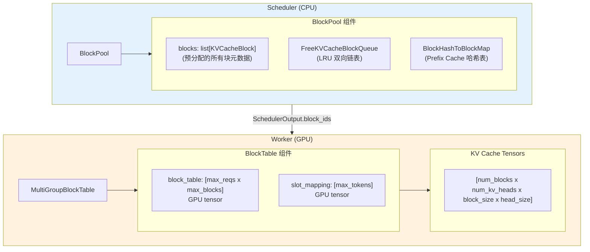
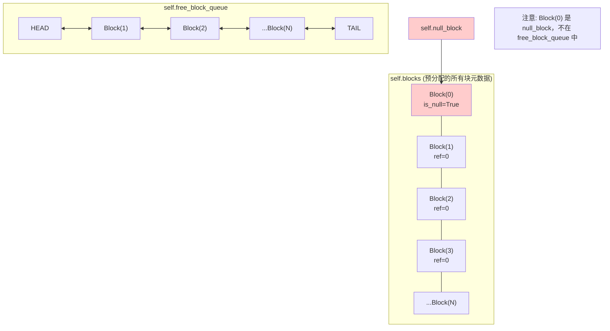
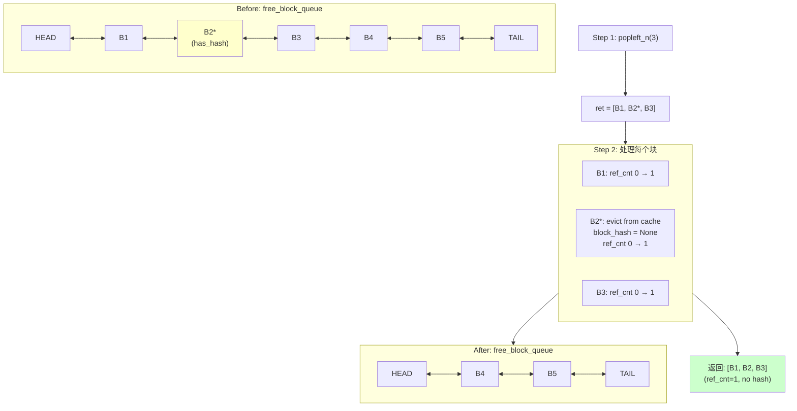
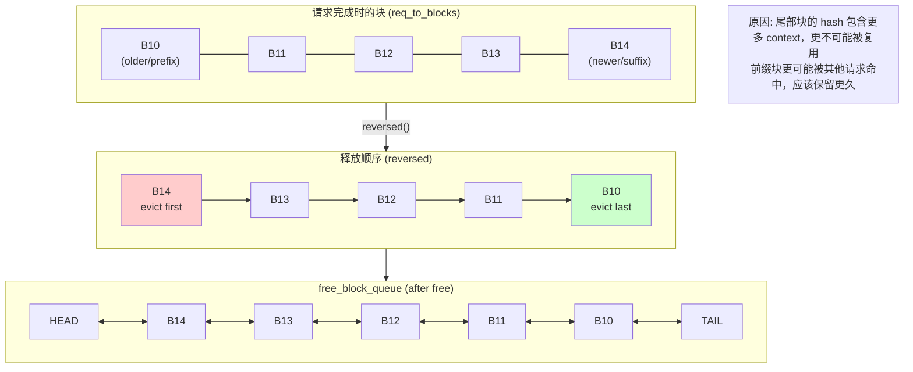
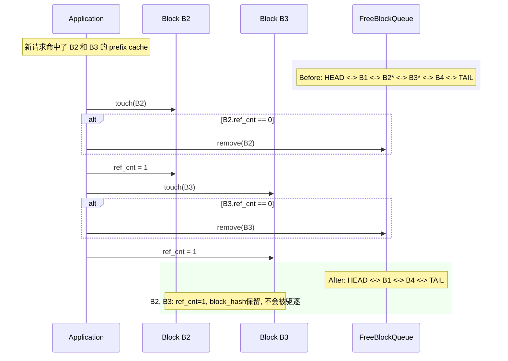
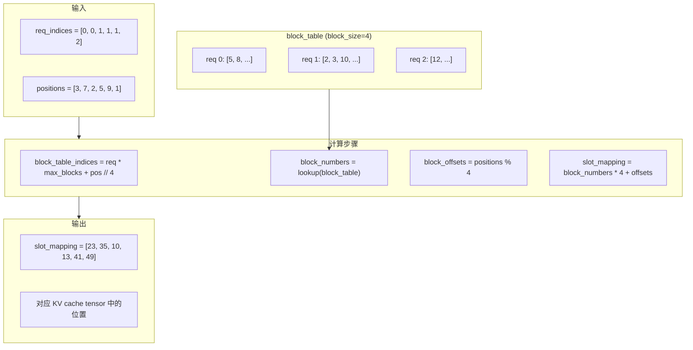
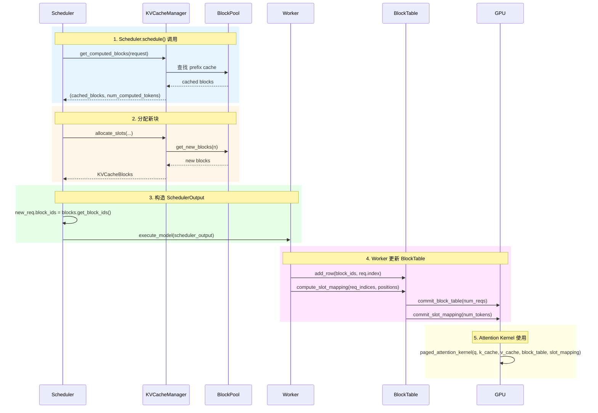
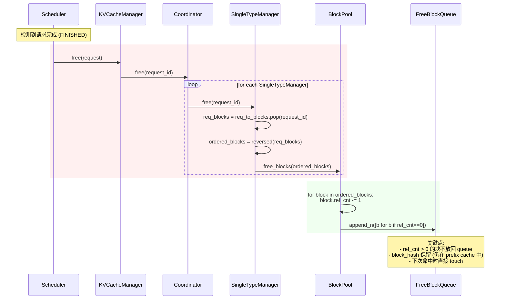

# 06 - Block 分配与回收

> 本笔记深入分析 vLLM V1 的 Block 分配机制，包括 BlockPool 的 LRU 策略、Prefix Caching 的 Hash 查找，以及 Worker 侧的 BlockTable 管理。

## 1. 整体架构



## 2. BlockPool - 块池核心实现

### 2.1 初始化

```python
# vllm/v1/core/block_pool.py:128-180

class BlockPool:
    """BlockPool that manages KVCacheBlocks.
    
    核心职责:
    1. 管理所有 KVCacheBlock 元数据
    2. 提供块分配、释放接口
    3. 实现 LRU 驱逐策略
    4. 支持 Prefix Caching 的哈希查找
    """

    def __init__(
        self,
        num_gpu_blocks: int,       # GPU 上的总块数
        enable_caching: bool,       # 是否启用 prefix caching
        hash_block_size: int,       # 用于计算 hash 的块大小
        enable_kv_cache_events: bool = False,  # P/D 分离事件
        metrics_collector: KVCacheMetricsCollector | None = None,
    ):
        assert isinstance(num_gpu_blocks, int) and num_gpu_blocks > 0
        self.num_gpu_blocks = num_gpu_blocks
        self.enable_caching = enable_caching
        self.hash_block_size = hash_block_size
        
        # 预分配所有块的元数据对象
        # 注意: 这里只分配 Python 对象，GPU 内存在 Worker 初始化时分配
        self.blocks: list[KVCacheBlock] = [
            KVCacheBlock(idx) for idx in range(num_gpu_blocks)
        ]
        
        # Free block queue - 实现 LRU 驱逐
        self.free_block_queue = FreeKVCacheBlockQueue(self.blocks)

        # Prefix cache 哈希表
        self.cached_block_hash_to_block: BlockHashToBlockMap = BlockHashToBlockMap()

        # Null block - block_id=0，用于占位
        # 对于 Sliding Window 等场景，窗口外的块用 null_block 占位
        self.null_block = self.free_block_queue.popleft()
        self.null_block.is_null = True
```

**内存布局:**



### 2.2 块分配流程

```python
# vllm/v1/core/block_pool.py:300-330

def get_new_blocks(self, num_blocks: int) -> list[KVCacheBlock]:
    """Get new blocks from the free block pool.
    
    分配流程:
    1. 从 free_block_queue 头部取出块 (LRU 最老的)
    2. 如果块有 hash (被缓存)，需要驱逐
    3. 增加引用计数
    
    Args:
        num_blocks: 需要分配的块数
        
    Returns:
        分配的块列表
        
    Raises:
        ValueError: 如果没有足够的空闲块
    """
    if num_blocks > self.get_num_free_blocks():
        raise ValueError(f"Cannot get {num_blocks} free blocks from the pool")

    # 从 LRU 队列头部批量取块 - O(num_blocks)
    ret: list[KVCacheBlock] = self.free_block_queue.popleft_n(num_blocks)

    if self.enable_caching:
        for block in ret:
            # 如果块有 hash，从缓存中驱逐
            self._maybe_evict_cached_block(block)
            assert block.ref_cnt == 0
            block.ref_cnt += 1
            if self.metrics_collector:
                self.metrics_collector.on_block_allocated(block)
    else:
        for block in ret:
            assert block.ref_cnt == 0
            block.ref_cnt += 1
            if self.metrics_collector:
                self.metrics_collector.on_block_allocated(block)
    
    return ret
```

**分配流程图:**



### 2.3 块释放流程

```python
# vllm/v1/core/block_pool.py:389-403

def free_blocks(self, ordered_blocks: Iterable[KVCacheBlock]) -> None:
    """Free a list of blocks. The blocks should be ordered by their
    eviction priority, where the first block will be evicted first.
    
    释放流程:
    1. 减少所有块的引用计数
    2. 将 ref_cnt == 0 的块放回 free queue 尾部
    
    重要: ordered_blocks 的顺序决定了驱逐优先级
    - 在 SingleTypeKVCacheManager.free() 中，块是逆序传入的
    - 这样尾部块 (hash tokens 多) 会更早被驱逐
    """
    # 物化迭代器以支持多次遍历
    blocks_list = list(ordered_blocks)
    
    for block in blocks_list:
        block.ref_cnt -= 1
    
    # 只有 ref_cnt == 0 且不是 null_block 的块才放回 free queue
    self.free_block_queue.append_n(
        [block for block in blocks_list if block.ref_cnt == 0 and not block.is_null]
    )
```

**释放与驱逐顺序:**



### 2.4 Touch - 增加引用计数

```python
# vllm/v1/core/block_pool.py:372-387

def touch(self, blocks: Sequence[KVCacheBlock]) -> None:
    """Touch a block increases its reference count by 1, and may remove
    the block from the free queue.
    
    使用场景:
    1. Prefix cache 命中时，需要 touch 命中的块
    2. 防止被命中的块被驱逐
    
    流程:
    1. 如果块在 free queue 中 (ref_cnt=0)，从 free queue 移除
    2. 增加引用计数
    """
    for block in blocks:
        # ref_cnt=0 意味着这个块在 free list 中 (驱逐候选)
        if block.ref_cnt == 0 and not block.is_null:
            # O(1) 从链表中间移除
            self.free_block_queue.remove(block)
        block.ref_cnt += 1
        if self.metrics_collector:
            self.metrics_collector.on_block_accessed(block)
```

**Touch 操作示意:**



### 2.5 缓存完整块

```python
# vllm/v1/core/block_pool.py:209-298

def cache_full_blocks(
    self,
    request: Request,
    blocks: list[KVCacheBlock],
    num_cached_blocks: int,      # 已经缓存的块数
    num_full_blocks: int,        # 需要缓存到的块数
    block_size: int,
    kv_cache_group_id: int,
) -> None:
    """Cache a list of full blocks for prefix caching.
    
    当块填满时调用，将块加入 prefix cache 哈希表。
    
    流程:
    1. 获取需要缓存的新块
    2. 为每个块设置 block_hash
    3. 将块加入 cached_block_hash_to_block
    """
    if num_cached_blocks >= num_full_blocks:
        return
    
    new_full_blocks = blocks[num_cached_blocks:num_full_blocks]
    
    # 处理不同 block_size 的情况 (hybrid models)
    if block_size == self.hash_block_size:
        block_hashes = request.block_hashes
    else:
        # block_size 是 hash_block_size 的倍数
        block_hashes = BlockHashListWithBlockSize(
            request.block_hashes, self.hash_block_size, block_size
        )

    new_block_hashes = block_hashes[num_cached_blocks:]
    
    for i, blk in enumerate(new_full_blocks):
        # 跳过 null blocks
        if blk.is_null:
            continue
        
        assert blk.block_hash is None
        block_hash = new_block_hashes[i]

        # 设置块的 hash 并加入缓存
        block_hash_with_group_id = make_block_hash_with_group_id(
            block_hash, kv_cache_group_id
        )
        blk.block_hash = block_hash_with_group_id
        self.cached_block_hash_to_block.insert(block_hash_with_group_id, blk)
```

## 3. FreeKVCacheBlockQueue - LRU 双向链表

### 3.1 设计动机

```python
# vllm/v1/core/kv_cache_utils.py:156-176

class FreeKVCacheBlockQueue:
    """This class organizes a list of KVCacheBlock objects to a doubly linked
    list of free blocks.
    
    为什么不用 Python deque?
    1. deque 不支持 O(1) 时间从中间删除
    2. touch 操作需要从链表中间移除块 (当 cache hit 时)
    
    为什么不用 Python 对象分配?
    1. 减少 GC 开销
    2. 直接操作 KVCacheBlock 的 prev_free_block/next_free_block 属性
    
    驱逐顺序:
    1. LRU - 最久未使用的块在链表头部
    2. 同时分配的块按 hash tokens 数量排序 (尾部块先驱逐)
    """
```

### 3.2 初始化

```python
# vllm/v1/core/kv_cache_utils.py:178-206

def __init__(self, blocks: list[KVCacheBlock]) -> None:
    self.num_free_blocks = len(blocks)

    # 初始化连续块的双向链接
    for i in range(self.num_free_blocks):
        if i > 0:
            blocks[i].prev_free_block = blocks[i - 1]
        if i < self.num_free_blocks - 1:
            blocks[i].next_free_block = blocks[i + 1]

    # 创建假的头尾节点
    # 好处: 简化边界处理，避免 None 检查
    self.fake_free_list_head = KVCacheBlock(block_id=-1)
    self.fake_free_list_tail = KVCacheBlock(block_id=-1)
    
    if self.num_free_blocks > 0:
        # 连接假头到第一个块
        self.fake_free_list_head.next_free_block = blocks[0]
        blocks[0].prev_free_block = self.fake_free_list_head
        # 连接最后一个块到假尾
        self.fake_free_list_tail.prev_free_block = blocks[-1]
        blocks[-1].next_free_block = self.fake_free_list_tail
    else:
        # 空列表，直接连接假头和假尾
        self.fake_free_list_head.next_free_block = self.fake_free_list_tail
        self.fake_free_list_tail.prev_free_block = self.fake_free_list_head
```

### 3.3 核心操作

```python
# vllm/v1/core/kv_cache_utils.py:208-296

def popleft(self) -> KVCacheBlock:
    """Pop the first free block - O(1)
    
    从链表头部取块 (LRU 最老的块)
    """
    first_block = self.fake_free_list_head.next_free_block
    
    # 重新链接: HEAD <-> second_block
    self.fake_free_list_head.next_free_block = first_block.next_free_block
    first_block.next_free_block.prev_free_block = self.fake_free_list_head
    
    # 清理被移除块的指针
    first_block.prev_free_block = first_block.next_free_block = None
    
    self.num_free_blocks -= 1
    return first_block

def popleft_n(self, n: int) -> list[KVCacheBlock]:
    """Pop the first n free blocks - O(n)
    
    批量取块，比循环调用 popleft() 更高效
    """
    if n == 0:
        return []
    assert self.num_free_blocks >= n
    self.num_free_blocks -= n

    curr_block = self.fake_free_list_head.next_free_block
    ret = []
    for _ in range(n):
        ret.append(curr_block)
        last_block = curr_block
        curr_block = curr_block.next_free_block
        # 清理指针
        last_block.prev_free_block = None
        last_block.next_free_block = None

    # 重新链接: HEAD <-> curr_block
    self.fake_free_list_head.next_free_block = curr_block
    curr_block.prev_free_block = self.fake_free_list_head
    return ret

def remove(self, block: KVCacheBlock) -> None:
    """Remove a block from the middle - O(1)
    
    关键操作: 当块被 touch (cache hit) 时调用
    """
    # 直接修改前后节点的指针
    block.prev_free_block.next_free_block = block.next_free_block
    block.next_free_block.prev_free_block = block.prev_free_block
    
    # 清理被移除块的指针
    block.prev_free_block = block.next_free_block = None
    self.num_free_blocks -= 1

def append(self, block: KVCacheBlock) -> None:
    """Put a block back at the end - O(1)
    
    释放块时调用
    """
    last_block = self.fake_free_list_tail.prev_free_block
    
    # 插入: last_block <-> block <-> TAIL
    last_block.next_free_block = block
    block.prev_free_block = last_block
    block.next_free_block = self.fake_free_list_tail
    self.fake_free_list_tail.prev_free_block = block
    
    self.num_free_blocks += 1

def append_n(self, blocks: list[KVCacheBlock]) -> None:
    """Put a list of blocks back at the end - O(n)
    
    批量释放块时调用
    """
    if len(blocks) == 0:
        return

    last_block = self.fake_free_list_tail.prev_free_block
    
    # 批量链接
    for block in blocks:
        block.prev_free_block = last_block
        last_block.next_free_block = block
        last_block = block

    # 链接到假尾
    last_block.next_free_block = self.fake_free_list_tail
    self.fake_free_list_tail.prev_free_block = last_block

    self.num_free_blocks += len(blocks)
```

## 4. BlockHashToBlockMap - Prefix Cache 哈希表

### 4.1 设计

```python
# vllm/v1/core/block_pool.py:32-125

class BlockHashToBlockMap:
    """
    Cache of blocks that are used for prefix caching.
    
    设计要点:
    1. 大多数 hash 只映射到一个块
    2. 少数情况下可能有多个块 (如 GQA 不同组)
    3. 使用 Union 类型减少 GC 开销
    
    数据结构:
    - 单块: hash -> KVCacheBlock
    - 多块: hash -> dict[block_id, KVCacheBlock]
    
    注意: 不进行块去重
    - 原因: 保持 block_id 不变，使 block table 只追加
    """

    def __init__(self):
        self._cache: dict[
            BlockHashWithGroupId, KVCacheBlock | dict[int, KVCacheBlock]
        ] = {}

    def get_one_block(self, key: BlockHashWithGroupId) -> KVCacheBlock | None:
        """Gets any block with the given block hash key."""
        blocks = self._cache.get(key)
        if blocks is not None:
            if isinstance(blocks, KVCacheBlock):
                return blocks
            if isinstance(blocks, dict):
                return next(iter(blocks.values()))
        return None

    def insert(self, key: BlockHashWithGroupId, block: KVCacheBlock) -> None:
        """Inserts the KVCacheBlock to the cache"""
        blocks = self._cache.get(key)
        if blocks is None:
            # 第一个块，直接存储
            self._cache[key] = block
        elif isinstance(blocks, KVCacheBlock):
            # 第二个块，转换为 dict
            self._cache[key] = {blocks.block_id: blocks, block.block_id: block}
        elif isinstance(blocks, dict):
            # 已经是 dict，直接添加
            blocks[block.block_id] = block

    def pop(self, key: BlockHashWithGroupId, block_id: int) -> KVCacheBlock | None:
        """Checks if block_hash exists and pop block_id from the cache"""
        blocks = self._cache.pop(key, None)
        if blocks is None:
            return None
        
        if isinstance(blocks, KVCacheBlock):
            if blocks.block_id == block_id:
                return blocks
            # 不匹配，放回
            self._cache[key] = blocks
            return None
        
        if isinstance(blocks, dict):
            block = blocks.pop(block_id, None)
            if len(blocks) > 0:
                # 还有其他块，放回
                self._cache[key] = blocks
            return block
```

### 4.2 查找缓存块

```python
# vllm/v1/core/block_pool.py:182-207

def get_cached_block(
    self, block_hash: BlockHash, kv_cache_group_ids: list[int]
) -> list[KVCacheBlock] | None:
    """Get the cached block by the block hash for each group.
    
    对于 Hybrid 模型:
    - kv_cache_group_ids 包含多个 group id
    - 需要所有 group 都命中才算成功
    
    Args:
        block_hash: 块的 hash 值
        kv_cache_group_ids: KV cache group IDs
        
    Returns:
        所有 group 的缓存块列表，或 None (任一 miss)
    """
    cached_blocks = []
    for group_id in kv_cache_group_ids:
        # 组合 hash 和 group_id
        block_hash_with_group_id = make_block_hash_with_group_id(
            block_hash, group_id
        )
        block = self.cached_block_hash_to_block.get_one_block(
            block_hash_with_group_id
        )
        if not block:
            return None  # 任一 group miss 就返回 None
        cached_blocks.append(block)
    return cached_blocks
```

## 5. Worker 侧 BlockTable

### 5.1 BlockTable - 单组块表

```python
# vllm/v1/worker/block_table.py:16-98

class BlockTable:
    def __init__(
        self,
        block_size: int,                # 分配的块大小
        max_num_reqs: int,              # 最大并发请求数
        max_num_blocks_per_req: int,    # 每请求最大块数
        max_num_batched_tokens: int,    # 每批最大 token 数
        pin_memory: bool,               # 是否 pin memory
        device: torch.device,           # GPU 设备
        kernel_block_size: int,         # kernel 使用的块大小
        cp_kv_cache_interleave_size: int,  # Context Parallelism 交错大小
    ):
        """
        Worker 侧的块表管理
        
        维护两个关键结构:
        1. block_table: [max_reqs x max_blocks] 矩阵
           - 每行是一个请求的块 ID 列表
           - CPU 和 GPU 双缓冲
        2. slot_mapping: [max_tokens] 向量
           - 将 token position 映射到 KV cache slot
           - 用于 attention kernel
        """
        self.max_num_reqs = max_num_reqs
        self.max_num_batched_tokens = max_num_batched_tokens
        self.device = device

        # 处理 hybrid blocks (分配和 kernel 使用不同 block_size)
        if kernel_block_size == block_size:
            self.block_size = block_size
            self.blocks_per_kv_block = 1
            self.use_hybrid_blocks = False
        else:
            # 例如: 分配 32-token 块，kernel 用 16-token 块
            # 每个分配块对应 2 个 kernel 块
            self.block_size = kernel_block_size
            self.blocks_per_kv_block = block_size // kernel_block_size
            self.use_hybrid_blocks = True

        self.max_num_blocks_per_req = max_num_blocks_per_req * self.blocks_per_kv_block

        # 块表 - CPU/GPU 双缓冲
        self.block_table = self._make_buffer(
            self.max_num_reqs, self.max_num_blocks_per_req, dtype=torch.int32
        )
        # 每行的块数
        self.num_blocks_per_row = np.zeros(max_num_reqs, dtype=np.int32)

        # Slot mapping
        self.slot_mapping = self._make_buffer(
            self.max_num_batched_tokens, dtype=torch.int64
        )
```

### 5.2 行操作

```python
# vllm/v1/worker/block_table.py:100-131

def append_row(
    self,
    block_ids: list[int],
    row_idx: int,
) -> None:
    """追加块 ID 到指定行
    
    当请求分配新块时调用
    """
    if not block_ids:
        return

    # 处理 hybrid blocks
    if self.use_hybrid_blocks:
        block_ids = self.map_to_kernel_blocks(
            np.array(block_ids), self.blocks_per_kv_block, self._kernel_block_arange
        )

    num_blocks = len(block_ids)
    start = self.num_blocks_per_row[row_idx]
    self.num_blocks_per_row[row_idx] += num_blocks
    self.block_table.np[row_idx, start : start + num_blocks] = block_ids

def add_row(self, block_ids: list[int], row_idx: int) -> None:
    """设置指定行的块 ID (覆盖)"""
    self.num_blocks_per_row[row_idx] = 0
    self.append_row(block_ids, row_idx)

def move_row(self, src: int, tgt: int) -> None:
    """移动行 (用于请求重排)"""
    num_blocks = self.num_blocks_per_row[src]
    self.block_table.np[tgt, :num_blocks] = self.block_table.np[src, :num_blocks]
    self.num_blocks_per_row[tgt] = num_blocks

def swap_row(self, src: int, tgt: int) -> None:
    """交换两行 (用于请求重排)"""
    src_tgt, tgt_src = [src, tgt], [tgt, src]
    self.num_blocks_per_row[src_tgt] = self.num_blocks_per_row[tgt_src]
    self.block_table.np[src_tgt] = self.block_table.np[tgt_src]
```

### 5.3 Slot Mapping 计算

```python
# vllm/v1/worker/block_table.py:133-191

def compute_slot_mapping(
    self, req_indices: np.ndarray, positions: np.ndarray
) -> None:
    """计算 token position 到 KV cache slot 的映射
    
    Args:
        req_indices: 每个 token 对应的请求索引
        positions: 每个 token 在请求中的位置
        
    输出存储在 self.slot_mapping
    
    示例 (block_size=2, max_num_blocks_per_req=K):
    positions = [0, 1, 0, 1, 2, 3, 4, 0, 1, 2]
    req_indices = [0, 0, 1, 1, 1, 1, 1, 2, 2, 2]
    
    block_table:
    req 0: [B0, B1, ...]
    req 1: [B5, B6, B7, ...]
    req 2: [B10, B11, ...]
    
    计算:
    - token 0,1: req 0, pos 0,1 -> block 0, slot 0,1
    - token 2,3: req 1, pos 0,1 -> block 5, slot 0,1
    - token 4,5: req 1, pos 2,3 -> block 6, slot 0,1
    - ...
    """
    total_cp_world_size = self.pcp_world_size * self.dcp_world_size
    
    if total_cp_world_size > 1:
        # Context Parallelism: 使用虚拟块
        virtual_block_size = self.block_size * total_cp_world_size
        block_table_indices = (
            req_indices * self.max_num_blocks_per_req
            + positions // virtual_block_size
        )
        block_numbers = self.block_table.np.ravel()[block_table_indices]
        
        # 计算本地 tokens
        virtual_block_offsets = positions % virtual_block_size
        total_cp_rank = self.pcp_rank * self.dcp_world_size + self.dcp_rank
        mask = (
            virtual_block_offsets
            // self.cp_kv_cache_interleave_size
            % total_cp_world_size
            == total_cp_rank
        )
        
        # 计算本地偏移
        block_offsets = (
            virtual_block_offsets
            // (total_cp_world_size * self.cp_kv_cache_interleave_size)
            * self.cp_kv_cache_interleave_size
            + virtual_block_offsets % self.cp_kv_cache_interleave_size
        )
        
        slot_mapping = block_numbers * self.block_size + block_offsets
        # 非本地 token 设为 -1
        self.slot_mapping.np[:req_indices.shape[0]] = np.where(
            mask, slot_mapping, -1
        )
    else:
        # 标准情况
        block_table_indices = (
            req_indices * self.max_num_blocks_per_req + positions // self.block_size
        )
        block_numbers = self.block_table.np.ravel()[block_table_indices]
        block_offsets = positions % self.block_size
        
        np.add(
            block_numbers * self.block_size,
            block_offsets,
            out=self.slot_mapping.np[:req_indices.shape[0]],
        )
```

**Slot Mapping 计算示意:**



**计算示例**:
| token | req | pos | block_idx | block_num | offset | slot |
|-------|-----|-----|-----------|-----------|--------|------|
| 0 | 0 | 3 | 0 | 5 | 3 | 5×4+3=23 |
| 1 | 0 | 7 | 1 | 8 | 3 | 8×4+3=35 |
| 2 | 1 | 2 | 0 | 2 | 2 | 2×4+2=10 |
| 3 | 1 | 5 | 1 | 3 | 1 | 3×4+1=13 |
| 4 | 1 | 9 | 2 | 10 | 1 | 10×4+1=41 |
| 5 | 2 | 1 | 0 | 12 | 1 | 12×4+1=49 |

### 5.4 Hybrid Blocks 映射

```python
# vllm/v1/worker/block_table.py:203-231

@staticmethod
def map_to_kernel_blocks(
    kv_manager_block_ids: np.ndarray,
    blocks_per_kv_block: int,
    kernel_block_arange: np.ndarray,
) -> np.ndarray:
    """Convert kv_manager_block_id IDs to kernel block IDs.
    
    当分配块大小与 kernel 块大小不同时使用。
    
    Example:
        # 分配块: 32 tokens/块
        # Kernel 块: 16 tokens/块
        # blocks_per_kv_block = 2
        
        kv_manager_block_ids = [0, 1, 2]
        
        结果: [0, 1, 2, 3, 4, 5]
        
        映射关系:
        - 分配块 0 → kernel 块 [0, 1]
        - 分配块 1 → kernel 块 [2, 3]
        - 分配块 2 → kernel 块 [4, 5]
    """
    if blocks_per_kv_block == 1:
        return kv_manager_block_ids

    kernel_block_ids = (
        kv_manager_block_ids.reshape(-1, 1) * blocks_per_kv_block
        + kernel_block_arange
    )

    return kernel_block_ids.reshape(-1)
```

### 5.5 MultiGroupBlockTable - 多组块表

```python
# vllm/v1/worker/block_table.py:253-342

class MultiGroupBlockTable:
    """The BlockTables for each KV cache group.
    
    用于 Hybrid 模型 (如 Gemma3 = Full Attention + Sliding Window)
    每个 KV cache group 有独立的 BlockTable
    """

    def __init__(
        self,
        max_num_reqs: int,
        max_model_len: int,
        max_num_batched_tokens: int,
        pin_memory: bool,
        device: torch.device,
        block_sizes: list[int],           # 每组的块大小
        kernel_block_sizes: list[int],    # 每组的 kernel 块大小
        max_num_blocks: list[int] | None = None,
        cp_kv_cache_interleave_size: int = 1,
    ) -> None:
        # 为每个组创建 BlockTable
        self.block_tables = [
            BlockTable(
                block_size,
                max_num_reqs,
                max_num_blocks_per_req,
                max_num_batched_tokens,
                pin_memory,
                device,
                kernel_block_size,
                cp_kv_cache_interleave_size,
            )
            for block_size, kernel_block_size, max_num_blocks_per_req in zip(
                block_sizes, kernel_block_sizes, max_num_blocks
            )
        ]

    def append_row(self, block_ids: tuple[list[int], ...], row_idx: int) -> None:
        """追加块 ID 到所有组的指定行"""
        for i, block_table in enumerate(self.block_tables):
            block_table.append_row(block_ids[i], row_idx)

    def add_row(self, block_ids: tuple[list[int], ...], row_idx: int) -> None:
        """设置所有组的指定行"""
        for i, block_table in enumerate(self.block_tables):
            block_table.add_row(block_ids[i], row_idx)

    def compute_slot_mapping(
        self, req_indices: np.ndarray, positions: np.ndarray
    ) -> None:
        """为所有组计算 slot mapping"""
        for block_table in self.block_tables:
            block_table.compute_slot_mapping(req_indices, positions)

    def commit_block_table(self, num_reqs: int) -> None:
        """将所有组的 block table 从 CPU 拷贝到 GPU"""
        for block_table in self.block_tables:
            block_table.commit_block_table(num_reqs)

    def commit_slot_mapping(self, num_tokens: int) -> None:
        """将所有组的 slot mapping 从 CPU 拷贝到 GPU"""
        for block_table in self.block_tables:
            block_table.commit_slot_mapping(num_tokens)
```

## 6. 端到端流程

### 6.1 请求分配流程



### 6.2 请求释放流程



## 7. 性能优化

### 7.1 避免 GC 的设计

1. **预分配 KVCacheBlock**: 初始化时创建所有块对象
2. **复用 empty_kv_cache_blocks**: 避免每次创建空对象
3. **BlockHashToBlockMap Union 类型**: 单块直接存储，避免 dict 开销
4. **NumPy 数组操作**: BlockTable 使用 NumPy 批量操作

### 7.2 O(1) 操作

1. **LRU 驱逐**: 双向链表 popleft
2. **Cache Hit 移除**: 双向链表 remove
3. **Hash 查找**: dict O(1) 平均

### 7.3 批量操作

1. **popleft_n**: 批量分配块
2. **append_n**: 批量释放块
3. **commit_block_table**: 批量 CPU->GPU 拷贝

## 8. 总结

| 组件 | 位置 | 职责 |
|------|------|------|
| BlockPool | Scheduler (CPU) | 块元数据管理、LRU、Prefix Cache |
| FreeKVCacheBlockQueue | Scheduler (CPU) | LRU 双向链表 |
| BlockHashToBlockMap | Scheduler (CPU) | Prefix Cache 哈希表 |
| BlockTable | Worker (GPU) | 块表到 GPU tensor |
| MultiGroupBlockTable | Worker (GPU) | 多组块表管理 |

关键设计决策:
- **元数据与实际内存分离**: Scheduler 只操作元数据，GPU 内存在 Worker 管理
- **LRU + Prefix Cache**: 双重机制平衡内存利用和缓存命中
- **逆序释放**: 尾部块优先驱逐，保留前缀缓存
- **CPU/GPU 双缓冲**: 减少同步开销
