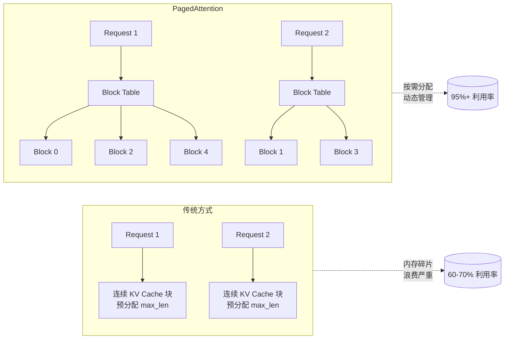
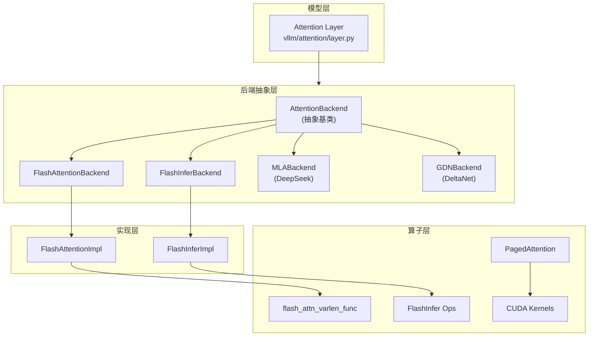
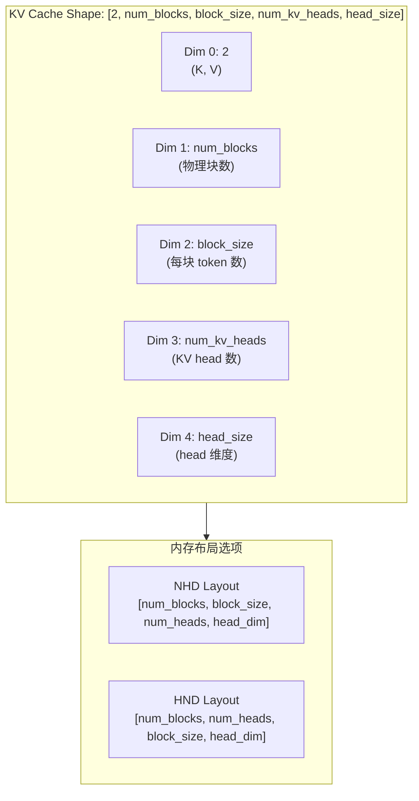
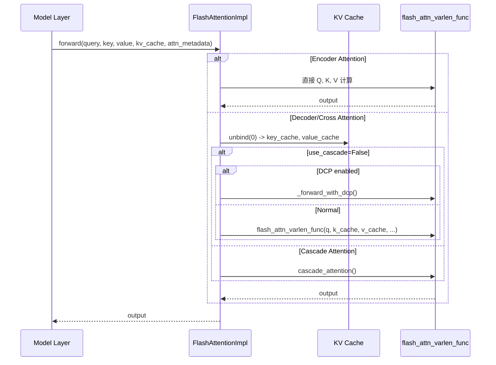
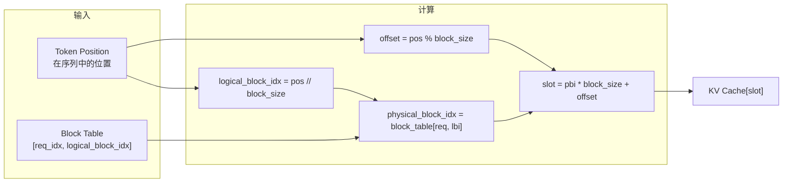
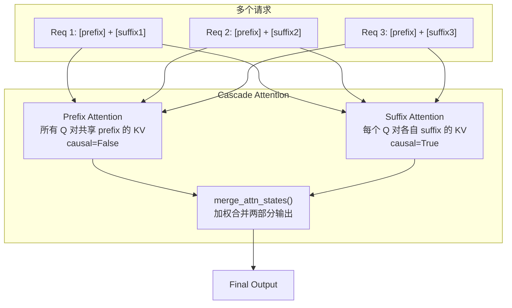
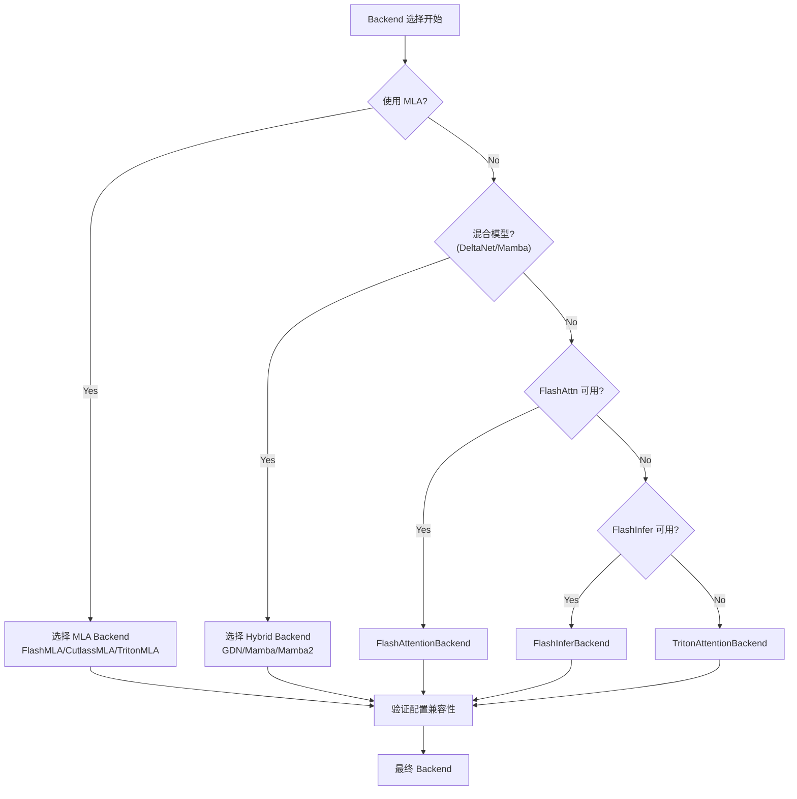
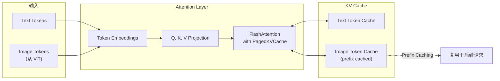
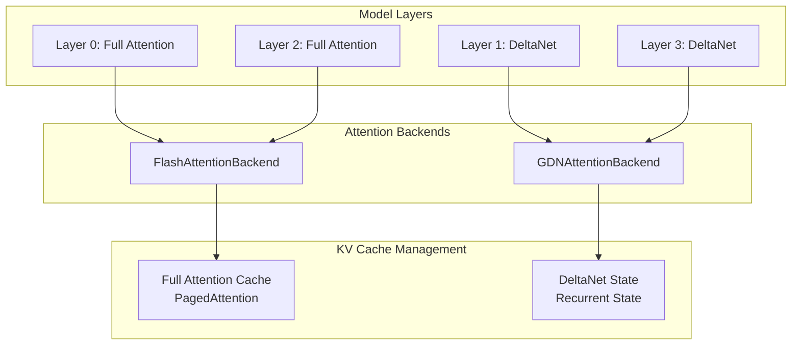
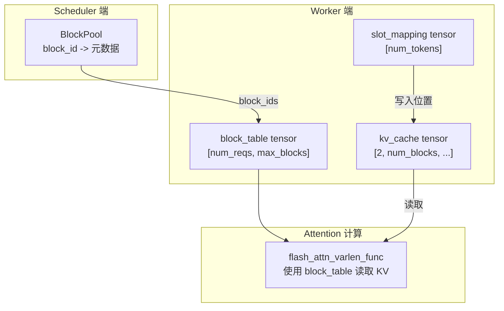

# 07 - PagedAttention 实现

> **前置阅读**: [05-kv-cache.md](./05-kv-cache.md), [06-block-manager.md](./06-block-manager.md)
>
> **核心文件**:
> - `vllm/v1/attention/backend.py` - AttentionBackend 抽象基类
> - `vllm/v1/attention/backends/flash_attn.py` - FlashAttention 实现
> - `vllm/v1/attention/ops/paged_attn.py` - PagedAttention Python 接口
> - `csrc/attention/attention_kernels.cuh` - CUDA Kernel 模板

---

## 1. 概述

PagedAttention 是 vLLM 的核心创新，它将 KV Cache 的内存管理从连续分配改为分页分配，类似操作系统的虚拟内存机制。

### 1.1 核心思想



### 1.2 V1 架构中的 Attention 层次



---

## 2. AttentionBackend 抽象层

### 2.1 核心类定义

```python
# vllm/v1/attention/backend.py:46
class AttentionBackend(ABC):
    """Abstract class for attention backends."""

    # 是否接受预分配的输出 buffer（用于 piecewise cudagraph）
    accept_output_buffer: bool = False
    
    # 支持的数据类型
    supported_dtypes: ClassVar[list[torch.dtype]] = [torch.float16, torch.bfloat16]
    supported_kv_cache_dtypes: ClassVar[list["CacheDType"]] = ["auto", "bfloat16"]

    # forward() 是否包含 KV cache 更新
    # FlashAttention 分离了这两个操作
    forward_includes_kv_cache_update: bool = True

    @staticmethod
    @abstractmethod
    def get_name() -> str:
        raise NotImplementedError

    @staticmethod
    @abstractmethod
    def get_impl_cls() -> type["AttentionImpl"]:
        """返回实际执行 attention 计算的类"""
        raise NotImplementedError

    @staticmethod
    @abstractmethod
    def get_builder_cls():  # -> Type["AttentionMetadataBuilder"]:
        """返回构建 AttentionMetadata 的类"""
        raise NotImplementedError

    @staticmethod
    @abstractmethod
    def get_kv_cache_shape(
        num_blocks: int,
        block_size: int,
        num_kv_heads: int,
        head_size: int,
        cache_dtype_str: str = "auto",
    ) -> tuple[int, ...]:
        """返回 KV Cache 的形状"""
        raise NotImplementedError
```

### 2.2 Attention 类型枚举

```python
# vllm/v1/attention/backend.py:23
class AttentionType(str, Enum):
    """Attention type. Use string for torch.compile compatibility."""
    
    DECODER = "decoder"          # 标准 Decoder 自回归 attention
    ENCODER = "encoder"          # Encoder-Decoder 模型的 Encoder attention
    ENCODER_ONLY = "encoder_only"  # 纯 Encoder 模型 (BERT等)
    ENCODER_DECODER = "encoder_decoder"  # Cross-attention
```

### 2.3 CUDAGraph 支持级别

```python
# vllm/v1/attention/backend.py:416
class AttentionCGSupport(Enum):
    """Constants for the cudagraph support of the attention backend."""

    ALWAYS = 3
    """Cudagraph always supported; supports mixed-prefill-decode"""
    
    UNIFORM_BATCH = 2
    """Cudagraph supported for batches with same query lengths
       (used for spec-decode where decodes are 1 + num_speculative_tokens)"""
    
    UNIFORM_SINGLE_TOKEN_DECODE = 1
    """Cudagraph supported only for batches with query_len==1 decodes"""
    
    NEVER = 0
    """NO cudagraph support"""
```

---

## 3. FlashAttention 后端实现

### 3.1 FlashAttentionBackend

```python
# vllm/v1/attention/backends/flash_attn.py:58
class FlashAttentionBackend(AttentionBackend):
    accept_output_buffer: bool = True
    
    # KV Cache 更新在 forward 外部处理
    forward_includes_kv_cache_update: bool = False

    @staticmethod
    def get_name() -> str:
        return "FLASH_ATTN"

    @staticmethod
    def get_kv_cache_shape(
        num_blocks: int,
        block_size: int,
        num_kv_heads: int,
        head_size: int,
        cache_dtype_str: str = "auto",
    ) -> tuple[int, ...]:
        if block_size % 16 != 0:
            raise ValueError("Block size must be a multiple of 16.")
        # Shape: [2, num_blocks, block_size, num_kv_heads, head_size]
        #         ^-- K/V 两个 cache
        return (2, num_blocks, block_size, num_kv_heads, head_size)
```

### 3.2 KV Cache 内存布局



```python
# vllm/v1/attention/backends/flash_attn.py:118
@staticmethod
def get_kv_cache_stride_order(
    include_num_layers_dimension: bool = False,
) -> tuple[int, ...]:
    """
    Get the physical (memory layout) ordering of the kv cache dimensions.
    
    逻辑 shape: [2, num_blocks, block_size, num_kv_heads, head_size]
    
    NHD layout stride_order: (0, 1, 2, 3, 4)
      -> 物理布局: [2, num_blocks, block_size, num_kv_heads, head_size]
    
    HND layout stride_order: (0, 1, 3, 2, 4)
      -> 物理布局: [2, num_blocks, num_kv_heads, block_size, head_size]
    """
    cache_layout = get_kv_cache_layout()
    if cache_layout == "NHD":
        stride_order = (0, 1, 2, 3, 4)
    elif cache_layout == "HND":
        stride_order = (0, 1, 3, 2, 4)
    return stride_order
```

### 3.3 FlashAttentionMetadata

```python
# vllm/v1/attention/backends/flash_attn.py:185
@dataclass
class FlashAttentionMetadata:
    # Context length 定义:
    # |---------- N-1 iteration --------|
    # |---------------- N iteration --------------------|
    # |- tokenA -|......................|-- newTokens --|
    # |---------- context_len ----------|
    # |-------------------- seq_len --------------------|
    #                                   |-- query_len --|

    num_actual_tokens: int       # 不含 padding 的 token 数
    max_query_len: int           # 批次中最大 query 长度
    query_start_loc: torch.Tensor  # shape: (batch_size + 1,)
    max_seq_len: int             # 批次中最大序列长度
    seq_lens: torch.Tensor       # shape: (batch_size,)
    block_table: torch.Tensor    # 逻辑块到物理块的映射
    slot_mapping: torch.Tensor   # token 到 cache slot 的映射

    # Cascade attention 相关
    use_cascade: bool
    common_prefix_len: int
    cu_prefix_query_lens: torch.Tensor | None
    prefix_kv_lens: torch.Tensor | None
    suffix_kv_lens: torch.Tensor | None

    # DCP (Decode Context Parallelism) 相关
    max_dcp_context_kv_len: int | None = None
    dcp_context_kv_lens: torch.Tensor | None = None

    # AOT scheduling (FA3 特有)
    scheduler_metadata: torch.Tensor | None = None
    prefix_scheduler_metadata: torch.Tensor | None = None
    max_num_splits: int = 0

    causal: bool = True
```

---

## 4. FlashAttentionImpl forward 流程

### 4.1 主要流程



### 4.2 核心 forward 代码

```python
# vllm/v1/attention/backends/flash_attn.py:607
def forward(
    self,
    layer: torch.nn.Module,
    query: torch.Tensor,      # [num_tokens, num_heads, head_size]
    key: torch.Tensor,        # [num_tokens, num_kv_heads, head_size]
    value: torch.Tensor,      # [num_tokens, num_kv_heads, head_size]
    kv_cache: torch.Tensor,   # [2, num_blocks, block_size, num_kv_heads, head_size]
    attn_metadata: FlashAttentionMetadata,
    output: torch.Tensor | None = None,
    output_scale: torch.Tensor | None = None,
    output_block_scale: torch.Tensor | None = None,
) -> torch.Tensor:
    """Forward pass with FlashAttention."""
    
    assert output is not None, "Output tensor must be provided."
    
    # ============ 1. 处理 Encoder Attention ============
    if attn_type in (AttentionType.ENCODER_ONLY, AttentionType.ENCODER):
        return self._forward_encoder_attention(
            query[:num_actual_tokens],
            key[:num_actual_tokens],
            value[:num_actual_tokens],
            output[:num_actual_tokens],
            attn_metadata,
            layer,
        )

    # ============ 2. 分离 K/V Cache ============
    key_cache, value_cache = kv_cache.unbind(0)

    # FP8 量化处理
    if self.kv_cache_dtype.startswith("fp8"):
        dtype = FlashAttentionBackend.get_fp8_dtype_for_flashattn(
            self.kv_cache_dtype
        )
        key_cache = key_cache.view(dtype)
        value_cache = value_cache.view(dtype)

    # ============ 3. 非 Cascade 路径 ============
    if not attn_metadata.use_cascade:
        cu_seqlens_q = attn_metadata.query_start_loc
        seqused_k = attn_metadata.seq_lens
        max_seqlen_q = attn_metadata.max_query_len
        max_seqlen_k = attn_metadata.max_seq_len
        block_table = attn_metadata.block_table
        
        # FP8 descale 参数
        descale_shape = (cu_seqlens_q.shape[0] - 1, self.num_kv_heads)
        q_descale = layer._q_scale.expand(descale_shape)
        k_descale = layer._k_scale.expand(descale_shape)
        v_descale = layer._v_scale.expand(descale_shape)

        if self.dcp_world_size > 1:
            # Decode Context Parallelism
            self._forward_with_dcp(...)
            return output
        else:
            # 标准 FlashAttention
            flash_attn_varlen_func(
                q=query[:num_actual_tokens],
                k=key_cache,           # 直接使用 cache
                v=value_cache,
                out=output[:num_actual_tokens],
                cu_seqlens_q=cu_seqlens_q,
                max_seqlen_q=max_seqlen_q,
                seqused_k=seqused_k,
                max_seqlen_k=max_seqlen_k,
                softmax_scale=self.scale,
                causal=attn_metadata.causal,
                alibi_slopes=self.alibi_slopes,
                window_size=sliding_window_size,
                block_table=block_table,  # PagedAttention 的关键!
                softcap=self.logits_soft_cap,
                scheduler_metadata=scheduler_metadata,
                fa_version=self.vllm_flash_attn_version,
                q_descale=q_descale,
                k_descale=k_descale,
                v_descale=v_descale,
                num_splits=attn_metadata.max_num_splits,
                s_aux=self.sinks,
            )
            return output

    # ============ 4. Cascade Attention ============
    cascade_attention(output[:num_actual_tokens], ...)
    return output
```

### 4.3 KV Cache 更新（分离操作）

```python
# vllm/v1/attention/backends/flash_attn.py:773
def do_kv_cache_update(
    self,
    layer: torch.nn.Module,
    key: torch.Tensor,
    value: torch.Tensor,
    kv_cache: torch.Tensor,
    slot_mapping: torch.Tensor,
) -> None:
    """更新 KV Cache，与 forward 分离执行"""
    
    # Encoder attention 不需要 cache
    if self.attn_type in (AttentionType.ENCODER_ONLY, AttentionType.ENCODER):
        return

    # KV sharing 时跳过
    if self.kv_sharing_target_layer_name is not None or key is None or value is None:
        return

    key_cache, value_cache = kv_cache.unbind(0)

    # 调用 reshape_and_cache_flash 写入 cache
    # NOTE: key/value 是 padded 的，但 slot_mapping 不是
    # reshape_and_cache_flash 使用 slot_mapping 的 shape 确定实际 token 数
    reshape_and_cache_flash(
        key,
        value,
        key_cache,
        value_cache,
        slot_mapping,
        self.kv_cache_dtype,
        layer._k_scale,
        layer._v_scale,
    )
```

---

## 5. PagedAttention Python 接口

### 5.1 核心操作

```python
# vllm/v1/attention/ops/paged_attn.py:15
class PagedAttention:
    @staticmethod
    def split_kv_cache(
        kv_cache: torch.Tensor,
        num_kv_heads: int,
        head_size: int,
    ) -> tuple[torch.Tensor, torch.Tensor]:
        """将 KV cache 拆分为 key_cache 和 value_cache"""
        x = 16 // kv_cache.element_size()  # 对齐因子
        num_blocks = kv_cache.shape[1]

        key_cache = kv_cache[0]
        # 重塑为 [num_blocks, num_kv_heads, head_size // x, block_size, x]
        key_cache = key_cache.view(num_blocks, num_kv_heads, head_size // x, -1, x)
        
        value_cache = kv_cache[1]
        # 重塑为 [num_blocks, num_kv_heads, head_size, block_size]
        value_cache = value_cache.view(num_blocks, num_kv_heads, head_size, -1)
        
        return key_cache, value_cache

    @staticmethod
    def write_to_paged_cache(
        key: torch.Tensor,
        value: torch.Tensor,
        key_cache: torch.Tensor,
        value_cache: torch.Tensor,
        slot_mapping: torch.Tensor,
        kv_cache_dtype: str,
        k_scale: torch.Tensor,
        v_scale: torch.Tensor,
    ) -> None:
        """将 K, V 写入分页 cache"""
        ops.reshape_and_cache(
            key,
            value,
            key_cache,
            value_cache,
            slot_mapping.flatten(),
            kv_cache_dtype,
            k_scale,
            v_scale,
        )
```

### 5.2 slot_mapping 计算



---

## 6. Cascade Attention

### 6.1 原理

当多个请求共享相同的前缀（如 system prompt）时，可以将 attention 分为两部分：

1. **Prefix Attention**: 所有 query 对共享前缀的 attention（非因果）
2. **Suffix Attention**: 每个请求对其独有后缀的 attention（因果）



### 6.2 何时使用 Cascade

```python
# vllm/v1/attention/backends/flash_attn.py:971
def use_cascade_attention(
    common_prefix_len: int,
    query_lens: np.ndarray,
    num_query_heads: int,
    num_kv_heads: int,
    use_alibi: bool,
    use_sliding_window: bool,
    use_local_attention: bool,
    num_sms: int,
    dcp_world_size: int,
) -> bool:
    """Decide whether to use cascade attention."""
    
    # 1. 前缀太短，不值得使用
    if common_prefix_len < 256:
        return False
    
    # 2. 不支持的配置
    if use_alibi or use_sliding_window or use_local_attention:
        return False
    
    # 3. 请求太少
    num_reqs = len(query_lens)
    if num_reqs < 8:
        return False
    
    # 4. DCP 时禁用
    if dcp_world_size > 1:
        return False

    # 5. 性能启发式判断
    num_queries_per_kv = num_query_heads // num_kv_heads
    use_flash_decoding = (
        num_queries_per_kv > 1
        and not use_sliding_window
        and not use_alibi
        and np.all(query_lens == 1)
    )
    
    if not use_flash_decoding:
        return True  # 使用 cascade

    # 比较 cascade vs FlashDecoding 的性能
    # ... 详细性能模型计算 ...
    return cascade_time < flash_decoding_time
```

### 6.3 Cascade Attention 实现

```python
# vllm/v1/attention/backends/flash_attn.py:1049
def cascade_attention(
    output: torch.Tensor,
    query: torch.Tensor,
    key_cache: torch.Tensor,
    value_cache: torch.Tensor,
    # ... 其他参数
) -> torch.Tensor:
    """Cascade attention with shared prefix."""
    
    num_tokens = query.shape[0]
    num_common_kv_blocks = common_prefix_len // block_size
    
    # ============ 1. Prefix Attention ============
    # 所有 token 对共享前缀的 attention
    prefix_output, prefix_lse = flash_attn_varlen_func(
        q=query,
        k=key_cache,
        v=value_cache,
        cu_seqlens_q=cu_prefix_query_lens,  # [0, num_tokens]
        seqused_k=prefix_kv_lens,            # [common_prefix_len]
        max_seqlen_q=num_tokens,
        max_seqlen_k=common_prefix_len,
        causal=False,  # 非因果！所有 token 都能看到整个 prefix
        block_table=block_table[:1],  # 只用第一个请求的前缀块
        return_softmax_lse=True,
        s_aux=s_aux,  # sink tokens 处理
    )

    # ============ 2. Suffix Attention ============
    # 每个请求对各自后缀的 attention
    suffix_output, suffix_lse = flash_attn_varlen_func(
        q=query,
        k=key_cache,
        v=value_cache,
        cu_seqlens_q=cu_query_lens,
        seqused_k=suffix_kv_lens,
        max_seqlen_q=max_query_len,
        max_seqlen_k=max_kv_len - common_prefix_len,
        causal=True,  # 因果
        block_table=block_table[:, num_common_kv_blocks:],  # 跳过前缀块
        return_softmax_lse=True,
    )

    # ============ 3. 合并两部分输出 ============
    # 使用 LSE (log-sum-exp) 进行加权合并
    merge_attn_states(output, prefix_output, prefix_lse, suffix_output, suffix_lse)
```

---

## 7. V1 Backend 选择机制

### 7.1 Backend 注册

```python
# vllm/v1/attention/backends/registry.py
class AttentionBackendEnum(str, Enum):
    FLASH_ATTN = "FLASH_ATTN"
    FLASH_ATTN_DIFFKV = "FLASH_ATTN_DIFFKV"
    FLASHINFER = "FLASHINFER"
    TRITON_ATTN = "TRITON_ATTN"
    FLEX_ATTENTION = "FLEX_ATTENTION"
    # MLA backends
    FLASH_MLA = "FLASH_MLA"
    CUTLASS_MLA = "CUTLASS_MLA"
    TRITON_MLA = "TRITON_MLA"
    # Hybrid model backends
    GDN_ATTN = "GDN_ATTN"
    MAMBA_ATTN = "MAMBA_ATTN"
    MAMBA2_ATTN = "MAMBA2_ATTN"
    LINEAR_ATTN = "LINEAR_ATTN"
```

### 7.2 选择流程



---

## 8. 以 Qwen3-VL 为例

### 8.1 Qwen3-VL 的 Attention 配置

```python
# Qwen3-VL 235B 配置
model_config:
    num_attention_heads: 96
    num_kv_heads: 8       # GQA: 96/8 = 12 queries per KV head
    head_size: 128
    max_position_embeddings: 131072  # 128K context
    sliding_window: null   # Full attention

# 对应的 Backend 选择
# 1. 不使用 MLA (use_mla=False)
# 2. 使用标准 FlashAttention
# 3. 支持 Cascade Attention (共享 system prompt)
```

### 8.2 多模态 Token 处理



---

## 9. 以 Qwen3-Next (DeltaNet) 为例

### 9.1 混合 Attention 架构

```python
# Qwen3-Next 混合配置
model_config:
    is_hybrid: True
    attention_type: "mixed"
    # 部分层使用 Full Attention，部分使用 DeltaNet
    layer_types: ["full", "gdn", "full", "gdn", ...]  # 交替
```

### 9.2 混合模型的 Backend 分配



### 9.3 GDN Attention Backend

```python
# vllm/v1/attention/backends/gdn_attn.py
class GDNAttentionBackend(AttentionBackend):
    """Backend for Gated DeltaNet (Linear Attention variant)."""
    
    @staticmethod
    def get_name() -> str:
        return "GDN_ATTN"
    
    # GDN 使用 chunk-wise 状态，不需要传统 KV cache
    # 而是维护 (batch, heads, head_dim, head_dim) 形状的状态
```

---

## 10. 性能优化要点

### 10.1 内存访问优化

| 优化技术 | 说明 |
|---------|------|
| **Block Table 查找** | 使用 GPU 寄存器缓存 block table，减少全局内存访问 |
| **HND Layout** | 当 num_heads < block_size 时，HND 布局有更好的内存合并访问 |
| **FP8 KV Cache** | 将 KV cache 量化为 FP8，减少内存带宽需求 |
| **AOT Scheduling** | FA3 预先计算 split 策略，避免运行时开销 |

### 10.2 CUDA Graph 兼容性

```python
# FlashAttention 2/3 的 CUDAGraph 支持差异
FlashAttentionMetadataBuilder._cudagraph_support = (
    AttentionCGSupport.ALWAYS        # FA3: 完全支持
    if get_flash_attn_version() == 3
    else AttentionCGSupport.UNIFORM_BATCH  # FA2: 仅支持均匀 batch
)
```

### 10.3 FlashDecoding vs Cascade

```
场景: 8 个请求共享 4K token 前缀，每个请求 1 token query

FlashDecoding:
  - CTAs = 8 * 8 * ceil(12/128) * ceil(4096/128) = 8 * 8 * 1 * 32 = 2048
  - Waves = ceil(2048 / 132) = 16

Cascade:
  - Prefix CTAs = 96 * ceil(8/128) = 96
  - Prefix Waves = ceil(96/132) * 32 = 32
  - 但只计算一次共享前缀！

结论: 对长共享前缀，Cascade 更优
```

---

## 11. 总结

### 11.1 关键要点

1. **PagedAttention 核心**: 通过 Block Table 实现逻辑块到物理块的映射，消除内存碎片
2. **V1 架构分层**: AttentionBackend (抽象) -> AttentionImpl (实现) -> Ops (算子)
3. **FlashAttention 特点**: 分离 forward 和 kv_cache_update，支持 FA2/FA3
4. **Cascade Attention**: 优化共享前缀场景，减少冗余计算
5. **混合模型支持**: 不同层可使用不同 Backend (FlashAttn/GDN/Mamba)

### 11.2 关键数据结构映射



---

> **下一步**: [08-model-runner.md](./08-model-runner.md) - ModelRunner 核心架构
