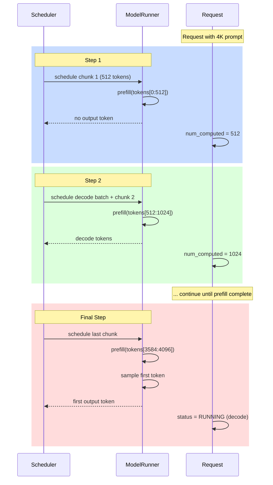
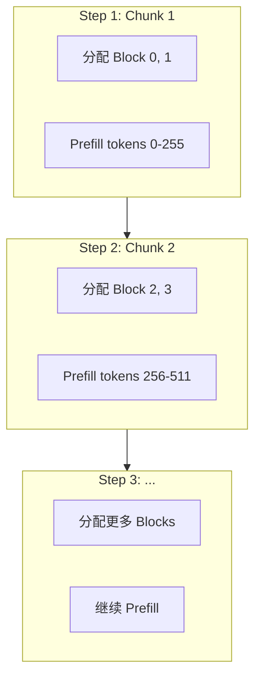
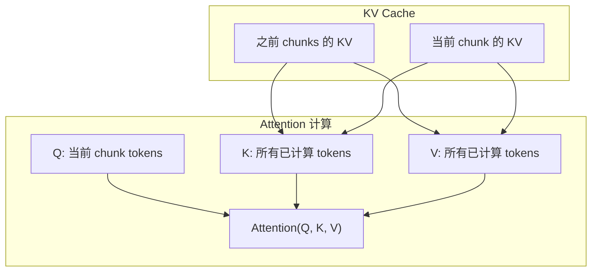
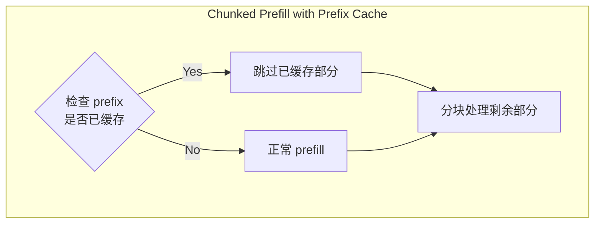
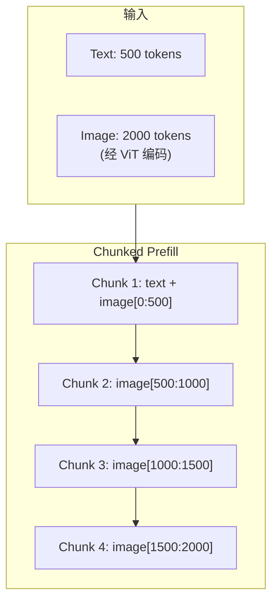
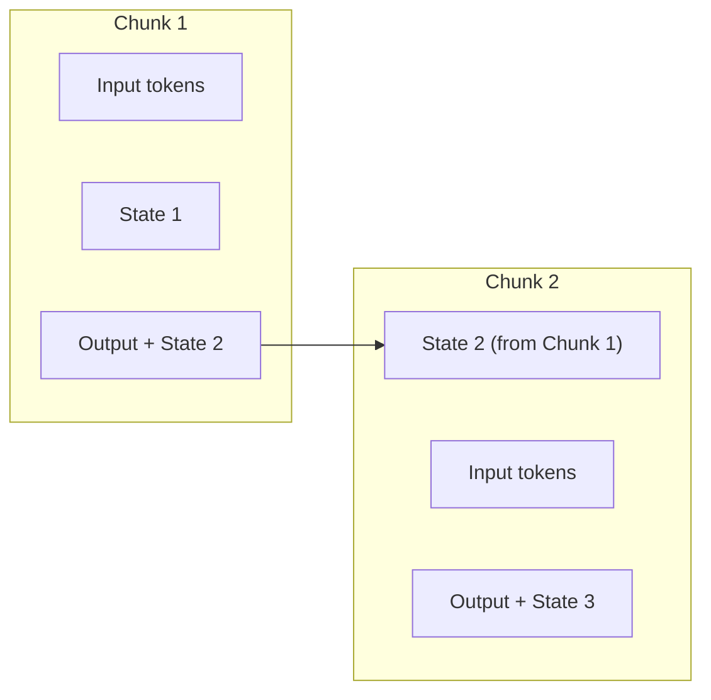
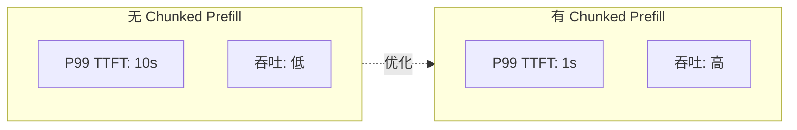

# 12 - Chunked Prefill 分块预填充

> **前置阅读**: [03-scheduler-design.md](./03-scheduler-design.md), [04-request-lifecycle.md](./04-request-lifecycle.md)
>
> **核心文件**:
> - `vllm/v1/core/sched/scheduler.py` - Scheduler.schedule()
> - `vllm/v1/core/sched/prefill_scheduler.py` - Prefill 调度逻辑

---

## 1. 概述

Chunked Prefill（分块预填充）是一种优化技术，将长 prompt 的 prefill 分成多个较小的 chunk，与 decode 请求交替执行，从而：
- 避免长 prefill 阻塞所有 decode 请求
- 降低 TTFT (Time To First Token) 的长尾
- 提高整体吞吐量和公平性

### 1.1 问题场景

```mermaid
gantt
    title 无 Chunked Prefill
    dateFormat X
    axisFormat %s
    
    section Without Chunking
    Long Prefill (4K tokens) :a1, 0, 400
    Decode Batch :a2, 400, 450
    Decode Batch :a3, 450, 500
    
    section With Chunking
    Chunk 1 (512 tokens) :b1, 0, 60
    Decode Batch :b2, 60, 110
    Chunk 2 (512 tokens) :b3, 110, 170
    Decode Batch :b4, 170, 220
```



### 1.2 核心参数

```python
# vllm/config.py
class SchedulerConfig:
    max_num_batched_tokens: int = 2048
    """单次调度的最大 token 数，也是 prefill chunk 的上限"""
    
    enable_chunked_prefill: bool = True
    """是否启用分块预填充"""
```

---

## 2. Scheduler 实现

### 2.1 调度逻辑

```python
# vllm/v1/core/sched/scheduler.py (simplified)
def schedule(self) -> SchedulerOutput:
    """主调度方法"""
    
    # 1. 计算预算
    token_budget = self.max_num_batched_tokens
    request_budget = self.max_num_seqs
    
    # 2. 先调度运行中的 decode 请求
    running_reqs = self._schedule_running_requests(token_budget)
    token_budget -= sum(1 for _ in running_reqs)  # decode 每个请求 1 token
    
    # 3. 调度 prefill 请求（可能分块）
    if token_budget > 0:
        prefill_reqs = self._schedule_prefills(token_budget)
```

### 2.2 Prefill 调度

```python
def _schedule_prefills(self, token_budget: int) -> list[ScheduledRequest]:
    """调度 prefill 请求"""
    
    scheduled = []
    
    for request in self.waiting_queue:
        remaining_tokens = request.num_tokens - request.num_computed_tokens
        
        if remaining_tokens <= token_budget:
            # 可以完整 prefill
            tokens_to_schedule = remaining_tokens
        else:
            # 需要分块
            tokens_to_schedule = min(remaining_tokens, token_budget)
            if tokens_to_schedule < self.min_chunk_size:
                # 不足最小 chunk，等待
                break
        
        # 分配 KV cache blocks
        num_new_blocks = ceil(tokens_to_schedule / self.block_size)
        if not self.kv_cache_manager.can_allocate(num_new_blocks):
            # 内存不足，停止调度
            break
        
        scheduled.append(ScheduledRequest(
            request=request,
            num_tokens=tokens_to_schedule,
        ))
        
        token_budget -= tokens_to_schedule
        if token_budget <= 0:
            break
    
    return scheduled
```

---

## 3. 分块执行流程

### 3.1 多步 Prefill



### 3.2 请求状态变化

```python
# 请求在分块 prefill 过程中保持 RUNNING 状态
# 但其 phase 从 PREFILL 变为 DECODE

class Request:
    num_computed_tokens: int = 0  # 已计算的 token 数
    
    @property
    def is_prefill(self) -> bool:
        """是否还在 prefill 阶段"""
        return self.num_computed_tokens < len(self.prompt_token_ids)
    
    @property
    def num_remaining_prefill(self) -> int:
        """剩余的 prefill token 数"""
        return max(0, len(self.prompt_token_ids) - self.num_computed_tokens)
```

---

## 4. Block 分配策略

### 4.1 增量分配



### 4.2 代码实现

```python
# vllm/v1/core/kv_cache_manager.py
def allocate_slots(
    self, request: Request, num_new_tokens: int
) -> list[int]:
    """为新 token 分配 slots"""
    
    current_tokens = request.num_computed_tokens
    new_tokens = current_tokens + num_new_tokens
    
    # 计算需要的新 block 数
    current_blocks = ceil(current_tokens / self.block_size)
    needed_blocks = ceil(new_tokens / self.block_size)
    num_new_blocks = needed_blocks - current_blocks
    
    if num_new_blocks > 0:
        new_block_ids = self.block_pool.allocate(num_new_blocks)
        request.block_ids.extend(new_block_ids)
    
    # 返回 slot mapping
    return self._compute_slot_mapping(request, current_tokens, num_new_tokens)
```

---

## 5. Attention 处理

### 5.1 Chunked Prefill Attention



### 5.2 Causal Mask 处理

```python
# 在 chunked prefill 中，attention 仍然是 causal 的
# 每个 chunk 的 token 只能看到:
# 1. 之前所有 chunks 的 token
# 2. 当前 chunk 中位置在自己之前的 token

# FlashAttention 自动处理 causal mask
flash_attn_varlen_func(
    q=query,           # 当前 chunk 的 Q
    k=key_cache,       # 所有 KV cache
    v=value_cache,
    cu_seqlens_q=...,  # 当前 chunk 的位置
    seqused_k=seq_lens,  # 完整序列长度
    causal=True,       # 启用 causal mask
)
```

---

## 6. 与其他特性的交互

### 6.1 Prefix Caching



```python
def _schedule_prefills(self, token_budget: int):
    for request in self.waiting_queue:
        # 检查 prefix cache hit
        cached_tokens = self.kv_cache_manager.get_cached_prefix_len(request)
        
        # 只需要 prefill 未缓存的部分
        remaining_tokens = request.num_tokens - cached_tokens
        tokens_to_schedule = min(remaining_tokens, token_budget)
```

### 6.2 投机解码

```python
# 投机解码时，chunked prefill 可能与 draft token 验证同时发生
# 需要确保 KV cache 的正确性

# 调度优先级:
# 1. Verify draft tokens (已有请求)
# 2. Prefill chunks
# 3. Generate draft tokens
```

---

## 7. 以 Qwen3-VL 为例

### 7.1 多模态 Chunked Prefill



### 7.2 图像 Token 处理

```python
# 图像 token 与文本 token 一起分块
# 但图像 token 的位置编码需要特殊处理（M-RoPE）

def prepare_mrope_positions(request, chunk_start, chunk_end):
    """为 chunk 准备 M-RoPE 位置"""
    positions = []
    for i in range(chunk_start, chunk_end):
        if is_image_token(request, i):
            # 3D 位置: (temporal, height, width)
            positions.append(get_image_position(request, i))
        else:
            # 1D 位置: (pos, pos, pos)
            positions.append((i, i, i))
    return positions
```

---

## 8. 以 Qwen3-Next (DeltaNet) 为例

### 8.1 Linear Attention 的 Chunked Prefill

```python
# DeltaNet 使用 chunk-wise 计算
# 与 vLLM 的 chunked prefill 天然契合

# 但需要注意:
# 1. DeltaNet 的 chunk size 可能与 vLLM 的不同
# 2. 需要正确管理 recurrent state
```

### 8.2 状态管理



---

## 9. 性能考虑

### 9.1 Chunk Size 选择

| Chunk Size | 优点 | 缺点 |
|------------|------|------|
| **小 (256)** | 低延迟，公平性好 | 调度开销大，可能效率低 |
| **大 (2048)** | 高效率，batch 更大 | 可能阻塞 decode |
| **中等 (512-1024)** | 平衡 | 需要根据场景调优 |

### 9.2 调优建议

```python
# 高吞吐场景
SchedulerConfig(
    max_num_batched_tokens=4096,  # 大 batch
    enable_chunked_prefill=True,
)

# 低延迟场景
SchedulerConfig(
    max_num_batched_tokens=512,  # 小 chunk
    enable_chunked_prefill=True,
)

# 长 context 场景
SchedulerConfig(
    max_num_batched_tokens=2048,
    enable_chunked_prefill=True,
    max_model_len=128000,
)
```

---

## 10. 总结

### 10.1 关键要点

| 要点 | 说明 |
|------|------|
| **分块大小** | 由 max_num_batched_tokens 控制 |
| **增量分配** | Block 随 chunk 逐步分配 |
| **状态追踪** | num_computed_tokens 记录进度 |
| **交替执行** | Prefill chunk 与 decode 交替 |

### 10.2 效果



---

> **下一步**: [13-pd-disaggregation.md](./13-pd-disaggregation.md) - Prefill-Decode 分离
