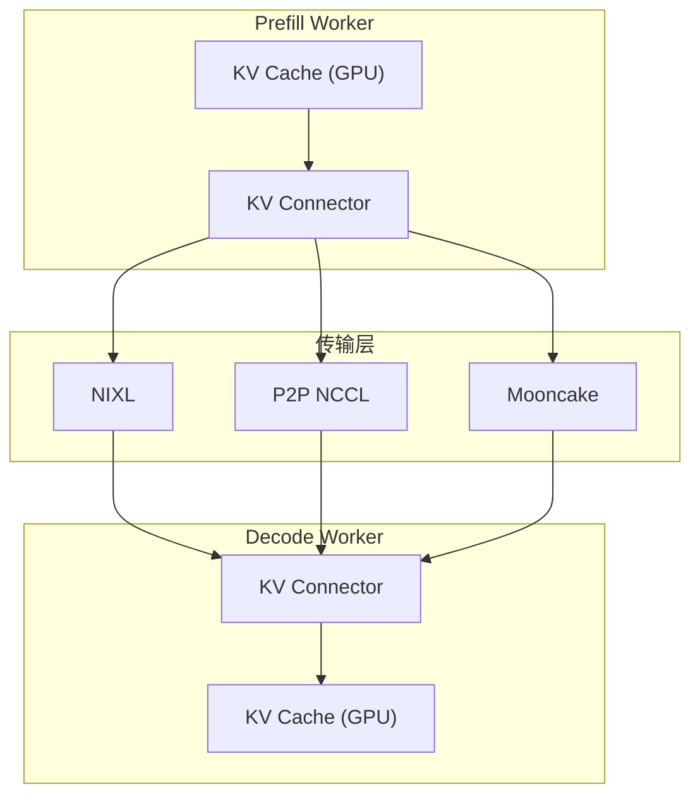
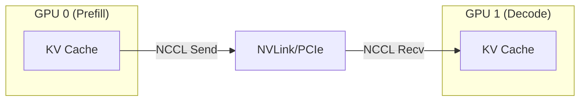
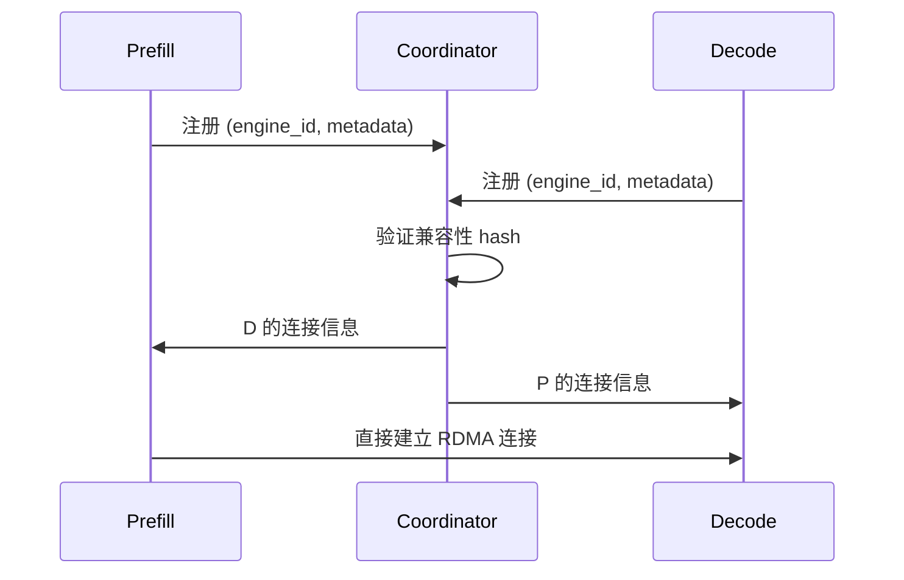
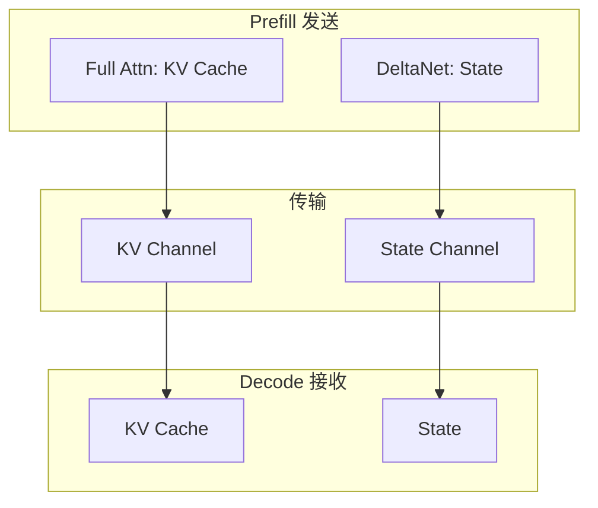
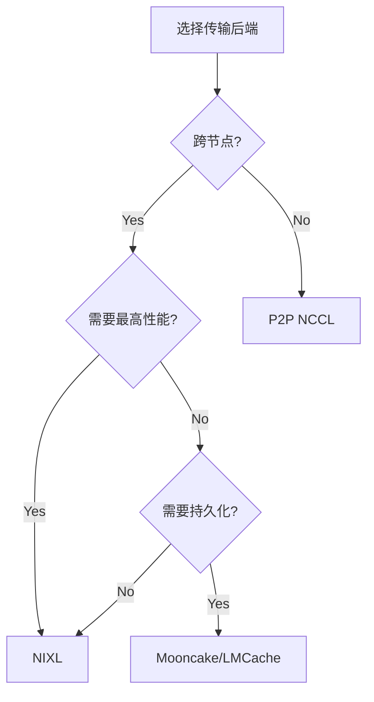

# 14 - KV 传输机制 (NIXL/P2P)

> **前置阅读**: [13-pd-disaggregation.md](./13-pd-disaggregation.md)
>
> **核心文件**:
> - `vllm/distributed/kv_transfer/kv_connector/v1/nixl_connector.py`
> - `vllm/distributed/kv_transfer/kv_connector/v1/p2p/p2p_nccl_connector.py`
> - `vllm/distributed/kv_transfer/kv_connector/utils.py`

---

## 1. 概述

KV 传输机制是 PD 分离架构的核心组件，负责在 Prefill 和 Decode 节点之间高效传输 KV Cache。vLLM 支持多种传输后端：

| 后端 | 说明 | 适用场景 |
|------|------|---------|
| **NIXL** | NVIDIA 官方库 | 跨节点、高性能 |
| **P2P NCCL** | 点对点 NCCL | 同机多卡 |
| **Mooncake** | 分布式存储 | 云环境 |
| **LMCache** | KV Cache 外存 | 混合部署 |

### 1.1 传输架构



---

## 2. NIXL Connector 详解

### 2.1 NIXL Agent 初始化

```python
# vllm/distributed/kv_transfer/kv_connector/v1/nixl_connector.py
class NixlConnectorWorker:
    def __init__(self, vllm_config: VllmConfig, engine_id: EngineId):
        # 创建 NIXL agent
        if nixl_agent_config is not None:
            config = nixl_agent_config()
            # 配置传输参数
            config.set("transport", "ucx")  # 或 "tcp"
        
        self.nixl_agent = NixlWrapper(
            str(engine_id),
            config,
        )
```

### 2.2 注册 KV Cache

```python
def register_kv_caches(self, kv_caches: dict[str, torch.Tensor]):
    """注册 KV Cache 张量用于 RDMA 传输"""
    
    self.kv_caches = kv_caches
    
    # 获取每层 KV Cache 的基地址
    kv_caches_base_addr = []
    block_lens = []
    
    for layer_name, kv_cache in kv_caches.items():
        # kv_cache shape: [2, num_blocks, block_size, num_kv_heads, head_size]
        base_addr = kv_cache.data_ptr()
        kv_caches_base_addr.append(base_addr)
        block_lens.append(kv_cache.numel() * kv_cache.element_size())
    
    # 向 NIXL 注册内存区域
    self.nixl_agent.register_memory(
        kv_caches_base_addr,
        block_lens,
    )
```

### 2.3 发送 KV Cache

```python
def send_kv_cache(
    self,
    request_id: str,
    block_ids: list[int],
    remote_engine_id: str,
    remote_block_ids: list[int],
):
    """发送 KV Cache 到远程节点"""
    
    # 构建传输描述符
    local_descs = []
    remote_descs = []
    
    for layer_idx, kv_cache in enumerate(self.kv_caches.values()):
        for local_bid, remote_bid in zip(block_ids, remote_block_ids):
            # 计算本地 block 的地址和大小
            local_offset = local_bid * self.block_size_bytes
            local_addr = kv_cache.data_ptr() + local_offset
            
            local_descs.append((local_addr, self.block_size_bytes))
            remote_descs.append((remote_bid, self.block_size_bytes))
    
    # 发起异步传输
    handle = self.nixl_agent.async_send(
        remote_engine_id,
        local_descs,
        remote_descs,
    )
    
    return handle
```

### 2.4 接收 KV Cache

```python
def start_load_kv(
    self,
    forward_context: ForwardContext,
    connector_metadata: NixlConnectorMetadata,
):
    """开始接收 KV Cache"""
    
    for request_id, req_meta in connector_metadata.reqs_to_recv.items():
        remote = req_meta.remote
        
        # 发起 RDMA 读取
        handle = self.nixl_agent.async_read(
            remote.engine_id,
            remote.block_ids,
            req_meta.local_block_ids,
        )
        
        self.pending_loads[request_id] = handle

def wait_for_layer_load(self, layer_name: str) -> bool:
    """等待特定层的 KV 加载完成"""
    
    for request_id, handle in self.pending_loads.items():
        # 检查传输状态
        status = self.nixl_agent.check_status(handle)
        
        if status == "failed":
            return False
        elif status == "pending":
            # 等待完成
            self.nixl_agent.wait(handle)
    
    return True
```

---

## 3. P2P NCCL Connector

### 3.1 设计思想

P2P NCCL 使用 NCCL 的点对点通信原语，适用于同机多卡场景。



### 3.2 核心实现

```python
# vllm/distributed/kv_transfer/kv_connector/v1/p2p/p2p_nccl_connector.py
class P2PNCCLConnector(KVConnectorBase_V1):
    def __init__(self, vllm_config: VllmConfig, role: KVConnectorRole, ...):
        super().__init__(vllm_config, role, ...)
        
        # 创建专用通信组
        self.kv_transfer_group = create_kv_transfer_group()
    
    def send_kv_cache(
        self,
        kv_cache: torch.Tensor,
        dst_rank: int,
    ):
        """使用 NCCL 发送 KV Cache"""
        
        # 使用非阻塞发送
        torch.distributed.isend(
            kv_cache,
            dst=dst_rank,
            group=self.kv_transfer_group,
        )
    
    def recv_kv_cache(
        self,
        kv_cache: torch.Tensor,
        src_rank: int,
    ):
        """使用 NCCL 接收 KV Cache"""
        
        req = torch.distributed.irecv(
            kv_cache,
            src=src_rank,
            group=self.kv_transfer_group,
        )
        
        return req
```

### 3.3 Tensor Memory Pool

```python
# vllm/distributed/kv_transfer/kv_connector/v1/p2p/tensor_memory_pool.py
class TensorMemoryPool:
    """预分配的张量内存池，用于 KV 传输缓冲"""
    
    def __init__(self, pool_size: int, dtype: torch.dtype, device: str):
        self.pool = torch.empty(
            pool_size,
            dtype=dtype,
            device=device,
        )
        self.free_list: list[tuple[int, int]] = [(0, pool_size)]
    
    def allocate(self, size: int) -> torch.Tensor:
        """从池中分配内存"""
        for i, (start, length) in enumerate(self.free_list):
            if length >= size:
                tensor = self.pool[start:start+size]
                # 更新 free list
                if length > size:
                    self.free_list[i] = (start + size, length - size)
                else:
                    del self.free_list[i]
                return tensor
        raise MemoryError("Pool exhausted")
    
    def free(self, tensor: torch.Tensor):
        """释放内存回池"""
        start = tensor.data_ptr() - self.pool.data_ptr()
        size = tensor.numel() * tensor.element_size()
        self._merge_free_block(start, size)
```

---

## 4. 布局转换

### 4.1 KV Cache 布局

```python
# vllm/distributed/kv_transfer/kv_connector/utils.py

def kv_postprocess_layout_on_receive(
    kv_cache: torch.Tensor,
    src_layout: str,
    dst_layout: str,
) -> torch.Tensor:
    """接收后的布局转换"""
    
    if src_layout == dst_layout:
        return kv_cache
    
    if src_layout == "NHD" and dst_layout == "HND":
        # [num_blocks, block_size, num_heads, head_dim]
        # -> [num_blocks, num_heads, block_size, head_dim]
        return kv_cache.transpose(1, 2).contiguous()
    
    # ... 其他转换
```

### 4.2 Block Size 适配

```python
def kv_postprocess_blksize_on_receive(
    kv_cache: torch.Tensor,
    src_block_size: int,
    dst_block_size: int,
) -> torch.Tensor:
    """Block size 不匹配时的重排"""
    
    if src_block_size == dst_block_size:
        return kv_cache
    
    # 需要重新组织 block 边界
    # 例如: src=16, dst=32 -> 合并相邻 block
    # 例如: src=32, dst=16 -> 拆分 block
    ...
```

---

## 5. 元数据同步

### 5.1 Handshake 协议



### 5.2 请求元数据

```python
@dataclass
class NixlConnectorMetadata(KVConnectorMetadata):
    reqs_to_recv: dict[ReqId, ReqMeta]  # 需要接收的请求
    reqs_to_save: dict[ReqId, ReqMeta]  # 需要保存的请求
    reqs_to_send: dict[ReqId, float]    # 需要发送的请求
    reqs_in_batch: set[ReqId]           # 当前批次的请求
    
@dataclass
class ReqMeta:
    local_block_ids: list[int]          # 本地 block IDs
    local_physical_block_ids: list[int] # 物理 block IDs
    tp_size: int                         # TP 大小
    remote: RemoteMeta | None           # 远程信息

@dataclass
class RemoteMeta:
    block_ids: list[int]    # 远程 block IDs
    host: str               # 远程主机
    port: int               # 远程端口
    engine_id: str          # 远程引擎 ID
    request_id: str         # 请求 ID
```

---

## 6. 故障处理

### 6.1 传输失败回退

```python
def _handle_transfer_failure(
    self,
    request_id: str,
    error: Exception,
):
    """传输失败时的处理"""
    
    logger.warning(f"KV transfer failed for {request_id}: {error}")
    
    # 选项 1: 重试传输
    if self.retry_count < self.max_retries:
        self.retry_count += 1
        return self._retry_transfer(request_id)
    
    # 选项 2: 回退到重新计算
    # 将请求重新加入 prefill 队列
    return self._fallback_to_recompute(request_id)
```

### 6.2 超时处理

```python
def wait_for_layer_load(
    self,
    layer_name: str,
    timeout_ms: int = 10000,
) -> bool:
    """带超时的等待"""
    
    start_time = time.time()
    
    while True:
        status = self.check_all_transfers()
        
        if status == "complete":
            return True
        elif status == "failed":
            return False
        
        elapsed = (time.time() - start_time) * 1000
        if elapsed > timeout_ms:
            logger.error(f"KV transfer timeout for layer {layer_name}")
            return False
        
        # 短暂等待后重试
        time.sleep(0.001)
```

---

## 7. 性能优化

### 7.1 流水线传输

```python
class PipelinedKVTransfer:
    """分层流水线传输"""
    
    def start_transfer(self, layers: list[str], block_ids: list[int]):
        """启动所有层的传输"""
        
        handles = {}
        for layer_name in layers:
            # 每层独立传输
            handle = self._transfer_layer(layer_name, block_ids)
            handles[layer_name] = handle
        
        return handles
    
    def wait_layer(self, layer_name: str, handle) -> bool:
        """等待单层完成"""
        return self.nixl_agent.wait(handle)
```

### 7.2 内存对齐

```python
def _align_block_size(self, block_size: int) -> int:
    """确保 block size 对 RDMA 友好"""
    
    # RDMA 通常需要 4KB 或更大的对齐
    alignment = 4096
    return ((block_size + alignment - 1) // alignment) * alignment
```

### 7.3 批量传输

```python
def batch_transfer(
    self,
    requests: list[Request],
) -> list[TransferHandle]:
    """批量传输多个请求的 KV Cache"""
    
    # 合并相邻的 block
    merged_descs = self._merge_contiguous_blocks(requests)
    
    # 单次大传输比多次小传输更高效
    handles = []
    for desc in merged_descs:
        h = self.nixl_agent.async_send(desc)
        handles.append(h)
    
    return handles
```

---

## 8. 以 Qwen3-VL 为例

### 8.1 图像 Token 的 KV 传输

```python
# 图像 token 的 KV Cache 与文本 token 一起传输
# 但可能需要特殊处理:

# 1. 图像 token 通常在序列开头（prefix）
# 2. 可能被 prefix caching 缓存
# 3. 需要传输完整的图像 token KV

def _get_blocks_to_transfer(self, request: Request) -> list[int]:
    """确定需要传输的 block"""
    
    if request.has_image:
        # 图像 token 的 block 也需要传输
        image_blocks = request.get_image_block_ids()
        text_blocks = request.get_text_block_ids()
        return image_blocks + text_blocks
    else:
        return request.block_ids
```

---

## 9. 以 Qwen3-Next (DeltaNet) 为例

### 9.1 混合状态传输



### 9.2 State 传输实现

```python
def transfer_hybrid_model_state(
    self,
    request: Request,
    remote_info: RemoteMeta,
):
    """传输混合模型的状态"""
    
    handles = []
    
    # 1. 传输 Full Attention 的 KV Cache
    for layer_name in self.full_attn_layers:
        h = self._transfer_kv_cache(layer_name, request.block_ids, remote_info)
        handles.append(h)
    
    # 2. 传输 DeltaNet 的 recurrent state
    for layer_name in self.gdn_layers:
        h = self._transfer_gdn_state(layer_name, request.state_id, remote_info)
        handles.append(h)
    
    return handles
```

---

## 10. 总结

### 10.1 关键要点

| 要点 | 说明 |
|------|------|
| **多后端支持** | NIXL, P2P NCCL, Mooncake 等 |
| **异步传输** | 与计算流水线重叠 |
| **层级流水线** | 按层传输，边传边算 |
| **布局适配** | 自动转换 NHD/HND 布局 |
| **故障容错** | 超时重试或回退重算 |

### 10.2 选择指南



### 10.3 性能基准

| 场景 | NIXL (NVLink) | P2P NCCL | 说明 |
|------|--------------|----------|------|
| 16 GB KV | ~27ms | ~30ms | 同机 8xA100 |
| 16 GB KV | ~250ms | N/A | 跨节点 IB HDR |
| 延迟开销 | ~5ms | ~2ms | 建立连接 |

---

> **本节完成。继续学习**: [15-attention-backend.md](./15-attention-backend.md) - Attention Backend 架构
