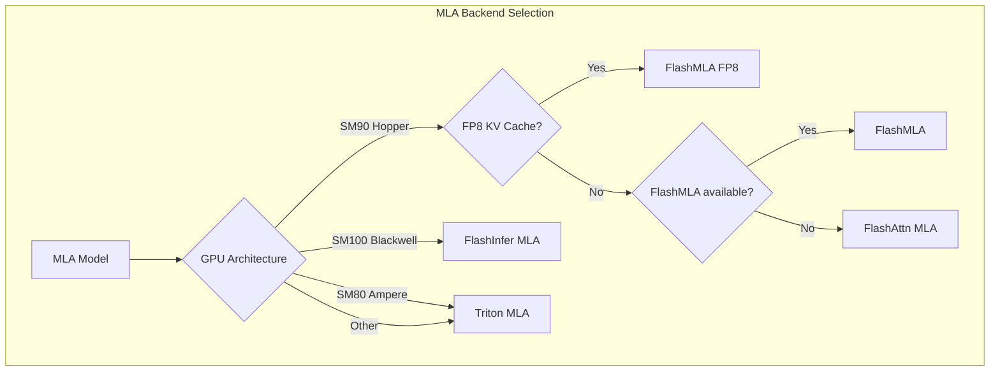

# 17. Multi-head Latent Attention (MLA) 实现

## 概述

MLA (Multi-head Latent Attention) 是 DeepSeek V2/V3/R1 模型引入的创新注意力机制。它通过使用低秩压缩的 latent 向量来表示 KV Cache，大幅减少了显存占用和带宽需求。

## MLA 核心思想

传统 MHA (Multi-Head Attention):
- KV Cache 大小: `2 × L × N × D` (L=层数, N=头数, D=头维度)
- DeepSeek V3: 128 heads × 128 dim = 16384 per token

MLA:
- KV Cache 大小: `L × L_kv` (L_kv=latent 维度, 通常 512)
- DeepSeek V3: 512 per token (减少 32x!)

```
┌───────────────────────────────────────────────────────────────────┐
│                    MLA vs MHA 对比                                 │
├──────────────────────────────┬────────────────────────────────────┤
│        MHA (传统)            │           MLA (DeepSeek)            │
├──────────────────────────────┼────────────────────────────────────┤
│  K: [seq_len, N, D]          │  kv_c: [seq_len, L_kv]             │
│  V: [seq_len, N, D]          │  k_pe: [seq_len, R]                │
│                              │                                    │
│  Cache: 2 × N × D            │  Cache: L_kv + R = 512 + 64        │
│       = 2 × 128 × 128        │       = 576 per token              │
│       = 32768 per token      │                                    │
├──────────────────────────────┴────────────────────────────────────┤
│  核心: KV 共享 latent 表示，通过投影恢复多头                        │
└───────────────────────────────────────────────────────────────────┘
```

## 数学原理

### 符号定义

| 符号 | 含义 | DeepSeek V3 值 |
|------|------|---------------|
| `H` | 隐藏层维度 | 7168 |
| `N` | 注意力头数 | 128 |
| `L_q` | Q latent 维度 | 1536 |
| `L_kv` | KV latent 维度 | 512 |
| `P` | nope 头维度 (无 RoPE) | 128 |
| `R` | rope 头维度 (有 RoPE) | 64 |
| `V` | V 头维度 | 128 |

### 计算流程

```python
"""
MLA 完整计算流程

输入: h_t [Sq, H]  隐藏状态
输出: o [Sq, H]    注意力输出
"""

# ============ Q 分支 ============
# Q 压缩: 降维到 latent 空间
q_c = h_t @ W_DQ                    # [Sq, H] @ [H, L_q] -> [Sq, L_q]

# Q 解压: 恢复多头
q_nope = (q_c @ W_UQ).view(Sq, N, P)  # nope 部分 (无 RoPE)
q_pe = RoPE(q_c @ W_QR).view(Sq, N, R)  # rope 部分 (有 RoPE)

# ============ KV 分支 ============
# KV 压缩: 使用共享 latent
kv_c = h_t @ W_DKV                  # [Sq, H] @ [H, L_kv] -> [Sq, L_kv]
k_pe = RoPE(h_t @ W_KR)             # [Sq, H] @ [H, R] -> [Sq, R]

# KV Cache 只存储 kv_c 和 k_pe!
# 大小: L_kv + R = 576 per token (vs 32768 for MHA)
```

### Prefill 路径 (计算密集型)

```python
"""
Prefill: Compute-Friendly Approach

适用于 Sq / Skv 接近 1 的情况 (如首次 prefill)
执行完整的 MHA，因为我们有足够的 query 来摊销 KV 解压开销
"""

# 解压 KV 到多头形式
k_nope = (kv_c @ W_UK).view(Skv, N, P)  # [Skv, L_kv] @ [L_kv, N*P] -> [Skv, N, P]
v = (kv_c @ W_UV).view(Skv, N, V)        # [Skv, L_kv] @ [L_kv, N*V] -> [Skv, N, V]

# 拼接完整的 Q 和 K
q = torch.cat([q_nope, q_pe], dim=-1)    # [Sq, N, P+R]
k = torch.cat([k_nope, 
               k_pe.unsqueeze(1).expand(-1, N, -1)], dim=-1)  # [Skv, N, P+R]

# 标准 MHA
output = scaled_dot_product_attention(q, k, v)  # [Sq, N, V]

return output @ W_O
```

### Decode 路径 (访存密集型)

```python
"""
Decode: Memory-Friendly Approach

适用于 Sq / Skv 很小的情况 (如 decode, Sq=1)
使用 MQA 模式避免解压 KV
"""

# Q 投影到 latent 空间
ql_nope = einsum("snh,lnh->snl", q_nope, W_UK)  # [Sq, N, L_kv]

# 拼接压缩的 Q
q_latent = torch.cat([ql_nope, q_pe], dim=-1)   # [Sq, N, L_kv+R]

# KV 保持压缩形式
kv_combined = torch.cat([kv_c, k_pe], dim=-1)   # [Skv, L_kv+R]

# MQA: 所有 head 共享 KV (1 个 KV head)
# 这是 MLA 高效的关键!
output = scaled_dot_product_attention(
    q_latent,                    # [Sq, N, L_kv+R]
    kv_combined.unsqueeze(1),    # [Skv, 1, L_kv+R]
    kv_c.unsqueeze(1),           # [Skv, 1, L_kv]
)                                # -> [Sq, N, L_kv]

# 解压输出
o = einsum("snl,lnv->snv", output, W_UV)  # [Sq, N, V]

return o.view(-1, N * V) @ W_O
```

## 源码位置

```
vllm/model_executor/layers/attention/mla_attention.py  # 核心实现
vllm/v1/attention/backends/mla/                        # MLA 后端
├── __init__.py
├── indexer.py              # MLA 索引工具
├── flashmla.py             # FlashMLA 后端
├── flashmla_sparse.py      # 稀疏 FlashMLA
├── triton_mla.py           # Triton MLA
├── cutlass_mla.py          # CUTLASS MLA
├── flashattn_mla.py        # FlashAttention + MLA
├── flashinfer_mla.py       # FlashInfer + MLA
└── rocm_aiter_mla.py       # ROCm MLA
```

## MLACommonBackend

```python
# vllm/model_executor/layers/attention/mla_attention.py

class MLACommonBackend(AttentionBackend):
    """MLA 后端的公共基类"""
    
    accept_output_buffer: bool = True
    
    @staticmethod
    def get_kv_cache_shape(
        num_blocks: int,
        block_size: int,
        num_kv_heads: int,  # 对于 MLA 总是 1
        head_size: int,     # L_kv + R = 576
        cache_dtype_str: str = "auto",
    ) -> tuple[int, ...]:
        """MLA KV Cache 形状
        
        与标准 attention 不同:
        - 没有 2 (K/V 合并存储)
        - 没有 num_kv_heads (使用 latent 替代)
        """
        return (num_blocks, block_size, head_size)
    
    @staticmethod
    def get_kv_cache_stride_order(
        include_num_layers_dimension: bool = False,
    ) -> tuple[int, ...]:
        """物理布局: (num_blocks, num_layers, block_size, head_size)"""
        return (1, 0, 2, 3) if include_num_layers_dimension else (0, 1, 2)
    
    @classmethod
    def get_supported_head_sizes(cls) -> list[int]:
        """MLA head_size = L_kv + R = 576"""
        return [576]
    
    @classmethod
    def is_mla(cls) -> bool:
        """标识为 MLA 后端"""
        return True
```

## MLACommonImpl

```python
class MLACommonImpl(MLAAttentionImpl[T], Generic[T]):
    """MLA 实现的公共基类
    
    实现了 prefill 和 decode 的通用逻辑
    子类只需实现 _forward_decode()
    """
    
    def __init__(
        self,
        num_heads: int,
        head_size: int,
        scale: float,
        num_kv_heads: int,
        alibi_slopes: list[float] | None,
        sliding_window: int | None,
        kv_cache_dtype: str,
        logits_soft_cap: float | None,
        attn_type: str,
        kv_sharing_target_layer_name: str | None,
        # MLA 特有参数
        q_lora_rank: int | None,
        kv_lora_rank: int,
        qk_nope_head_dim: int,
        qk_rope_head_dim: int,
        qk_head_dim: int,
        v_head_dim: int,
        kv_b_proj: ColumnParallelLinear,
        indexer: object | None = None,
    ) -> None:
        # 基础属性
        self.num_heads = num_heads
        self.head_size = head_size
        self.scale = float(scale)
        
        # MLA 特有属性
        self.kv_lora_rank = kv_lora_rank      # L_kv = 512
        self.qk_nope_head_dim = qk_nope_head_dim  # P = 128
        self.qk_rope_head_dim = qk_rope_head_dim  # R = 64
        self.qk_head_dim = qk_head_dim        # P + R = 192
        self.v_head_dim = v_head_dim          # V = 128
        
        # 从 kv_b_proj 提取权重
        # kv_b_proj = [W_UK; W_UV] concatenated
        self._init_kv_b_proj_weights(kv_b_proj)
    
    def _init_kv_b_proj_weights(self, kv_b_proj: ColumnParallelLinear):
        """提取 KV 反投影权重
        
        kv_b_proj 的形状: [L_kv, N * (P + V)]
        分割为: W_UK [L_kv, N, P] 和 W_UV [L_kv, N, V]
        """
        kv_b_proj_weight, _ = get_and_maybe_dequant_weights(kv_b_proj)
        
        # [L_kv, N * (P + V)] -> [L_kv, N, P + V]
        kv_b_proj_weight = kv_b_proj_weight.view(
            self.kv_lora_rank, self.num_heads, -1
        )
        
        # 分割 nope 和 value 部分
        self.kv_b_proj_k = kv_b_proj_weight[
            :, :, :self.qk_nope_head_dim
        ].contiguous()  # W_UK: [L_kv, N, P]
        
        self.kv_b_proj_v = kv_b_proj_weight[
            :, :, self.qk_nope_head_dim:
        ].contiguous()  # W_UV: [L_kv, N, V]
    
    def forward(
        self,
        layer: AttentionLayer,
        hidden_states_or_cq: torch.Tensor,  # 已压缩的 Q
        kv_c_normed: torch.Tensor,          # 已压缩的 KV (经过 LayerNorm)
        k_pe: torch.Tensor,                 # K 的 RoPE 部分
        kv_cache: torch.Tensor,
        attn_metadata: T,
        output: torch.Tensor | None = None,
        output_scale: torch.Tensor | None = None,
        output_block_scale: torch.Tensor | None = None,
    ) -> torch.Tensor:
        """MLA 前向计算"""
        
        assert output is not None
        
        if attn_metadata is None:
            return output.fill_(0)
        
        num_actual_tokens = attn_metadata.num_actual_tokens
        num_decode_tokens = attn_metadata.num_decode_tokens
        num_prefill_tokens = attn_metadata.num_prefill_tokens
        
        # 更新 KV Cache
        if self.kv_sharing_target_layer_name is None:
            # MLA 存储的是 concat(kv_c, k_pe)
            kv_c_and_k_pe = torch.cat([kv_c_normed, k_pe], dim=-1)
            self._write_kv_cache(
                kv_c_and_k_pe[:num_actual_tokens],
                kv_cache,
                attn_metadata.slot_mapping[:num_actual_tokens],
                layer,
            )
        
        # ============ Prefill 路径 ============
        if num_prefill_tokens > 0:
            prefill_output = self._forward_prefill(
                hidden_states_or_cq[num_decode_tokens:num_actual_tokens],
                kv_c_normed[num_decode_tokens:num_actual_tokens],
                k_pe[num_decode_tokens:num_actual_tokens],
                kv_cache,
                attn_metadata,
                layer,
            )
            output[num_decode_tokens:num_actual_tokens].copy_(prefill_output)
        
        # ============ Decode 路径 ============
        if num_decode_tokens > 0:
            decode_q = hidden_states_or_cq[:num_decode_tokens]
            
            # 调用子类实现的 decode
            decode_output, decode_lse = self._forward_decode(
                decode_q,
                kv_cache,
                attn_metadata,
                layer,
            )
            
            # DCP 处理
            if self.dcp_world_size > 1:
                decode_output = self._handle_dcp(
                    decode_output, decode_lse, ...
                )
            
            # 解压输出: [B, N, L_kv] -> [B, N, V]
            decode_output = self._output_up_proj(decode_output)
            output[:num_decode_tokens].copy_(decode_output)
        
        return output
    
    def _forward_prefill(
        self,
        cq: torch.Tensor,      # 压缩的 Q [num_tokens, ...]
        kv_c: torch.Tensor,    # 压缩的 KV [num_tokens, L_kv]
        k_pe: torch.Tensor,    # K RoPE [num_tokens, R]
        kv_cache: torch.Tensor,
        attn_metadata: MLACommonMetadata,
        layer: AttentionLayer,
    ) -> torch.Tensor:
        """Prefill: 使用完整的 MHA
        
        1. 解压 Q 和 KV 到多头形式
        2. 使用标准 FlashAttention
        3. 投影输出
        """
        prefill_meta = attn_metadata.prefill
        
        # 解压 Q
        q_nope, q_pe = self._decompress_query(cq)
        q = torch.cat([q_nope, q_pe], dim=-1)  # [B, N, P+R]
        
        # 处理 chunked prefill (长上下文)
        if prefill_meta.chunked_context is not None:
            return self._forward_prefill_chunked(
                q, kv_c, k_pe, kv_cache, prefill_meta, layer
            )
        
        # 简单 prefill: 只有新 token
        # 解压当前 KV
        k_nope = torch.einsum("blk,knh->blnh", kv_c, self.kv_b_proj_k)
        v = torch.einsum("blk,knv->blnv", kv_c, self.kv_b_proj_v)
        
        # 扩展 k_pe 到多头
        k = torch.cat([k_nope, k_pe.unsqueeze(-2).expand(-1, -1, self.num_heads, -1)], dim=-1)
        
        # FlashAttention
        output = flash_attn_varlen_func(
            q, k, v,
            cu_seqlens_q=prefill_meta.query_start_loc,
            cu_seqlens_k=prefill_meta.query_start_loc,
            max_seqlen_q=prefill_meta.max_query_len,
            max_seqlen_k=prefill_meta.max_query_len,
            causal=True,
            softmax_scale=self.scale,
        )
        
        return output
    
    def _forward_prefill_chunked(
        self,
        q: torch.Tensor,
        kv_c: torch.Tensor,
        k_pe: torch.Tensor,
        kv_cache: torch.Tensor,
        prefill_meta: MLACommonPrefillMetadata,
        layer: AttentionLayer,
    ) -> torch.Tensor:
        """Chunked Prefill: 处理长上下文
        
        将已缓存的上下文分块处理，避免内存爆炸
        """
        cc = prefill_meta.chunked_context
        
        # Step 1: 计算与当前 token 的注意力
        current_k_nope = torch.einsum("blk,knh->blnh", kv_c, self.kv_b_proj_k)
        current_v = torch.einsum("blk,knv->blnv", kv_c, self.kv_b_proj_v)
        current_k = torch.cat([current_k_nope, k_pe.unsqueeze(-2).expand(-1, -1, self.num_heads, -1)], dim=-1)
        
        curr_output, curr_lse = flash_attn_varlen_func(
            q, current_k, current_v,
            cu_seqlens_q=prefill_meta.query_start_loc,
            cu_seqlens_k=prefill_meta.query_start_loc,
            causal=True,
            return_softmax_lse=True,
        )
        
        # Step 2: 分块处理已缓存的上下文
        for chunk_idx in range(len(cc.chunk_total_token)):
            chunk_start = cc.starts[chunk_idx]
            chunk_seq_lens = cc.seq_lens[chunk_idx]
            
            # 从 cache 读取 chunk
            chunk_kv_c = self._read_kv_cache_chunk(
                kv_cache, cc, chunk_idx
            )
            
            # 解压 chunk
            chunk_k_nope = torch.einsum("blk,knh->blnh", chunk_kv_c[..., :self.kv_lora_rank], self.kv_b_proj_k)
            chunk_k_pe = chunk_kv_c[..., self.kv_lora_rank:]
            chunk_v = torch.einsum("blk,knv->blnv", chunk_kv_c[..., :self.kv_lora_rank], self.kv_b_proj_v)
            chunk_k = torch.cat([chunk_k_nope, chunk_k_pe.unsqueeze(-2).expand(-1, -1, self.num_heads, -1)], dim=-1)
            
            # 注意力计算
            chunk_output, chunk_lse = flash_attn_varlen_func(
                q, chunk_k, chunk_v,
                causal=False,  # 上下文是完整的
                return_softmax_lse=True,
            )
            
            # 合并结果
            curr_output, curr_lse = merge_attn_states(
                curr_output, curr_lse,
                chunk_output, chunk_lse,
            )
        
        return curr_output
    
    @abstractmethod
    def _forward_decode(
        self,
        q: torch.Tensor | tuple[torch.Tensor, torch.Tensor],
        kv_cache: torch.Tensor,
        attn_metadata: T,
        layer: AttentionLayer,
    ) -> tuple[torch.Tensor, torch.Tensor | None]:
        """Decode 路径 - 由子类实现
        
        不同的后端使用不同的 kernel:
        - FlashMLA: 专用 MLA kernel
        - Triton: Triton 实现的 MQA
        - FlashInfer: 使用 FlashInfer 的 MQA
        
        Returns:
            output: [B, N, L_kv] 压缩的输出
            lse: softmax LSE (用于 DCP)
        """
        raise NotImplementedError
    
    def _output_up_proj(self, output: torch.Tensor) -> torch.Tensor:
        """解压输出: [B, N, L_kv] -> [B, N, V]"""
        return torch.einsum("bnl,lnv->bnv", output, self.kv_b_proj_v)
```

## FlashMLABackend

```python
# vllm/v1/attention/backends/mla/flashmla.py

class FlashMLABackend(MLACommonBackend):
    """FlashMLA 后端
    
    使用专门的 FlashMLA kernel，针对 MLA 的 decode 路径优化
    """
    
    supported_dtypes: ClassVar[list[torch.dtype]] = [torch.float16, torch.bfloat16]
    supported_kv_cache_dtypes: ClassVar[list[CacheDType]] = [
        "auto", "bfloat16", "fp8", "fp8_e4m3"
    ]
    
    @staticmethod
    def get_supported_kernel_block_sizes() -> list[int | MultipleOf]:
        """FlashMLA 只支持 block_size=64"""
        return [64]
    
    @staticmethod
    def get_name() -> str:
        return "FLASHMLA"
    
    @classmethod
    def supports_compute_capability(cls, capability: DeviceCapability) -> bool:
        """FlashMLA 支持 Hopper (SM90) 和 Blackwell (SM100)"""
        return capability.major in [9, 10]


class FlashMLAImpl(MLACommonImpl[FlashMLAMetadata]):
    """FlashMLA 实现"""
    
    can_return_lse_for_decode: bool = True
    
    def _forward_decode(
        self,
        q: torch.Tensor | tuple[torch.Tensor, torch.Tensor],
        kv_c_and_k_pe_cache: torch.Tensor,
        attn_metadata: FlashMLAMetadata,
        layer: AttentionLayer,
    ) -> tuple[torch.Tensor, torch.Tensor | None]:
        """FlashMLA decode
        
        使用专门的 FlashMLA kernel
        """
        assert kv_c_and_k_pe_cache.numel() > 0
        assert attn_metadata.decode is not None
        
        if type(q) is tuple:
            q = torch.cat(q, dim=-1)
        
        # 处理 speculative decoding
        num_decodes = attn_metadata.num_decodes
        q = reshape_query_for_spec_decode(q, num_decodes)
        
        scheduler_metadata = attn_metadata.decode.scheduler_metadata
        
        # 调用 FlashMLA kernel
        if self.kv_cache_dtype.startswith("fp8"):
            o, lse = flash_mla_with_kvcache_fp8(
                q=q,
                k_cache=kv_c_and_k_pe_cache.unsqueeze(-2),  # 添加 head 维度
                block_table=attn_metadata.decode.block_table,
                cache_seqlens=attn_metadata.decode.seq_lens,
                head_dim_v=self.kv_lora_rank,
                tile_scheduler_metadata=scheduler_metadata.tile_scheduler_metadata,
                num_splits=scheduler_metadata.num_splits,
                softmax_scale=self.scale,
                causal=True,
                descale_q=layer._q_scale.reshape(1),
                descale_k=layer._k_scale.reshape(1),
            )
        else:
            o, lse = flash_mla_with_kvcache(
                q=q,
                k_cache=kv_c_and_k_pe_cache.unsqueeze(-2),
                block_table=attn_metadata.decode.block_table,
                cache_seqlens=attn_metadata.decode.seq_lens,
                head_dim_v=self.kv_lora_rank,
                tile_scheduler_metadata=scheduler_metadata,
                softmax_scale=self.scale,
                causal=True,
                is_fp8_kvcache=False,
            )
        
        o = reshape_attn_output_for_spec_decode(o)
        
        return o, lse
```

## TritonMLABackend

```python
# vllm/v1/attention/backends/mla/triton_mla.py

class TritonMLABackend(MLACommonBackend):
    """Triton MLA 后端
    
    使用 Triton 实现的通用 MQA kernel
    比 FlashMLA 更通用，但可能性能稍低
    """
    
    supported_dtypes: ClassVar[list[torch.dtype]] = [torch.float16, torch.bfloat16]
    supported_kv_cache_dtypes: ClassVar[list[CacheDType]] = ["auto", "bfloat16"]
    
    @staticmethod
    def get_name() -> str:
        return "TRITON_MLA"
    
    @classmethod
    def supports_compute_capability(cls, capability: DeviceCapability) -> bool:
        """Triton 在大多数 GPU 上都能运行"""
        return True


class TritonMLAImpl(MLACommonImpl[MLACommonMetadata]):
    """Triton MLA 实现"""
    
    can_return_lse_for_decode: bool = True
    
    def _forward_decode(
        self,
        q: torch.Tensor | tuple[torch.Tensor, torch.Tensor],
        kv_c_and_k_pe_cache: torch.Tensor,
        attn_metadata: MLACommonMetadata,
        layer: AttentionLayer,
    ) -> tuple[torch.Tensor, torch.Tensor | None]:
        """Triton decode 实现
        
        使用 Triton 的 decode_attention_fwd kernel
        """
        if self.kv_cache_dtype.startswith("fp8"):
            raise NotImplementedError("FP8 Triton MLA not yet supported")
        
        if type(q) is tuple:
            q = torch.cat(q, dim=-1)
        
        B = q.shape[0]
        q_num_heads = q.shape[1]
        
        # 分配输出
        o = torch.zeros(B, q_num_heads, self.kv_lora_rank, 
                       dtype=q.dtype, device=q.device)
        lse = torch.zeros(B, q_num_heads, dtype=q.dtype, device=q.device)
        
        # 分配中间 buffer
        num_kv_splits = 1 if vllm_is_batch_invariant() else 4
        attn_logits = torch.empty(
            (B, q_num_heads, num_kv_splits, self.kv_lora_rank + 1),
            dtype=torch.float32, device=q.device,
        )
        
        # 添加 head 维度
        kv_c_and_k_pe_cache = kv_c_and_k_pe_cache.unsqueeze(2)
        kv_c_cache = kv_c_and_k_pe_cache[..., :self.kv_lora_rank]
        PAGE_SIZE = kv_c_and_k_pe_cache.size(1)
        
        # 调用 Triton kernel
        decode_attention_fwd(
            q,
            kv_c_and_k_pe_cache,  # K+K_pe 部分
            kv_c_cache,           # V 部分 (使用相同的 latent)
            o,
            lse,
            attn_metadata.decode.block_table,
            attn_metadata.decode.seq_lens,
            attn_logits,
            num_kv_splits,
            self.scale,
            PAGE_SIZE,
        )
        
        return o, lse
```

## MLA 元数据

```python
@dataclass
class MLACommonDecodeMetadata:
    """MLA decode 元数据"""
    block_table: torch.Tensor
    seq_lens: torch.Tensor
    dcp_tot_seq_lens: torch.Tensor | None = None


@dataclass
class MLACommonPrefillMetadata:
    """MLA prefill 元数据"""
    
    @dataclass
    class ChunkedContextMetadata:
        """分块上下文元数据
        
        用于处理长上下文，避免一次解压所有 KV
        """
        cu_seq_lens: torch.Tensor
        starts: torch.Tensor
        seq_tot: list[int]
        max_seq_lens: list[int]
        seq_lens: torch.Tensor
        workspace: torch.Tensor
        token_to_seq: torch.Tensor
        chunk_total_token: list[int]
    
    block_table: torch.Tensor
    query_start_loc: torch.Tensor
    max_query_len: int
    chunked_context: ChunkedContextMetadata | None = None
    query_seq_lens: torch.Tensor | None = None


@dataclass
class MLACommonMetadata(AttentionMetadata, Generic[D]):
    """MLA 通用元数据"""
    
    num_actual_tokens: int
    num_decodes: int
    num_decode_tokens: int
    num_prefills: int
    num_prefill_tokens: int
    slot_mapping: torch.Tensor
    
    decode: D | None = None
    prefill: MLACommonPrefillMetadata | None = None
```

## MLA 后端选择



## 性能对比

| 后端 | GPU | FP8 | Block Size | 特点 |
|------|-----|-----|------------|------|
| FlashMLA | SM90/100 | 是 | 64 | 专用 kernel，最快 |
| Triton MLA | 通用 | 否 | 任意 | 通用，较慢 |
| FlashAttn MLA | SM80+ | 是 | 16x | 使用 FA 的 MQA |
| FlashInfer MLA | SM100 | 是 | 16/32/64 | Blackwell 优化 |
| CUTLASS MLA | SM90+ | 是 | 64 | CUTLASS 实现 |

## 总结

MLA 是 DeepSeek 模型的核心创新：

1. **内存效率**: KV Cache 减少 32x (576 vs 32768 per token)
2. **计算权衡**: 
   - Prefill: 解压 KV，使用 MHA
   - Decode: 保持压缩，使用 MQA
3. **实现多样性**: 多种后端适配不同硬件
4. **与 vLLM 集成**: 完整的 PagedAttention 支持
